# Dialeng 📓

An open-source Solveit-like notebook built entirely with **FastHTML**. Features prompt cells with editable LLM responses, Python code execution, and markdown notes.

**Full `.ipynb` compatibility** - Uses the Solveit convention for prompt cells, making notebooks interoperable with Jupyter and Solveit.

## ✨ Key Features

- **Three cell types**: Code, Note, and Prompt
- **Real-time collaboration**: Share URL to collaborate - see cell changes, outputs, and AI responses in real-time
- **Editable AI responses**: Both user prompts AND AI responses are fully editable
- **Solveit-compatible**: Standard `.ipynb` format with Solveit metadata conventions
- **Pure Python**: Built with FastHTML, no JavaScript frameworks
- **Mock LLM included**: Works out of the box without API keys
- **Dark/Light theme**: Toggle between themes with persistent localStorage saving
- **Mobile responsive**: Works on tablets and phones with adaptive layout
- **Cell folding**: Collapse cells to focus on what matters
- **Cancel generation**: Stop AI responses mid-stream with the ⏹ button
- **🧠 Thinking mode**: Visual indicator during AI thinking process

## 📚 Documentation

| Document | Description |
|----------|-------------|
| **[README.md](README.md)** | Quick start and overview (this file) |
| **[DEVELOPERS.md](DEVELOPERS.md)** | Developer guide for extending the project |
| **[ROADMAP.md](ROADMAP.md)** | Planned features and contribution opportunities |
| **[docs/](docs/)** | Technical deep dives (collaboration, architecture) |

---

## 🚀 Quick Start

```bash
# Clone and setup
git clone <repo>
cd llm_notebook
pip install -r requirements.txt

# Run (no API key needed - uses mock LLM)
python app.py

# Open http://localhost:8000
```

Notebooks are saved to `./notebooks/*.ipynb`.

---

## 🎯 The Prompt Cell Innovation

Unlike traditional notebooks (Jupyter) or chat interfaces (ChatGPT), Dialeng introduces a **prompt cell** that bridges the gap:

| Cell Type | Purpose | Output | Editable? |
|-----------|---------|--------|-----------|
| **Code** | Execute Python | Stdout/stderr | Source only |
| **Note** | Documentation | Rendered markdown | Yes |
| **Prompt** | Chat with AI | LLM response | **Both parts!** |

```mermaid
flowchart TB
    subgraph PromptCell["PROMPT ▶"]
        direction TB
        Header["👤 Your Prompt"]
        UserInput["How do I reverse a list in Python?<br/><i>← Editable</i>"]
        AIHeader["🤖 AI Response (editable)"]
        AIResponse["You can reverse a list using:<br/>• list.reverse() (in-place)<br/>• list[::-1] (creates new list)<br/><i>← Also editable!</i>"]
    end

    Header --> UserInput
    UserInput --> AIHeader
    AIHeader --> AIResponse
```



---

## 📄 .ipynb Format (Solveit-Compatible)

Dialeng uses the Solveit convention for storing prompt cells in standard `.ipynb` files:

### Cell Type Mapping

| Dialeng | Jupyter Cell | Key Metadata |
|--------------|--------------|--------------|
| **Code** | `cell_type: "code"` | `time_run`, `skipped` |
| **Note** | `cell_type: "markdown"` | *(no `solveit_ai`)* |
| **Prompt** | `cell_type: "markdown"` | `solveit_ai: true` |

### Prompt Cell Format

Prompt cells store both user input and AI response in one markdown cell:

```markdown
What is the capital of France?

##### 🤖Reply🤖<!-- SOLVEIT_SEPARATOR_7f3a9b2c -->

The capital of France is **Paris**.
```

The separator `##### 🤖Reply🤖<!-- SOLVEIT_SEPARATOR_xxx -->` divides:
- **Before**: User's prompt (editable)
- **After**: AI's response (also editable!)

### Notebook Metadata

```json
{
  "metadata": {
    "solveit_dialog_mode": "learning",
    "solveit_ver": 2
  }
}
```

### Round-Trip Compatibility

```python
from app import Notebook

# Load any Solveit notebook
nb = Notebook.load("solveit_dialog.ipynb")

# Edit cells programmatically
nb.cells[2].output = "Updated AI response"

# Save - preserves Solveit format
nb.save("solveit_dialog.ipynb")
```

---

## ⌨️ Keyboard Shortcuts (Jupyter-style)

Works on both Windows/Linux (Ctrl) and macOS (Cmd):

| Shortcut | Action |
|----------|--------|
| `Shift+Enter` | Run current cell (Jupyter style) |
| `Ctrl/Cmd+Enter` | Run current cell (alternative) |
| `Ctrl/Cmd+S` | Save notebook |
| `D D` | Delete cell (press D twice, Jupyter style) |
| `Ctrl/Cmd+Backspace` | Delete current cell |
| `Ctrl/Cmd+Shift+C` | Add code cell at end |
| `Ctrl/Cmd+Shift+N` | Add note cell at end |
| `Ctrl/Cmd+Shift+P` | Add prompt cell at end |
| `Alt+↑` | Move cell up |
| `Alt+↓` | Move cell down |
| `Escape` | Exit edit mode |
| `Double-click` | Edit markdown/AI response |
| `Z` | Cycle input collapse level |
| `Shift+Z` | Cycle output collapse level |
| `Alt+Z` | Cycle both input and output collapse |

## 🎨 Ace Editor

Code cells use the **Ace Editor** for proper syntax highlighting:
- Python syntax highlighting
- Auto-indentation
- Bracket matching
- Keyboard shortcuts work inside the editor
- **Theme-aware**: Monokai (dark) / Chrome (light) based on app theme

## 🔌 WebSocket Streaming

LLM responses stream in real-time via WebSocket:

```javascript
// Automatic connection on page load
connectWebSocket(notebookId);

// Receives chunks as they're generated
ws.onmessage = (event) => {
    const data = JSON.parse(event.data);
    if (data.type === 'stream_chunk') {
        appendToResponse(data.cell_id, data.chunk);
    }
};
```

## 📝 Markdown Features

- **Code highlighting** with copy button
- **Double-click to edit** rendered markdown
- **Escape to exit** edit mode
- Supports headers, lists, bold, italic, code blocks

## 🏗️ Architecture


### Data Flow

1. **User types in cell** → HTMX posts to `/cell/{id}/source` → Updates in-memory state
2. **User clicks Run (Code)** → Python kernel executes → Returns output
3. **User clicks Run (Prompt)** → Context aggregated → LLM generates response
4. **User edits AI response** → `/cell/{id}/output` → Updates stored response
5. **User saves** → Notebook serialized to `.ipynb` file

---

## ⌨️ Keyboard Shortcuts

| Shortcut | Action |
|----------|--------|
| `Ctrl+Enter` | Run current cell |
| `Ctrl+S` | Save notebook |

---

## 🔧 Extending Dialeng

### Swap LLM Provider

Replace the mock LLM with a real provider:

```python
# In app.py, replace mock_llm_stream with:

import anthropic

async def real_llm_stream(prompt: str, context: str):
    client = anthropic.Anthropic()
    with client.messages.stream(
        model="claude-sonnet-4-20250514",
        max_tokens=4096,
        messages=[{"role": "user", "content": f"{context}\n\n{prompt}"}]
    ) as stream:
        for text in stream.text_stream:
            yield text
```

### Add New Cell Type

1. Add to `CellType` enum
2. Add rendering in `CellView()`
3. Add execution in `/cell/{id}/run`
4. Add serialization in `to_jupyter_cell()`

### Add Persistence Backend

```python
class MyStorage:
    def save(self, nb: Notebook): ...
    def load(self, id: str) -> Notebook: ...
    def list(self) -> list[str]: ...
```

See **[DEVELOPERS.md](DEVELOPERS.md)** for complete examples and patterns.

---

## 🌗 Theme & UI Features

### Theme Toggle
Click the ☀️/🌙 button in the toolbar to switch between dark and light themes. Your preference is saved to localStorage.

### Cell Folding
Click the ▼ button on any cell to collapse it completely. Collapsed cells show only the header. Click again to expand.

### Multi-Level Section Collapse
Each cell has independent collapse controls for input and output sections:

| Icon | Level | Description |
|------|-------|-------------|
| ▼ | Expanded | Full visibility |
| ◐ | Scrollable | 168px max height with scrollbar (default for code cells) |
| ▬ | Summary | Single line with ellipsis |

**Keyboard shortcuts:**
- `Z` - Cycle input collapse level
- `Shift+Z` - Cycle output collapse level
- `Alt+Z` - Cycle both together

New code cells default to scrollable output mode for better screen space usage. Collapse states are saved per cell and persist across page reloads.

### Mobile Support
The interface adapts to smaller screens:
- **Tablet (768px)**: Stacked toolbar, full-width buttons
- **Mobile (480px)**: Compact layout, optimized touch targets

### Cancel Generation
During AI response streaming, click the ⏹ button to stop generation. The run button (▶) returns after cancellation.

## 👥 Real-time Collaboration

Share your notebook URL with others to collaborate in real-time. All connected users will see:

- **Cell operations**: When you add, delete, or move a cell, collaborators see it instantly
- **Code execution**: When you run a code cell, everyone sees the output
- **AI responses**: Prompt cell responses stream to all connected users simultaneously
- **Collapse state**: Cell expand/collapse changes are synchronized
- **Cell type changes**: Switching a cell between code/note/prompt updates for everyone

### How it works

1. Open a notebook at `http://localhost:8000/notebook/mynotebook`
2. Share the URL with collaborators
3. Everyone with the URL sees changes in real-time

**Note**: Typing in cells is NOT synced in real-time (to avoid interruptions). Only cell-level operations (run, add, delete, move, collapse) are broadcast.

### Smart Conflict Avoidance

If you're actively editing a cell when a collaborator makes changes to that same cell, the update is skipped for you to avoid interrupting your work. Once you finish editing, subsequent updates will come through.

## 🗺️ Roadmap

| Phase | Key Features |
|-------|--------------|
| **v0.2** ✓ | Ace Editor, cell navigation, output improvements |
| **v0.3** ✓ | Theme toggle, mobile responsive, cell folding, cancel streaming |
| **v0.4** ✓ | Real-time collaboration via WebSocket |
| **v0.5** | Real LLM integration, context management, rich outputs |
| **v0.6** | Authentication, cloud storage |
| **v1.0** | Module export, full Solveit feature parity |

See **[ROADMAP.md](ROADMAP.md)** for detailed plans and contribution opportunities.

---

## 🔌 DialogHelper Compatibility

Dialeng is fully compatible with the [dialoghelper](https://github.com/AnswerDotAI/dialoghelper) library, enabling programmatic notebook manipulation from Python code:

```python
from dialoghelper import dh_settings
dh_settings['port'] = 8000  # Dialeng server port

from dialoghelper import read_msg, add_msg, iife, fire_event, pop_data

# Read the previous cell
prev = read_msg(-1)
print(prev.msg.content)

# Add a new cell
add_msg("Created from Python!", msg_type="note", placement="after")

# Execute JavaScript in the browser
iife("""
    console.log('Hello from Python!');
    alert('JavaScript injection works!');
""")

# Bidirectional browser communication
import uuid
request_id = str(uuid.uuid4())[:8]
fire_event('my-event', {'idx': request_id})
response = pop_data(idx=request_id, timeout=5)  # Note: parameter is 'idx', not 'data_id'
```

### Test Notebooks

Two test notebooks are included to verify and demonstrate DialogHelper features:

| Notebook | Purpose |
|----------|---------|
| `notebooks/test_dialoghelper.ipynb` | Basic tests: read/write cells, iife, event_get |
| `notebooks/test_dialoghelper_advanced.ipynb` | Advanced: multi-string replace, fire_event/pop_data, async iife patterns |

See **[docs/how_it_works/05_dialoghelper_integration.md](docs/how_it_works/05_dialoghelper_integration.md)** for complete documentation.

---

## 📁 Project Structure

```
dialeng/
├── app.py                  # Main application (FastHTML)
├── services/               # Service layer
│   ├── kernel/            # Python kernel (subprocess, streaming)
│   ├── llm_service.py     # LLM integration (multi-provider)
│   └── dialoghelper_service.py  # DialogHelper shared logic
├── notebooks/              # Saved notebooks
│   ├── test_dialoghelper.ipynb          # Basic DialogHelper tests
│   └── test_dialoghelper_advanced.ipynb # Advanced tests
├── docs/                   # Documentation
│   └── how_it_works/      # Technical deep dives
├── requirements.txt        # Dependencies
├── README.md              # This file
├── DEVELOPERS.md          # Developer guide
├── ROADMAP.md             # Feature roadmap
└── CHANGELOG.md           # Version history
```

---

## 🤝 Contributing

This is an open-source alternative to Solveit. Contributions welcome!

**Good first issues:**
- Add real LLM provider integration (Claude, OpenAI)
- Write unit tests
- Add cell execution queue
- Implement cell pinning UI
- Add notebook title editing

**See [ROADMAP.md](ROADMAP.md)** for the full list of planned features.

---

## 📚 References

- [Solveit](https://solve.it.com) - The original inspiration
- [FastHTML](https://docs.fastht.ml) - The framework
- [HTMX](https://htmx.org) - For interactivity
- [Answer.AI](https://www.answer.ai) - FastHTML creators

---

## License

MIT
