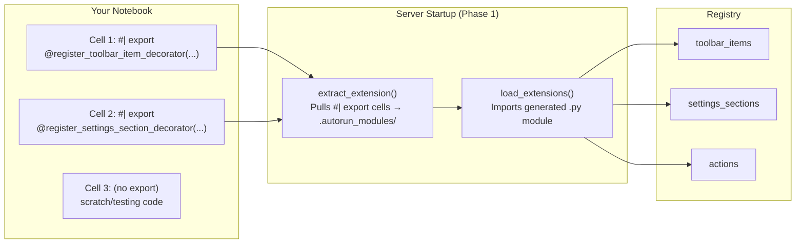
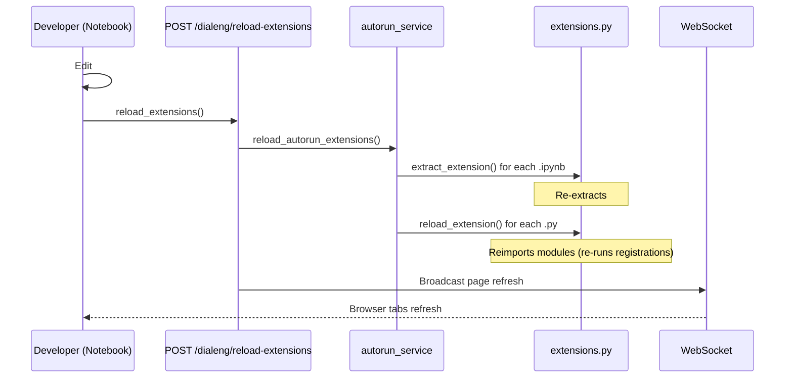
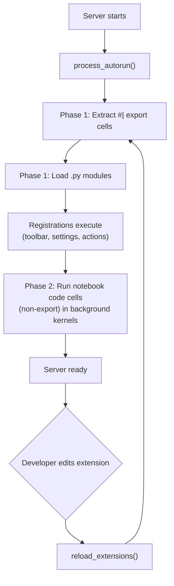

# Writing AUTORUN Extensions

A step-by-step guide to creating extensions that register toolbar buttons, settings sections, custom actions, and more — all from a notebook in the `AUTORUN/` folder.

## Table of Contents

- [Overview](#overview)
- [How It Works](#how-it-works)
- [Tutorial: Building a Test Extension](#tutorial-building-a-test-extension)
  - [Step 1: Create the Notebook](#step-1-create-the-notebook)
  - [Step 2: Add a Toolbar Button](#step-2-add-a-toolbar-button)
  - [Step 3: Add a Settings Section](#step-3-add-a-settings-section)
  - [Step 4: Add a Custom Action](#step-4-add-a-custom-action)
  - [Step 5: Hot-Reload Your Changes](#step-5-hot-reload-your-changes)
- [The `#| export` Directive](#the--export-directive)
- [Available Registration Decorators](#available-registration-decorators)
- [Hot-Reload Workflow](#hot-reload-workflow)
- [Extension Lifecycle](#extension-lifecycle)

---

## Overview

The `AUTORUN/` folder (inside `notebooks/`) is a special directory that dialeng processes at server startup. Any notebook placed there can register extensions — toolbar buttons, settings panels, custom HTTP actions — by marking cells with `#| export`.

The key insight is that you **develop in a notebook** (with the ability to test interactively) but the `#| export` cells run in the **main server process**, giving them access to the registry and UI rendering pipeline.

## How It Works



1. **Extract** — On startup, dialeng scans `AUTORUN/*.ipynb` and extracts cells containing `#| export` into `.autorun_modules/{name}.py`
2. **Load** — The generated `.py` files (plus any raw `.py` files in `AUTORUN/`) are imported into the main server process
3. **Register** — Decorator calls inside those cells register components with the global `ExtensionRegistry`
4. **Render** — The UI picks up registered toolbar items, settings sections, etc. when rendering pages

Cells **without** `#| export` are ignored during extraction — they run only in Phase 2 (background kernel execution) or when you execute them manually.

## Tutorial: Building a Test Extension

This walkthrough recreates the `test_autorun_ext.ipynb` example, a minimal extension that registers a toolbar button, a settings toggle, and an action endpoint.

### Step 1: Create the Notebook

Create a new notebook at `notebooks/AUTORUN/test_autorun_ext.ipynb`. You can do this through the dialeng UI or by placing a `.ipynb` file there directly.

Add a markdown cell as documentation (optional but recommended):

```markdown
# Test AUTORUN Extension

A minimal extension to test the AUTORUN + hot-reload workflow.

**`#| export` cells** below are extracted and loaded in the main server process on startup.
They register a toolbar button, a settings section, and an action endpoint.

**To hot-reload after editing:** Run this in any notebook cell:
```python
from dialeng.dev import reload_extensions
reload_extensions()
```

### Step 2: Add a Toolbar Button

Create a code cell with the `#| export` directive at the top:

```python
#| export
from fasthtml.common import Button
from dialeng.core.registry import register_toolbar_item_decorator

@register_toolbar_item_decorator("test_ext_button", position="right", order=90)
def render_test_button(notebook, config):
    """A simple toolbar button that shows an alert."""
    return Button(
        "Test Ext",
        cls="btn btn-sm",
        onclick="alert('Hello from AUTORUN extension!')",
        title="Test Extension Button"
    )
```

**What this does:**
- `@register_toolbar_item_decorator` registers a function that returns an FT component (here, a `Button`)
- `position="right"` places it on the right side of the toolbar
- `order=90` controls sort order relative to other toolbar items (higher = further right)
- The renderer receives the current `notebook` and `config` objects, so you can conditionally render based on notebook state

### Step 3: Add a Settings Section

Add another `#| export` cell:

```python
#| export
from dialeng.core.registry import register_settings_section_decorator
from dialeng.ui.settings import SettingsGroup, SettingToggle

@register_settings_section_decorator("test_ext_settings", "Test Extension", order=80)
def render_test_settings(config):
    """A simple settings toggle."""
    return SettingsGroup("Test Extension",
        SettingToggle("Enable test extension", "test_ext_enabled", current=True)
    )
```

**What this does:**
- Adds a "Test Extension" section to the settings panel
- `SettingToggle` creates a toggle switch bound to the `test_ext_enabled` config key
- The renderer receives the current `config` so you can read existing setting values

### Step 4: Add a Custom Action

Add another `#| export` cell:

```python
#| export
from dialeng.core.registry import register_action

@register_action("test_ping")
def test_ping(nb_id: str, **kwargs):
    """Simple action that echoes back the notebook ID."""
    return {"status": "pong", "nb_id": nb_id, "kwargs": dict(kwargs)}
```

**What this does:**
- Registers an HTTP endpoint at `POST /dialeng/{nb_id}/ext/test_ping`
- The handler receives the `nb_id` from the URL path and any form/query parameters as `**kwargs`
- Returns a JSON response — useful for HTMX-driven interactions or JavaScript `fetch()` calls

You can invoke this action from a toolbar button:

```python
Button(
    "Ping",
    hx_post="/dialeng/{nb_id}/ext/test_ping",
    hx_swap="none"
)
```

Or from JavaScript:

```javascript
fetch(`/dialeng/${nbId}/ext/test_ping`, { method: 'POST' })
    .then(r => r.json())
    .then(data => console.log(data));
```

### Step 5: Hot-Reload Your Changes

You don't need to restart the server every time you edit an extension. From any notebook cell, run:

```python
from dialeng.dev import reload_extensions
reload_extensions()
```

This will:
1. Re-extract `#| export` cells from all `AUTORUN/*.ipynb` files
2. Reimport all extension modules (picking up your changes)
3. Auto-refresh all connected browser tabs via WebSocket

You should see output like:

```
Extracted from: test_autorun_ext.ipynb
Loaded 1 extension(s): test_autorun_ext
```

## The `#| export` Directive

The `#| export` marker (borrowed from [nbdev](https://nbdev.fast.ai/)) tells the extraction system which cells should be pulled into the generated module.

**Rules:**
- `#| export` must be the **first line** of the cell (optionally preceded by whitespace)
- Only cells with this marker are extracted; all others are skipped
- The extracted cells are concatenated in order into a single `.py` file at `.autorun_modules/{notebook_stem}.py`
- The generated file is **overwritten** on each extraction — don't edit it directly

**Example notebook → generated module:**

```
notebooks/AUTORUN/my_ext.ipynb     →  .autorun_modules/my_ext.py
```

The generated `.py` file contains only the export cells, stripped of the `#| export` line itself, concatenated with blank lines between cells.

## Available Registration Decorators

All decorators are importable from `dialeng.core.registry`:

| Decorator | Signature | Purpose |
|-----------|-----------|---------|
| `@register_toolbar_item_decorator` | `(name, position="right", order=50)` | Register a toolbar button renderer |
| `@register_settings_section_decorator` | `(name, label, order=50)` | Register a settings panel section |
| `@register_action` | `(name)` | Register a `POST /dialeng/{nb_id}/ext/{name}` endpoint |

For lower-level registration (without decorators), you can also use the registry directly:

```python
from dialeng.core.registry import registry, ToolbarItemRegistration
registry.register_toolbar_item(ToolbarItemRegistration(name=..., renderer=..., position=..., order=...))
```

See [Extension Registries](../how_it_works/15_extension_registries.md) for full dataclass definitions and all available registries (kernels, providers, toolbar items, settings sections).

## Hot-Reload Workflow



**Key points:**
- Hot-reload only re-runs **Phase 1** (extraction + import). It does **not** restart Phase 2 background kernels
- If your extension has import errors, they'll appear in the `errors` list returned by `reload_extensions()`
- The reload uses Python's `importlib.reload()` — module-level state is re-initialized

## Extension Lifecycle



**Phase 1** (extensions) runs synchronously during startup — the server won't accept requests until all extensions are loaded. Keep extension code fast and side-effect-free.

**Phase 2** (background notebooks) runs asynchronously — long-running code cells won't block startup. Errors are logged but don't affect other notebooks or the server.

**Separation of concerns:**
- `#| export` cells → run in the **main server process** (have access to registry, can define routes)
- Non-export code cells → run in an **isolated background kernel** (`autorun_{name}`) — good for data pipelines, monitoring, initialization tasks

---

> **Note:** The `#| export` directive is also used outside of AUTORUN for the **`_lib` extraction workflow**, where exported cells are auto-extracted to reusable Python modules on notebook save. See the [Notebook to Package guide](notebook_to_package.md) for details on that progression.
