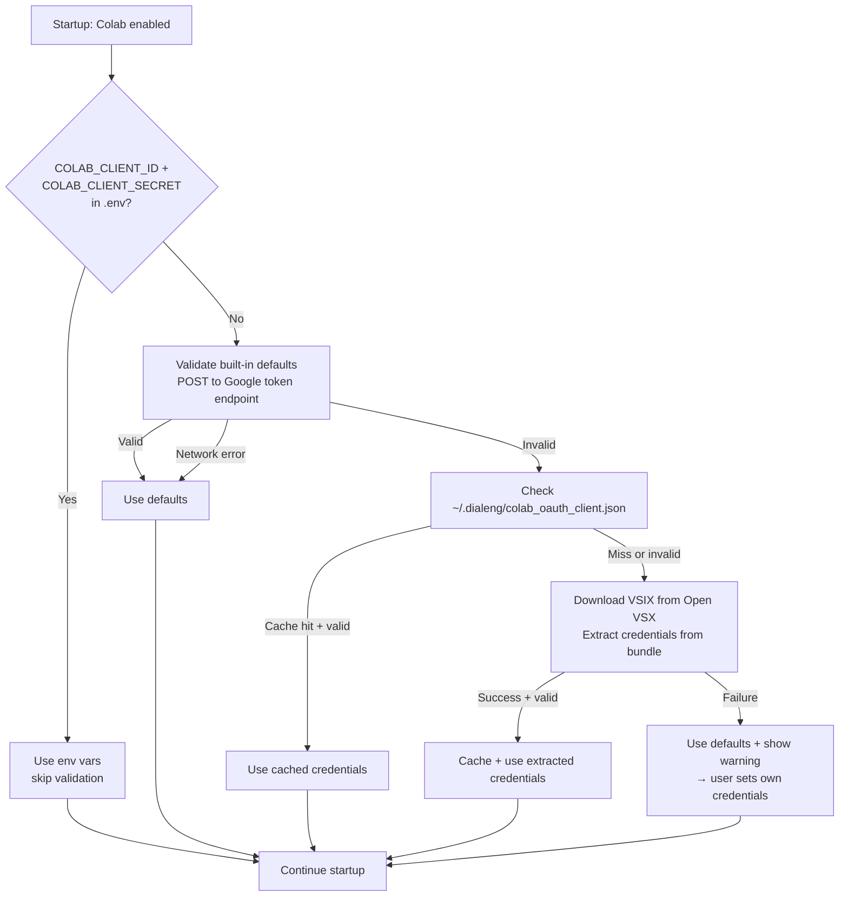

# Setting Up Your Own Google OAuth2 Credentials for Colab

## When You Need This

Dialeng ships with built-in OAuth credentials from the [Colab VS Code extension](https://github.com/googlecolab/colab-vscode). In most cases, these work automatically — Dialeng validates them at startup and auto-updates them if Google rotates them.

You only need your own credentials if:

- The built-in credentials have been rotated **and** auto-update from the VSIX fails
- You see a startup warning: `Colab OAuth: credentials may be invalid`
- You want to use your own Google Cloud project for tracking/quota
- You are in a restricted network that blocks [Open VSX](https://open-vsx.org)

## Step-by-Step Setup

### 1. Create a Google Cloud Project

1. Go to [Google Cloud Console](https://console.cloud.google.com/)
2. Click the project selector at the top → **New Project**
3. Name it something like "Dialeng" and click **Create**
4. Select the new project from the project selector

### 2. Enable the Colaboratory API

1. Go to **APIs & Services** → **Library** ([direct link](https://console.cloud.google.com/apis/library))
2. Search for **"Colaboratory API"**
3. Click on it and press **Enable**

### 3. Configure the OAuth Consent Screen

1. Go to **APIs & Services** → **OAuth consent screen** ([direct link](https://console.cloud.google.com/apis/credentials/consent))
2. Select **External** user type (or **Internal** if using Google Workspace)
3. Fill in the required fields:
   - **App name**: Dialeng
   - **User support email**: your email
   - **Developer contact**: your email
4. Click **Add or Remove Scopes** and add these scopes:
   - `profile`
   - `email`
   - `https://www.googleapis.com/auth/colaboratory`
5. Under **Test users**, add your Google account email
6. Save and continue

> **Note:** While in "Testing" mode, only test users you add can authenticate. You can publish the app later to remove this restriction, but testing mode is fine for personal use.

### 4. Create OAuth2 Credentials

1. Go to **APIs & Services** → **Credentials** ([direct link](https://console.cloud.google.com/apis/credentials))
2. Click **Create Credentials** → **OAuth client ID**
3. **Application type**: select **Desktop app**
4. **Name**: "Dialeng" (or any name you prefer)
5. Click **Create**
6. Copy the **Client ID** and **Client Secret** from the dialog

### 5. Configure Dialeng

Create a `.env` file in the Dialeng project root (or add to your existing one):

```bash
COLAB_CLIENT_ID=your-client-id.apps.googleusercontent.com
COLAB_CLIENT_SECRET=GOCSPX-your-client-secret
```

Restart Dialeng. You should see:

```
   Colab OAuth: valid (source: env)
   Colab: enabled (authenticated=False)
```

Then click **Connect Colab** to authenticate with your new credentials.

## Troubleshooting

| Error | Solution |
|-------|----------|
| `invalid_client` | Double-check your Client ID and Client Secret are correct |
| `redirect_uri_mismatch` | Make sure you selected **Desktop app** type (not Web application) |
| `access_denied` | Add your Google account as a test user in the OAuth consent screen |
| `Colaboratory API has not been used` | Enable the Colaboratory API (Step 2) |
| `deleted_client` | The OAuth client was deleted from Google Cloud Console — create a new one |

## How Auto-Update Works

Dialeng's credential resolution cascade at startup:



The built-in credentials come from the published Colab VS Code extension on Open VSX. If Google rotates them, Dialeng automatically downloads the latest extension package and extracts the new credentials. This cache is stored at `~/.dialeng/colab_oauth_client.json` with a 7-day TTL.
