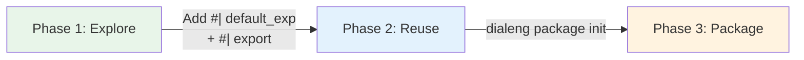
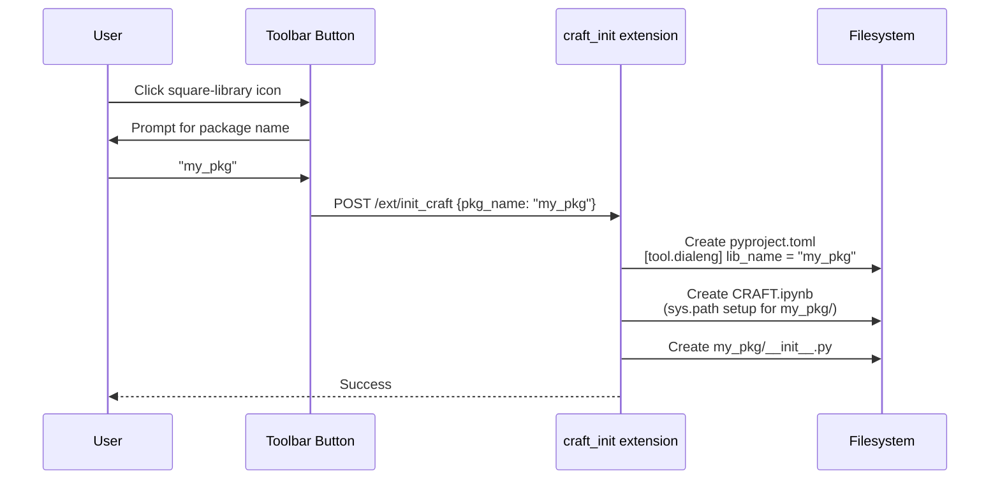
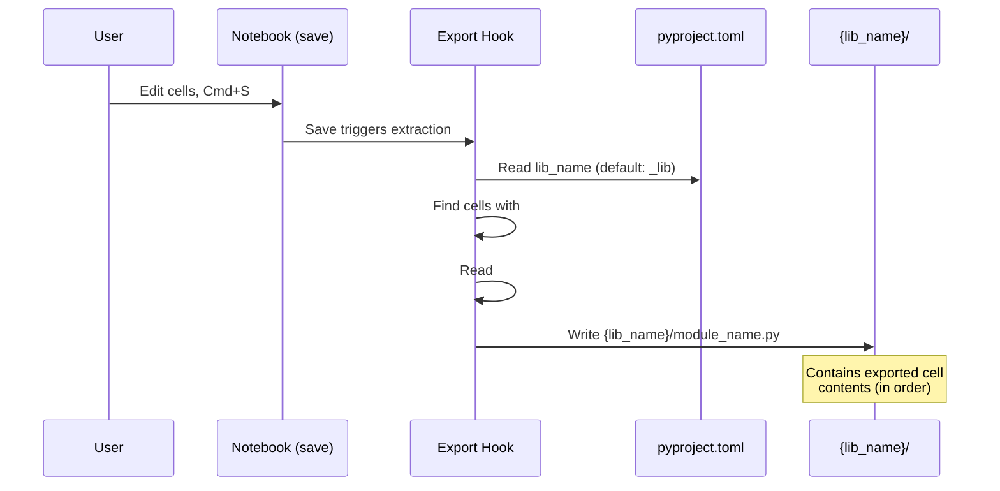
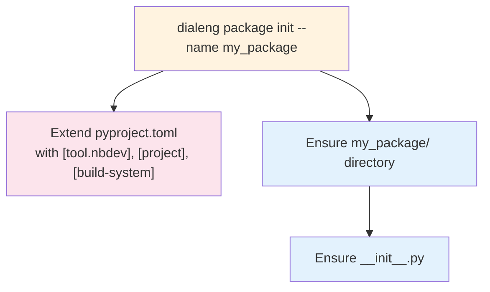
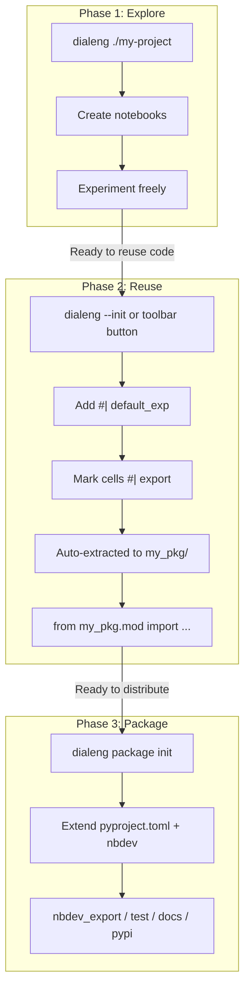

# Notebook to Package: A Three-Phase Progression

A guide to evolving from exploratory notebooks to reusable modules to publishable Python packages.

## Table of Contents

- [Overview](#overview)
- [Phase 1: Explore](#phase-1-explore)
- [Phase 2: Reuse](#phase-2-reuse)
- [Phase 3: Package](#phase-3-package)
- [Summary](#summary)

---

## Overview

Dialeng supports a natural progression from experimentation to production. You start by exploring ideas in notebooks, graduate to sharing code between notebooks via a configurable package directory, and finally scaffold a full Python package with nbdev integration.

Run `dialeng -h` to see all available commands and options.



---

## Phase 1: Explore

Start the dialeng server rooted at any directory and create notebooks freely.

### Starting the server

```bash
# Current directory (default)
dialeng

# Specific project directory (relative)
dialeng ./my-project

# Absolute path
dialeng /abs/path/to/notebooks

# Custom port
dialeng --port 9000
```

The argument tells dialeng where to look for (and create) notebooks. All notebooks live under this root directory.

### What you can do

- Create new notebooks from the file explorer
- Organize notebooks into subdirectories
- Experiment with code, attach kernels, use LLM prompts
- Use CRAFT and TEMPLATE files to customize notebook behavior (see [CRAFT/TEMPLATE docs](../how_it_works/16_craft_template_autorun.md))

No special directives are needed -- just write code and explore ideas.

---

## Phase 2: Reuse

When you find yourself copying code between notebooks, it is time to extract reusable modules.

### Quick start: CLI or toolbar button

There are two ways to initialize the reuse workflow:

**Option A: CLI flag** (recommended for new projects)

```bash
# Auto-detect name from pyproject.toml or directory name
dialeng --init

# Explicit package name
dialeng --init my_pkg

# Create a new project from scratch
dialeng my-project --init my_pkg
```

**Option B: Toolbar button** (from within a running server)

The **CRAFT Init** toolbar button (square-library icon) does the same thing. Click it, enter a package name, and it sets up everything:



This creates three things:
1. **`pyproject.toml`** with `[tool.dialeng] lib_name = "my_pkg"` — tells the save hook where to export
2. **`CRAFT.ipynb`** — auto-executes on kernel start, adds the project root to `sys.path`
3. **`my_pkg/`** directory with `__init__.py` — ready to receive exported modules

### How it works

1. Add `#| default_exp module_name` to the **first code cell** of a notebook
2. Mark reusable cells with `#| export`
3. On save, the exported cells are automatically extracted to `{lib_name}/{module_name}.py`
4. Other notebooks can immediately `from {lib_name}.module_name import ...`

The export folder name is read from `pyproject.toml`, checking `[tool.dialeng] lib_name` first, then `[tool.nbdev] lib_name` (for existing nbdev projects). If no configuration is found, it defaults to `_lib/`.

### Save-hook extraction pipeline



### Colab support

When using a Colab kernel, exported modules are automatically uploaded to the Colab VM:
- On kernel start (during CRAFT init)
- On kernel restart
- On every notebook save that triggers an export

This means `from my_pkg.helpers import ...` works identically on local and Colab kernels.

### Example notebook

```python
#| default_exp data_utils
```

```python
#| export
import pandas as pd

def load_csv(path):
    """Load a CSV with standard settings."""
    return pd.read_csv(path, parse_dates=True)

def clean_column_names(df):
    """Normalize column names to snake_case."""
    df.columns = df.columns.str.strip().str.lower().str.replace(' ', '_')
    return df
```

```python
# This cell is NOT exported -- scratch/testing code
df = load_csv("sample.csv")
clean_column_names(df).head()
```

After saving, `my_pkg/data_utils.py` is created (or updated) with the contents of the exported cells.

### Using extracted modules

In any other notebook under the same root:

```python
from my_pkg.data_utils import load_csv, clean_column_names
```

This works because the project root is automatically added to the kernel's `sys.path` on startup.

### Directory structure

```
my-project/
├── pyproject.toml             # [tool.dialeng] lib_name = "my_pkg"
├── CRAFT.ipynb                # Auto-created by CRAFT Init button
├── my_pkg/                    # Auto-generated from notebooks
│   ├── __init__.py
│   ├── data_utils.py          # From data_exploration.ipynb
│   └── plotting.py            # From viz_helpers.ipynb
├── data_exploration.ipynb     # Has #| default_exp data_utils
├── viz_helpers.ipynb          # Has #| default_exp plotting
└── analysis.ipynb             # Imports from my_pkg/
```

---

## Phase 3: Package

When you are ready to distribute your code as a proper Python package, use the built-in scaffolding command.

If you used the CRAFT Init button in Phase 2, `pyproject.toml` and the package directory already exist. The `dialeng package init` command extends them with `[project]`, `[build-system]`, and `[tool.nbdev]` sections — no migration needed.

### Initialize the package

```bash
dialeng package init --name my_package
```

This creates an nbdev-compatible project structure:

### Package init workflow



### Generated structure

```
my-project/
├── pyproject.toml             # With [tool.dialeng] + [tool.nbdev] configuration
├── my_package/
│   └── __init__.py
├── data_exploration.ipynb
└── ...
```

### Using nbdev commands

Once the package is scaffolded, you have access to the full nbdev workflow:

| Command | Purpose |
|---------|---------|
| `nbdev_export` | Export `#\| export` cells into the package directory |
| `nbdev_test` | Run all notebook cells as tests |
| `nbdev_docs` | Generate documentation from notebooks |
| `nbdev_pypi` | Publish the package to PyPI |

```bash
# Export notebook code into the package
uv run nbdev_export

# Run notebook tests
uv run nbdev_test

# Generate docs
uv run nbdev_docs

# Publish to PyPI
uv run nbdev_pypi
```

The `#| default_exp` and `#| export` directives you already added in Phase 2 are the same ones nbdev uses, so the transition is seamless.

---

## Summary



Each phase builds on the previous one. You can stay in any phase as long as it suits your needs -- there is no requirement to progress further.

### See also

- [Writing AUTORUN Extensions](autorun_extensions.md) -- uses `#| export` for extension registration (a different workflow from package extraction)
- [CRAFT, TEMPLATE, and AUTORUN](../how_it_works/16_craft_template_autorun.md) -- deep dive into special notebook mechanics
