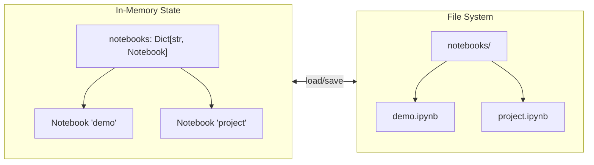
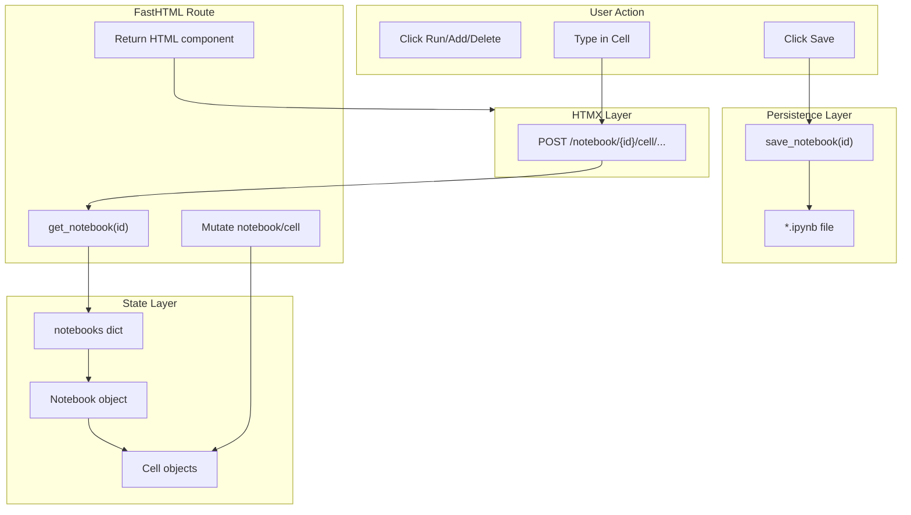
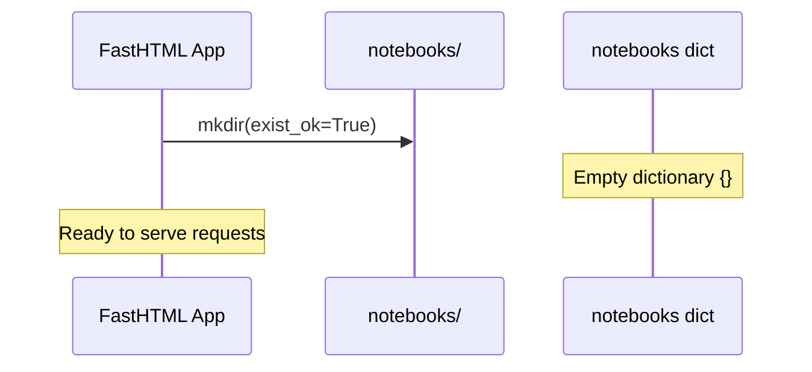
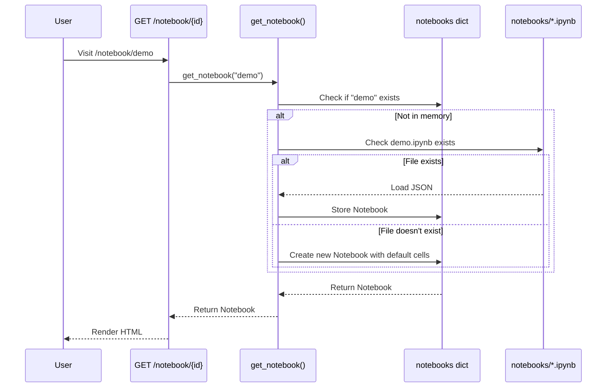
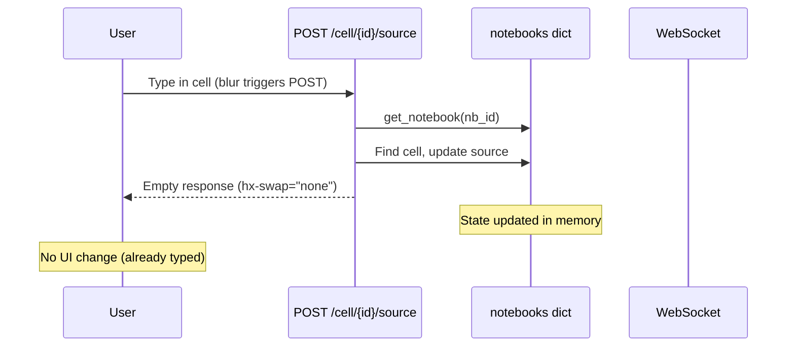
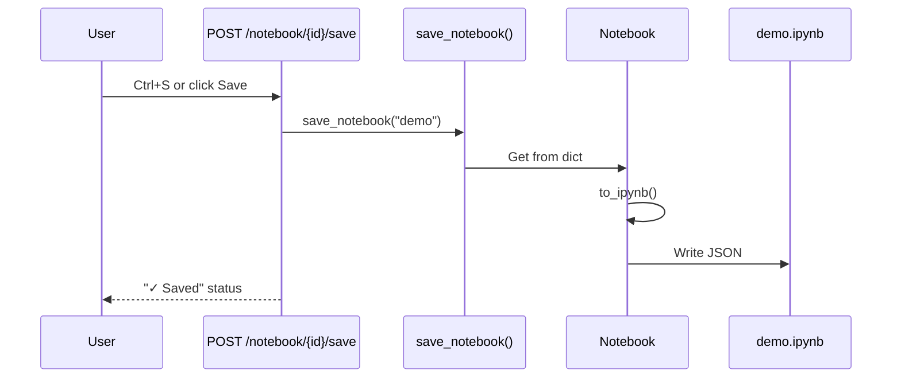

# State Management - Technical Documentation

This document explains how LLM Notebook manages notebook and cell state, including the in-memory data structures, persistence to disk, and state synchronization across the application.

## Table of Contents

1. [Overview](#overview)
2. [Architecture](#architecture)
3. [Data Structures](#data-structures)
4. [State Lifecycle](#state-lifecycle)
5. [CRUD Operations](#crud-operations)
6. [Persistence](#persistence)
7. [State Synchronization](#state-synchronization)
8. [Key Files and Functions](#key-files-and-functions)
9. [Extending the State System](#extending-the-state-system)

---

## Overview

LLM Notebook uses a simple but effective state management approach:

- **In-memory dictionary** holds all active notebooks
- **Lazy loading** - notebooks are loaded from disk on first access
- **Manual save** - changes persist to `.ipynb` files when user clicks Save (Ctrl+S)
- **Direct mutation** - routes modify the in-memory objects directly
- **HTMX re-rendering** - UI updates by re-rendering FastHTML components



---

## Architecture

### State Flow



### Key Principles

1. **Single Source of Truth**: The `notebooks` dictionary is the authoritative state
2. **Lazy Loading**: Notebooks are only loaded when first accessed
3. **Optimistic Updates**: UI updates immediately, save is explicit
4. **No ORM**: Direct JSON serialization to `.ipynb` format

---

## Data Structures

### Global State (`app.py:348-356`)

```python
# In-memory notebook storage
notebooks: Dict[str, Notebook] = {}

# Notebook files directory
NOTEBOOKS_DIR = Path("notebooks")
NOTEBOOKS_DIR.mkdir(exist_ok=True)

# WebSocket connections (for collaboration)
ws_connections: Dict[str, List[Any]] = {}

# Track cancelled cell generations
cancelled_cells: set = set()
```

### Notebook Class (`app.py:205-242`)

```python
@dataclass
class Notebook:
    id: str = field(default_factory=lambda: uuid.uuid4().hex[:8])
    title: str = "Untitled Notebook"
    cells: List[Cell] = field(default_factory=list)
    dialog_mode: str = "learning"  # Solveit compatibility

    def to_ipynb(self) -> Dict[str, Any]:
        """Convert to Jupyter .ipynb format"""
        return {
            "nbformat": 4, "nbformat_minor": 5,
            "metadata": {
                "kernelspec": {"display_name": "Python 3", ...},
                "solveit_dialog_mode": self.dialog_mode,
                "solveit_ver": SOLVEIT_VER
            },
            "cells": [cell.to_jupyter_cell() for cell in self.cells]
        }

    @classmethod
    def from_ipynb(cls, data: Dict[str, Any], notebook_id: str) -> "Notebook":
        """Load from Jupyter .ipynb format"""
        metadata = data.get("metadata", {})
        cells = [Cell.from_jupyter_cell(c) for c in data.get("cells", [])]
        return cls(
            id=notebook_id,
            title="Imported Notebook",
            cells=cells,
            dialog_mode=metadata.get("solveit_dialog_mode", "learning")
        )

    def save(self, path: str):
        with open(path, 'w') as f:
            json.dump(self.to_ipynb(), f, indent=2)

    @classmethod
    def load(cls, path: str) -> "Notebook":
        with open(path) as f:
            data = json.load(f)
        nb_id = Path(path).stem
        nb = cls.from_ipynb(data, nb_id)
        nb.title = Path(path).stem
        return nb
```

### Cell Class (`app.py:71-85`)

See [02_cell_types.md](02_cell_types.md) for complete Cell documentation.

```python
@dataclass
class Cell:
    id: str = field(default_factory=lambda: uuid.uuid4().hex[:8])
    cell_type: str = CellType.CODE.value
    source: str = ""
    output: str = ""
    execution_count: Optional[int] = None
    time_run: str = ""
    skipped: bool = False
    use_thinking: bool = False
    collapsed: bool = False
    input_collapse: int = 0
    output_collapse: int = 0
    pinned: bool = False
    is_exported: bool = False
```

---

## State Lifecycle

### 1. Application Startup



### 2. First Notebook Access



### 3. Cell Modification



### 4. Save to Disk



---

## CRUD Operations

### Create Cell (`app.py:2234-2248`)

```python
@rt("/notebook/{nb_id}/cell/add")
async def post(nb_id: str, pos: int = -1, type: str = "code"):
    nb = get_notebook(nb_id)
    if pos < 0:
        pos = len(nb.cells)

    # Code cells default to scrollable output
    if type == "code":
        nb.cells.insert(pos, Cell(cell_type=type, output_collapse=1))
    else:
        nb.cells.insert(pos, Cell(cell_type=type))

    # Broadcast to collaborators
    await broadcast_to_notebook(nb_id, AllCellsOOB(nb))

    return AllCells(nb)
```

**Key points:**
- `pos=-1` means append to end
- Code cells default to `output_collapse=1` (scrollable)
- Returns full `AllCells()` for HTMX to replace `#cells`
- Broadcasts to WebSocket for collaboration

### Read Cell

Cells are read implicitly when rendering:

```python
def CellView(cell: Cell, notebook_id: str):
    """Render a single cell to HTML"""
    # Reads cell.source, cell.output, cell.cell_type, etc.
    # Returns FastHTML component
```

### Update Cell Source (`app.py:2260-2267`)

```python
@rt("/notebook/{nb_id}/cell/{cid}/source")
def post(nb_id: str, cid: str, source: str):
    nb = get_notebook(nb_id)
    for c in nb.cells:
        if c.id == cid:
            c.source = source
            break
    return ""  # hx-swap="none" - no UI update needed
```

**Key points:**
- Triggered on blur with `hx-trigger="blur changed"`
- Returns empty string (UI already shows typed content)
- Does NOT broadcast to collaborators (typing not synced)

### Update Cell Output (`app.py:2269-2276`)

```python
@rt("/notebook/{nb_id}/cell/{cid}/output")
def post(nb_id: str, cid: str, output: str):
    nb = get_notebook(nb_id)
    for c in nb.cells:
        if c.id == cid:
            c.output = output
            break
    return ""
```

**Use case:** Editing AI response in prompt cells (double-click to edit).

### Delete Cell (`app.py:2250-2258`)

```python
@rt("/notebook/{nb_id}/cell/{cid}")
async def delete(nb_id: str, cid: str):
    nb = get_notebook(nb_id)
    nb.cells = [c for c in nb.cells if c.id != cid]

    # Broadcast to collaborators
    await broadcast_to_notebook(nb_id, AllCellsOOB(nb))

    return AllCells(nb)
```

### Move Cell (`app.py:2293-2307`)

```python
@rt("/notebook/{nb_id}/cell/{cid}/move/{direction}")
async def post(nb_id: str, cid: str, direction: str):
    nb = get_notebook(nb_id)
    for i, c in enumerate(nb.cells):
        if c.id == cid:
            if direction == "up" and i > 0:
                nb.cells[i], nb.cells[i-1] = nb.cells[i-1], nb.cells[i]
            elif direction == "down" and i < len(nb.cells) - 1:
                nb.cells[i], nb.cells[i+1] = nb.cells[i+1], nb.cells[i]
            break

    await broadcast_to_notebook(nb_id, AllCellsOOB(nb))
    return AllCells(nb)
```

### Change Cell Type (`app.py:2278-2291`)

```python
@rt("/notebook/{nb_id}/cell/{cid}/type")
async def post(nb_id: str, cid: str, cell_type: str):
    nb = get_notebook(nb_id)
    for c in nb.cells:
        if c.id == cid:
            c.cell_type = cell_type
            c.output = ""  # Clear output when type changes
            await broadcast_to_notebook(nb_id, CellViewOOB(c, nb_id))
            return CellView(c, nb_id)
    return ""
```

---

## Persistence

### File Format

Notebooks are stored as standard Jupyter `.ipynb` files in the `notebooks/` directory:

```
notebooks/
├── demo.ipynb
├── project.ipynb
└── tutorial.ipynb
```

### Save Operation (`app.py:374-377`)

```python
def save_notebook(notebook_id: str):
    if notebook_id in notebooks:
        path = NOTEBOOKS_DIR / f"{notebook_id}.ipynb"
        notebooks[notebook_id].save(str(path))
```

### Load Operation (`app.py:358-372`)

```python
def get_notebook(notebook_id: str) -> Notebook:
    """Get or create a notebook - ALWAYS requires notebook_id"""
    if notebook_id not in notebooks:
        path = NOTEBOOKS_DIR / f"{notebook_id}.ipynb"
        if path.exists():
            # Load from disk
            notebooks[notebook_id] = Notebook.load(str(path))
        else:
            # Create new with default cells
            nb = Notebook(id=notebook_id, title=notebook_id)
            nb.cells = [
                Cell(cell_type="note", source="# Welcome to LLM Notebook..."),
                Cell(cell_type="code", source="x = [1, 2, 3]...", output_collapse=1),
                Cell(cell_type="prompt", source="Hello! What can you help me with?"),
            ]
            notebooks[notebook_id] = nb
    return notebooks[notebook_id]
```

### List Notebooks (`app.py:379-380`)

```python
def list_notebooks() -> List[str]:
    return [p.stem for p in NOTEBOOKS_DIR.glob("*.ipynb")]
```

---

## State Synchronization

### What Gets Synchronized

| Action | In-Memory | To Disk | To Collaborators |
|--------|-----------|---------|------------------|
| Type in cell | Immediate | Manual save | **No** (too expensive) |
| Run cell | Immediate | Manual save | **Yes** (OOB swap) |
| Add cell | Immediate | Manual save | **Yes** (OOB swap) |
| Delete cell | Immediate | Manual save | **Yes** (OOB swap) |
| Move cell | Immediate | Manual save | **Yes** (OOB swap) |
| Change type | Immediate | Manual save | **Yes** (OOB swap) |
| Collapse | Immediate | Manual save | **Yes** (OOB swap) |
| Save | N/A | Immediate | **No** |

### Broadcast Pattern

Routes that modify state follow this pattern:

```python
@rt("/notebook/{nb_id}/cell/{cid}/some-action")
async def post(nb_id: str, cid: str, ...):
    nb = get_notebook(nb_id)

    # 1. Find and modify the cell
    for c in nb.cells:
        if c.id == cid:
            # Modify state
            break

    # 2. Broadcast to collaborators (OOB swap)
    await broadcast_to_notebook(nb_id, CellViewOOB(c, nb_id))
    # OR for full cells container:
    await broadcast_to_notebook(nb_id, AllCellsOOB(nb))

    # 3. Return HTML for requesting client
    return CellView(c, nb_id)
```

---

## Key Files and Functions

| Location | Purpose |
|----------|---------|
| `app.py:348` | `notebooks: Dict[str, Notebook]` - global state |
| `app.py:349-350` | `NOTEBOOKS_DIR` - file storage path |
| `app.py:358-372` | `get_notebook()` - lazy load/create |
| `app.py:374-377` | `save_notebook()` - persist to disk |
| `app.py:379-380` | `list_notebooks()` - enumerate saved |
| `app.py:205-242` | `Notebook` class - data model |
| `app.py:71-165` | `Cell` class - data model |
| `app.py:2234-2248` | Add cell route |
| `app.py:2250-2258` | Delete cell route |
| `app.py:2260-2276` | Update source/output routes |
| `app.py:2293-2307` | Move cell route |
| `app.py:2309-2346` | Collapse routes |

---

## Extending the State System

### Adding a New Cell Field

1. **Add to Cell dataclass** (`app.py:71`):
   ```python
   @dataclass
   class Cell:
       # ... existing fields ...
       new_field: str = ""
   ```

2. **Add serialization** (`app.py:87`):
   ```python
   def to_jupyter_cell(self):
       # ... existing code ...
       if self.new_field:
           cell["metadata"]["new_field"] = self.new_field
   ```

3. **Add deserialization** (`app.py:130`):
   ```python
   @classmethod
   def from_jupyter_cell(cls, cell):
       # ... existing code ...
       new_field=metadata.get("new_field", "")
   ```

4. **Add route if needed**:
   ```python
   @rt("/notebook/{nb_id}/cell/{cid}/new-field")
   async def post(nb_id: str, cid: str, value: str):
       nb = get_notebook(nb_id)
       for c in nb.cells:
           if c.id == cid:
               c.new_field = value
               await broadcast_to_notebook(nb_id, CellViewOOB(c, nb_id))
               return CellView(c, nb_id)
   ```

### Adding a New Notebook Field

1. **Add to Notebook dataclass** (`app.py:205`):
   ```python
   @dataclass
   class Notebook:
       # ... existing fields ...
       new_setting: str = "default"
   ```

2. **Add to `to_ipynb()`** (`app.py:211`):
   ```python
   "metadata": {
       # ... existing metadata ...
       "new_setting": self.new_setting
   }
   ```

3. **Add to `from_ipynb()`** (`app.py:224`):
   ```python
   return cls(
       # ... existing fields ...
       new_setting=metadata.get("new_setting", "default")
   )
   ```

### Alternative Storage Backends

To add a different storage backend (e.g., database, cloud):

```python
from abc import ABC, abstractmethod

class StorageBackend(ABC):
    @abstractmethod
    def save(self, notebook_id: str, notebook: Notebook): ...

    @abstractmethod
    def load(self, notebook_id: str) -> Notebook: ...

    @abstractmethod
    def list(self) -> List[str]: ...

    @abstractmethod
    def exists(self, notebook_id: str) -> bool: ...

class FileStorage(StorageBackend):
    def __init__(self, directory: Path):
        self.directory = directory

    def save(self, notebook_id: str, notebook: Notebook):
        path = self.directory / f"{notebook_id}.ipynb"
        notebook.save(str(path))

    def load(self, notebook_id: str) -> Notebook:
        path = self.directory / f"{notebook_id}.ipynb"
        return Notebook.load(str(path))

    def list(self) -> List[str]:
        return [p.stem for p in self.directory.glob("*.ipynb")]

    def exists(self, notebook_id: str) -> bool:
        return (self.directory / f"{notebook_id}.ipynb").exists()

# Usage
storage = FileStorage(NOTEBOOKS_DIR)
# Or: storage = DatabaseStorage(connection_string)
# Or: storage = S3Storage(bucket_name)
```

---

## See Also

- [02_cell_types.md](02_cell_types.md) - Cell types and their behavior
- [03_real_time_collaboration.md](03_real_time_collaboration.md) - WebSocket broadcasting
- [../../DEVELOPERS.md](../../DEVELOPERS.md) - General developer guide
