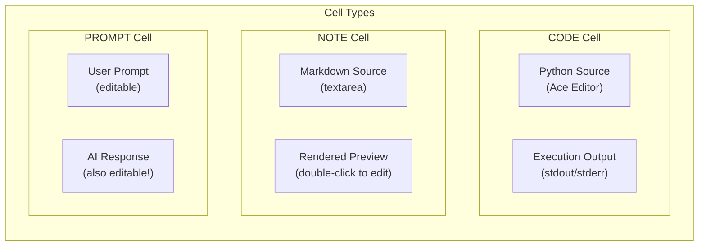
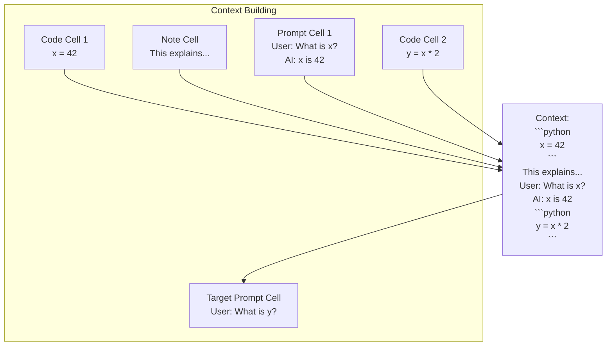

# Cell Types - Technical Documentation

This document provides a comprehensive guide to the three cell types in Dialeng: **Code**, **Note**, and **Prompt**. It covers how each cell type is implemented, how they work, and their intended behavior.

## Table of Contents

1. [Overview](#overview)
2. [Data Model](#data-model)
3. [Code Cells](#code-cells)
4. [Note Cells](#note-cells)
5. [Prompt Cells](#prompt-cells)
6. [Serialization (.ipynb Format)](#serialization-ipynb-format)
7. [Cell Collapse System](#cell-collapse-system)
8. [Adding New Cell Types](#adding-new-cell-types)

---

## Overview

Dialeng has three distinct cell types, each serving a different purpose:

| Cell Type | Purpose | Input | Output | Editable Parts |
|-----------|---------|-------|--------|----------------|
| **Code** | Execute Python | Python code | stdout/stderr + last expression | Source only |
| **Note** | Documentation | Markdown text | Rendered preview | Source (markdown) |
| **Prompt** | Chat with AI | User prompt | LLM response | **Both** user prompt and AI response |



---

## Data Model

### CellType Enum

Defined in `app.py:61-64`:

```python
class CellType(str, Enum):
    CODE = "code"
    NOTE = "note"
    PROMPT = "prompt"
```

### Cell Dataclass

The `Cell` dataclass (`app.py:71-85`) stores all cell data:

```python
@dataclass
class Cell:
    id: str = field(default_factory=lambda: uuid.uuid4().hex[:8])
    cell_type: str = CellType.CODE.value
    source: str = ""           # Code, markdown, or user prompt
    output: str = ""           # Execution output or AI response
    execution_count: Optional[int] = None
    time_run: str = ""         # Timestamp of last run
    skipped: bool = False      # Solveit compatibility
    use_thinking: bool = False # Enable thinking mode for prompts
    collapsed: bool = False    # Legacy collapse state
    input_collapse: int = 0    # CollapseLevel: 0=expanded, 1=scrollable, 2=summary
    output_collapse: int = 0   # CollapseLevel: 0=expanded, 1=scrollable, 2=summary
    pinned: bool = False       # Pin to context (future feature)
    is_exported: bool = False  # Mark as exported (future feature)
```

### Field Meanings by Cell Type

| Field | Code Cell | Note Cell | Prompt Cell |
|-------|-----------|-----------|-------------|
| `source` | Python code | Markdown text | User's prompt |
| `output` | stdout/stderr | (unused) | AI response |
| `execution_count` | Incremented on run | (unused) | (unused) |
| `time_run` | Timestamp | (unused) | Timestamp |
| `use_thinking` | (unused) | (unused) | Show thinking indicator |

---

## Code Cells

### Purpose

Code cells execute Python code in a persistent kernel namespace, displaying stdout/stderr output and the result of the last expression (Jupyter-style).

### Implementation Details

#### Rendering (`app.py:1981-2002`)

Code cells are rendered with:
1. **Hidden textarea** - Stores source for form submission
2. **Ace Editor container** - Syntax-highlighted code editor
3. **Output div** - Shows execution results (with error styling)

```python
if cell.cell_type == "code":
    input_collapse_cls = get_collapse_class(cell.input_collapse)
    output_collapse_cls = get_collapse_class(cell.output_collapse)
    body = Div(
        # Hidden textarea for form submission - Ace reads from this
        Textarea(cell.source, name="source", id=f"source-{cell.id}",
                style="display: none;",
                hx_post=f"/notebook/{notebook_id}/cell/{cell.id}/source",
                hx_trigger="blur changed", hx_swap="none"),
        # Ace Editor container
        Div(
            Div(id=f"ace-{cell.id}", cls="ace-container"),
            cls=f"cell-input {input_collapse_cls}".strip(),
            data_collapse_section="input"
        ),
        # Output section (only shown if output exists)
        Div(cell.output,
            cls=f"output{' error' if 'Error' in cell.output else ''} {output_collapse_cls}".strip(),
            data_collapse_section="output")
            if cell.output else None,
        Script(f"setTimeout(() => initAceEditor('{cell.id}'), 0);"),
        cls="cell-body"
    )
```

#### Ace Editor Integration

The Ace Editor provides:
- Python syntax highlighting
- Auto-indentation
- Bracket matching
- Theme sync (Monokai for dark, Chrome for light)

JavaScript initialization (`initAceEditor()`):
```javascript
function initAceEditor(cellId) {
    const container = document.getElementById(`ace-${cellId}`);
    const textarea = document.getElementById(`source-${cellId}`);

    const editor = ace.edit(container);
    editor.setTheme(`ace/theme/${currentTheme === 'dark' ? 'monokai' : 'chrome'}`);
    editor.session.setMode("ace/mode/python");
    editor.setValue(textarea.value, -1);

    // Sync to hidden textarea on change
    editor.on('change', () => {
        textarea.value = editor.getValue();
    });
}
```

#### Execution (`app.py:2369-2376`)

When a code cell is run:

```python
if c.cell_type == "code":
    stdout, stderr, success, exec_count = kernel.execute(c.source)
    c.output = stdout + stderr
    c.execution_count = exec_count
    c.time_run = datetime.now().strftime("%H:%M:%S")

    # Broadcast to collaborators
    await broadcast_to_notebook(nb_id, CellViewOOB(c, nb_id))
```

#### Python Kernel (`app.py:248-305`)

The `PythonKernel` class provides Jupyter-style execution:

```python
class PythonKernel:
    def __init__(self):
        self.namespace = {"__name__": "__main__"}
        self.execution_count = 0
        self._setup_builtins()

    def execute(self, code: str) -> tuple[str, str, bool, int]:
        """Execute code with Jupyter-style output for the last expression."""
        # Parse code into AST
        tree = ast.parse(code, '<cell>', 'exec')

        if tree.body:
            last_stmt = tree.body[-1]

            # If last statement is an expression, evaluate it separately
            if isinstance(last_stmt, ast.Expr):
                # Execute all but last
                if len(tree.body) > 1:
                    exec_tree = ast.Module(body=tree.body[:-1], type_ignores=[])
                    exec(compile(exec_tree, '<cell>', 'exec'), self.namespace)

                # Evaluate last expression
                expr_tree = ast.Expression(body=last_stmt.value)
                last_expr_result = eval(compile(expr_tree, '<cell>', 'eval'), self.namespace)
            else:
                exec(compile(tree, '<cell>', 'exec'), self.namespace)

        # Append last expression result to output (Jupyter-style)
        if last_expr_result is not None:
            stdout_val += repr(last_expr_result)

        return (stdout_val, stderr_val, success, self.execution_count)
```

**Key Behavior:**
- Variables persist across cells in `namespace`
- Last expression is automatically displayed (like Jupyter)
- Errors show full traceback in output
- Execution count increments on each run

### Intended Behavior

1. **Shift+Enter** runs the cell and moves to next cell
2. **Output is scrollable by default** (`output_collapse=1`)
3. **Errors are styled red** (class `.error` applied)
4. **Namespace persists** - variables defined in one cell are available in later cells
5. **Ace Editor syncs to hidden textarea** for form submission

---

## Note Cells

### Purpose

Note cells provide markdown documentation within the notebook. They render markdown to HTML and support double-click editing.

### Implementation Details

#### Rendering (`app.py:2003-2020`)

Note cells are rendered with:
1. **Hidden textarea** - Stores markdown source
2. **Preview div** - Shows rendered markdown

```python
elif cell.cell_type == "note":
    input_collapse_cls = get_collapse_class(cell.input_collapse)
    body = Div(
        Textarea(cell.source, cls="source", name="source", id=f"source-{cell.id}",
                placeholder="# Markdown notes...",
                hx_post=f"/notebook/{notebook_id}/cell/{cell.id}/source",
                hx_trigger="blur changed", hx_swap="none",
                style="display: none;",
                onblur=f"switchToPreview('{cell.id}', 'source')"),
        Div(
            Div(id=f"preview-{cell.id}", cls="md-preview",
                data_cell_id=cell.id, data_field="source"),
            cls=f"cell-input {input_collapse_cls}".strip(),
            data_collapse_section="input"
        ),
        Div("Double-click to edit - Escape to finish - Z to cycle collapse", cls="edit-hint"),
        cls="cell-body"
    )
```

#### Markdown Rendering

JavaScript handles markdown preview:

```javascript
function renderMarkdownPreview(cellId, field) {
    const textarea = document.getElementById(`${field === 'source' ? 'source' : field}-${cellId}`);
    const preview = document.querySelector(`[data-cell-id="${cellId}"][data-field="${field}"]`);

    if (textarea && preview) {
        // Use marked.js for markdown rendering
        preview.innerHTML = marked.parse(textarea.value || '*Empty note*');
        // Add syntax highlighting to code blocks
        preview.querySelectorAll('pre code').forEach(block => {
            hljs.highlightElement(block);
        });
    }
}
```

#### Edit Mode Toggle

Double-click switches to edit mode:

```javascript
function switchToEdit(cellId, field) {
    const textarea = document.getElementById(`${field === 'source' ? 'source' : field}-${cellId}`);
    const preview = document.querySelector(`[data-cell-id="${cellId}"][data-field="${field}"]`);

    textarea.style.display = 'block';
    preview.parentElement.style.display = 'none';
    textarea.focus();
}

function switchToPreview(cellId, field) {
    const textarea = document.getElementById(`${field === 'source' ? 'source' : field}-${cellId}`);
    const preview = document.querySelector(`[data-cell-id="${cellId}"][data-field="${field}"]`);

    textarea.style.display = 'none';
    preview.parentElement.style.display = 'block';
    renderMarkdownPreview(cellId, field);
}
```

### Intended Behavior

1. **Renders markdown immediately** on page load
2. **Double-click** any part of the preview to edit
3. **Escape** or clicking outside exits edit mode
4. **Shift+Enter** moves to next cell (no "execution")
5. **No output section** - notes are input-only
6. **Code blocks** get syntax highlighting via highlight.js

---

## Prompt Cells

### Purpose

Prompt cells are the unique innovation of Dialeng. They provide a chat interface where:
- Users write prompts to the AI
- AI responses stream in real-time
- **Both** the prompt AND response are editable

### Implementation Details

#### Rendering (`app.py:2021-2093`)

Prompt cells have two main sections:

**1. User Prompt Section:**
- Before run: Shows editable textarea
- After run: Shows rendered markdown preview (double-click to edit)

**2. AI Response Section:**
- Shows streaming response or rendered preview
- Always editable (double-click to edit)

```python
else:  # Prompt
    has_output = bool(cell.output and cell.output.strip())

    # User prompt section
    if has_output:
        # After run: show markdown preview (double-click to edit)
        user_prompt_section = Div(
            Div(Span("👤"), " Your Prompt ", cls="prompt-label user"),
            Div(
                Textarea(cell.source, style="display: none;", ...),
                Div(cls="md-preview prompt-preview", data_cell_id=cell.id, data_field="prompt"),
                cls=f"prompt-input {input_collapse_cls}".strip()
            ),
            cls="prompt-section"
        )
    else:
        # Before run: show editable textarea
        user_prompt_section = Div(
            Div(Span("👤"), " Your Prompt", cls="prompt-label user"),
            Div(
                Textarea(cell.source, placeholder="Ask the AI anything...", ...),
                cls=f"prompt-input {input_collapse_cls}".strip()
            ),
            cls="prompt-section"
        )

    # AI response section
    body = Div(
        Input(type="hidden", id=f"source-{cell.id}", name="source", value=cell.source),
        user_prompt_section,
        Div(
            Div(Span("🤖"), " AI Response ", cls="prompt-label ai"),
            Div(
                Textarea(cell.output, style="display: none;", ...),
                Div(cls="ai-preview", data_cell_id=cell.id, data_field="output"),
                cls=f"prompt-output {output_collapse_cls}".strip()
            ),
            cls="prompt-section"
        ),
        cls="cell-body"
    )
```

#### Execution with Streaming (`app.py:2378-2440`)

Prompt cell execution involves:
1. Building context from previous cells
2. Streaming LLM response via WebSocket
3. Broadcasting final state to collaborators

```python
elif c.cell_type == "prompt":
    # Build context from visible cells above
    context_parts = []
    for prev in nb.cells:
        if prev.id == cid: break
        if prev.cell_type == "code":
            context_parts.append(f"```python\n{prev.source}\n```")
            if prev.output:
                context_parts.append(f"Output:\n```\n{prev.output}\n```")
        elif prev.cell_type == "note":
            context_parts.append(prev.source)
        elif prev.cell_type == "prompt" and prev.output:
            context_parts.append(f"User: {prev.source}\n\nAssistant: {prev.output}")
    context = "\n\n".join(context_parts)

    # Stream LLM response
    response_parts = []
    async for item in mock_llm_stream(c.source, context, c.use_thinking):
        if cid in cancelled_cells:
            break

        if item["type"] == "chunk":
            response_parts.append(item["content"])

        # Send via WebSocket
        if nb_id in ws_connections:
            msg = json.dumps({"type": "stream_chunk", "cell_id": cid, "chunk": item["content"]})
            for send in ws_connections[nb_id]:
                await send(msg)

    c.output = "".join(response_parts)

    # Broadcast final state
    await broadcast_to_notebook(nb_id, CellViewOOB(c, nb_id))
```

#### WebSocket Streaming

The client receives streaming chunks:

```javascript
ws.onmessage = (event) => {
    const data = JSON.parse(event.data);

    if (data.type === 'stream_chunk') {
        const preview = document.querySelector(`#cell-${data.cell_id} .ai-preview`);
        if (preview) {
            // Append chunk and re-render markdown
            streamingContent[data.cell_id] = (streamingContent[data.cell_id] || '') + data.chunk;
            preview.innerHTML = marked.parse(streamingContent[data.cell_id]);
        }
    }

    if (data.type === 'stream_end') {
        // Finalize streaming
        delete streamingContent[data.cell_id];
    }

    if (data.type === 'thinking_start') {
        showThinkingIndicator(data.cell_id);
    }

    if (data.type === 'thinking_end') {
        hideThinkingIndicator(data.cell_id);
    }
};
```

#### Context Building

Context is built from cells **above** the prompt:



#### Thinking Mode

When `use_thinking` is enabled:
1. Server yields `{"type": "thinking_start"}`
2. Client shows animated "🧠 Thinking..." indicator
3. Server yields `{"type": "thinking_end"}`
4. Client hides indicator, starts showing response

### Intended Behavior

1. **Shift+Enter** runs the prompt, streaming response appears
2. **Both parts editable** - double-click user prompt or AI response to edit
3. **Context-aware** - AI sees all cells above the prompt
4. **Streaming** - Response appears word-by-word via WebSocket
5. **Cancellable** - Click ⏹ button to stop generation
6. **Thinking indicator** - Shows 🧠 animation when enabled
7. **Collaborative** - All connected users see the streaming response

---

## Serialization (.ipynb Format)

Dialeng uses the Solveit convention for `.ipynb` files, ensuring compatibility with Jupyter and Solveit.

### Cell Type Mapping

| Dialeng | Jupyter Cell Type | Key Metadata |
|--------------|-------------------|--------------|
| Code | `code` | `time_run`, `skipped`, `execution_count` |
| Note | `markdown` | (no `solveit_ai`) |
| Prompt | `markdown` | `solveit_ai: true` |

### Serialization (`app.py:87-128`)

```python
def to_jupyter_cell(self) -> Dict[str, Any]:
    if self.cell_type == CellType.CODE.value:
        cell = {
            "cell_type": "code",
            "id": self.id,
            "metadata": {},
            "source": self._to_source_lines(self.source),
            "execution_count": self.execution_count,
            "outputs": self._format_outputs(self.output)
        }
    elif self.cell_type == CellType.NOTE.value:
        cell = {
            "cell_type": "markdown",
            "id": self.id,
            "metadata": {},
            "source": self._to_source_lines(self.source)
        }
    else:  # Prompt
        combined = join_prompt_content(self.source, self.output)
        cell = {
            "cell_type": "markdown",
            "id": self.id,
            "metadata": {"solveit_ai": True},
            "source": self._to_source_lines(combined)
        }
    return cell
```

### Prompt Cell Format in .ipynb

Prompt cells store both parts in a single markdown cell:

```markdown
What is the capital of France?

##### 🤖Reply🤖<!-- SOLVEIT_SEPARATOR_7f3a9b2c -->

The capital of France is **Paris**.
```

The separator `##### 🤖Reply🤖<!-- SOLVEIT_SEPARATOR_xxx -->` divides:
- **Before**: User's prompt
- **After**: AI's response

### Deserialization (`app.py:130-165`)

```python
@classmethod
def from_jupyter_cell(cls, cell: Dict[str, Any]) -> "Cell":
    if cell["cell_type"] == "code":
        return cls(
            cell_type=CellType.CODE.value,
            source=source,
            output=cls._extract_output(cell.get("outputs", [])),
            execution_count=cell.get("execution_count"),
            # Code cells default to scrollable output
            output_collapse=metadata.get("output_collapse", 1)
        )
    else:
        if metadata.get("solveit_ai"):
            # Prompt cell - split into user/AI parts
            user_prompt, ai_response = split_prompt_content(source)
            return cls(
                cell_type=CellType.PROMPT.value,
                source=user_prompt,
                output=ai_response
            )
        else:
            # Note cell
            return cls(
                cell_type=CellType.NOTE.value,
                source=source
            )
```

---

## Cell Collapse System

### Collapse Levels

Each cell has independent input and output collapse:

```python
class CollapseLevel(int, Enum):
    EXPANDED = 0    # Full visibility
    SCROLLABLE = 1  # 168px max height with scrollbar
    SUMMARY = 2     # Single line with ellipsis
```

### CSS Classes

```css
.collapse-scrollable {
    max-height: 168px;
    overflow-y: auto;
}

.collapse-summary {
    max-height: 2.25em;
    overflow: hidden;
    text-overflow: ellipsis;
    white-space: nowrap;
}
```

### Keyboard Shortcuts

| Shortcut | Action |
|----------|--------|
| `Z` | Cycle input collapse level |
| `Shift+Z` | Cycle output collapse level |
| `Alt+Z` | Cycle both together |

### Default Collapse States

| Cell Type | Input Default | Output Default |
|-----------|---------------|----------------|
| Code | Expanded (0) | **Scrollable (1)** |
| Note | Expanded (0) | N/A |
| Prompt | Expanded (0) | Expanded (0) |

---

## Adding New Cell Types

To add a new cell type:

### 1. Add to CellType Enum (`app.py:61`)

```python
class CellType(str, Enum):
    CODE = "code"
    NOTE = "note"
    PROMPT = "prompt"
    IMAGE = "image"  # New type
```

### 2. Add Rendering in CellView (`app.py:1981+`)

```python
elif cell.cell_type == "image":
    body = Div(
        # Your rendering logic
        Img(src=cell.source, cls="cell-image"),
        cls="cell-body"
    )
```

### 3. Add Execution Handler (`app.py:2369+`)

```python
elif c.cell_type == "image":
    # Handle image cell execution
    pass
```

### 4. Add Serialization (`app.py:87+`)

```python
elif self.cell_type == CellType.IMAGE.value:
    cell = {
        "cell_type": "markdown",  # Or custom
        "metadata": {"custom_type": "image"},
        "source": self._to_source_lines(self.source)
    }
```

### 5. Add Deserialization (`app.py:130+`)

```python
if metadata.get("custom_type") == "image":
    return cls(cell_type=CellType.IMAGE.value, source=source)
```

### 6. Add CSS Styling

```css
.cell[data-type="image"] {
    /* Image cell styles */
}
```

### 7. Update AddButtons (`app.py:2095+`)

```python
Button("+ Image", cls="btn btn-sm",
       hx_post=f"/notebook/{nb_id}/cell/add?pos={pos}&type=image",
       hx_target="#cells", hx_swap="outerHTML"),
```

---

## Key Files Reference

| File | Purpose |
|------|---------|
| `app.py:61-64` | CellType enum definition |
| `app.py:71-85` | Cell dataclass |
| `app.py:87-165` | Serialization/deserialization |
| `app.py:248-305` | PythonKernel for code execution |
| `app.py:311-343` | Mock LLM streaming |
| `app.py:1981-2093` | CellView rendering |
| `app.py:2369-2440` | Cell execution handler |

---

## See Also

- [01_state_management.md](01_state_management.md) - How notebooks and cells are stored
- [03_real_time_collaboration.md](03_real_time_collaboration.md) - How cell updates are broadcast
- [DEVELOPERS.md](../../DEVELOPERS.md) - General developer guide
- [ROADMAP.md](../../ROADMAP.md) - Planned cell type improvements
