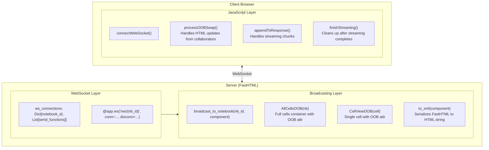

# Real-Time Collaboration - How It Works

This document explains the implementation of real-time collaboration in LLM Notebook, enabling multiple users to work on the same notebook simultaneously.

## Table of Contents

1. [Architecture Overview](#architecture-overview)
2. [WebSocket Connection Management](#websocket-connection-management)
3. [Message Types](#message-types)
4. [OOB Swap Mechanism](#oob-swap-mechanism)
5. [Cell-Specific Behavior](#cell-specific-behavior)
   - [Code Cells](#code-cells)
   - [Note Cells](#note-cells)
   - [Prompt Cells](#prompt-cells)
6. [Conflict Avoidance](#conflict-avoidance)
7. [Key Files and Functions](#key-files-and-functions)
8. [Improving the Implementation](#improving-the-implementation)

---

## Architecture Overview



### Key Concepts

1. **WebSocket per Notebook**: Each notebook has its own WebSocket endpoint (`/ws/{notebook_id}`). All clients viewing the same notebook share updates.

2. **OOB (Out-of-Band) Swaps**: Instead of sending JSON messages that need custom handlers, we send HTML with `hx-swap-oob="true"` attributes. This leverages HTMX's built-in DOM replacement.

3. **List-Based Connection Tracking**: Connections are stored as a simple list of `send` functions (following FastHTML's Game of Life pattern), not a dictionary with IDs.

4. **Two Message Categories**:
   - **HTML messages** (start with `<`): Processed via `processOOBSwap()` for DOM updates
   - **JSON messages**: Used for streaming chunks, thinking indicators, and cancellation

---

## WebSocket Connection Management

### Server-Side Connection Tracking

```python
# Global connection registry (app.py:353)
ws_connections: Dict[str, List[Any]] = {}
```

Each notebook ID maps to a list of WebSocket `send` functions.

### Connection Lifecycle

```python
# When a client connects (app.py:2490-2501)
async def ws_on_connect(send, scope):
    # Extract notebook ID from WebSocket path (/ws/notebook_id)
    path = scope.get('path', '')
    parts = path.strip('/').split('/')
    nb_id = parts[1] if len(parts) > 1 else 'default'

    # Add to connections list
    if nb_id not in ws_connections:
        ws_connections[nb_id] = []
    ws_connections[nb_id].append(send)

# When a client disconnects (app.py:2503-2511)
async def ws_on_disconnect(send, scope):
    # Extract notebook ID and remove from list
    if nb_id in ws_connections and send in ws_connections[nb_id]:
        ws_connections[nb_id].remove(send)
```

### Client-Side Connection

```javascript
// Establishes WebSocket on page load (app.py:1600-1606)
function connectWebSocket(notebookId) {
    const protocol = window.location.protocol === 'https:' ? 'wss:' : 'ws:';
    ws = new WebSocket(`${protocol}//${window.location.host}/ws/${notebookId}`);

    ws.onmessage = function(event) {
        const msg = event.data;

        // HTML messages (collaboration updates)
        if (msg.startsWith('<')) {
            processOOBSwap(msg);
            return;
        }

        // JSON messages (streaming, thinking indicators)
        const data = JSON.parse(msg);
        // ... handle streaming
    };
}
```

---

## Message Types

### HTML Messages (OOB Swaps)

Used for structural updates that replace DOM elements.

| Trigger | Function Called | HTML Sent |
|---------|-----------------|-----------|
| Add cell | `AllCellsOOB(nb)` | `<div id="cells" hx-swap-oob="true">...</div>` |
| Delete cell | `AllCellsOOB(nb)` | `<div id="cells" hx-swap-oob="true">...</div>` |
| Move cell | `AllCellsOOB(nb)` | `<div id="cells" hx-swap-oob="true">...</div>` |
| Run code cell | `CellViewOOB(cell, nb_id)` | `<div id="cell-xxx" hx-swap-oob="true">...</div>` |
| Collapse cell | `CellViewOOB(cell, nb_id)` | `<div id="cell-xxx" hx-swap-oob="true">...</div>` |
| Change cell type | `CellViewOOB(cell, nb_id)` | `<div id="cell-xxx" hx-swap-oob="true">...</div>` |
| Prompt complete | `CellViewOOB(cell, nb_id)` | `<div id="cell-xxx" hx-swap-oob="true">...</div>` |

### JSON Messages (Streaming)

Used for real-time streaming during prompt cell execution.

| Type | When Sent | Payload |
|------|-----------|---------|
| `stream_chunk` | Each LLM token | `{type, cell_id, chunk, thinking?}` |
| `stream_end` | Streaming complete | `{type, cell_id}` |
| `thinking_start` | Thinking mode begins | `{type, cell_id}` |
| `thinking_end` | Thinking mode ends | `{type, cell_id}` |
| `cancel` | User clicks cancel (client→server) | `{type, cell_id}` |

---

## OOB Swap Mechanism

### What is OOB (Out-of-Band)?

HTMX's OOB swap allows updating elements by ID without the typical request/response cycle. When an element has `hx-swap-oob="true"`, HTMX finds the element with matching ID and replaces it.

### Server-Side: Creating OOB Components

```python
# Full cells container replacement (app.py:2124-2132)
def AllCellsOOB(nb: Notebook):
    """Returns AllCells with hx-swap-oob for WebSocket broadcasting."""
    items = [AddButtons(0, nb.id)]
    for i, c in enumerate(nb.cells):
        items.extend([CellView(c, nb.id), AddButtons(i+1, nb.id)])
    return Div(*items, id="cells", hx_swap_oob="true")

# Single cell replacement (app.py:2134-2150)
def CellViewOOB(cell: Cell, notebook_id: str):
    """Returns CellView with hx-swap-oob for WebSocket broadcasting."""
    cell_div = CellView(cell, notebook_id)
    return Div(
        *cell_div.children,
        id=f"cell-{cell.id}",
        cls=cell_div.attrs.get('class', ''),
        hx_swap_oob="true",
        **{k: v for k, v in cell_div.attrs.items() if k not in ('id', 'class')}
    )
```

### Server-Side: Broadcasting

```python
# Broadcast helper (app.py:386-428)
async def broadcast_to_notebook(nb_id: str, component, exclude_send: Any = None):
    """Broadcast an HTML component to all WebSocket connections."""
    if nb_id not in ws_connections or not ws_connections[nb_id]:
        return

    # CRITICAL: Use to_xml() not str() for HTML serialization
    # str(component) returns only the element ID, not HTML!
    html_str = to_xml(component)

    alive = []
    for send in ws_connections[nb_id]:
        if send is exclude_send:
            alive.append(send)
            continue
        try:
            await send(html_str)
            alive.append(send)
        except Exception:
            pass  # Dead connection, don't add to alive

    ws_connections[nb_id] = alive  # Clean up dead connections
```

### Client-Side: Processing OOB Swaps

```javascript
// Process incoming HTML (app.py:1723-1802)
function processOOBSwap(html) {
    const template = document.createElement('template');
    template.innerHTML = html.trim();

    for (const element of template.content.children) {
        const oobAttr = element.getAttribute('hx-swap-oob');
        if (oobAttr !== 'true') continue;

        const targetId = element.id;
        const target = document.getElementById(targetId);
        if (!target) continue;

        // Single cell update
        if (targetId.startsWith('cell-')) {
            const cellId = targetId.replace('cell-', '');
            const isEditing = target.contains(document.activeElement);
            const isStreaming = target.classList.contains('streaming');

            // Skip if user is editing or streaming
            if (isEditing || isStreaming) continue;

            element.removeAttribute('hx-swap-oob');
            target.replaceWith(element);

            // Reinitialize Ace editor for code cells
            if (newCell.dataset.type === 'code') {
                setTimeout(() => initAceEditor(cellId), 0);
            }
            renderCellPreviews(cellId);
        }
        // Full cells container update
        else if (targetId === 'cells') {
            // Skip if any cell is being edited or streaming
            if (editingCell || streamingCell) continue;

            element.removeAttribute('hx-swap-oob');
            target.replaceWith(element);
            reinitializeAceEditors();
            renderAllPreviews();
        }
    }
}
```

---

## Cell-Specific Behavior

### Code Cells

**When Run:**
1. Server executes Python code via the kernel
2. Output is stored in `cell.output`
3. `CellViewOOB(cell, nb_id)` is broadcast to all clients
4. Each client's `processOOBSwap()` replaces the cell (unless editing)
5. Ace editor is reinitialized for code cells

**Route:** `POST /notebook/{nb_id}/cell/{cid}/run`

```python
# Code cell execution (app.py:2367-2376)
if c.cell_type == "code":
    c.output = kernel.execute(c.source)
    c.time_run = datetime.now().strftime("%H:%M:%S")

    # Broadcast to collaborators
    await broadcast_to_notebook(nb_id, CellViewOOB(c, nb_id))
```

### Note Cells

**When Run:**
- Note cells don't execute; they just render markdown
- The "run" action simply moves focus to the next cell
- Collaborators see updates when markdown source changes (on blur)

**Route:** `POST /notebook/{nb_id}/cell/{cid}/source`
- Updates source on blur
- No broadcast needed (collaborators don't see typing in real-time)

### Prompt Cells

**Most Complex:** Prompt cells have streaming behavior that requires special handling.

**When Run:**
1. Client calls `startStreaming(cellId)` which:
   - Adds `streaming` class to cell
   - Shows thinking indicator
   - Swaps run button for cancel button

2. Server streams tokens via WebSocket JSON messages:
```python
# Streaming loop (app.py:2398-2425)
async for item in mock_llm_stream(c.source, context, c.use_thinking):
    if cid in cancelled_cells:
        break

    if item["type"] == "chunk":
        response_parts.append(item["content"])

    # Send via WebSocket to ALL connected clients
    if nb_id in ws_connections and ws_connections[nb_id]:
        msg = json.dumps({
            "type": "stream_chunk",
            "cell_id": cid,
            "chunk": item["content"]
        })
        for send in ws_connections[nb_id]:
            try:
                await send(msg)
            except:
                pass
```

3. Client handles streaming chunks:
```javascript
function appendToResponse(cellId, chunk, isThinking) {
    const textarea = document.getElementById(`output-${cellId}`);
    if (textarea) {
        textarea.value += chunk;
        // Also update preview
        const preview = document.querySelector(`[data-cell-id="${cellId}"][data-field="output"]`);
        if (preview) {
            preview.innerHTML = renderMarkdown(textarea.value);
        }
    }
}
```

4. When streaming completes:
```python
# Send end signal (app.py:2430-2437)
msg = json.dumps({"type": "stream_end", "cell_id": cid})
for send in ws_connections[nb_id]:
    await send(msg)

# Broadcast final cell state via OOB
await broadcast_to_notebook(nb_id, CellViewOOB(c, nb_id))
```

5. Client finishes streaming:
```javascript
function finishStreaming(cellId) {
    const cell = document.getElementById(`cell-${cellId}`);
    cell.classList.remove('streaming');
    // Show run button, hide cancel button
}
```

**Important Notes for Prompt Cells:**
- Streaming goes to ALL connected clients
- The initiating client has `streaming` class set, so OOB updates are skipped
- Collaborators receive stream chunks but may not have proper UI setup
- After streaming, the OOB broadcast ensures all clients have final state

---

## Conflict Avoidance

### Why Conflicts Happen

When multiple users edit the same notebook:
- User A might be typing in a cell while User B runs a cell
- User A might be editing while the server broadcasts an update
- A cell might be streaming while an update arrives

### How Conflicts Are Avoided

1. **Check Before Replacing (Client-Side)**
```javascript
function processOOBSwap(html) {
    // ...
    if (targetId.startsWith('cell-')) {
        const isEditing = target.contains(document.activeElement);
        const isStreaming = target.classList.contains('streaming');

        if (isEditing || isStreaming) {
            console.log('[WS] Skipping OOB swap');
            continue;  // Don't replace
        }
    }
}
```

2. **Skip Full Container Updates During Editing**
```javascript
if (targetId === 'cells') {
    const editingCell = focusedCell;
    const streamingCell = document.querySelector('.cell.streaming');

    if (editingCell || streamingCell) {
        continue;  // Don't replace entire container
    }
}
```

3. **No Real-Time Typing Sync**
- Individual keystrokes are NOT broadcast
- Only cell-level operations (run, add, delete, move) trigger updates
- This prevents constant interruptions during typing

### What's NOT Protected

- If User A is editing Cell 1 and User B deletes Cell 2, User A's container updates
- Race conditions when two users perform actions simultaneously
- No operational transform or CRDT (no merge of concurrent edits)

---

## Key Files and Functions

### Server-Side (app.py)

| Location | Function | Purpose |
|----------|----------|---------|
| Line 353 | `ws_connections` | Global dict tracking WebSocket connections per notebook |
| Line 356 | `cancelled_cells` | Set tracking cancelled prompt generations |
| Line 386-428 | `broadcast_to_notebook()` | Sends HTML to all WebSocket clients |
| Line 2124-2132 | `AllCellsOOB()` | Creates full cells container with OOB attribute |
| Line 2134-2150 | `CellViewOOB()` | Creates single cell with OOB attribute |
| Line 2490-2501 | `ws_on_connect()` | Handles new WebSocket connections |
| Line 2503-2511 | `ws_on_disconnect()` | Handles WebSocket disconnections |
| Line 2513-2529 | `@app.ws('/ws/{nb_id}')` | WebSocket endpoint handler |

### Client-Side (JavaScript in app.py)

| Location | Function | Purpose |
|----------|----------|---------|
| Line 1600-1647 | `connectWebSocket()` | Establishes WebSocket, handles messages |
| Line 1649-1661 | `appendToResponse()` | Appends streaming chunks to prompt cells |
| Line 1663-1679 | `showThinkingIndicator()` | Shows thinking UI during prompt execution |
| Line 1681-1684 | `hideThinkingIndicator()` | Hides thinking UI |
| Line 1686-1698 | `finishStreaming()` | Cleans up after streaming completes |
| Line 1723-1802 | `processOOBSwap()` | Handles incoming HTML OOB updates |
| Line 1803-1822 | `reinitializeAceEditors()` | Recreates Ace editors after DOM updates |
| Line 1823-1836 | `renderAllPreviews()` | Re-renders markdown previews |
| Line 1837-1851 | `renderCellPreviews()` | Re-renders previews for specific cell |

---

## Improving the Implementation

### Current Limitations

1. **No Typing Sync**: Collaborators don't see each other typing in real-time
2. **Basic Conflict Handling**: Edits during updates are simply skipped
3. **No Cursor Awareness**: Can't see where collaborators are editing
4. **No Undo/Redo Sync**: Each client has independent undo history
5. **Streaming Goes to All**: Prompt streaming reaches all clients, even those not ready

### Potential Improvements

#### 1. Add Cursor Presence
Show where each collaborator is editing:
```javascript
// Broadcast cursor position
function broadcastCursor(cellId, position) {
    ws.send(JSON.stringify({
        type: 'cursor',
        cell_id: cellId,
        position: position,
        user_id: userId
    }));
}

// Display remote cursors
function showRemoteCursor(cellId, position, userId) {
    // Add colored cursor indicator in the cell
}
```

#### 2. Stream Only to Initiating Client
Currently, prompt streaming goes to ALL clients. To stream only to the initiator:

```python
# Option 1: Track which connection initiated the request
# This requires correlating HTTP requests with WebSocket connections

# Option 2: Use a unique request ID
@rt("/notebook/{nb_id}/cell/{cid}/run")
async def post(nb_id: str, cid: str, request_id: str = None):
    # Mark which request ID should receive streaming
    streaming_requests[cid] = request_id

    # Only send to matching connection
    for send in ws_connections[nb_id]:
        if get_request_id(send) == request_id:
            await send(chunk)
```

#### 3. Add Operational Transform (OT)
For true real-time collaborative editing (like Google Docs):
- Track operations (insert, delete) rather than full state
- Transform concurrent operations to maintain consistency
- Requires significant architecture changes

Libraries to consider:
- `yjs` - CRDT-based collaborative editing
- `ShareDB` - OT-based real-time database

#### 4. Improve Conflict Resolution
Instead of skipping updates, merge changes:
```javascript
function processOOBSwap(html) {
    if (isEditing) {
        // Instead of skipping, queue the update
        pendingUpdates[cellId] = html;
        // Apply when user stops editing
    }
}

function onCellBlur(cellId) {
    if (pendingUpdates[cellId]) {
        applyPendingUpdate(cellId);
    }
}
```

#### 5. Add User Identification
Track who made each change:
```python
# Add user info to connections
ws_connections: Dict[str, List[Tuple[Any, str]]] = {}  # [(send, user_id), ...]

# Include user info in broadcasts
await broadcast_to_notebook(nb_id, CellViewOOB(cell, nb_id),
                           metadata={"user": current_user})
```

### Testing Collaboration

To test collaboration locally:

1. Start the server: `uv run python app.py`
2. Open http://localhost:8000 in one browser tab
3. Open the same URL in another tab (or incognito window)
4. Make changes in one tab and watch them appear in the other

For multi-machine testing:
1. Find your local IP: `ipconfig` (Windows) or `ifconfig` (Mac/Linux)
2. Share URL like `http://192.168.1.100:8000/notebook/mynotebook`
3. Other devices on the same network can collaborate

### Debugging Tips

1. **Check Server Logs**: Look for `[BROADCAST]` and `[WS]` messages
2. **Browser Console**: Look for `[WS] Received` and `[WS] Skipping` messages
3. **Network Tab**: Monitor WebSocket frames in browser DevTools
4. **Test with Simple Changes**: Try adding/deleting cells before testing complex scenarios

---

## Summary

The real-time collaboration system uses:
- **WebSocket** for bidirectional communication
- **OOB swaps** for efficient DOM updates
- **List-based connection tracking** for simplicity
- **HTML + JSON hybrid** for different update types
- **Client-side conflict checking** to avoid interrupting users

The implementation prioritizes simplicity over features like cursor awareness or true concurrent editing, making it easier to understand and maintain while still providing useful real-time collaboration.
