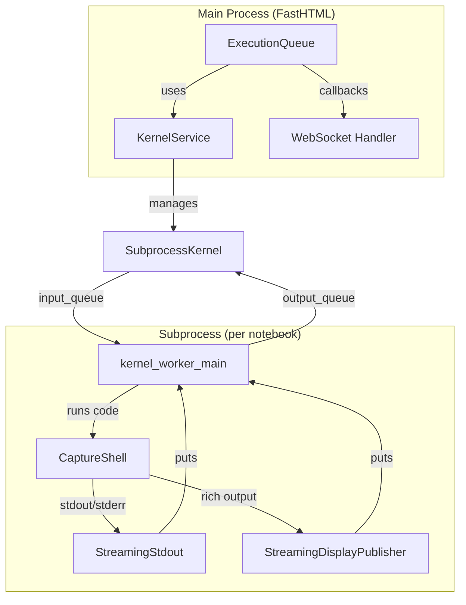
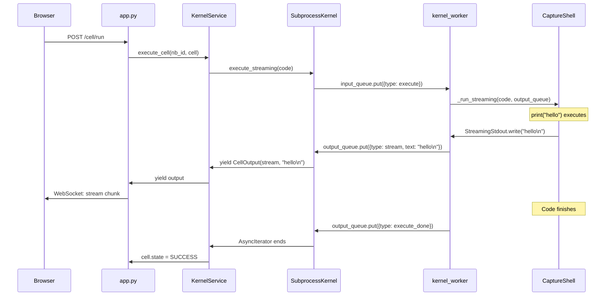
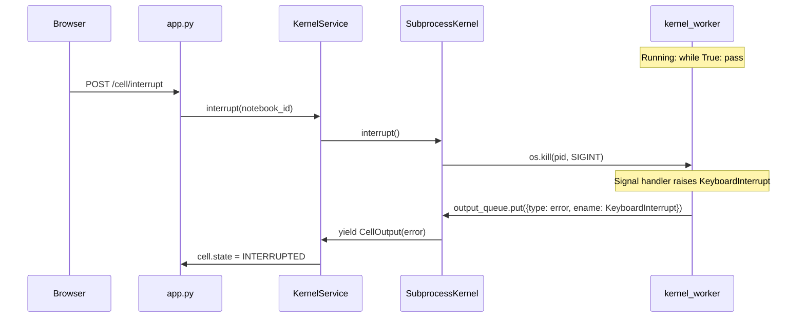
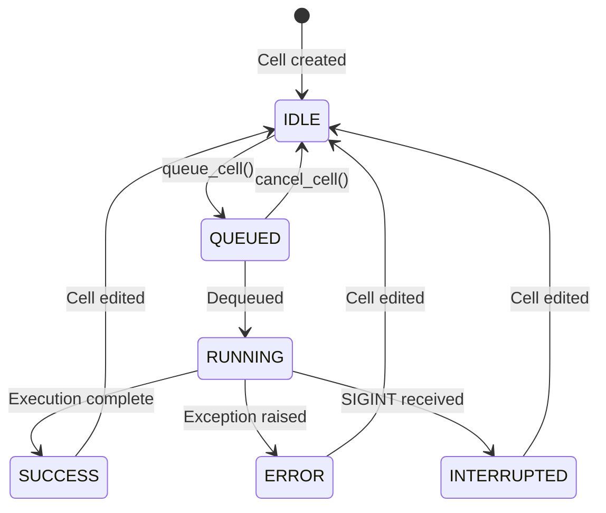

# Kernel Execution & Streaming Output

This document explains how LLM Notebook executes code cells with real-time streaming output, hard interrupt support, and queue management.

## Table of Contents

1. [Architecture Overview](#architecture-overview)
2. [Key Components](#key-components)
3. [Streaming Output Flow](#streaming-output-flow)
4. [Hard Interrupt (SIGINT)](#hard-interrupt-sigint)
5. [Execution Queue](#execution-queue)
6. [Cell State Machine](#cell-state-machine)
7. [Output Types](#output-types)
8. [Integration Points](#integration-points)
9. [How to Extend](#how-to-extend)

## Architecture Overview

The kernel execution system uses a **subprocess-based architecture** to enable:
- Real-time streaming of stdout/stderr as code runs
- Hard interrupt via SIGINT (can stop C extensions, tight loops, etc.)
- Rich output support (images, plots, HTML)
- One kernel per notebook with persistent namespace



## Key Components

### SubprocessKernel (`services/kernel/subprocess_kernel.py`)

Manages the subprocess and provides async interface for execution:

```python
class SubprocessKernel:
    def __init__(self):
        self._start_process()  # Creates subprocess with input/output queues

    async def execute_streaming(self, code: str) -> AsyncIterator[CellOutput]:
        """Execute code and yield output chunks as they arrive."""
        self.input_queue.put({'type': 'execute', 'code': code})
        # Yields CellOutput objects as they arrive from subprocess

    def interrupt(self) -> bool:
        """Send SIGINT to subprocess to stop execution."""
        os.kill(self.process.pid, signal.SIGINT)

    def restart(self):
        """Kill and restart the subprocess (clears namespace)."""
```

### KernelService (`services/kernel/kernel_service.py`)

Service layer managing kernels per notebook:

```python
class KernelService:
    def __init__(self):
        self._kernels: Dict[str, SubprocessKernel] = {}

    def get_kernel(self, notebook_id: str) -> SubprocessKernel:
        """Get or create kernel for notebook."""

    async def execute_cell(self, notebook_id: str, cell: Cell) -> AsyncIterator[CellOutput]:
        """Execute cell and update its state/outputs."""
        cell.state = CellState.RUNNING
        cell.outputs = []
        async for output in kernel.execute_streaming(cell.source):
            cell.outputs.append(output)
            yield output
```

### ExecutionQueue (`services/kernel/execution_queue.py`)

FIFO queue allowing multiple cells to be queued while one executes:

```python
class ExecutionQueue:
    def queue_cell(self, notebook_id: str, cell: Cell,
                   on_output: Callable = None) -> QueuedExecution:
        """Queue a cell for execution."""
        cell.state = CellState.QUEUED
        # Starts processing if not already running

    def cancel_cell(self, cell_id: str) -> bool:
        """Remove queued cell (cannot cancel running)."""

    def cancel_all(self, notebook_id: str):
        """Cancel all queued cells for notebook."""
```

### kernel_worker_main (`services/kernel/kernel_worker.py`)

The subprocess entry point that runs the actual code:

```python
def kernel_worker_main(input_queue: Queue, output_queue: Queue):
    # Setup signal handler for hard interrupt
    signal.signal(signal.SIGINT, sigint_handler)

    shell = CaptureShell()  # IPython-based execution

    while True:
        msg = input_queue.get()
        if msg['type'] == 'execute':
            shell._run_streaming(msg['code'], output_queue)
```

## Streaming Output Flow

When code like `print("hello")` runs, here's the flow:



### StreamingStdout

Replaces `sys.stdout`/`sys.stderr` during execution:

```python
class StreamingStdout:
    def write(self, text: str):
        if text:
            self.queue.put({
                'type': 'stream',
                'name': self.stream_name,  # 'stdout' or 'stderr'
                'text': text
            })
```

### StreamingDisplayPublisher

Captures rich outputs from `display()`, matplotlib, etc:

```python
class StreamingDisplayPublisher:
    def publish(self, data: dict, metadata: dict = None, **kwargs):
        self.queue.put({
            'type': 'display_data',
            'data': data,  # {'image/png': base64, 'text/plain': '...'}
            'metadata': metadata
        })
```

## Hard Interrupt (SIGINT)

The subprocess architecture enables true hard interrupt:



The signal handler in the subprocess:

```python
def sigint_handler(signum, frame):
    raise KeyboardInterrupt("Execution interrupted by user")

signal.signal(signal.SIGINT, sigint_handler)
```

This works even for:
- `time.sleep()` calls
- Tight infinite loops
- C extension code (numpy operations, etc.)

## Execution Queue

The queue ensures orderly execution while keeping UI responsive:



### Queue Processing

```python
async def _process_queue(self, notebook_id: str):
    while queue:
        execution = queue.popleft()
        cell = execution.cell
        cell.state = CellState.RUNNING

        async for output in self.kernel.execute_cell(notebook_id, cell):
            # Notify via callback (WebSocket broadcast)
            if execution.on_output:
                await execution.on_output(cell, output)

        # Cell state is now SUCCESS/ERROR/INTERRUPTED
```

## Cell State Machine

```python
class CellState(str, Enum):
    IDLE = "idle"           # Not executing
    QUEUED = "queued"       # In queue, waiting
    RUNNING = "running"     # Currently executing
    INTERRUPTED = "interrupted"  # Stopped by SIGINT
    ERROR = "error"         # Exception raised
    SUCCESS = "success"     # Completed normally
```

State transitions:

| From | To | Trigger |
|------|-----|---------|
| IDLE | QUEUED | `queue_cell()` |
| QUEUED | RUNNING | Dequeued for execution |
| QUEUED | IDLE | `cancel_cell()` |
| RUNNING | SUCCESS | Execution completes |
| RUNNING | ERROR | Exception raised |
| RUNNING | INTERRUPTED | `interrupt()` |
| SUCCESS/ERROR/INTERRUPTED | IDLE | Cell edited |

## Output Types

The kernel produces several output types, matching Jupyter's format:

### Stream Output

Standard output/error from `print()`, etc:

```python
CellOutput(
    output_type='stream',
    content='Hello, world!\n',
    stream_name='stdout'  # or 'stderr'
)
```

### Execute Result

The final expression's value (like Jupyter's `Out[n]`):

```python
CellOutput(
    output_type='execute_result',
    content='42',  # repr() of result
    metadata={}
)
```

### Error

Exception information:

```python
CellOutput(
    output_type='error',
    ename='ValueError',
    evalue='invalid value',
    traceback=['Traceback (most recent call last):', ...]
)
```

### Display Data

Rich content from `display()`, matplotlib, etc:

```python
CellOutput(
    output_type='display_data',
    content={
        'image/png': 'base64...',
        'text/plain': '<Figure size 640x480>'
    },
    metadata={'width': 640, 'height': 480}
)
```

## Integration Points

### Integrating with app.py

Replace the existing `PythonKernel` class:

```python
# Old approach (blocking, no streaming)
kernel = PythonKernel()
result = kernel.execute(cell.source)

# New approach (streaming)
from services.kernel import KernelService

kernel_service = KernelService()

@app.route('/notebook/{nb_id}/cell/{cid}/run')
async def run_cell(nb_id: str, cid: str):
    cell = get_cell(nb_id, cid)

    async for output in kernel_service.execute_cell(nb_id, cell):
        # Send via WebSocket for real-time update
        await broadcast_output(nb_id, cell, output)

    return CellView(cell)
```

### WebSocket Integration

Stream output chunks to browser:

```python
@app.ws('/ws/{nb_id}')
async def ws_handler(nb_id: str, send):
    async def on_output(cell, output):
        await send(json.dumps({
            'type': 'cell_output',
            'cell_id': cell.id,
            'output': output_to_dict(output)
        }))

    # Use on_output as callback when queuing cells
```

## How to Extend

### Adding a New Output Type

1. Add handling in `kernel_worker.py`:
```python
# In _run_streaming, after execution
if has_new_output_type:
    output_queue.put({
        'type': 'my_new_type',
        'data': ...
    })
```

2. Handle in `subprocess_kernel.py`:
```python
# In execute_streaming
elif msg['type'] == 'my_new_type':
    yield CellOutput(
        output_type='my_new_type',
        content=msg['data']
    )
```

3. Render in frontend:
```javascript
if (output.type === 'my_new_type') {
    // Render the new output type
}
```

### Adding Code Completion

The kernel worker already supports completion:

```python
# Send completion request
kernel.input_queue.put({
    'type': 'complete',
    'code': 'imp',
    'cursor_pos': 3
})

# Receive matches
# {'type': 'complete_reply', 'matches': ['import'], 'cursor_start': 0}
```

### Supporting Other Languages

Create a new kernel worker that uses a different execution engine:

```python
# services/kernel/julia_worker.py
def julia_kernel_worker_main(input_queue, output_queue):
    from julia import Julia
    jl = Julia()

    while True:
        msg = input_queue.get()
        if msg['type'] == 'execute':
            result = jl.eval(msg['code'])
            output_queue.put({'type': 'execute_result', ...})
```

## Testing

Run kernel tests:

```bash
uv run python test_kernel.py
```

Tests cover:
- Basic streaming output
- Namespace persistence across cells
- Error handling
- Hard interrupt via SIGINT
- Integration with Cell objects
