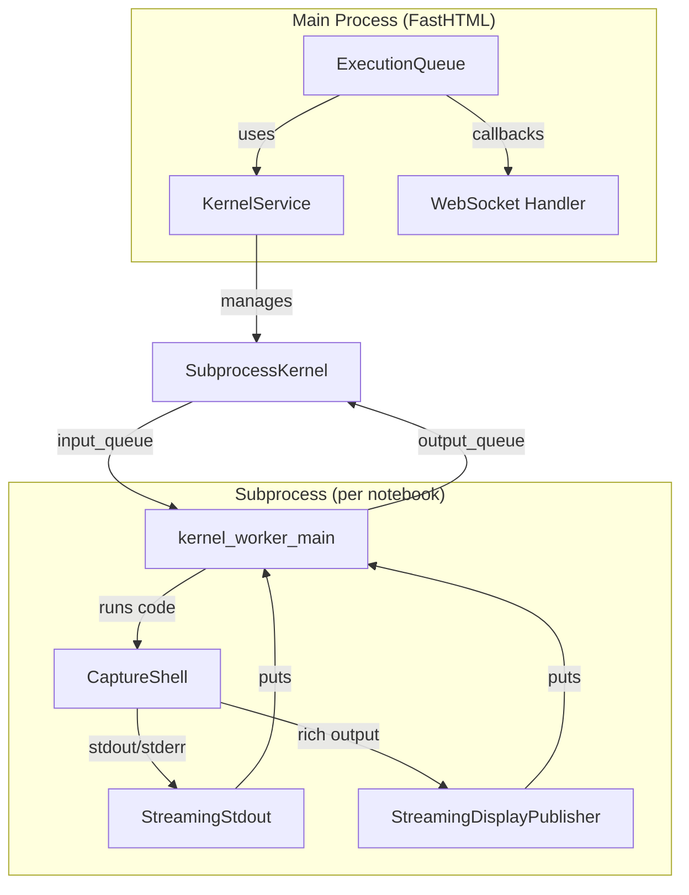
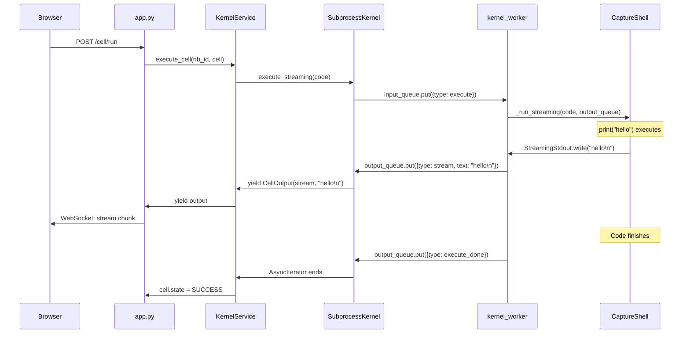
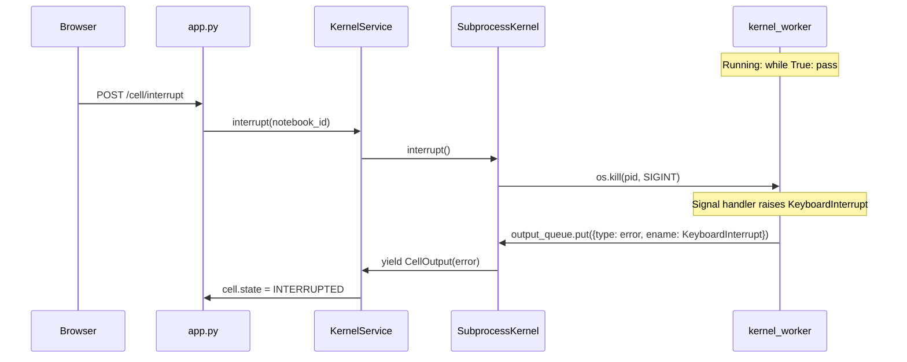
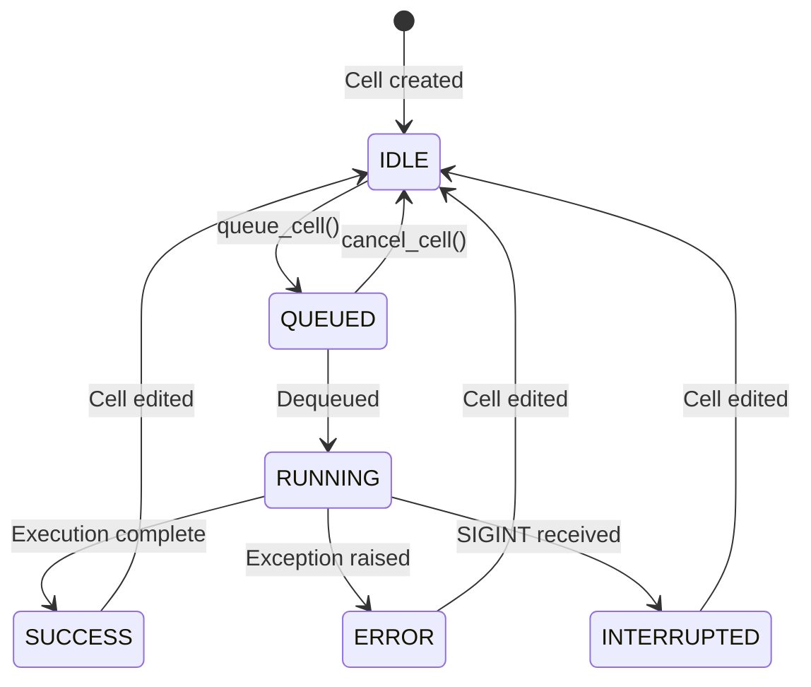
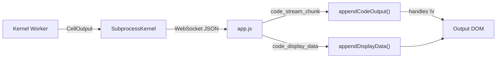
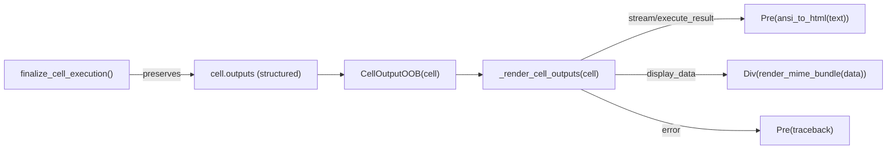
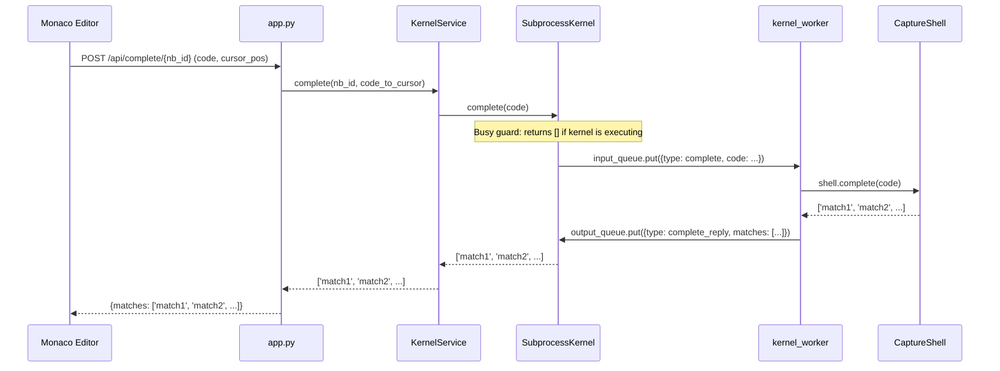

# Kernel Execution & Streaming Output

This document explains how Dialeng executes code cells with real-time streaming output, hard interrupt support, and queue management.

## Table of Contents

1. [Architecture Overview](#architecture-overview)
2. [Key Components](#key-components)
3. [Streaming Output Flow](#streaming-output-flow)
4. [Hard Interrupt (SIGINT)](#hard-interrupt-sigint)
5. [Execution Queue](#execution-queue)
6. [Cell State Machine](#cell-state-machine)
7. [Output Types](#output-types)
8. [Integration Points](#integration-points)
9. [How to Extend](#how-to-extend)

## Architecture Overview

The kernel execution system uses a **subprocess-based architecture** to enable:
- Real-time streaming of stdout/stderr as code runs
- Hard interrupt via SIGINT (can stop C extensions, tight loops, etc.)
- Rich output support (images, plots, HTML)
- One kernel per notebook with persistent namespace

### Kernel Selection (Kernel-First Flow)

Kernels are **not** created automatically when a notebook opens. Instead, when a notebook without an attached kernel is opened, the kernel selection modal is shown automatically. The user must select a kernel before any code or prompt cells can execute. If the user dismisses the modal, the notebook is in view-only mode — they can browse content but cannot run cells. Attempting to run a cell without a kernel re-opens the modal, and after selection, CRAFT code cells are executed first, then the pending cell runs. The kernel status dot next to the notebook title reflects the state: grey (no kernel), yellow (initializing), green (connected), red (error).


```mermaid
graph TB
    subgraph "Main Process (FastHTML)"
        KS[KernelService]
        EQ[ExecutionQueue]
        WS[WebSocket Handler]
    end

    subgraph "Subprocess (per notebook)"
        KW[kernel_worker_main]
        CS[CaptureShell]
        SS[StreamingStdout]
        SDP[StreamingDisplayPublisher]
    end

    KS -->|"manages"| SK[SubprocessKernel]
    SK -->|"input_queue"| KW
    KW -->|"output_queue"| SK

    EQ -->|"uses"| KS
    EQ -->|"callbacks"| WS

    KW -->|"runs code"| CS
    CS -->|"stdout/stderr"| SS
    CS -->|"rich output"| SDP
    SS -->|"puts"| KW
    SDP -->|"puts"| KW
```

## Key Components

### SubprocessKernel (`services/kernel/subprocess_kernel.py`)

Manages the subprocess and provides async interface for execution:

```python
class SubprocessKernel:
    def __init__(self):
        self._start_process()  # Creates subprocess with input/output queues

    async def execute_streaming(self, code: str) -> AsyncIterator[CellOutput]:
        """Execute code and yield output chunks as they arrive."""
        self.input_queue.put({'type': 'execute', 'code': code})
        # Yields CellOutput objects as they arrive from subprocess

    def interrupt(self) -> bool:
        """Send SIGINT to subprocess to stop execution."""
        os.kill(self.process.pid, signal.SIGINT)

    def restart(self):
        """Kill and restart the subprocess (clears namespace)."""
```

### KernelService (`services/kernel/kernel_service.py`)

Service layer managing kernels per notebook:

```python
class KernelService:
    def __init__(self):
        self._kernels: Dict[str, SubprocessKernel] = {}

    def get_kernel(self, notebook_id: str) -> SubprocessKernel:
        """Get or create kernel for notebook."""

    async def execute_cell(self, notebook_id: str, cell: Cell) -> AsyncIterator[CellOutput]:
        """Execute cell and update its state/outputs."""
        cell.state = CellState.RUNNING
        cell.outputs = []
        async for output in kernel.execute_streaming(cell.source):
            cell.outputs.append(output)
            yield output
```

### ExecutionQueue (`services/kernel/execution_queue.py`)

FIFO queue allowing multiple cells to be queued while one executes:

```python
class ExecutionQueue:
    def queue_cell(self, notebook_id: str, cell: Cell,
                   on_output: Callable = None) -> QueuedExecution:
        """Queue a cell for execution."""
        cell.state = CellState.QUEUED
        # Starts processing if not already running

    def cancel_cell(self, cell_id: str) -> bool:
        """Remove queued cell (cannot cancel running)."""

    def cancel_all(self, notebook_id: str):
        """Cancel all queued cells for notebook."""
```

### kernel_worker_main (`services/kernel/kernel_worker.py`)

The subprocess entry point that runs the actual code:

```python
def kernel_worker_main(input_queue: Queue, output_queue: Queue):
    # Setup signal handler for hard interrupt
    signal.signal(signal.SIGINT, sigint_handler)

    shell = CaptureShell()  # IPython-based execution

    while True:
        msg = input_queue.get()
        if msg['type'] == 'execute':
            shell._run_streaming(msg['code'], output_queue)
```

## Streaming Output Flow

When code like `print("hello")` runs, here's the flow:


```mermaid
sequenceDiagram
    participant UI as Browser
    participant App as app.py
    participant KS as KernelService
    participant SK as SubprocessKernel
    participant KW as kernel_worker
    participant CS as CaptureShell

    UI->>App: POST /cell/run
    App->>KS: execute_cell(nb_id, cell)
    KS->>SK: execute_streaming(code)
    SK->>KW: input_queue.put({type: execute})

    KW->>CS: _run_streaming(code, output_queue)

    Note over CS: print("hello") executes
    CS->>KW: StreamingStdout.write("hello\n")
    KW->>SK: output_queue.put({type: stream, text: "hello\n"})
    SK->>KS: yield CellOutput(stream, "hello\n")
    KS->>App: yield output
    App->>UI: WebSocket: stream chunk

    Note over CS: Code finishes
    KW->>SK: output_queue.put({type: execute_done})
    SK->>KS: AsyncIterator ends
    KS->>App: cell.state = SUCCESS
```

### StreamingStdout

Replaces `sys.stdout`/`sys.stderr` during execution:

```python
class StreamingStdout:
    def write(self, text: str):
        if text:
            self.queue.put({
                'type': 'stream',
                'name': self.stream_name,  # 'stdout' or 'stderr'
                'text': text
            })
```

### StreamingDisplayPublisher

Captures rich outputs from `display()`, matplotlib, etc:

```python
class StreamingDisplayPublisher:
    def publish(self, data: dict, metadata: dict = None, **kwargs):
        self.queue.put({
            'type': 'display_data',
            'data': data,  # {'image/png': base64, 'text/plain': '...'}
            'metadata': metadata
        })
```

## Hard Interrupt (SIGINT)

The subprocess architecture enables true hard interrupt:


```mermaid
sequenceDiagram
    participant UI as Browser
    participant App as app.py
    participant KS as KernelService
    participant SK as SubprocessKernel
    participant KW as kernel_worker

    Note over KW: Running: while True: pass

    UI->>App: POST /cell/interrupt
    App->>KS: interrupt(notebook_id)
    KS->>SK: interrupt()
    SK->>KW: os.kill(pid, SIGINT)

    Note over KW: Signal handler raises KeyboardInterrupt

    KW->>SK: output_queue.put({type: error, ename: KeyboardInterrupt})
    SK->>KS: yield CellOutput(error)
    KS->>App: cell.state = INTERRUPTED
```

The signal handler in the subprocess:

```python
def sigint_handler(signum, frame):
    raise KeyboardInterrupt("Execution interrupted by user")

signal.signal(signal.SIGINT, sigint_handler)
```

This works even for:
- `time.sleep()` calls
- Tight infinite loops
- C extension code (numpy operations, etc.)

## Execution Queue

The queue ensures orderly execution while keeping UI responsive:


```mermaid
stateDiagram-v2
    [*] --> IDLE: Cell created
    IDLE --> QUEUED: queue_cell()
    QUEUED --> RUNNING: Dequeued
    QUEUED --> IDLE: cancel_cell()
    RUNNING --> SUCCESS: Execution complete
    RUNNING --> ERROR: Exception raised
    RUNNING --> INTERRUPTED: SIGINT received
    SUCCESS --> IDLE: Cell edited
    ERROR --> IDLE: Cell edited
    INTERRUPTED --> IDLE: Cell edited
```

### Queue Processing

```python
async def _process_queue(self, notebook_id: str):
    while queue:
        execution = queue.popleft()
        cell = execution.cell
        cell.state = CellState.RUNNING

        async for output in self.kernel.execute_cell(notebook_id, cell):
            # Notify via callback (WebSocket broadcast)
            if execution.on_output:
                await execution.on_output(cell, output)

        # Cell state is now SUCCESS/ERROR/INTERRUPTED
```

## Cell State Machine

```python
class CellState(str, Enum):
    IDLE = "idle"           # Not executing
    QUEUED = "queued"       # In queue, waiting
    RUNNING = "running"     # Currently executing
    INTERRUPTED = "interrupted"  # Stopped by SIGINT
    ERROR = "error"         # Exception raised
    SUCCESS = "success"     # Completed normally
```

State transitions:

| From | To | Trigger |
|------|-----|---------|
| IDLE | QUEUED | `queue_cell()` |
| QUEUED | RUNNING | Dequeued for execution |
| QUEUED | IDLE | `cancel_cell()` |
| RUNNING | SUCCESS | Execution completes |
| RUNNING | ERROR | Exception raised |
| RUNNING | INTERRUPTED | `interrupt()` |
| SUCCESS/ERROR/INTERRUPTED | IDLE | Cell edited |

## Output Types

The kernel produces several output types, matching Jupyter's format:

### Stream Output

Standard output/error from `print()`, etc:

```python
CellOutput(
    output_type='stream',
    content='Hello, world!\n',
    stream_name='stdout'  # or 'stderr'
)
```

### Execute Result

The final expression's value (like Jupyter's `Out[n]`):

```python
CellOutput(
    output_type='execute_result',
    content='42',  # repr() of result
    metadata={}
)
```

#### Rich Result Promotion

When the result object has rich representations (`_repr_png_()` for PIL images, `_repr_html_()` for DataFrames, etc.), the kernel automatically promotes the result to `display_data` with a full MIME bundle. This ensures objects like PIL Images, pandas DataFrames, and other rich objects render inline rather than showing their text `repr()`.

```python
# A cell ending with `img` (a PIL Image) produces:
CellOutput(
    output_type='display_data',  # promoted from execute_result
    content={
        'text/plain': '<PIL.PngImagePlugin.PngImageFile ...>',
        'image/png': 'base64...'
    },
    metadata={}
)
```

The promotion check order is: `_repr_png_()` first, then `_repr_html_()`. If neither produces content, the result falls back to a plain `execute_result` with `text/plain` only.

### Error

Exception information:

```python
CellOutput(
    output_type='error',
    ename='ValueError',
    evalue='invalid value',
    traceback=['Traceback (most recent call last):', ...]
)
```

### Display Data

Rich content from `display()`, matplotlib, etc:

```python
CellOutput(
    output_type='display_data',
    content={
        'image/png': 'base64...',
        'text/plain': '<Figure size 640x480>'
    },
    metadata={'width': 640, 'height': 480}
)
```

## Output Rendering Pipeline

Cell outputs go through two rendering paths: **real-time streaming** (WebSocket) and **final rendering** (OOB swap / page load).

### Real-Time Streaming (Browser)

During execution, output chunks are sent via WebSocket and rendered by JavaScript:


```mermaid
graph LR
    KW[Kernel Worker] -->|"CellOutput"| SK[SubprocessKernel]
    SK -->|"WebSocket JSON"| JS[app.js]
    JS -->|"code_stream_chunk"| AO["appendCodeOutput()"]
    JS -->|"code_display_data"| AD["appendDisplayData()"]
    AO -->|"handles \\r"| DOM[Output DOM]
    AD --> DOM
```

- **Stream chunks** go through `appendCodeOutput()` which handles `\r` (carriage return) for progress bars like tqdm — each `\r` overwrites the current line
- **Display data** (HTML, images) is appended as separate `<div class="display-data">` elements
- **ANSI codes** are converted to HTML spans with colored styles via `ansiToHtml()` (JS)

### Final Rendering (Server-Side OOB Swap)

When execution completes, `finalize_cell_execution()` broadcasts an OOB swap that replaces the output div:


```mermaid
graph LR
    FC["finalize_cell_execution()"] -->|"preserves"| CO["cell.outputs (structured)"]
    CO --> OOB["CellOutputOOB(cell)"]
    OOB --> RCO["_render_cell_outputs(cell)"]
    RCO -->|"stream/execute_result"| PRE["Pre(ansi_to_html(text))"]
    RCO -->|"display_data"| DIV["Div(render_mime_bundle(data))"]
    RCO -->|"error"| ERR["Pre(traceback)"]
```

Key design decisions:

1. **Structured outputs are preserved** — `finalize_cell_execution()` does NOT flatten `cell.outputs` to a string. Previously, `cell.output = ''.join(output_parts)` used the setter which replaced all structured `CellOutput` objects with a single stream output, destroying `display_data` (HTML, images, etc.)

2. **Carriage returns are collapsed** — `_process_carriage_returns()` processes `\r` to show only the final state of each line, matching terminal behavior. Without this, tools like tqdm would show 100+ intermediate progress lines instead of just the final completed bar.

3. **ANSI conversion is shared** — `ansi_to_html()` lives in `dialeng/ui/mime.py` and is used by both `_render_cell_outputs()` (server-side) and the WebSocket streaming path.

4. **stderr is not an error** — Many tools (tqdm, warnings, logging) write to stderr. The `error` CSS class is only applied when the cell actually has an error (`has_error` from `code_stream_end`), not when stderr output is received.

5. **Scripts are re-executed after OOB swap** — When `processOOBSwap()` replaces an `output-*` element, any `<script>` tags in the new DOM are cloned into fresh `<script>` elements so the browser executes them. Without this, interactive widgets (YouTube embeds, custom JS visualizations) would only work on the first cell run — because `replaceWith()` / `innerHTML` does not execute `<script>` tags. On the first run, asynchronously-loaded scripts (e.g., the YouTube IFrame API) happen to fire after the OOB swap, finding the fresh DOM. On subsequent runs, the API is already loaded and creates the widget synchronously during streaming, but the OOB swap then destroys it. Re-executing scripts after the OOB swap ensures the widget is always recreated in the final DOM. This mirrors the same script clone-and-replace pattern used in `appendDisplayData()` during streaming.

### Shared Rendering Module (`dialeng/ui/mime.py`)

Output rendering utilities are centralized to avoid duplication:

| Function | Used By | Purpose |
|----------|---------|---------|
| `ansi_to_html()` | `_render_cell_outputs()` | Convert ANSI escape codes to colored HTML spans |
| `render_mime_bundle()` | `_render_cell_outputs()`, WebSocket streaming in `app.py` | Convert Jupyter MIME bundles to HTML (priority: text/html > image/svg+xml > image/png > text/markdown > text/plain) |

## Integration Points

### Integrating with app.py

Replace the existing `PythonKernel` class:

```python
# Old approach (blocking, no streaming)
kernel = PythonKernel()
result = kernel.execute(cell.source)

# New approach (streaming)
from dialeng.services.kernel import KernelService

kernel_service = KernelService()

@app.route('/dialeng/{nb_id}/cell/{cid}/run')
async def run_cell(nb_id: str, cid: str):
    cell = get_cell(nb_id, cid)

    async for output in kernel_service.execute_cell(nb_id, cell):
        # Send via WebSocket for real-time update
        await broadcast_output(nb_id, cell, output)

    return CellView(cell)
```

### WebSocket Integration

Stream output chunks to browser:

```python
@app.ws('/ws/{nb_id}')
async def ws_handler(nb_id: str, send):
    async def on_output(cell, output):
        await send(json.dumps({
            'type': 'cell_output',
            'cell_id': cell.id,
            'output': output_to_dict(output)
        }))

    # Use on_output as callback when queuing cells
```

## How to Extend

### Adding a New Output Type

1. Add handling in `kernel_worker.py`:
```python
# In _run_streaming, after execution
if has_new_output_type:
    output_queue.put({
        'type': 'my_new_type',
        'data': ...
    })
```

2. Handle in `subprocess_kernel.py`:
```python
# In execute_streaming
elif msg['type'] == 'my_new_type':
    yield CellOutput(
        output_type='my_new_type',
        content=msg['data']
    )
```

3. Render in frontend:
```javascript
if (output.type === 'my_new_type') {
    // Render the new output type
}
```

### Code Completion

The kernel supports Python code completion via execnb's `CaptureShell.complete()`. The full pipeline:


```mermaid
sequenceDiagram
    participant Monaco as Monaco Editor
    participant App as app.py
    participant KS as KernelService
    participant SK as SubprocessKernel
    participant KW as kernel_worker
    participant CS as CaptureShell

    Monaco->>App: POST /api/complete/{nb_id} (code, cursor_pos)
    App->>KS: complete(nb_id, code_to_cursor)
    KS->>SK: complete(code)
    Note over SK: Busy guard: returns [] if kernel is executing
    SK->>KW: input_queue.put({type: complete, code: ...})
    KW->>CS: shell.complete(code)
    CS-->>KW: ['match1', 'match2', ...]
    KW->>SK: output_queue.put({type: complete_reply, matches: [...]})
    SK-->>KS: ['match1', 'match2', ...]
    KS-->>App: ['match1', 'match2', ...]
    App-->>Monaco: {matches: ['match1', 'match2', ...]}
```

**Frontend:** Monaco's `CompletionItemProvider` for Python triggers on `.` with 150ms debounce. Completions are fetched from `/api/complete/{nb_id}`.

**Backend:** The kernel worker calls `shell.complete(code)` which returns a `list[str]` of completion suffixes. The `SubprocessKernel` has a busy guard — if the kernel is executing code, completions return empty to avoid queue message interleaving.

```python
# Example: after running "import os", typing "os.pa" triggers:
# shell.complete("os.pa") → ["th"]
# Monaco shows "path" as a completion suggestion
```

### Remote Execution via Google Colab

For remote kernel execution on Colab runtimes (GPU/TPU), see [12_colab_kernel.md](12_colab_kernel.md). The `ColabKernel` implements the same `BaseKernel` interface using Jupyter wire protocol over WebSocket.

### Supporting Other Languages

Create a new kernel worker that uses a different execution engine:

```python
# services/kernel/julia_worker.py
def julia_kernel_worker_main(input_queue, output_queue):
    from julia import Julia
    jl = Julia()

    while True:
        msg = input_queue.get()
        if msg['type'] == 'execute':
            result = jl.eval(msg['code'])
            output_queue.put({'type': 'execute_result', ...})
```

## Testing

Run kernel tests:

```bash
uv run python test_kernel.py
```

Tests cover:
- Basic streaming output
- Namespace persistence across cells
- Error handling
- Hard interrupt via SIGINT
- Integration with Cell objects
