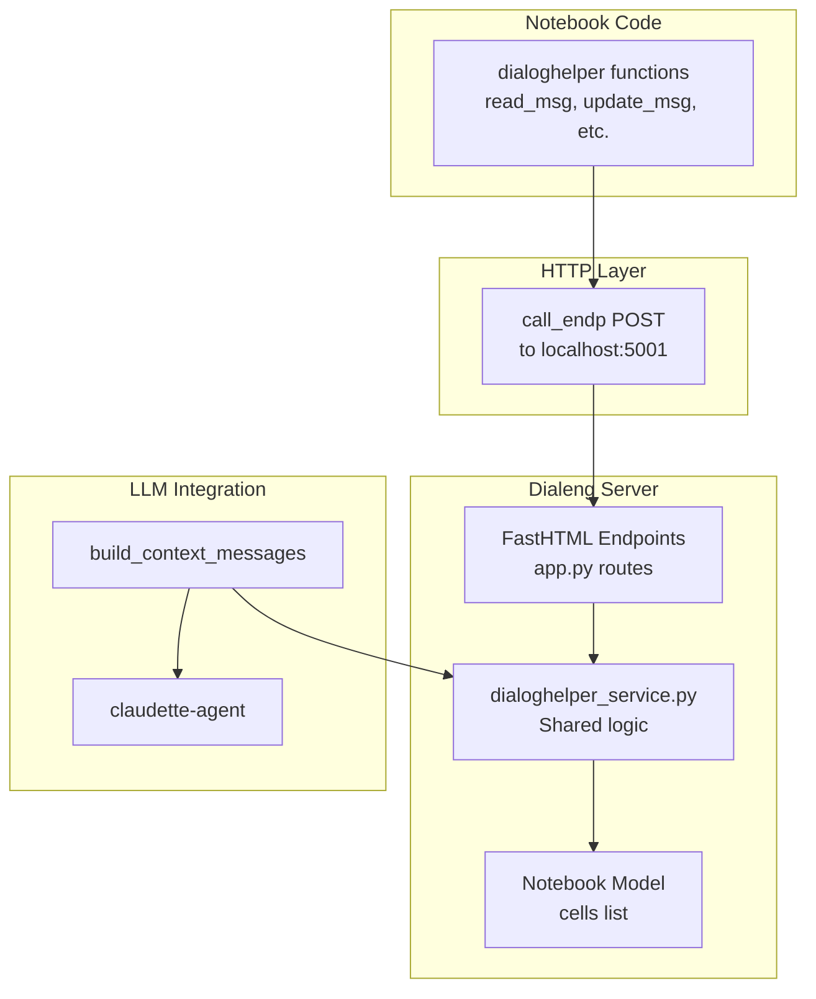
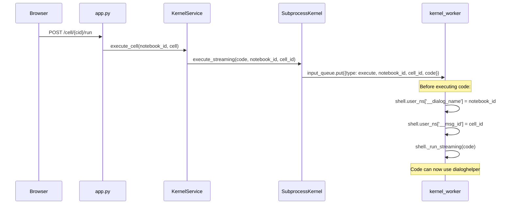
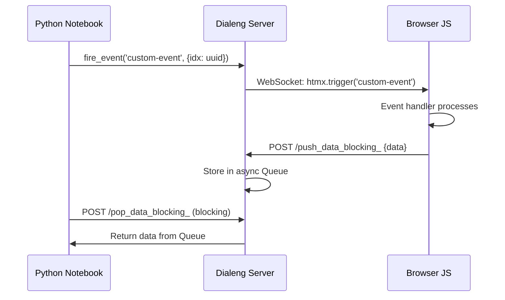
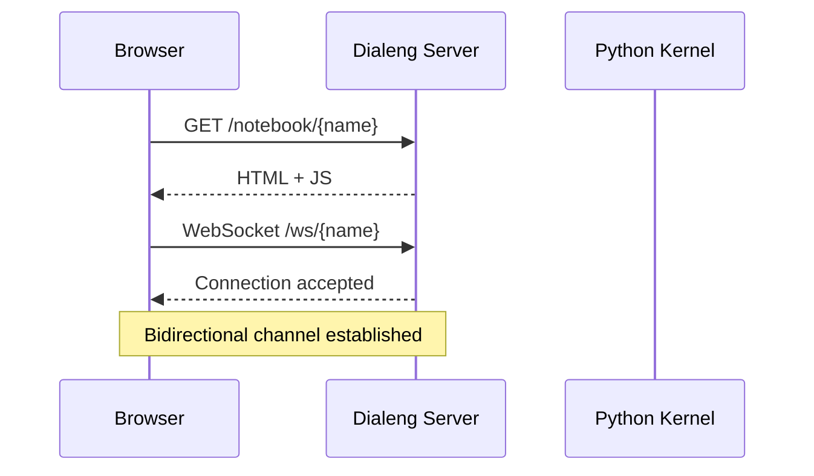
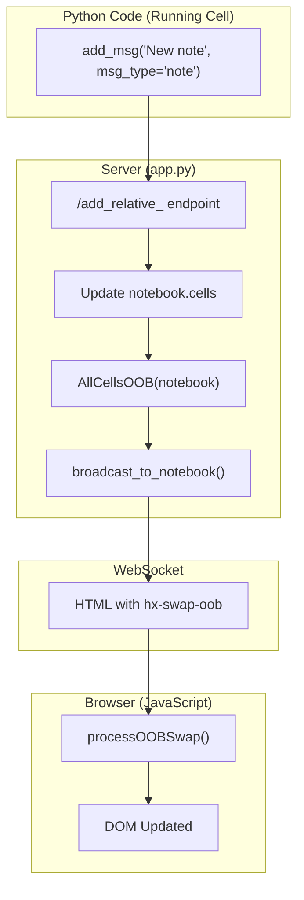
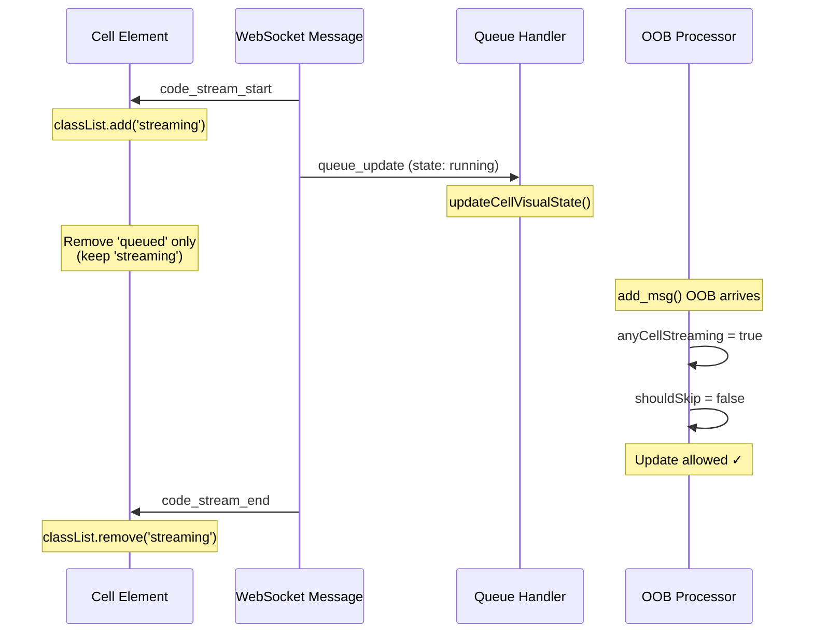

# DialogHelper Integration

This document explains how Dialeng notebooks maintain compatibility with the [dialoghelper](https://github.com/AnswerDotAI/dialoghelper) library for programmatic cell manipulation.

## Overview

DialogHelper is a library that allows programmatic manipulation of notebook cells (called "messages" in dialoghelper terminology) from within notebook code. Dialeng implements the server-side API that dialoghelper's `call_endp()` function uses.

## Architecture



## Magic Variable Injection

DialogHelper functions like `read_msg(-1)` (read the previous cell) need to know which notebook and cell context they're operating in. This is achieved through **magic variables** that are automatically injected into the kernel namespace before each cell executes.

### The Magic Variables

| Variable | Purpose | Example Value |
|----------|---------|---------------|
| `__dialog_name` | The notebook ID | `"my_notebook"` |
| `__msg_id` | The current cell ID | `"abc12345"` |

These variables are used by dialoghelper's internal `find_var()` function to determine context when you call functions like:
- `read_msg(-1)` - Uses `__msg_id` to find "previous" cell
- `update_msg(pinned=True)` - Uses `__msg_id` to know which cell to update
- `add_msg(..., placement="after")` - Uses `__msg_id` for relative positioning
- `iife(...)` - Uses `__dialog_name` to know which notebook's WebSocket to use

### Injection Flow



### Implementation Details

**kernel_service.py** - Passes notebook_id and cell.id to the subprocess:

```python
async for output in kernel.execute_streaming(
    cell.source,
    notebook_id=notebook_id,
    cell_id=cell.id
):
    ...
```

**subprocess_kernel.py** - Forwards to the worker process:

```python
self.input_queue.put({
    'type': 'execute',
    'code': code,
    'notebook_id': notebook_id,
    'cell_id': cell_id
})
```

**kernel_worker.py** - Injects into the execution namespace:

```python
# Inject dialoghelper magic variables into the namespace
# These are used by dialoghelper's find_var() to identify context
notebook_id = msg.get('notebook_id', '')
cell_id = msg.get('cell_id', '')
if notebook_id:
    shell.user_ns['__dialog_name'] = notebook_id
if cell_id:
    shell.user_ns['__msg_id'] = cell_id
```

### Why This Matters

Without these magic variables, users would need to explicitly pass the notebook and cell IDs to every dialoghelper function:

```python
# Without magic variables (tedious):
read_msg(dname="/my_notebook", id="abc123", n=-1)

# With magic variables (convenient):
read_msg(-1)
```

The variables are injected **before every cell execution**, so they're always current. When cell A runs and calls `read_msg(-1)`, `__msg_id` points to cell A. When cell B runs, `__msg_id` is updated to point to cell B.

## Shared Service Layer

The `services/dialoghelper_service.py` module provides core functions used by both:

1. **HTTP Endpoints** - For dialoghelper library compatibility
2. **LLM Context Building** - Ensures consistent behavior

### Key Functions

| Function | Purpose | Used By |
|----------|---------|---------|
| `get_msg_idx(notebook, msgid)` | Find cell index by ID | Endpoints, Context |
| `find_msgs(notebook, ...)` | Search cells by criteria | Endpoints, Context |
| `read_msg(notebook, ...)` | Read cell content with options | Endpoints |
| `cell_to_dict(cell)` | Convert cell for JSON | Endpoints |
| `build_context_messages(notebook, cell_id)` | Build LLM context | LLM Service |
| `cell_to_messages(cell)` | Convert to LLM format | LLM Service |

### find_msgs() Parameters

```python
find_msgs(
    notebook,           # Notebook object
    re_pattern="",      # Regex to match source
    msg_type="",        # Filter by cell type
    pinned_only=False,  # Only pinned cells
    skipped=None,       # None=all, True=skipped, False=non-skipped
    limit=100,          # Max results
    before_idx=None     # Only cells before this index
)
```

## Supported Endpoints

All endpoints receive `dlg_name` parameter (the notebook ID).

### Information Endpoints

| Endpoint | Purpose | Parameters |
|----------|---------|------------|
| `POST /curr_dialog_` | Get dialog info | `with_messages: bool` |
| `POST /msg_idx_` | Get cell index | `id_: str` |
| `POST /find_msgs_` | Search cells | `re_pattern, msg_type, limit` |
| `POST /read_msg_` | Read cell content | `n, relative, id_, view_range, nums` |

### Modification Endpoints

| Endpoint | Purpose | Parameters |
|----------|---------|------------|
| `POST /add_relative_` | Add new cell | `content, placement, id_, msg_type, ...` |
| `POST /rm_msg_` | Remove cell | `msid: str` |
| `POST /update_msg_` | Update properties | `id_, **kwargs` |
| `POST /add_runq_` | Queue for execution | `id_, api` |

### Content Editing Endpoints

| Endpoint | Purpose | Parameters |
|----------|---------|------------|
| `POST /msg_insert_line_` | Insert line | `id_, insert_line, new_str` |
| `POST /msg_str_replace_` | Replace string | `id_, old_str, new_str` |
| `POST /msg_strs_replace_` | Replace multiple | `id_, old_strs, new_strs` (JSON arrays) |
| `POST /msg_replace_lines_` | Replace line range | `id_, start_line, end_line, new_content` |

> **Note:** The server endpoints use `id_` (with underscore) as the parameter name due to FastHTML conventions, but the dialoghelper library uses `id=` in its function calls and handles the mapping internally.

> **Note:** Line-based functions (`msg_insert_line`, `msg_replace_lines`, `msg_del_lines`) use **1-based line indexing** in the dialoghelper library.

### Utility Endpoints

| Endpoint | Purpose | Parameters |
|----------|---------|------------|
| `POST /add_html_` | Broadcast HTML via WebSocket (OOB swaps) | `content: str` |
| `POST /push_data_blocking_` | Push data to queue (from JS to Python) | `data_id, data` |
| `POST /pop_data_blocking_` | Pop data from queue with timeout | `data_id, timeout` |

## JavaScript Injection (iife, add_scr)

The `iife()` and `add_scr()` functions allow executing JavaScript in the browser from Python notebook code. This enables powerful browser interactions like DOM manipulation, API calls, and custom UI injection.

### Architecture

```mermaid
flowchart LR
    subgraph "Python Notebook"
        IIFE[iife code]
        ADDSCR[add_scr code]
    end

    subgraph "Server"
        ADD[/add_html_]
        WS[WebSocket Broadcast]
    end

    subgraph "Browser"
        PROC["processOOBSwap()"]
        JS[#js-script div]
        EXEC["Script Execution<br/>(via createElement)"]
    end

    IIFE --> ADDSCR
    ADDSCR --> ADD
    ADD --> WS
    WS --> PROC
    PROC --> JS
    JS --> EXEC
```

### How iife() Works

1. `iife(code)` wraps your JavaScript in an async IIFE: `(async () => { ...code... })()`
2. Calls `add_scr()` with the wrapped code
3. `add_scr()` creates: `<div hx-swap-oob="beforeend:#js-script"><script>...</script></div>`
4. `add_html()` POSTs to `/add_html_` endpoint
5. Server broadcasts HTML via WebSocket to all connected clients
6. `processOOBSwap()` receives and processes the HTML (see Script Execution below)

### How add_scr() Works

`add_scr()` is the lower-level function that `iife()` uses. It directly injects a script element:

```python
from dialoghelper import add_scr

# Inject raw JavaScript (not wrapped in async IIFE)
add_scr("""
    console.log('Direct script injection!');
    alert('Hello from add_scr!');
""")
```

### Script Execution Mechanism (app.py)

**Critical**: Scripts inserted via `innerHTML` don't execute automatically (browser security feature). The `processOOBSwap()` function handles this specially:

```javascript
// app.py:2684-2726 - Handle swap strategies like "beforeend:#js-script"
if (oobAttr && oobAttr.includes(':')) {
    const [swapStrategy, targetSelector] = oobAttr.split(':');
    const target = document.querySelector(targetSelector);

    if (target) {
        // For script injection, manually create and execute scripts
        const scripts = element.querySelectorAll('script');
        if (scripts.length > 0) {
            scripts.forEach(script => {
                // Create new script element (this triggers execution!)
                const newScript = document.createElement('script');
                Array.from(script.attributes).forEach(attr => {
                    newScript.setAttribute(attr.name, attr.value);
                });
                newScript.textContent = script.textContent;
                target.appendChild(newScript);  // Execution happens here
            });
        }
    }
}
```

**Key insight**: `document.createElement('script')` followed by appending to DOM triggers execution, unlike `innerHTML` which doesn't.

### The #js-script Container

The page includes a hidden container for script injection:

```python
# app.py:3248
Div(id="js-script"),  # Container for dialoghelper script injection via HTMX OOB
```

All injected scripts are appended to this container, keeping them organized.

### Example: DOM Manipulation

```python
from dialoghelper import iife

# Change background color temporarily
iife("""
    const original = document.body.style.backgroundColor;
    document.body.style.backgroundColor = '#e8f5e9';
    setTimeout(() => {
        document.body.style.backgroundColor = original;
    }, 2000);
""")
```

### Example: Async Operations

Since `iife()` wraps code in an async IIFE, you can use `await`:

```python
iife("""
    const delay = ms => new Promise(r => setTimeout(r, ms));

    console.log('Starting async operation...');
    await delay(1000);
    console.log('Done after 1 second!');
""")
```

### Example: Fetch API

```python
iife("""
    const response = await fetch('/curr_dialog_', {
        method: 'POST',
        headers: {'Content-Type': 'application/x-www-form-urlencoded'},
        body: `dlg_name=${window.NOTEBOOK_ID}`
    });
    const data = await response.json();
    console.log('Notebook info:', data);
""")
```

### Example: Inject Custom UI

```python
iife("""
    const notif = document.createElement('div');
    notif.style.cssText = 'position: fixed; top: 20px; right: 20px; padding: 15px; background: #667eea; color: white; border-radius: 8px;';
    notif.textContent = 'Hello from Python!';
    document.body.appendChild(notif);
    setTimeout(() => notif.remove(), 3000);
""")
```

## Bidirectional Data Transfer

Dialeng supports bidirectional communication between Python and JavaScript via the `fire_event()`, `pop_data()`, and `event_get()` functions, along with the `/push_data_blocking_` and `/pop_data_blocking_` endpoints.

### Architecture



### fire_event() - Trigger Browser Events

`fire_event()` sends an HTMX trigger event to the browser. This is used to notify JavaScript event handlers.

```python
from dialoghelper import fire_event

# Fire a custom event with data
fire_event('my-event', {'action': 'calculate', 'value': 42})
```

**How it works:**
1. `fire_event()` calls `/add_html_` with: `<script hx-swap-oob="true" id="js-event">htmx.trigger(document.body, 'my-event', {...})</script>`
2. Server broadcasts via WebSocket
3. `processOOBSwap()` handles `<script hx-swap-oob="true">` elements specially (app.py:2731-2751)
4. Script is created via `document.createElement('script')` and executed
5. Browser fires the HTMX event, which JavaScript handlers can catch

### pop_data() - Receive Data from Browser

`pop_data()` waits for data pushed from JavaScript via `/push_data_blocking_`.

```python
from dialoghelper import pop_data

# Wait for data with specific ID (blocking, with timeout)
# NOTE: Parameter is 'idx', not 'data_id'!
response = pop_data(idx='request-123', timeout=5)
print(response.result)
```

**Function signature:**
```python
def pop_data(idx, timeout=15):
    """
    Pop data from the blocking queue.

    Args:
        idx: The data identifier (matches data_id in push_data)
        timeout: Max seconds to wait (default: 15)

    Returns:
        Object with data attributes (dict2obj wrapped)
    """
```

**Important:** The parameter is `idx`, not `data_id`. Internally, dialoghelper maps `idx` to `data_id` when calling the endpoint.

### event_get() - Combined Request/Response

`event_get()` combines `fire_event()` and `pop_data()` for a request/response pattern:

```python
from dialoghelper import event_get

# Fires event and waits for response in one call
result = event_get('get-info', timeout=5)
print(f"URL: {result.url}")
```

**Equivalent to:**
```python
import uuid
request_id = str(uuid.uuid4())
fire_event('get-info', {'idx': request_id})
result = pop_data(idx=request_id, timeout=5)
```

### Complete Example: Browser Calculation

**Step 1: Register JavaScript handler (run once)**

```python
from dialoghelper import iife

iife("""
    // Remove existing handler if any
    if (window._mathHandler) {
        document.body.removeEventListener('do-math', window._mathHandler);
    }

    window._mathHandler = async (e) => {
        const { operation, a, b, idx } = e.detail;
        let result;

        switch (operation) {
            case 'add': result = a + b; break;
            case 'multiply': result = a * b; break;
            case 'power': result = Math.pow(a, b); break;
        }

        // Send result back to Python
        await fetch('/push_data_blocking_', {
            method: 'POST',
            headers: {'Content-Type': 'application/x-www-form-urlencoded'},
            body: `dlg_name=${window.NOTEBOOK_ID}&data_id=${idx}&data=${JSON.stringify({result, operation, a, b})}`
        });
    };

    document.body.addEventListener('do-math', window._mathHandler);
    console.log('Math handler registered!');
""")
```

**Step 2: Use fire_event/pop_data pattern**

```python
import uuid
from dialoghelper import fire_event, pop_data

# Generate unique request ID
request_id = str(uuid.uuid4())[:8]

# Fire calculation request
fire_event('do-math', {
    'operation': 'power',
    'a': 2,
    'b': 10,
    'idx': request_id
})

# Wait for browser to calculate and respond
response = pop_data(idx=request_id, timeout=5)
print(f"2^10 = {response.result}")  # Output: 2^10 = 1024
```

### Global NOTEBOOK_ID

The notebook ID is exposed to JavaScript as `window.NOTEBOOK_ID` for use in push_data calls:

```javascript
// In browser console or injected script
console.log(window.NOTEBOOK_ID);  // e.g., "test_dialoghelper_advanced"
```

This is set when the notebook page loads and is essential for the `/push_data_blocking_` endpoint to know which notebook's queue to push to.

### Server-Side Endpoints

| Endpoint | Direction | Parameters |
|----------|-----------|------------|
| `/push_data_blocking_` | JS → Python | `dlg_name`, `data_id`, `data` (JSON string) |
| `/pop_data_blocking_` | Python ← Server | `dlg_name`, `data_id`, `timeout` |

The server maintains async queues per `(notebook_id, data_id)` pair for thread-safe data transfer.

## Usage Examples

### From Notebook Code (using dialoghelper)

```python
from dialoghelper import read_msg, update_msg, find_msgs, add_msg

# Read the previous cell
# Note: read_msg() returns an AttrDict with flat structure (.content, .type, .id, etc.)
prev = read_msg(-1)
print(prev.content)  # Access via attribute (recommended)
print(prev['content'])  # Or via dict key

# Find all code cells
# Note: find_msgs() returns a list of AttrDicts
code_cells = find_msgs(msg_type="code")
for cell in code_cells:
    print(f"Cell {cell.idx}: {cell.id} - {cell.content[:30]}...")

# Pin the current cell (keeps it in LLM context)
update_msg(pinned=True)

# Add a new note cell after the current one
# Returns the new cell's ID as a string
new_id = add_msg("This is a note", msg_type="note", placement="after")
print(f"Created cell: {new_id}")
```

### Response Format

DialogHelper functions return **flat** AttrDict objects (not nested). Available fields:

| Field | Description |
|-------|-------------|
| `.id` | Cell ID (string) |
| `.idx` | Cell index (int) |
| `.type` | Cell type: "code", "note", or "prompt" |
| `.content` | Cell source content |
| `.output` | Cell output (if any) |
| `.pinned` | Whether cell is pinned (bool) |
| `.skipped` | Whether cell is skipped (bool) |

### How Context Building Uses These Functions

When a prompt cell executes, `build_context_messages()` is called:

```python
def build_context_messages(notebook, current_cell_id):
    current_idx = get_msg_idx(notebook, current_cell_id)

    # 1. Find pinned cells (using find_msgs)
    pinned = find_msgs(notebook, pinned_only=True, skipped=False, before_idx=current_idx)

    # 2. Find window cells (non-pinned, non-skipped)
    window = find_msgs(notebook, pinned_only=False, skipped=False, before_idx=current_idx)

    # 3. Combine up to 25 cells total
    # Pinned first, then most recent non-pinned to fill remaining slots
    ...
```

## Cell Properties Mapping

| dialoghelper | Dialeng | Description |
|--------------|--------------|-------------|
| `msg_type` | `cell_type` | code, note, prompt |
| `pinned` | `pinned` | Always included in LLM context |
| `skipped` | `skipped` | Excluded from LLM context |
| `i_collapsed` | `input_collapse` | Input collapse state (0-2) |
| `o_collapsed` | `output_collapse` | Output collapse state (0-2) |
| `is_exported` | `is_exported` | Export flag |

## Real-time Updates via WebSocket

DialogHelper operations that modify the notebook (like `add_msg()`, `del_msg()`, `update_msg()`) trigger real-time updates in the browser via WebSocket. This section explains how these updates flow through the system.

### WebSocket Connection

When a notebook page loads, it establishes a WebSocket connection:



The WebSocket handles:
- **Streaming output** - Real-time code execution output
- **OOB swaps** - DOM updates from dialoghelper operations
- **Queue updates** - Execution queue state changes

### OOB Swap Mechanism

DialogHelper uses HTMX's Out-of-Band (OOB) swap mechanism to update the DOM. When a dialoghelper function modifies the notebook, the server broadcasts HTML with `hx-swap-oob="true"` attributes.



### Two Update Paths

The `processOOBSwap()` function handles two types of updates differently:

#### 1. Individual Cell Updates (`cell-{id}`)

Used by `update_msg()` when modifying a single cell's content, output, or properties.

```javascript
// Target: cell-{id}
// Broadcast: CellViewOOB(cell, notebook_id)

// Skip logic (lines 2701-2707):
const isEditing = target.contains(document.activeElement);
const isStreaming = target.classList.contains('streaming');
if (isEditing || isStreaming) {
    continue;  // Skip - user editing or cell streaming
}
```

**Behavior:**
- Checks the TARGET cell only
- Updates allowed if user is NOT editing that specific cell
- Updates skipped if that cell is currently streaming output

#### 2. Full Cells Container (`#cells`)

Used by `add_msg()`, `del_msg()` when the cell list structure changes.

```javascript
// Target: cells
// Broadcast: AllCellsOOB(notebook)

// Skip logic (lines 2739-2747):
const isInInput = document.activeElement?.matches('input, textarea, .ace_text-input');
const anyCellStreaming = document.querySelector('.cell.streaming') !== null;
const shouldSkip = isInInput && !anyCellStreaming;
if (shouldSkip) {
    continue;  // Skip - user typing and no cell executing
}
```

**Behavior:**
- Checks if ANY cell is streaming (executing code)
- If a cell is streaming, updates are allowed (for `add_msg()` during execution)
- If no cell is streaming AND user is typing, updates are deferred

### Streaming Class Management

The `.streaming` class is critical for determining when to allow real-time updates during code execution.



**Key Insight:** The streaming class must be preserved during execution so that:
1. The OOB skip logic knows code is running
2. `add_msg()` updates are not blocked
3. Real-time cell additions work during code execution

### Update Flow Summary

| Operation | Broadcast Type | Target | When Allowed |
|-----------|---------------|--------|--------------|
| `add_msg()` | `AllCellsOOB` | `#cells` | Any cell streaming OR user not typing |
| `del_msg()` | `AllCellsOOB` | `#cells` | Any cell streaming OR user not typing |
| `update_msg()` | `CellViewOOB` | `cell-{id}` | Target cell not being edited/streaming |
| `run_msg()` | Queue broadcast | `#cells` | Any cell streaming OR user not typing |

### Debugging Real-time Updates

Enable console logging to debug update issues:

```javascript
// Console output when OOB swap is processed:
[OOB] processOOBSwap called, HTML length: 85000
[OOB] Element tag: DIV id: cells oobAttr: true
[OOB] isInInput: true anyCellStreaming: true shouldSkip: false
[OOB] Replacing cells container
[OOB] Cells container replaced successfully
```

If updates are being skipped:
```javascript
[OOB] isInInput: true anyCellStreaming: false shouldSkip: true
[OOB] Skipping cells container update - user is typing and no cell is streaming
```

**Common causes for skipped updates:**
1. `.streaming` class not added (check `code_stream_start` handler)
2. `.streaming` class removed prematurely (check `updateCellVisualState`)
3. User focus in an input field with no executing code

## Implementation Notes

### Port Configuration

DialogHelper uses port 5001 by default. The Dialeng server must run on this port for dialoghelper compatibility, or you can configure `dh_settings["port"]` in the notebook.

### JSON Serialization

All endpoints return JSON. For complex responses, use `cell_to_dict()` to ensure consistent serialization.

### Error Handling

Endpoints return `{"error": "message"}` on failure, otherwise `{"status": "ok"}` or the requested data.

## Test Notebooks

Two comprehensive test notebooks are available:

### Basic Tests: `notebooks/test_dialoghelper.ipynb`

Tests fundamental dialoghelper compatibility:

- `curr_dialog()` - Get notebook info
- `msg_idx()` - Get cell index by ID
- `read_msg()` - Read cell content (absolute and relative)
- `find_msgs()` - Search cells by type, pattern
- `update_msg()` - Update cell properties (pinned, content, etc.)
- `add_msg()` - Create new cells
- `del_msg()` - Delete cells
- `msg_str_replace()` - Replace string in cell
- `msg_insert_line()` - Insert line at position
- Basic `iife()` - Console.log, alert, DOM manipulation
- `add_html()` - Direct HTML injection
- `event_get()` - Bidirectional browser communication

### Advanced Tests: `notebooks/test_dialoghelper_advanced.ipynb`

Tests advanced dialoghelper functions:

- **Multi-string operations:**
  - `msg_strs_replace()` - Replace multiple strings at once
  - `msg_replace_lines()` - Replace a range of lines
  - `msg_del_lines()` - Delete lines (error handling test)

- **Script injection:**
  - `add_scr()` - Lower-level script injection
  - Advanced `iife()` - Async patterns, progress indicators
  - `iife()` with Fetch API - HTTP requests from JS
  - `iife()` DOM queries - Access notebook structure

- **Bidirectional data transfer:**
  - `fire_event()` - Fire custom browser events
  - `pop_data()` - Receive data from browser (note: parameter is `idx`)
  - Multiple request/response patterns

- **Utility patterns:**
  - Cell duplication
  - Backup before modification
  - Find/replace across all cells

Run both notebooks to verify all dialoghelper features are working correctly.

## See Also

- [LLM Integration](./06_llm_integration.md) - How the LLM service uses context building
- [Cell Types](./02_cell_types.md) - Details on cell types and their properties
