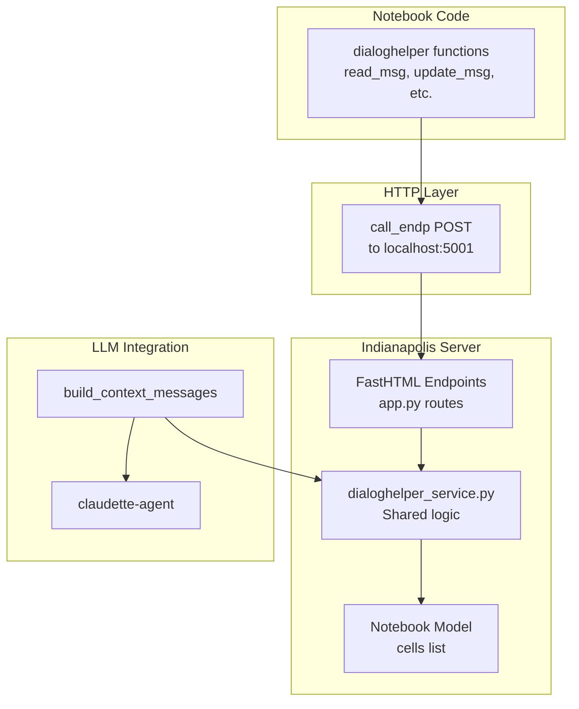

# DialogHelper Integration

This document explains how Indianapolis notebooks maintain compatibility with the [dialoghelper](https://github.com/AnswerDotAI/dialoghelper) library for programmatic cell manipulation.

## Overview

DialogHelper is a library that allows programmatic manipulation of notebook cells (called "messages" in dialoghelper terminology) from within notebook code. Indianapolis implements the server-side API that dialoghelper's `call_endp()` function uses.

## Architecture



## Shared Service Layer

The `services/dialoghelper_service.py` module provides core functions used by both:

1. **HTTP Endpoints** - For dialoghelper library compatibility
2. **LLM Context Building** - Ensures consistent behavior

### Key Functions

| Function | Purpose | Used By |
|----------|---------|---------|
| `get_msg_idx(notebook, msgid)` | Find cell index by ID | Endpoints, Context |
| `find_msgs(notebook, ...)` | Search cells by criteria | Endpoints, Context |
| `read_msg(notebook, ...)` | Read cell content with options | Endpoints |
| `cell_to_dict(cell)` | Convert cell for JSON | Endpoints |
| `build_context_messages(notebook, cell_id)` | Build LLM context | LLM Service |
| `cell_to_messages(cell)` | Convert to LLM format | LLM Service |

### find_msgs() Parameters

```python
find_msgs(
    notebook,           # Notebook object
    re_pattern="",      # Regex to match source
    msg_type="",        # Filter by cell type
    pinned_only=False,  # Only pinned cells
    skipped=None,       # None=all, True=skipped, False=non-skipped
    limit=100,          # Max results
    before_idx=None     # Only cells before this index
)
```

## Supported Endpoints

All endpoints receive `dlg_name` parameter (the notebook ID).

### Information Endpoints

| Endpoint | Purpose | Parameters |
|----------|---------|------------|
| `POST /curr_dialog_` | Get dialog info | `with_messages: bool` |
| `POST /msg_idx_` | Get cell index | `msgid: str` |
| `POST /find_msgs_` | Search cells | `re_pattern, msg_type, limit` |
| `POST /read_msg_` | Read cell content | `n, relative, msgid, view_range, nums` |

### Modification Endpoints

| Endpoint | Purpose | Parameters |
|----------|---------|------------|
| `POST /add_relative_` | Add new cell | `content, placement, msgid, msg_type, ...` |
| `POST /rm_msg_` | Remove cell | `msid: str` |
| `POST /update_msg_` | Update properties | `msgid, **kwargs` |
| `POST /add_runq_` | Queue for execution | `msgid, api` |

### Content Editing Endpoints

| Endpoint | Purpose | Parameters |
|----------|---------|------------|
| `POST /msg_insert_line_` | Insert line | `msgid, insert_line, new_str` |
| `POST /msg_str_replace_` | Replace string | `msgid, old_str, new_str` |
| `POST /msg_strs_replace_` | Replace multiple | `msgid, old_strs, new_strs` (JSON arrays) |
| `POST /msg_replace_lines_` | Replace line range | `msgid, start_line, end_line, new_content` |

### Utility Endpoints

| Endpoint | Purpose | Parameters |
|----------|---------|------------|
| `POST /add_html_` | Add HTML (OOB) | `content: str` |
| `POST /pop_data_blocking_` | Event data | `data_id, timeout` |

## Usage Examples

### From Notebook Code (using dialoghelper)

```python
from dialoghelper import read_msg, update_msg, find_msgs, add_msg

# Read the previous cell
prev = read_msg(-1)
print(prev['source'])

# Find all code cells
code_cells = find_msgs(msg_type="code")
for cell in code_cells:
    print(f"Cell {cell['idx']}: {cell['id']}")

# Pin the current cell (keeps it in LLM context)
update_msg(pinned=True)

# Add a new note cell after the current one
add_msg("This is a note", msg_type="note", placement="after")
```

### How Context Building Uses These Functions

When a prompt cell executes, `build_context_messages()` is called:

```python
def build_context_messages(notebook, current_cell_id):
    current_idx = get_msg_idx(notebook, current_cell_id)

    # 1. Find pinned cells (using find_msgs)
    pinned = find_msgs(notebook, pinned_only=True, skipped=False, before_idx=current_idx)

    # 2. Find window cells (non-pinned, non-skipped)
    window = find_msgs(notebook, pinned_only=False, skipped=False, before_idx=current_idx)

    # 3. Combine up to 25 cells total
    # Pinned first, then most recent non-pinned to fill remaining slots
    ...
```

## Cell Properties Mapping

| dialoghelper | Indianapolis | Description |
|--------------|--------------|-------------|
| `msg_type` | `cell_type` | code, note, prompt |
| `pinned` | `pinned` | Always included in LLM context |
| `skipped` | `skipped` | Excluded from LLM context |
| `i_collapsed` | `input_collapse` | Input collapse state (0-2) |
| `o_collapsed` | `output_collapse` | Output collapse state (0-2) |
| `is_exported` | `is_exported` | Export flag |

## Implementation Notes

### Port Configuration

DialogHelper uses port 5001 by default. The Indianapolis server must run on this port for dialoghelper compatibility, or you can configure `dh_settings["port"]` in the notebook.

### JSON Serialization

All endpoints return JSON. For complex responses, use `cell_to_dict()` to ensure consistent serialization.

### Error Handling

Endpoints return `{"error": "message"}` on failure, otherwise `{"status": "ok"}` or the requested data.

## See Also

- [LLM Integration](./06_llm_integration.md) - How the LLM service uses context building
- [Cell Types](./02_cell_types.md) - Details on cell types and their properties
