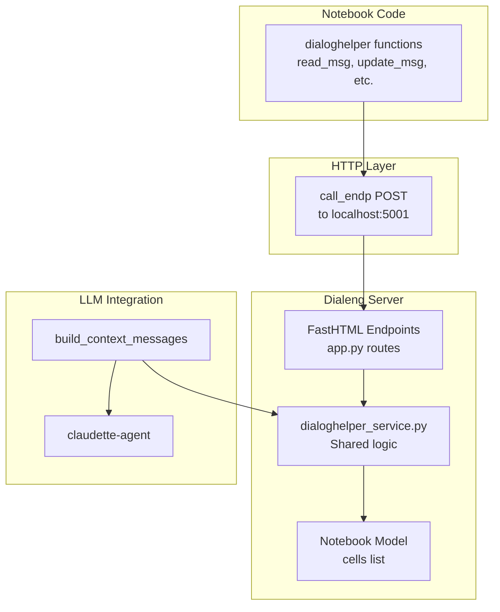
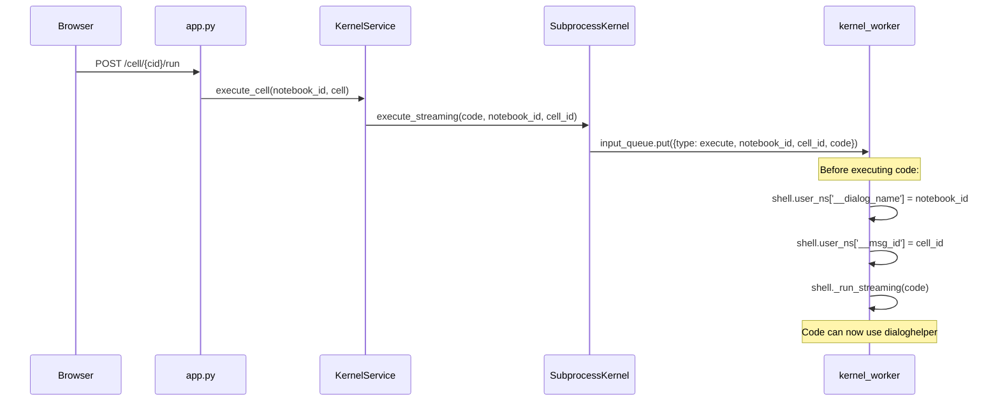
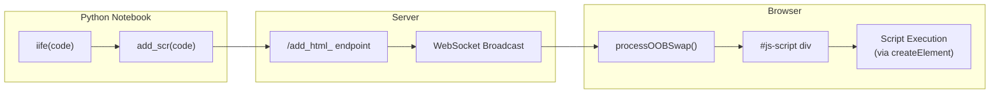
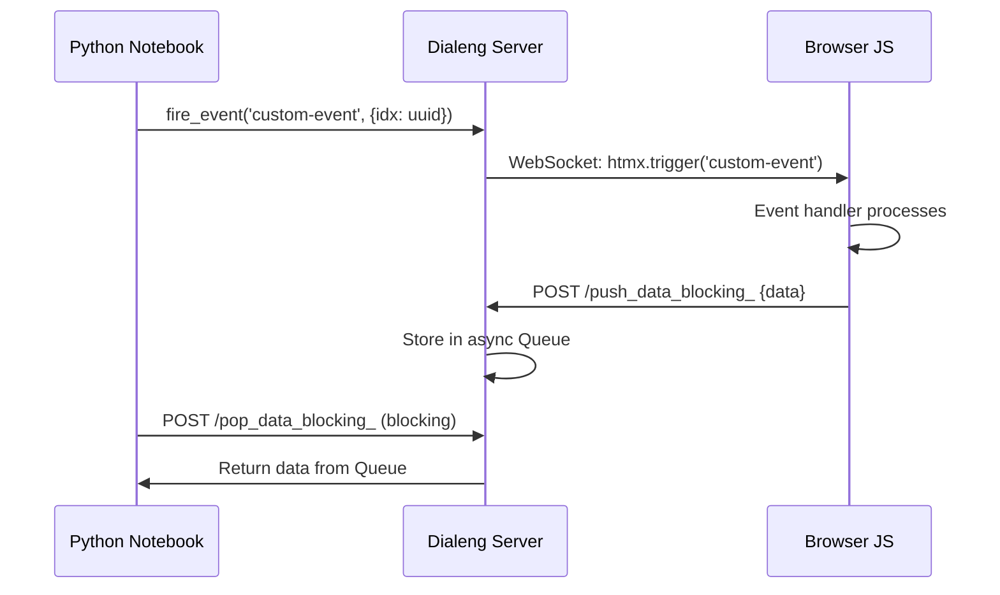
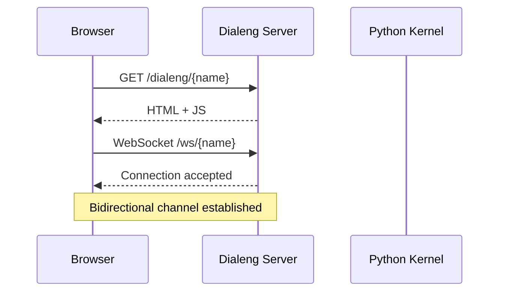
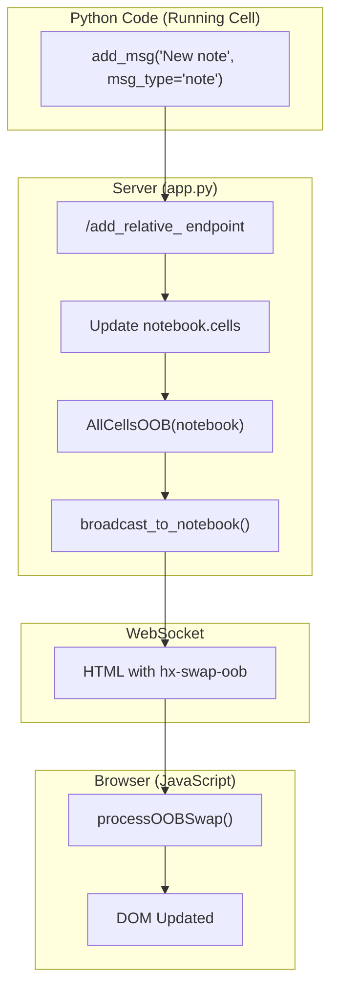
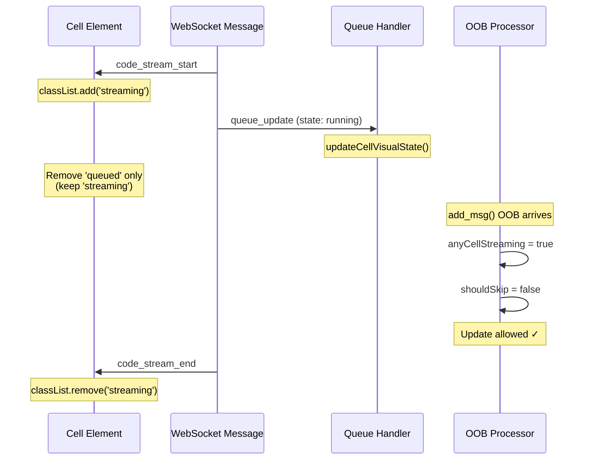
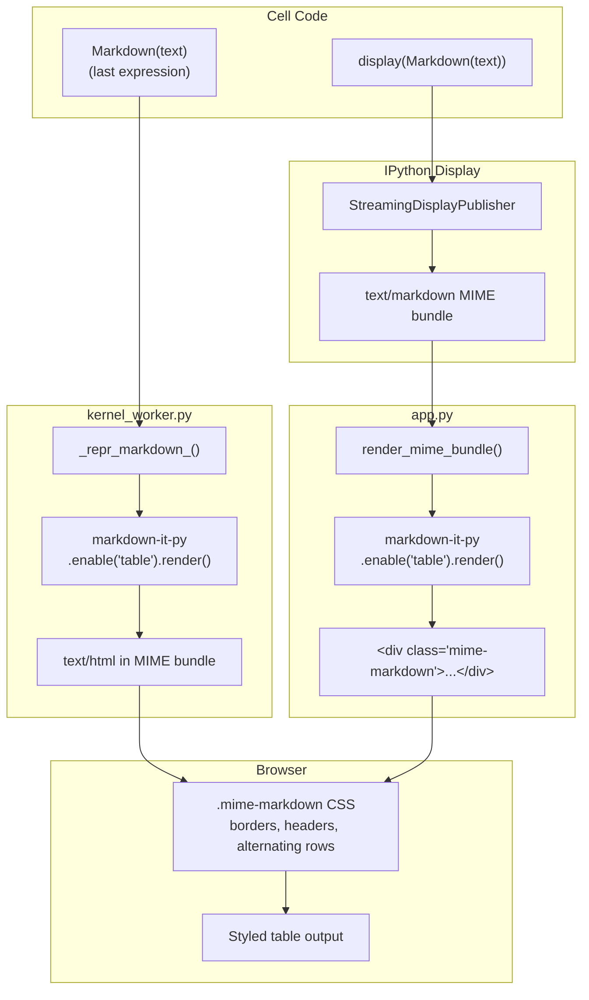

# DialogHelper Integration

This document explains how Dialeng notebooks maintain compatibility with the [dialoghelper](https://github.com/AnswerDotAI/dialoghelper) library for programmatic cell manipulation.

## Key Implementation Files

For headless interaction with Dialeng (e.g., a remote Jupyter notebook calling Dialeng's API), these are the core files:

| File | Purpose | Lines of Interest |
|------|---------|-------------------|
| `services/dialoghelper_service.py` | **Core logic** - Cell queries, search, context building | All |
| `app.py` | **HTTP endpoints** - Routes that dialoghelper calls | ~1190-1400 |
| `services/kernel/kernel_worker.py` | **Magic variable injection** - `__dialog_name`, `__msg_id` | ~80-90 |
| `services/kernel/subprocess_kernel.py` | **Context forwarding** - Passes notebook/cell IDs to worker | ~45-55 |

### File Responsibilities

**`services/dialoghelper_service.py`** - The shared service layer:
- `get_msg_idx()` - Find cell index by ID
- `find_msgs()` - Search cells by pattern, type, properties
- `read_msg()` - Read cell content with view range options
- `cell_to_dict()` - Convert cell to JSON-serializable format
- `build_context_messages()` - Build LLM context from notebook cells
- `cell_to_messages()` - Convert cell to LLM message format (uses dispatch)

**`app.py` endpoints** - HTTP API for dialoghelper library:
- Information: `/curr_dialog_`, `/msg_idx_`, `/find_msgs_`, `/read_msg_`
- Modification: `/add_relative_`, `/rm_msg_`, `/update_msg_`, `/add_runq_`
- Content editing: `/msg_insert_line_`, `/msg_str_replace_`, `/msg_strs_replace_`, `/msg_replace_lines_`, `/msg_del_lines_`, `/msg_pyrun_`
- Clipboard: `/msg_clipboard_`, `/msg_paste_`
- UI toggles: `/toggle_header_collapse_`, `/bookmark_`, `/toggle_comment_`
- Dialog management: `/create_dialog_`, `/stop_kernel_`, `/rm_dialog_`
- Utility: `/add_html_`, `/push_data_blocking_`, `/pop_data_blocking_`

**`services/kernel/kernel_worker.py`** - Magic variable injection:
```python
# Inject dialoghelper magic variables into the namespace
shell.user_ns['__dialog_name'] = notebook_id
shell.user_ns['__msg_id'] = cell_id
```

This allows `read_msg(-1)` to work without explicit context parameters.

## Overview

DialogHelper is a library that allows programmatic manipulation of notebook cells (called "messages" in dialoghelper terminology) from within notebook code. Dialeng implements the server-side API that dialoghelper's `call_endp()` function uses.

## Architecture


```mermaid
flowchart TB
    subgraph "Notebook Code"
        DH[dialoghelper functions<br/>read_msg, update_msg, etc.]
    end

    subgraph "HTTP Layer"
        CE[call_endp POST<br/>to localhost:5001]
    end

    subgraph "Dialeng Server"
        EP[FastHTML Endpoints<br/>app.py routes]
        SVC[dialoghelper_service.py<br/>Shared logic]
        NB[Notebook Model<br/>cells list]
    end

    subgraph "LLM Integration"
        CTX[build_context_messages]
        LLM[claudette-agent]
    end

    DH --> CE
    CE --> EP
    EP --> SVC
    SVC --> NB
    CTX --> SVC
    CTX --> LLM
```

## Magic Variable Injection

DialogHelper functions like `read_msg(-1)` (read the previous cell) need to know which notebook and cell context they're operating in. This is achieved through **magic variables** that are automatically injected into the kernel namespace before each cell executes.

### The Magic Variables

| Variable | Purpose | Example Value |
|----------|---------|---------------|
| `__dialog_name` | The notebook ID | `"my_notebook"` |
| `__msg_id` | The current cell ID | `"abc12345"` |

These variables are used by dialoghelper's internal `find_var()` function to determine context when you call functions like:
- `read_msg(-1)` - Uses `__msg_id` to find "previous" cell
- `update_msg(pinned=True)` - Uses `__msg_id` to know which cell to update
- `add_msg(..., placement="after")` - Uses `__msg_id` for relative positioning
- `iife(...)` - Uses `__dialog_name` to know which notebook's WebSocket to use

### Injection Flow


```mermaid
sequenceDiagram
    participant Browser
    participant App as app.py
    participant KS as KernelService
    participant SK as SubprocessKernel
    participant KW as kernel_worker

    Browser->>App: POST /cell/{cid}/run
    App->>KS: execute_cell(notebook_id, cell)
    KS->>SK: execute_streaming(code, notebook_id, cell_id)
    SK->>KW: input_queue.put({type: execute, notebook_id, cell_id, code})

    Note over KW: Before executing code:
    KW->>KW: shell.user_ns['__dialog_name'] = notebook_id
    KW->>KW: shell.user_ns['__msg_id'] = cell_id

    KW->>KW: shell._run_streaming(code)
    Note over KW: Code can now use dialoghelper
```

### Implementation Details

**kernel_service.py** - Passes notebook_id and cell.id to the subprocess:

```python
async for output in kernel.execute_streaming(
    cell.source,
    notebook_id=notebook_id,
    cell_id=cell.id
):
    ...
```

**subprocess_kernel.py** - Forwards to the worker process:

```python
self.input_queue.put({
    'type': 'execute',
    'code': code,
    'notebook_id': notebook_id,
    'cell_id': cell_id
})
```

**kernel_worker.py** - Injects into the execution namespace:

```python
# Inject dialoghelper magic variables into the namespace
# These are used by dialoghelper's find_var() to identify context
notebook_id = msg.get('notebook_id', '')
cell_id = msg.get('cell_id', '')
if notebook_id:
    shell.user_ns['__dialog_name'] = notebook_id
if cell_id:
    shell.user_ns['__msg_id'] = cell_id
```

### Why This Matters

Without these magic variables, users would need to explicitly pass the notebook and cell IDs to every dialoghelper function:

```python
# Without magic variables (tedious):
read_msg(dname="/my_notebook", id="abc123", n=-1)

# With magic variables (convenient):
read_msg(-1)
```

The variables are injected **before every cell execution**, so they're always current. When cell A runs and calls `read_msg(-1)`, `__msg_id` points to cell A. When cell B runs, `__msg_id` is updated to point to cell B.

## Shared Service Layer

The `services/dialoghelper_service.py` module provides core functions used by both:

1. **HTTP Endpoints** - For dialoghelper library compatibility
2. **LLM Context Building** - Ensures consistent behavior

### Key Functions

| Function | Purpose | Used By |
|----------|---------|---------|
| `get_msg_idx(notebook, msgid)` | Find cell index by ID | Endpoints, Context |
| `find_msgs(notebook, ...)` | Search cells by criteria | Endpoints, Context |
| `read_msg(notebook, ...)` | Read cell content with options | Endpoints |
| `cell_to_dict(cell)` | Convert cell for JSON | Endpoints |
| `build_context_messages(notebook, cell_id)` | Build LLM context | LLM Service |
| `cell_to_messages(cell)` | Convert to LLM format | LLM Service |
| `format_msgs_as_xml(results, ...)` | Format search results as XML | find_msgs endpoint |
| `format_msgs_as_json(results, ...)` | Format search results as JSON | find_msgs endpoint |
| `clipboard_copy(notebook, nb_id, ids, cut)` | Copy/cut cells to clipboard | msg_clipboard endpoint |
| `clipboard_paste(notebook, nb_id, ref_id, after)` | Paste cells from clipboard | msg_paste endpoint |
| `log_change(nb_id, action, cell_id, details)` | Log cell changes for audit | update_msg, rm_msg |

### find_msgs() Parameters

```python
find_msgs(
    notebook,             # Notebook object
    re_pattern="",        # Regex/literal pattern to match source
    msg_type="",          # Filter by cell type (code, note, prompt, raw)
    pinned_only=False,    # Only pinned cells
    skipped=None,         # None=all, True=skipped, False=non-skipped
    limit=100,            # Max results
    before_idx=None,      # Only cells before this index
    # New parameters (dialoghelper v2)
    use_case=False,       # Case-sensitive search
    use_regex=True,       # Regex vs literal matching
    only_err=False,       # Only cells with error outputs
    only_exp=False,       # Only exported cells
    only_chg=False,       # Only changed cells (version > 0)
    ids="",               # Comma-separated cell IDs to filter by
    include_output=True,  # Also search in output text
)
```

## Supported Endpoints

All endpoints receive `dlg_name` parameter (the notebook ID).

### Information Endpoints

| Endpoint | Purpose | Parameters |
|----------|---------|------------|
| `POST /curr_dialog_` | Get dialog info | `with_messages: bool` |
| `POST /msg_idx_` | Get cell index | `id_: str` |
| `POST /find_msgs_` | Search cells (XML/JSON) | `re_pattern, msg_type, limit, use_case, use_regex, only_err, only_exp, only_chg, ids, include_output, include_meta, as_xml, nums, trunc_out, trunc_in, headers_only, header_section` |
| `POST /read_msg_` | Read cell content | `n, relative, id_, view_range, nums` |

### Modification Endpoints

| Endpoint | Purpose | Parameters |
|----------|---------|------------|
| `POST /add_relative_` | Add new cell | `content, placement (add_after/add_before/at_start/at_end), id_, msg_type, run_mode, ...` |
| `POST /rm_msg_` | Remove cell | `msid, log_changed` |
| `POST /update_msg_` | Update properties | `id_, log_changed, content, msg_type, output, pinned, skipped, ...` |
| `POST /add_runq_` | Queue for execution | `ids, api` |

### Content Editing Endpoints

| Endpoint | Purpose | Parameters |
|----------|---------|------------|
| `POST /msg_insert_line_` | Insert line | `id_, insert_line, new_str` |
| `POST /msg_str_replace_` | Replace string | `id_, old_str, new_str, start_line, end_line, n_matches, re_filter, invert_filter` |
| `POST /msg_strs_replace_` | Replace multiple | `id_, old_strs, new_strs` (JSON arrays) |
| `POST /msg_replace_lines_` | Replace line range | `id_, start_line, end_line, new_content` |
| `POST /msg_del_lines_` | Delete line range | `id_, start_line, end_line, re_filter, invert_filter` |
| `POST /msg_pyrun_` | Execute Python against text | `id_, code` (cell source available as `text`) |

> **Note:** The server endpoints use `id_` (with underscore) as the parameter name due to FastHTML conventions, but the dialoghelper library uses `id=` in its function calls and handles the mapping internally.

> **Note:** Line-based functions (`msg_insert_line`, `msg_replace_lines`, `msg_del_lines`) use **1-based line indexing** in the dialoghelper library.

### Clipboard Endpoints

| Endpoint | Purpose | Parameters |
|----------|---------|------------|
| `POST /msg_clipboard_` | Copy/cut cells | `ids, id_, cmd` (copy/cut) |
| `POST /msg_paste_` | Paste cells from clipboard | `id_, after` |

### UI Toggle Endpoints

| Endpoint | Purpose | Parameters |
|----------|---------|------------|
| `POST /toggle_header_collapse_` | Toggle header collapse | `id_` |
| `POST /bookmark_` | Toggle bookmark (1-9) | `id_, n` |
| `POST /toggle_comment_` | Toggle line comments | `ids, id_` |

### Dialog Management Endpoints

| Endpoint | Purpose | Parameters |
|----------|---------|------------|
| `POST /create_dialog_` | Create/load notebook | `name` |
| `POST /stop_kernel_` | Stop execution queue | `name` |
| `POST /rm_dialog_` | Delete notebook from memory | `name` |

### Utility Endpoints

| Endpoint | Purpose | Parameters |
|----------|---------|------------|
| `POST /add_html_` | Broadcast HTML via WebSocket (OOB swaps) | `content: str` |
| `POST /push_data_blocking_` | Push data to queue (from JS to Python) | `data_id, data` |
| `POST /pop_data_blocking_` | Pop data from queue with timeout | `data_id, timeout` |

## JavaScript Injection (iife, add_scr)

The `iife()` and `add_scr()` functions allow executing JavaScript in the browser from Python notebook code. This enables powerful browser interactions like DOM manipulation, API calls, and custom UI injection.

### Architecture


```mermaid
flowchart LR
    subgraph "Python Notebook"
        IIFE["iife(code)"]
        ADDSCR["add_scr(code)"]
    end

    subgraph "Server"
        ADD["/add_html_ endpoint"]
        WS["WebSocket Broadcast"]
    end

    subgraph "Browser"
        PROC["processOOBSwap()"]
        JS["#js-script div"]
        EXEC["Script Execution<br/>(via createElement)"]
    end

    IIFE --> ADDSCR
    ADDSCR --> ADD
    ADD --> WS
    WS --> PROC
    PROC --> JS
    JS --> EXEC
```

### How iife() Works

1. `iife(code)` wraps your JavaScript in an async IIFE: `(async () => { ...code... })()`
2. Calls `add_scr()` with the wrapped code
3. `add_scr()` creates: `<div hx-swap-oob="beforeend:#js-script"><script>...</script></div>`
4. `add_html()` POSTs to `/add_html_` endpoint
5. Server broadcasts HTML via WebSocket to all connected clients
6. `processOOBSwap()` receives and processes the HTML (see Script Execution below)

### How add_scr() Works

`add_scr()` is the lower-level function that `iife()` uses. It directly injects a script element:

```python
from dialoghelper import add_scr

# Inject raw JavaScript (not wrapped in async IIFE)
add_scr("""
    console.log('Direct script injection!');
    alert('Hello from add_scr!');
""")
```

### Script Execution Mechanism (app.py)

**Critical**: Scripts inserted via `innerHTML` don't execute automatically (browser security feature). The `processOOBSwap()` function handles this specially:

```javascript
// app.py:2684-2726 - Handle swap strategies like "beforeend:#js-script"
if (oobAttr && oobAttr.includes(':')) {
    const [swapStrategy, targetSelector] = oobAttr.split(':');
    const target = document.querySelector(targetSelector);

    if (target) {
        // For script injection, manually create and execute scripts
        const scripts = element.querySelectorAll('script');
        if (scripts.length > 0) {
            scripts.forEach(script => {
                // Create new script element (this triggers execution!)
                const newScript = document.createElement('script');
                Array.from(script.attributes).forEach(attr => {
                    newScript.setAttribute(attr.name, attr.value);
                });
                newScript.textContent = script.textContent;
                target.appendChild(newScript);  // Execution happens here
            });
        }
    }
}
```

**Key insight**: `document.createElement('script')` followed by appending to DOM triggers execution, unlike `innerHTML` which doesn't.

### The #js-script Container

The page includes a hidden container for script injection:

```python
# app.py:3248
Div(id="js-script"),  # Container for dialoghelper script injection via HTMX OOB
```

All injected scripts are appended to this container, keeping them organized.

### Example: DOM Manipulation

```python
from dialoghelper import iife

# Change background color temporarily
iife("""
    const original = document.body.style.backgroundColor;
    document.body.style.backgroundColor = '#e8f5e9';
    setTimeout(() => {
        document.body.style.backgroundColor = original;
    }, 2000);
""")
```

### Example: Async Operations

Since `iife()` wraps code in an async IIFE, you can use `await`:

```python
iife("""
    const delay = ms => new Promise(r => setTimeout(r, ms));

    console.log('Starting async operation...');
    await delay(1000);
    console.log('Done after 1 second!');
""")
```

### Example: Fetch API

```python
iife("""
    const response = await fetch('/curr_dialog_', {
        method: 'POST',
        headers: {'Content-Type': 'application/x-www-form-urlencoded'},
        body: `dlg_name=${window.NOTEBOOK_ID}`
    });
    const data = await response.json();
    console.log('Notebook info:', data);
""")
```

### Example: Inject Custom UI

```python
iife("""
    const notif = document.createElement('div');
    notif.style.cssText = 'position: fixed; top: 20px; right: 20px; padding: 15px; background: #667eea; color: white; border-radius: 8px;';
    notif.textContent = 'Hello from Python!';
    document.body.appendChild(notif);
    setTimeout(() => notif.remove(), 3000);
""")
```

## The `pushData()` Global Function

Dialeng provides a global JavaScript function `pushData(idx, data)` (defined in `static/js/app.js`) that simplifies pushing data from browser JavaScript back to Python. It properly URL-encodes all parameters (critical for binary data like base64 images) and posts to `/push_data_blocking_`:

```javascript
// Defined globally in static/js/app.js
async function pushData(idx, data) {
    const params = new URLSearchParams();
    params.append('dlg_name', window.NOTEBOOK_ID);
    params.append('data_id', String(idx));
    params.append('data', JSON.stringify(data));
    await fetch('/push_data_blocking_', {
        method: 'POST',
        headers: {'Content-Type': 'application/x-www-form-urlencoded'},
        body: params.toString()
    });
}
```

This function is used by dialoghelper's `screenshot.js` for screen capture, and can be used by any injected JavaScript handler that needs to send data back to Python. Using `URLSearchParams` ensures proper encoding of special characters (e.g., `+`, `/`, `=` in base64 data).

## Bidirectional Data Transfer

Dialeng supports bidirectional communication between Python and JavaScript via the `fire_event()`, `pop_data()`, and `event_get()` functions, along with the `/push_data_blocking_` and `/pop_data_blocking_` endpoints.

### Architecture


```mermaid
sequenceDiagram
    participant Python as Python Notebook
    participant Server as Dialeng Server
    participant Browser as Browser JS

    Python->>Server: fire_event('custom-event', {idx: uuid})
    Server->>Browser: WebSocket: htmx.trigger('custom-event')
    Browser->>Browser: Event handler processes
    Browser->>Server: POST /push_data_blocking_ {data}
    Server->>Server: Store in async Queue
    Python->>Server: POST /pop_data_blocking_ (blocking)
    Server->>Python: Return data from Queue
```

### fire_event() - Trigger Browser Events

`fire_event()` sends an HTMX trigger event to the browser. This is used to notify JavaScript event handlers.

```python
from dialoghelper import fire_event

# Fire a custom event with data
fire_event('my-event', {'action': 'calculate', 'value': 42})
```

**How it works:**
1. `fire_event()` calls `/add_html_` with: `<script hx-swap-oob="true" id="js-event">htmx.trigger(document.body, 'my-event', {...})</script>`
2. Server broadcasts via WebSocket
3. `processOOBSwap()` handles `<script hx-swap-oob="true">` elements specially (app.py:2731-2751)
4. Script is created via `document.createElement('script')` and executed
5. Browser fires the HTMX event, which JavaScript handlers can catch

### pop_data() - Receive Data from Browser

`pop_data()` waits for data pushed from JavaScript via `/push_data_blocking_`.

```python
from dialoghelper import pop_data

# Wait for data with specific ID (blocking, with timeout)
# NOTE: Parameter is 'idx', not 'data_id'!
response = pop_data(idx='request-123', timeout=5)
print(response.result)
```

**Function signature:**
```python
def pop_data(idx, timeout=15):
    """
    Pop data from the blocking queue.

    Args:
        idx: The data identifier (matches data_id in push_data)
        timeout: Max seconds to wait (default: 15)

    Returns:
        Object with data attributes (dict2obj wrapped)
    """
```

**Important:** The parameter is `idx`, not `data_id`. Internally, dialoghelper maps `idx` to `data_id` when calling the endpoint.

### event_get() - Combined Request/Response

`event_get()` combines `fire_event()` and `pop_data()` for a request/response pattern:

```python
from dialoghelper import event_get

# Fires event and waits for response in one call
result = event_get('get-info', timeout=5)
print(f"URL: {result.url}")
```

**Equivalent to:**
```python
import uuid
request_id = str(uuid.uuid4())
fire_event('get-info', {'idx': request_id})
result = pop_data(idx=request_id, timeout=5)
```

### Complete Example: Browser Calculation

**Step 1: Register JavaScript handler (run once)**

```python
from dialoghelper import iife

iife("""
    // Remove existing handler if any
    if (window._mathHandler) {
        document.body.removeEventListener('do-math', window._mathHandler);
    }

    window._mathHandler = async (e) => {
        const { operation, a, b, idx } = e.detail;
        let result;

        switch (operation) {
            case 'add': result = a + b; break;
            case 'multiply': result = a * b; break;
            case 'power': result = Math.pow(a, b); break;
        }

        // Send result back to Python
        await fetch('/push_data_blocking_', {
            method: 'POST',
            headers: {'Content-Type': 'application/x-www-form-urlencoded'},
            body: `dlg_name=${window.NOTEBOOK_ID}&data_id=${idx}&data=${JSON.stringify({result, operation, a, b})}`
        });
    };

    document.body.addEventListener('do-math', window._mathHandler);
    console.log('Math handler registered!');
""")
```

**Step 2: Use fire_event/pop_data pattern**

```python
import uuid
from dialoghelper import fire_event, pop_data

# Generate unique request ID
request_id = str(uuid.uuid4())[:8]

# Fire calculation request
fire_event('do-math', {
    'operation': 'power',
    'a': 2,
    'b': 10,
    'idx': request_id
})

# Wait for browser to calculate and respond
response = pop_data(idx=request_id, timeout=5)
print(f"2^10 = {response.result}")  # Output: 2^10 = 1024
```

### Global NOTEBOOK_ID

The notebook ID is exposed to JavaScript as `window.NOTEBOOK_ID` for use in push_data calls:

```javascript
// In browser console or injected script
console.log(window.NOTEBOOK_ID);  // e.g., "test_dialoghelper_advanced"
```

This is set when the notebook page loads and is essential for the `/push_data_blocking_` endpoint to know which notebook's queue to push to.

### Server-Side Endpoints

| Endpoint | Direction | Parameters |
|----------|-----------|------------|
| `/push_data_blocking_` | JS → Python | `dlg_name`, `data_id`, `data` (JSON string) |
| `/pop_data_blocking_` | Python ← Server | `dlg_name`, `data_id`, `timeout` |

The server maintains async queues per `(notebook_id, data_id)` pair for thread-safe data transfer.

## Usage Examples

### From Notebook Code (using dialoghelper)

```python
from dialoghelper import read_msg, update_msg, find_msgs, add_msg

# Read the previous cell
# Note: read_msg() returns an AttrDict with flat structure (.content, .type, .id, etc.)
prev = read_msg(-1)
print(prev.content)  # Access via attribute (recommended)
print(prev['content'])  # Or via dict key

# Find all code cells
# Note: find_msgs() returns a list of AttrDicts
code_cells = find_msgs(msg_type="code")
for cell in code_cells:
    print(f"Cell {cell.idx}: {cell.id} - {cell.content[:30]}...")

# Pin the current cell (keeps it in LLM context)
update_msg(pinned=True)

# Add a new note cell after the current one
# Returns the new cell's ID as a string
new_id = add_msg("This is a note", msg_type="note", placement="after")
print(f"Created cell: {new_id}")
```

### Response Format

DialogHelper functions return **flat** AttrDict objects (not nested). Available fields:

| Field | Description |
|-------|-------------|
| `.id` | Cell ID (string) |
| `.idx` | Cell index (int) |
| `.type` | Cell type: "code", "note", or "prompt" |
| `.content` | Cell source content |
| `.output` | Cell output (if any) |
| `.pinned` | Whether cell is pinned (bool) |
| `.skipped` | Whether cell is skipped (bool) |

### How Context Building Uses These Functions

When a prompt cell executes, `build_context_messages()` is called:

```python
def build_context_messages(notebook, current_cell_id):
    current_idx = get_msg_idx(notebook, current_cell_id)

    # 1. Find pinned cells (using find_msgs)
    pinned = find_msgs(notebook, pinned_only=True, skipped=False, before_idx=current_idx)

    # 2. Find window cells (non-pinned, non-skipped)
    window = find_msgs(notebook, pinned_only=False, skipped=False, before_idx=current_idx)

    # 3. Combine up to 25 cells total
    # Pinned first, then most recent non-pinned to fill remaining slots
    ...
```

## Cell Properties Mapping

| dialoghelper | Dialeng | Description |
|--------------|--------------|-------------|
| `msg_type` | `cell_type` | code, note, prompt |
| `pinned` | `pinned` | Always included in LLM context |
| `skipped` | `skipped` | Excluded from LLM context |
| `i_collapsed` | `input_collapse` | Input collapse state (0-2) |
| `o_collapsed` | `output_collapse` | Output collapse state (0-2) |
| `is_exported` | `is_exported` | Export flag |

## Real-time Updates via WebSocket

DialogHelper operations that modify the notebook (like `add_msg()`, `del_msg()`, `update_msg()`) trigger real-time updates in the browser via WebSocket. This section explains how these updates flow through the system.

### WebSocket Connection

When a notebook page loads, it establishes a WebSocket connection:


```mermaid
sequenceDiagram
    participant Browser
    participant Server as Dialeng Server
    participant Kernel as Python Kernel

    Browser->>Server: GET /dialeng/{name}
    Server-->>Browser: HTML + JS
    Browser->>Server: WebSocket /ws/{name}
    Server-->>Browser: Connection accepted
    Note over Browser,Server: Bidirectional channel established
```

The WebSocket handles:
- **Streaming output** - Real-time code execution output
- **OOB swaps** - DOM updates from dialoghelper operations
- **Queue updates** - Execution queue state changes

### OOB Swap Mechanism

DialogHelper uses HTMX's Out-of-Band (OOB) swap mechanism to update the DOM. When a dialoghelper function modifies the notebook, the server broadcasts HTML with `hx-swap-oob="true"` attributes.


```mermaid
flowchart TB
    subgraph "Python Code (Running Cell)"
        DH["add_msg('New note', msg_type='note')"]
    end

    subgraph "Server (app.py)"
        EP["/add_relative_ endpoint"]
        NB["Update notebook.cells"]
        OOB["AllCellsOOB(notebook)"]
        BC["broadcast_to_notebook()"]
    end

    subgraph "WebSocket"
        WS["HTML with hx-swap-oob"]
    end

    subgraph "Browser (JavaScript)"
        PROC["processOOBSwap()"]
        DOM["DOM Updated"]
    end

    DH --> EP
    EP --> NB
    NB --> OOB
    OOB --> BC
    BC --> WS
    WS --> PROC
    PROC --> DOM
```

### Two Update Paths

The `processOOBSwap()` function handles two types of updates differently:

#### 1. Individual Cell Updates (`cell-{id}`)

Used by `update_msg()` when modifying a single cell's content, output, or properties.

```javascript
// Target: cell-{id}
// Broadcast: CellViewOOB(cell, notebook_id)

// Skip logic (lines 2701-2707):
const isEditing = target.contains(document.activeElement);
const isStreaming = target.classList.contains('streaming');
if (isEditing || isStreaming) {
    continue;  // Skip - user editing or cell streaming
}
```

**Behavior:**
- Checks the TARGET cell only
- Updates allowed if user is NOT editing that specific cell
- Updates skipped if that cell is currently streaming output

#### 2. Full Cells Container (`#cells`)

Used by `add_msg()`, `del_msg()` when the cell list structure changes.

```javascript
// Target: cells
// Broadcast: AllCellsOOB(notebook)

// Skip logic (lines 2739-2747):
const isInInput = document.activeElement?.matches('input, textarea, .ace_text-input');
const anyCellStreaming = document.querySelector('.cell.streaming') !== null;
const shouldSkip = isInInput && !anyCellStreaming;
if (shouldSkip) {
    continue;  // Skip - user typing and no cell executing
}
```

**Behavior:**
- Checks if ANY cell is streaming (executing code)
- If a cell is streaming, updates are allowed (for `add_msg()` during execution)
- If no cell is streaming AND user is typing, updates are deferred

### Streaming Class Management

The `.streaming` class is critical for determining when to allow real-time updates during code execution.


```mermaid
sequenceDiagram
    participant Cell as Cell Element
    participant WS as WebSocket Message
    participant Queue as Queue Handler
    participant OOB as OOB Processor

    WS->>Cell: code_stream_start
    Note over Cell: classList.add('streaming')

    WS->>Queue: queue_update (state: running)
    Note over Queue: updateCellVisualState()
    Note over Cell: Remove 'queued' only<br/>(keep 'streaming')

    Note over OOB: add_msg() OOB arrives
    OOB->>OOB: anyCellStreaming = true
    OOB->>OOB: shouldSkip = false
    Note over OOB: Update allowed ✓

    WS->>Cell: code_stream_end
    Note over Cell: classList.remove('streaming')
```

**Key Insight:** The streaming class must be preserved during execution so that:
1. The OOB skip logic knows code is running
2. `add_msg()` updates are not blocked
3. Real-time cell additions work during code execution

### Update Flow Summary

| Operation | Broadcast Type | Target | When Allowed |
|-----------|---------------|--------|--------------|
| `add_msg()` | `AllCellsOOB` | `#cells` | Any cell streaming OR user not typing |
| `del_msg()` | `AllCellsOOB` | `#cells` | Any cell streaming OR user not typing |
| `update_msg()` | `CellViewOOB` | `cell-{id}` | Target cell not being edited/streaming |
| `run_msg()` | Queue broadcast | `#cells` | Any cell streaming OR user not typing |

### Debugging Real-time Updates

Enable console logging to debug update issues:

```javascript
// Console output when OOB swap is processed:
[OOB] processOOBSwap called, HTML length: 85000
[OOB] Element tag: DIV id: cells oobAttr: true
[OOB] isInInput: true anyCellStreaming: true shouldSkip: false
[OOB] Replacing cells container
[OOB] Cells container replaced successfully
```

If updates are being skipped:
```javascript
[OOB] isInInput: true anyCellStreaming: false shouldSkip: true
[OOB] Skipping cells container update - user is typing and no cell is streaming
```

**Common causes for skipped updates:**
1. `.streaming` class not added (check `code_stream_start` handler)
2. `.streaming` class removed prematurely (check `updateCellVisualState`)
3. User focus in an input field with no executing code

## Implementation Notes

### Port Configuration

DialogHelper uses port 5001 by default. The Dialeng server must run on this port for dialoghelper compatibility, or you can configure `dh_settings["port"]` in the notebook.

### JSON Serialization

All endpoints return JSON. For complex responses, use `cell_to_dict()` to ensure consistent serialization.

### Error Handling

Endpoints return `{"error": "message"}` on failure, otherwise `{"status": "ok"}` or the requested data.

## Screen Capture

DialogHelper provides a `capture` module that enables taking screenshots from Python notebook code. Dialeng supports this functionality through its bidirectional data transfer infrastructure.

### How It Works

```mermaid
sequenceDiagram
    participant Python as Python Notebook
    participant Server as Dialeng Server
    participant Browser as Browser JS

    Note over Python: setup_share()
    Python->>Server: iife(screenshot.js)
    Server->>Browser: WebSocket: inject script
    Browser->>Browser: Register shareScreen + captureScreen listeners

    Note over Python: start_share()
    Python->>Server: trigger_now('shareScreen')
    Server->>Browser: WebSocket: htmx.trigger
    Browser->>Browser: navigator.mediaDevices.getDisplayMedia()
    Note over Browser: User picks a window/screen

    Note over Python: capture_screen()
    Python->>Server: fire_event_a('captureScreen', {idx: uuid})
    Server->>Browser: WebSocket: htmx.trigger
    Browser->>Browser: ImageCapture.grabFrame()
    Browser->>Browser: Canvas resize + toDataURL()
    Browser->>Server: pushData(idx, {img_data: dataURL})
    Server->>Server: asyncio.Queue.put(data)
    Python->>Server: pop_data_a(idx)
    Server->>Python: {img_data: "data:image/png;base64,..."}
    Python->>Python: base64 decode → PIL.Image
```

### Functions

| Function | Purpose |
|----------|---------|
| `setup_share()` | Injects `screenshot.js` into the browser via `iife()`. Registers `shareScreen` and `captureScreen` event listeners. Call once per session. |
| `start_share()` | Fires `shareScreen` event via `trigger_now()`. Browser shows the screen/window picker dialog. User must select a screen to share. |
| `capture_screen(timeout=15)` | Async. Fires `captureScreen` event, waits for the JS handler to grab a frame and send it back via `pushData()`. Returns a PIL Image. |
| `capture_tool(timeout=15)` | Async. LLM-friendly wrapper (`@llmtool` decorated). Returns PIL Image on success, error string on failure. |

### Usage

```python
from dialoghelper.capture import setup_share, start_share, capture_screen

# 1. Inject screenshot.js (once per session)
setup_share()

# 2. Prompt user to select a screen/window
start_share()

# 3. Capture screenshots (as many times as needed)
img = await capture_screen()
img.thumbnail((800, 600))
img  # Displays inline thanks to rich result promotion
```

### Key Infrastructure

- **`pushData()` global function** (`static/js/app.js`) — URL-encodes and posts data to `/push_data_blocking_`. Critical for base64 image data which contains `+`, `/`, `=` characters that break raw form encoding.
- **Rich result promotion** (`kernel_worker.py`) — PIL Images returned as the last expression are automatically promoted from `execute_result` to `display_data` with a `image/png` MIME type, so they render inline.
- **`window.NOTEBOOK_ID`** (`ui/layout.py`) — Set on page load, used by `pushData()` to identify which notebook's data queue to push to.

## Tracetools (Function Tracing)

DialogHelper provides a `tracetools` module for LLM-accessible function execution tracing using Python 3.12's `sys.monitoring`.

### Functions

| Function | Purpose |
|----------|---------|
| `tracetool(sym, args, kwargs, target_func)` | Trace execution of a callable. Returns list of `(stack_str, trace_dict)` tuples with per-line variable snapshots. Decorated with `@llmtool` for LLM tool calling. |
| `fmt_trace(traces)` | Format raw trace output as markdown tables with Source, Hits, and Variables columns. |

### Usage

```python
from dialoghelper.tracetools import tracetool, fmt_trace
from IPython.display import Markdown

# Define a function
def demo(n, m='x'):
    total = 0
    for i in range(n): total += i
    return m * total

# Trace it
r = tracetool(sym='demo', args=[5], kwargs={'m': 'y'})

# Display formatted (renders as HTML table via markdown-it-py)
Markdown(fmt_trace(r))
```

### Trace Output Semantics

- Each call to `target_func` (including recursion) produces a separate trace entry
- `trace_dict` maps source snippets to `(hit_count, variables)`
- Unchanged variables → `('type', 'repr')` tuple; changed variables → `[('type', 'repr'), ...]` list
- Comprehensions are monitored with per-iteration snapshots
- Snapshots are recorded after each line finishes

### Key Infrastructure

- **`tracefunc` package** — Core tracing engine using `sys.monitoring` (Python 3.12+). Dev dependency of dialoghelper, must be installed explicitly.
- **`toolslm.inspecttools.resolve()`** — Resolves dotted symbol paths (e.g., `'textwrap.TextWrapper._wrap_chunks'`) to Python callables.
- **Markdown rendering pipeline** — `Markdown(fmt_trace(r))` flows through two paths depending on how it's used:
  1. **Last expression** → `_repr_markdown_()` rich result promotion in `kernel_worker.py` converts to HTML via `markdown-it-py`
  2. **`display()` call** → IPython's `StreamingDisplayPublisher` produces a `text/markdown` MIME bundle → `render_mime_bundle()` in `app.py` converts to HTML
- **Table styling** (`static/css/components.css`) — `.mime-markdown` CSS provides themed borders, header styling (blue accent, secondary background), alternating row shading, hover highlights, and monospace font. All colors use CSS variables for dark/light theme compatibility.

## Tmux Tools (Terminal Buffer Viewing)

DialogHelper provides a `tmux` module for capturing and inspecting content from tmux sessions, windows, and panes. All capture functions are `@llmtool` decorated for use as AI assistant tools.

### Functions

| Function | Purpose |
|----------|---------|
| `shell_ret(cmd, host, ip, user, keyfile)` | Run shell commands locally or over SSH. Returns stdout/stderr. |
| `pane(n, pane, session, window)` | Capture scrollback history from a specific tmux pane. |
| `list_panes(session, window)` | List panes with dimensions, history size, and active status. |
| `panes(session, window, n)` | Capture all panes in a window as a `{pane_num: content}` dict. |
| `list_windows(session)` | List windows with names, pane counts, and active markers. |
| `windows(session, n)` | Capture all windows and panes as a nested dict. |
| `list_sessions()` | List all active tmux sessions. |
| `sessions(n)` | Capture entire tmux state as a nested dict (sessions > windows > panes). |
| `flatten_dict(d, sep)` | Flatten nested dicts into `(path, value)` tuples for searching. |
| `set_default_history(n)` | Set default scrollback line count (default: 500). |

### Function Hierarchy

```
sessions()                              # All sessions → nested dict
  └─ windows(session=...)               # All windows in a session
       └─ panes(session=..., window=...)  # All panes in a window
            └─ pane(session=..., window=..., pane=...)  # Single pane content

list_sessions() / list_windows() / list_panes()  # Metadata only (no content)

flatten_dict(sessions())  # Flat list of (path, content) for keyword search
```

### Usage

```python
from dialoghelper.tmux import pane, sessions, flatten_dict

# Capture a specific pane
content = pane(n=50, session='dev', window=0)

# Search across all tmux content
flat = flatten_dict(sessions(n=20))
matches = [(path, c) for path, c in flat if 'Error' in c]
for path, c in matches:
    lines = [l for l in c.split('\n') if 'Error' in l]
    print(f'{path}: {lines}')
```

### SSH Support

All functions accept SSH parameters for remote tmux access:

```python
# Via SSH host alias
pane(n=50, host='myserver')

# Via IP/user/keyfile
pane(n=50, ip='192.168.1.100', user='ubuntu', keyfile='~/.ssh/id_rsa')
```

### Requirements

- tmux installed (`brew install tmux` on macOS)
- No additional Python dependencies (uses `subprocess` from stdlib)

## Exhash (Hash-Addressed Line Editor)

DialogHelper provides an `exhash` module for verified line-addressed text editing. Each line is identified by a `lineno|hash|` address where the hash is a 4-char hex digest of the line content. This prevents stale edits — if the content has changed since viewing, the hash won't match and the edit is rejected.

### Functions

| Function | Source | Purpose |
|----------|--------|---------|
| `lnhashview(text)` | `exhash` | Show all lines with `lineno\|hash\|  content` addresses |
| `exhash(text, cmds)` | `exhash` | Apply hash-addressed edit commands. Returns dict with `lines`, `hashes`, `modified`, `deleted` |
| `lnhash(lineno, line)` | `exhash` | Get hash address `lineno\|hash\|` for a specific line |
| `line_hash(line)` | `exhash` | Get just the 4-char hex hash for a line |
| `exhash_result(results)` | `exhash` | Format only modified lines from result dicts |
| `msg_lnhashview(id)` | `dialoghelper.exhash` | Show hash-addressed lines of a notebook cell |
| `msg_exhash(id, cmds)` | `dialoghelper.exhash` | Apply exhash commands to a cell's content |
| `file_lnhashview(path)` | `dialoghelper.exhash` | Show hash-addressed lines of a file |
| `file_exhash(path, cmds)` | `dialoghelper.exhash` | Apply exhash commands to a file |

### Commands

Commands use lnhash addresses: `lineno|hash|cmd`

| Command | Description |
|---------|-------------|
| `s/pat/rep/[flags]` | Substitute (regex). Flags: `g`=all, `i`=case-insensitive |
| `d` | Delete line(s) |
| `a` | Append text after line (text block follows after newline) |
| `i` | Insert text before line |
| `c` | Change/replace line(s) |
| `j` | Join with next line; with range, joins all |
| `>` / `<` | Indent / dedent (4 spaces per level) |
| `m dest` | Move line(s) after dest address |
| `t dest` | Copy line(s) after dest address |
| `sort` | Sort lines alphabetically |
| `g/pat/cmd` | Global: run cmd on matching lines |

### Usage

```python
from exhash import lnhashview, exhash, line_hash

text = """def hello():
print('world')
return True"""

# View with hash addresses
for line in lnhashview(text): print(line)
# 1|a1b2|  def hello():
# 2|c3d4|  print('world')
# 3|e5f6|  return True

# Indent lines 2-3 (range address)
result = exhash(text, ['2|c3d4|,3|e5f6|>'])
```

### Why Hash Addresses?

Hash verification prevents **stale edit** errors — if line content changes between viewing and editing, the hash won't match and the edit is rejected. This is critical for LLM tool calling where the model may reference line numbers from an earlier `lnhashview` call.

## Markdown Rendering Pipeline

Any cell that returns or displays an IPython `Markdown` object (e.g., `Markdown(fmt_trace(r))`) is rendered as styled HTML via the following pipeline:


```mermaid
flowchart TB
    subgraph "Cell Code"
        EXPR["Markdown(text)<br/>(last expression)"]
        DISP["display(Markdown(text))"]
    end

    subgraph "kernel_worker.py"
        REPR["_repr_markdown_()"]
        MDIT1["markdown-it-py<br/>.enable('table').render()"]
        HTML1["text/html in MIME bundle"]
    end

    subgraph "IPython Display"
        PUB["StreamingDisplayPublisher"]
        MIME["text/markdown MIME bundle"]
    end

    subgraph "app.py"
        RMB["render_mime_bundle()"]
        MDIT2["markdown-it-py<br/>.enable('table').render()"]
        HTML2["&lt;div class='mime-markdown'&gt;...&lt;/div&gt;"]
    end

    subgraph "Browser"
        CSS[".mime-markdown CSS<br/>borders, headers, alternating rows"]
        RENDER["Styled table output"]
    end

    EXPR --> REPR
    REPR --> MDIT1
    MDIT1 --> HTML1
    HTML1 --> CSS

    DISP --> PUB
    PUB --> MIME
    MIME --> RMB
    RMB --> MDIT2
    MDIT2 --> HTML2
    HTML2 --> CSS
    CSS --> RENDER
```

### Rich Result Promotion Order

The kernel worker checks display representations in this order (`kernel_worker.py`):

1. `_repr_png_()` → `image/png` (PIL Images)
2. `_repr_html_()` → `text/html` (DataFrames, HTML objects)
3. `_repr_markdown_()` → converted to `text/html` via `markdown-it-py` (Markdown display objects)

### CSS Styling

Markdown tables rendered inside `.mime-markdown` divs are styled via `static/css/components.css`:

| CSS Rule | Effect |
|----------|--------|
| `.mime-markdown table` | Collapsed borders, monospace font, auto width |
| `.mime-markdown th` | Secondary background, blue accent color, bold |
| `.mime-markdown td` | Themed borders, padding, word-wrap |
| `tr:nth-child(even) td` | Alternating row shading |
| `tr:hover td` | Blue tint on hover |

All colors use CSS custom properties (`--border`, `--bg-secondary`, `--accent-blue`, etc.) for automatic dark/light theme support.

## Test Notebooks

Six test notebooks are available:

### Basic Tests: `notebooks/test_dialoghelper.ipynb`

Tests fundamental dialoghelper compatibility:

- `curr_dialog()` - Get notebook info
- `msg_idx()` - Get cell index by ID
- `read_msg()` - Read cell content (absolute and relative)
- `find_msgs()` - Search cells by type, pattern
- `update_msg()` - Update cell properties (pinned, content, etc.)
- `add_msg()` - Create new cells
- `del_msg()` - Delete cells
- `msg_str_replace()` - Replace string in cell
- `msg_insert_line()` - Insert line at position
- Basic `iife()` - Console.log, alert, DOM manipulation
- `add_html()` - Direct HTML injection
- `event_get()` - Bidirectional browser communication

### Advanced Tests: `notebooks/test_dialoghelper_advanced.ipynb`

Tests advanced dialoghelper functions:

- **Multi-string operations:**
  - `msg_strs_replace()` - Replace multiple strings at once
  - `msg_replace_lines()` - Replace a range of lines
  - `msg_del_lines()` - Delete lines (error handling test)

- **Script injection:**
  - `add_scr()` - Lower-level script injection
  - Advanced `iife()` - Async patterns, progress indicators
  - `iife()` with Fetch API - HTTP requests from JS
  - `iife()` DOM queries - Access notebook structure

- **Bidirectional data transfer:**
  - `fire_event()` - Fire custom browser events
  - `pop_data()` - Receive data from browser (note: parameter is `idx`)
  - Multiple request/response patterns

- **Utility patterns:**
  - Cell duplication
  - Backup before modification
  - Find/replace across all cells

### Capture Tests: `notebooks/test_capture.ipynb`

Tests the screen capture functionality:

- `setup_share()` - Inject `screenshot.js` event listeners into the browser
- `start_share()` - Trigger browser screen/window picker dialog
- `capture_screen()` - Capture current frame as PIL Image (async)
- `capture_tool()` - LLM-friendly wrapper (async, returns Image or error string)
- Multiple sequential captures with delay
- Save screenshot to file

### Tracetools Tests: `notebooks/test_tracetools.ipynb`

Tests the function tracing functionality:

- `tracetool()` - Trace a simple function with variable snapshots
- `fmt_trace()` - Format trace output as markdown tables
- `Markdown(fmt_trace(r))` - Render formatted traces inline
- `target_func` parameter - Trace internal/stdlib functions
- Recursive function tracing - One trace entry per call

### Tmux Tests: `notebooks/test_tmux.ipynb`

Tests tmux terminal buffer viewing:

- `shell_ret()` - Run shell commands and capture output
- `list_sessions()` / `list_windows()` / `list_panes()` - Enumerate tmux hierarchy
- `pane()` - Capture scrollback history from a specific pane
- `panes()` / `windows()` / `sessions()` - Capture content as nested dicts
- `flatten_dict()` - Flatten nested dicts for searching across all panes
- `set_default_history()` - Configure default scrollback line count
- Cross-pane keyword search example

### Exhash Tests: `notebooks/test_exhash.ipynb`

Tests the hash-addressed line editor:

- `lnhashview()` - Display lines with hash addresses
- `lnhash()` / `line_hash()` - Get hash addresses for specific lines
- `exhash()` - All edit commands: substitute, delete, insert, append, change, indent, global
- `exhash_result()` - Format only modified lines from results
- Hash verification - Wrong hashes are rejected
- Multiple commands in one call
- File editing with exhash

Run all six notebooks to verify all dialoghelper features are working correctly.

## See Also

- [DialogHelper Proxy for Colab](./13_colab_dialoghelper_proxy.md) - How dialoghelper works on remote Colab kernels (stdin proxy, auto-install, monkey-patching)
- [Google Colab Kernel](./12_colab_kernel.md) - Colab kernel architecture and Jupyter wire protocol
- [LLM Integration](./06_llm_integration.md) - How the LLM service uses context building
- [Cell Types](./02_cell_types.md) - Details on cell types and their properties
