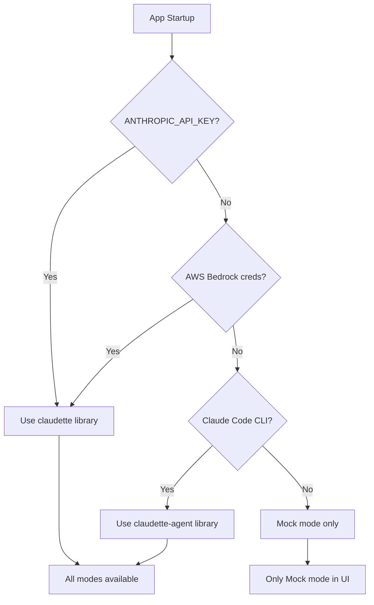
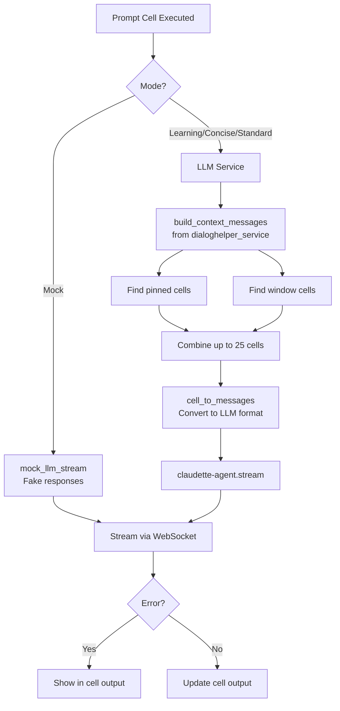

# LLM Integration

This document explains how Indianapolis integrates with LLMs for real AI responses in prompt cells.

## Overview

Indianapolis supports multiple AI modes for prompt cells, with **automatic credential detection** at startup to determine which providers are available:

| Mode | Description |
|------|-------------|
| **Mock** | Uses fake responses for testing (no API calls) |
| **Learning** | Guides user to discover answers themselves |
| **Concise** | Brief, code-focused responses |
| **Standard** | Balanced, helpful assistant |

## Credential Detection

At startup, Indianapolis automatically detects available LLM credentials and configures the appropriate provider.

### Detection Order



### Credential Sources

| Provider | Credentials | Library |
|----------|-------------|---------|
| **Anthropic API** | `ANTHROPIC_API_KEY` env var or `.env` | `claudette` |
| **AWS Bedrock** | AWS credentials (env, profile, IAM) | `claudette` |
| **Claude Code** | Claude CLI with active subscription | `claudette-agent` |
| **None** | No credentials found | Mock only |

### Startup Logging

The credential status is logged at startup:

```
🚀 LLM Notebook starting at http://localhost:8000
   Notebooks saved to: ./notebooks/
   Format: Solveit-compatible .ipynb

   ✅ LLM Credentials available
      Provider: claudette
      Backend:  anthropic_api
      Source:   env:ANTHROPIC_API_KEY
      Details:  anthropic-sdk: Anthropic(api_key=...) instantiated
```

Or when no credentials are found:

```
   ⚠️  No LLM credentials found - Mock mode only
      Details: No ANTHROPIC_API_KEY, no AWS Bedrock creds, and no Claude Code CLI found.
```

### Dynamic UI

The mode selector only shows available options based on credentials:

- **With credentials**: Mock, Learning, Concise, Standard
- **Without credentials**: Mock only

### Credential Service

The credential detection logic is in `services/credential_service.py`:

```python
from services.credential_service import detect_credentials, get_available_modes

# Detect at startup
CREDENTIAL_STATUS = detect_credentials()
AVAILABLE_DIALOG_MODES = get_available_modes(CREDENTIAL_STATUS)

# CredentialStatus fields:
# - available: bool - Whether any credentials were found
# - provider: str - "claudette" | "claudette_agent" | "mock_only"
# - backend: str - "anthropic_api" | "bedrock" | "claude_code_subscription" | "none"
# - source: str - Where credentials were found
# - details: str - Human-readable details
```

## Architecture



## Mode Selection

The mode selector is in the notebook header toolbar:

```
[ Mock ▼ ] [ Learning ] [ Concise ] [ Standard ]
```

The selected mode is stored in `notebook.dialog_mode` and persisted with the notebook.

## Model Selection

When a non-Mock mode is selected (Learning, Concise, or Standard), a model dropdown appears:

| Model | Description |
|-------|-------------|
| **Claude Sonnet 4.5** | Balanced performance and quality (default) |
| **Claude Haiku 4.5** | Faster, more cost-effective |

The selected model is stored in `notebook.model` and persisted in notebook metadata as `solveit_model`.

```python
# Available models in app.py
AVAILABLE_MODELS = [
    ("claude-sonnet-4-5", "Claude Sonnet 4.5"),
    ("claude-haiku-4-5", "Claude Haiku 4.5"),
]
DEFAULT_MODEL = "claude-sonnet-4-5"
```

The model dropdown visibility is controlled by JavaScript:
- **Hidden** when Mock mode is selected
- **Shown** when Learning, Concise, or Standard is selected

## Context Building

### The 25-Cell Window

LLM context is limited to 25 cells maximum to avoid token overflow:

1. **Pinned cells** are always included first (in order)
2. **Window cells** fill the remaining slots from the most recent non-pinned cells
3. **Skipped cells** are excluded from context

```python
MAX_CONTEXT_CELLS = 25

def build_context_messages(notebook, current_cell_id):
    # Get current cell index
    current_idx = get_msg_idx(notebook, current_cell_id)

    # Find pinned cells (always included)
    pinned = find_msgs(notebook, pinned_only=True, skipped=False, before_idx=current_idx)

    # Find non-pinned window cells
    window = find_msgs(notebook, pinned_only=False, skipped=False, before_idx=current_idx)
    window = [c for c in window if not c.pinned]  # Exclude pinned (already counted)

    # Calculate remaining slots
    remaining = MAX_CONTEXT_CELLS - len(pinned)
    window = window[-remaining:]  # Take most recent

    # Combine and convert
    all_cells = pinned + window
    return [cell_to_messages(c) for c in all_cells]
```

### Cell to Message Conversion

Cells are converted to claudette-agent message format:

| Cell Type | Conversion |
|-----------|------------|
| **code** | User message with python code block + output |
| **note** | User message with markdown content |
| **prompt** | User message (source) + Assistant message (output) |

```python
def cell_to_messages(cell):
    if cell.cell_type == "code":
        content = f"```python\n{cell.source}\n```"
        if cell.output:
            content += f"\nOutput:\n```\n{cell.output}\n```"
        return [{"role": "user", "content": content}]

    elif cell.cell_type == "note":
        return [{"role": "user", "content": cell.source}]

    elif cell.cell_type == "prompt":
        msgs = [{"role": "user", "content": cell.source}]
        if cell.output:
            msgs.append({"role": "assistant", "content": cell.output})
        return msgs
```

## LLM Service

The `services/llm_service.py` module provides a unified interface to both providers:

```python
class LLMService:
    async def stream_response(
        self,
        prompt: str,
        context_messages: List[Dict],
        mode: str,
        model: str = "claude-sonnet-4-5",
        use_thinking: bool = False
    ) -> AsyncIterator[Dict]:
        """
        Args:
            prompt: The user's prompt/question
            context_messages: Previous conversation context
            mode: One of "learning", "concise", "standard"
            model: Claude model to use (e.g., "claude-sonnet-4-5", "claude-haiku-4-5")
            use_thinking: Whether to enable thinking mode

        Yields:
        - {"type": "thinking_start"}
        - {"type": "thinking", "content": "..."}
        - {"type": "thinking_end"}
        - {"type": "chunk", "content": "..."}
        - {"type": "error", "content": "..."}
        """
```

### Provider-Specific Implementation

The two providers have different APIs:

#### claudette (Anthropic API / AWS Bedrock)

[claudette](https://claudette.answer.ai/) uses a callable Chat object with `stream=True`:

```python
from claudette import Chat, Client

# For direct Anthropic API (uses ANTHROPIC_API_KEY env var)
client = Client("claude-sonnet-4-5-20250514")
chat = Chat(cli=client, sp="You are helpful")

# For AWS Bedrock
from anthropic import AnthropicBedrock
ab = AnthropicBedrock()  # Auto-detects AWS credentials
client = Client("claude-sonnet-4-5-20250514", ab)
chat = Chat(cli=client, sp="You are helpful")

# Add context to history
for msg in context_messages:
    chat.h.append(msg)

# Stream response - NOTE: chat is callable, NOT chat.stream()
for chunk in chat(prompt, stream=True):
    print(chunk, end='')
```

Key differences:
- **Direct API** model names include date suffix: `"claude-sonnet-4-5-20250514"`
- **Bedrock** model names use full identifier: `"us.anthropic.claude-sonnet-4-5-20250514-v1:0"`
- Streaming via: `chat(prompt, stream=True)` (NOT `chat.stream()`)
- For Bedrock: Create `AnthropicBedrock` client and pass to `Client`
- Synchronous by default (async available via `await chat(prompt, stream=True)`)

Model name mappings are defined in `dialeng_config.json` (see [Configuration](#configuration) below).

#### claudette-agent (Claude Code Subscription)

[claudette-agent](https://github.com/sgaseretto/claudette-agent) uses AsyncChat with a `.stream()` method:

```python
from claudette_agent import AsyncChat

# Initialize with model and system prompt
chat = AsyncChat(model="claude-sonnet-4-5", sp="You are helpful")

# Add context to history
for msg in context_messages:
    chat.h.append(msg)

# Stream response - uses .stream() method
async for block in chat.stream(prompt):
    print(block, end='')
```

Key differences:
- Model names without date suffix: `"claude-sonnet-4-5"`
- Streaming via: `chat.stream(prompt)` (method, not callable)
- Async by default

### System Prompts

Each mode has a custom system prompt:

```python
SYSTEM_PROMPTS = {
    "learning": """You are a coding tutor. Guide the user to discover answers themselves.
Ask leading questions, provide hints, and explain concepts step-by-step.
Don't give direct solutions - help them learn by doing.""",

    "concise": """Be brief and code-focused. Provide minimal explanation.
Answer with code examples when possible. Skip pleasantries.""",

    "standard": """You are a helpful coding assistant. Provide clear, accurate answers
with appropriate code examples and explanations.""",
}
```

## Streaming Response Flow

1. **Prompt cell executed** → Check `dialog_mode`
2. **If mock** → Use `mock_llm_stream()` for fake responses
3. **If real mode** → Build context with `build_context_messages()`
4. **Stream response** via `llm_service.stream_response()`
5. **WebSocket broadcast** → Chunks sent to all connected clients
6. **Error handling** → Errors shown in cell output

### WebSocket Message Types

```javascript
// Thinking mode
{"type": "thinking_start", "cell_id": "abc123"}
{"type": "stream_chunk", "cell_id": "abc123", "chunk": "...", "thinking": true}
{"type": "thinking_end", "cell_id": "abc123"}

// Regular response
{"type": "stream_chunk", "cell_id": "abc123", "chunk": "..."}
{"type": "stream_end", "cell_id": "abc123"}
```

## Error Handling

LLM errors are displayed in the cell output:

```markdown
**Error:** LLM Error: claudette-agent is not installed...
```

Common error scenarios:
- claudette-agent not installed
- API authentication failure
- Network timeout
- Rate limiting

## Installation

### Option 1: Anthropic API (Recommended)

```bash
pip install claudette
```

Then set your API key:
```bash
export ANTHROPIC_API_KEY=sk-ant-...
# Or add to .env file
```

### Option 2: AWS Bedrock

```bash
pip install claudette
```

Configure AWS credentials via environment, profile, or IAM role.

### Option 3: Claude Code Subscription

```bash
pip install git+https://github.com/sgaseretto/claudette-agent.git
```

Requires:
- Claude Code subscription
- Claude CLI installed and authenticated (`claude --version`)

## Configuration

Indianapolis uses a `dialeng_config.json` file for customizable LLM settings. On first startup, this file is created automatically with sensible defaults.

### Config File Location

The config file is created in the project root directory:

```
./dialeng_config.json
```

### Default Configuration

```json
{
  "aws": {
    "region": "us-east-1",
    "comment": "AWS region for Bedrock. Common options: us-east-1, us-west-2, eu-west-1"
  },
  "models": {
    "available": [
      {"id": "claude-sonnet-3-7", "name": "Claude Sonnet 3.7", "default": true},
      {"id": "claude-sonnet-4-5", "name": "Claude Sonnet 4.5", "default": false},
      {"id": "claude-haiku-4-5", "name": "Claude Haiku 4.5", "default": false}
    ],
    "anthropic_api_map": {
      "claude-sonnet-4-5": "claude-sonnet-4-5-20250514",
      "claude-haiku-4-5": "claude-haiku-4-5-20250514",
      "claude-sonnet-3-7": "claude-3-7-sonnet-20250219",
      "comment": "Model IDs for direct Anthropic API (with date suffix)"
    },
    "bedrock_map": {
      "claude-sonnet-4-5": "us.anthropic.claude-sonnet-4-5-20250514-v1:0",
      "claude-haiku-4-5": "us.anthropic.claude-haiku-4-5-20250514-v1:0",
      "claude-sonnet-3-7": "us.anthropic.claude-3-7-sonnet-20250219-v1:0",
      "comment": "Model IDs for AWS Bedrock (with region prefix and version suffix)"
    },
    "claudette_agent_map": {
      "claude-sonnet-4-5": "claude-sonnet-4-5",
      "claude-haiku-4-5": "claude-haiku-4-5",
      "claude-sonnet-3-7": "claude-sonnet-3-7",
      "comment": "Model IDs for claudette-agent (Claude Code subscription) - uses simple names"
    }
  },
  "modes": {
    "default": "mock",
    "comment": "Default dialog mode when opening a notebook. Options: mock, learning, concise, standard"
  }
}
```

### Configuration Options

| Section | Key | Description |
|---------|-----|-------------|
| `aws.region` | AWS region | Region for Bedrock API calls (e.g., `us-east-1`, `eu-west-1`) |
| `models.available` | Model list | Models shown in the UI picker. Each has `id`, `name`, and optional `default` |
| `models.anthropic_api_map` | API model IDs | Maps UI model IDs to Anthropic API model names (with date suffix) |
| `models.bedrock_map` | Bedrock model IDs | Maps UI model IDs to AWS Bedrock model ARNs (with version suffix) |
| `models.claudette_agent_map` | Claude Code model IDs | Maps UI model IDs to claudette-agent model names (simple names) |
| `modes.default` | Default mode | Initial dialog mode for new notebooks (`mock`, `learning`, `concise`, `standard`) |

### Customization Examples

#### Adding a New Model

To add a new model (e.g., Claude Opus):

```json
{
  "models": {
    "available": [
      {"id": "claude-sonnet-3-7", "name": "Claude Sonnet 3.7", "default": true},
      {"id": "claude-sonnet-4-5", "name": "Claude Sonnet 4.5"},
      {"id": "claude-haiku-4-5", "name": "Claude Haiku 4.5"},
      {"id": "claude-opus-4", "name": "Claude Opus 4"}
    ],
    "anthropic_api_map": {
      "claude-sonnet-3-7": "claude-3-7-sonnet-20250219",
      "claude-sonnet-4-5": "claude-sonnet-4-5-20250514",
      "claude-haiku-4-5": "claude-haiku-4-5-20250514",
      "claude-opus-4": "claude-opus-4-20250514"
    },
    "bedrock_map": {
      "claude-sonnet-3-7": "us.anthropic.claude-3-7-sonnet-20250219-v1:0",
      "claude-sonnet-4-5": "us.anthropic.claude-sonnet-4-5-20250514-v1:0",
      "claude-haiku-4-5": "us.anthropic.claude-haiku-4-5-20250514-v1:0",
      "claude-opus-4": "us.anthropic.claude-opus-4-20250514-v1:0"
    },
    "claudette_agent_map": {
      "claude-sonnet-3-7": "claude-sonnet-3-7",
      "claude-sonnet-4-5": "claude-sonnet-4-5",
      "claude-haiku-4-5": "claude-haiku-4-5",
      "claude-opus-4": "claude-opus-4"
    }
  }
}
```

#### Changing Default Model

To make Sonnet 4.5 the default:

```json
{
  "models": {
    "available": [
      {"id": "claude-sonnet-3-7", "name": "Claude Sonnet 3.7", "default": false},
      {"id": "claude-sonnet-4-5", "name": "Claude Sonnet 4.5", "default": true},
      {"id": "claude-haiku-4-5", "name": "Claude Haiku 4.5", "default": false}
    ]
  }
}
```

#### Setting Default Mode to Standard

```json
{
  "modes": {
    "default": "standard"
  }
}
```

### Startup Logging

The config status is logged at startup:

```
🚀 LLM Notebook starting at http://localhost:8000
   Notebooks saved to: ./notebooks/
   Format: Solveit-compatible .ipynb

   ✅ LLM Credentials available
      Provider: claudette
      Backend:  bedrock
      Source:   aws:env (standard)

   Config: dialeng_config.json
      AWS Region:     us-east-1
      Models:         Claude Sonnet 3.7, Claude Sonnet 4.5, Claude Haiku 4.5
      Default Model:  claude-sonnet-3-7
      Default Mode:   mock
```

### Config Service

The configuration is managed by `services/dialeng_config.py`:

```python
from services.dialeng_config import load_config, get_config

# Load config (creates default if missing)
config = load_config()

# Get model choices for UI
model_choices = config.get_model_choices()  # [(id, name), ...]

# Get API model name based on backend
api_model = config.get_api_model_name("claude-sonnet-4-5", "bedrock")
# Returns: "us.anthropic.claude-sonnet-4-5-20250514-v1:0"
```

### Credential Sources

LLM credentials are automatically detected at startup via:

1. **Environment variables**: `ANTHROPIC_API_KEY`, `AWS_ACCESS_KEY_ID`, etc.
2. **`.env` file**: In project root
3. **AWS profiles**: Standard AWS credential chain
4. **Claude CLI**: For Claude Code subscription users

## See Also

- [DialogHelper Integration](./05_dialoghelper_integration.md) - How context building reuses dialoghelper functions
- [Cell Types](./02_cell_types.md) - Details on prompt cells
- [Real-Time Collaboration](./03_real_time_collaboration.md) - WebSocket streaming details
