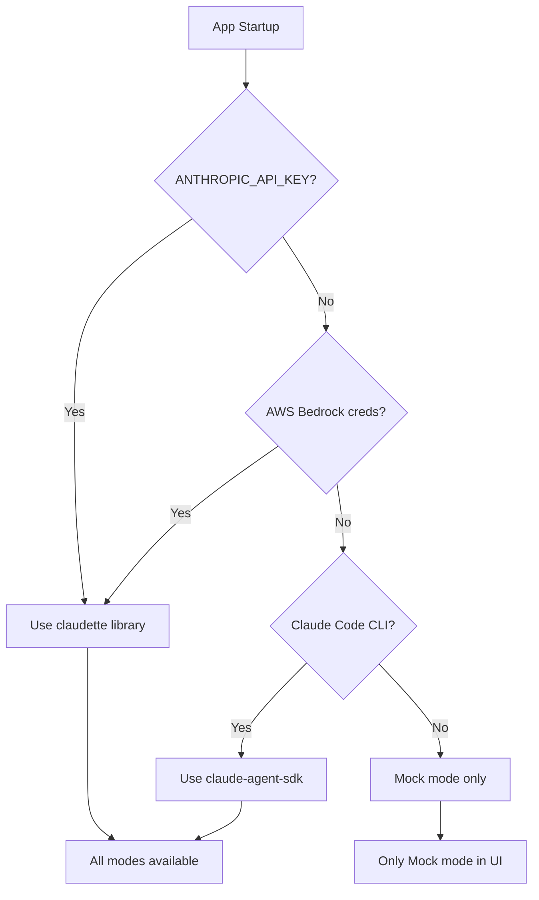
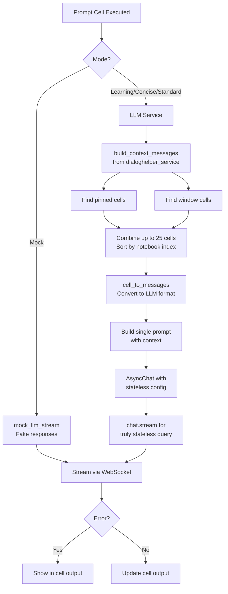
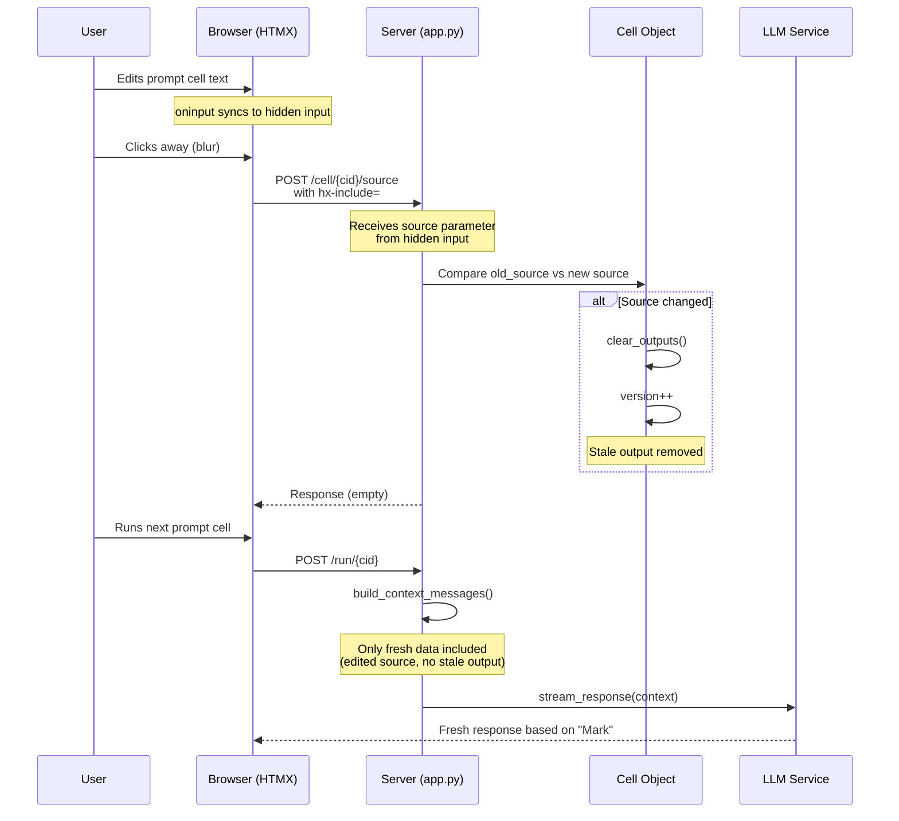
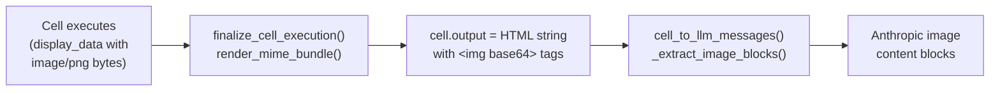
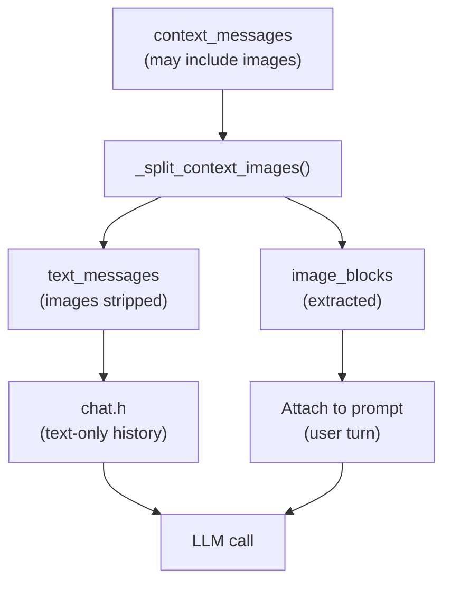
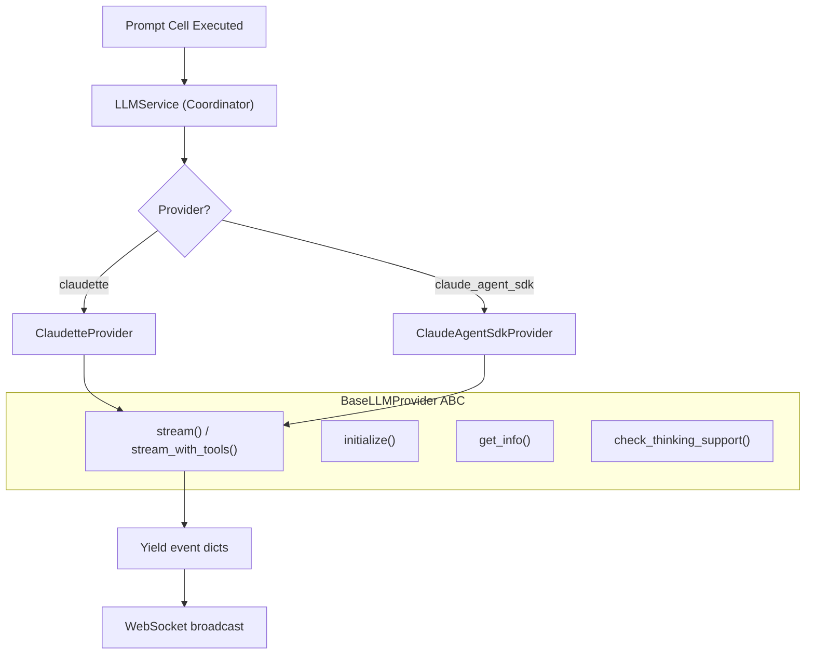
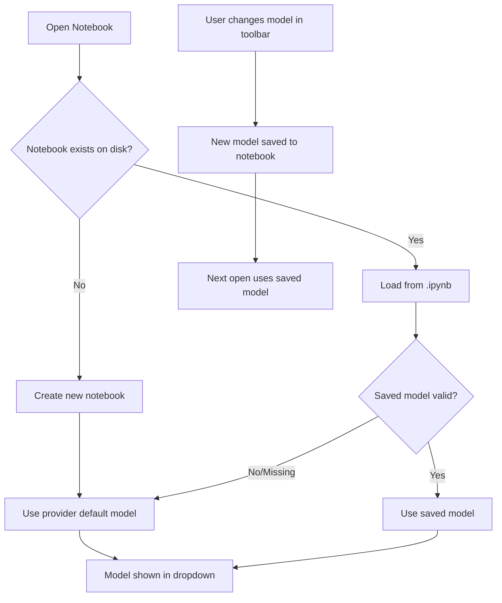
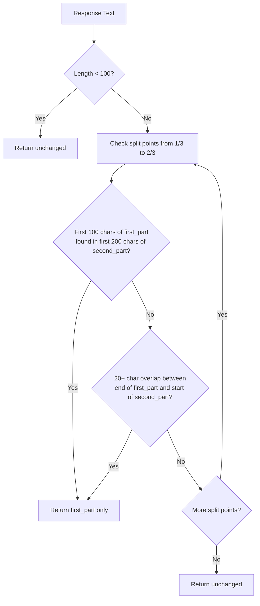
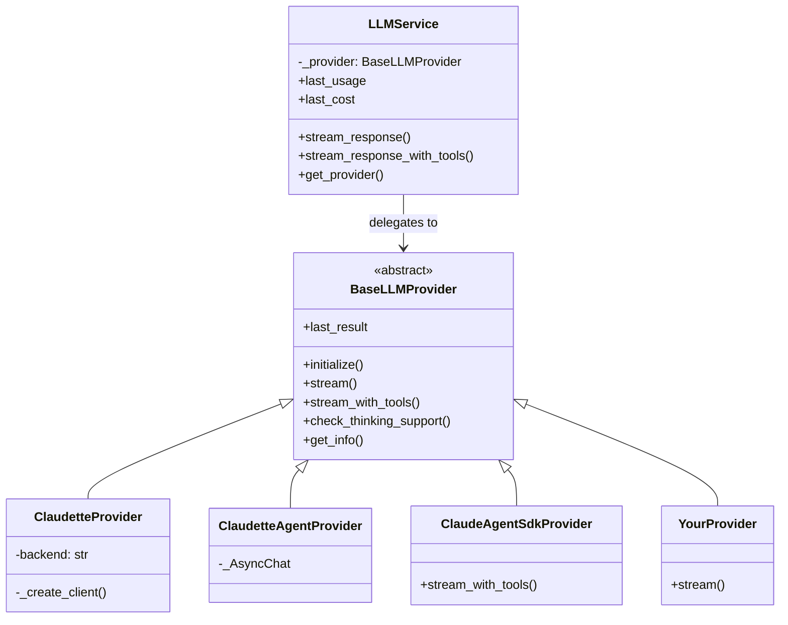

# LLM Integration

This document explains how Dialeng integrates with LLMs for real AI responses in prompt cells.

## Overview

Dialeng supports multiple AI modes for prompt cells, with **automatic credential detection** at startup to determine which providers are available:

| Mode | Description |
|------|-------------|
| **Mock** | Uses fake responses for testing (no API calls) |
| **Learning** | Guides user to discover answers themselves |
| **Concise** | Brief, code-focused responses |
| **Standard** | Balanced, helpful assistant |

## Credential Detection

At startup, Dialeng automatically detects available LLM credentials and configures the appropriate provider.

### Detection Order


```mermaid
flowchart TD
    A[App Startup] --> B{ANTHROPIC_API_KEY?}
    B -->|Yes| C[Use claudette library]
    B -->|No| D{AWS Bedrock creds?}
    D -->|Yes| C
    D -->|No| E{Claude Code CLI?}
    E -->|Yes| F[Use claude-agent-sdk]
    E -->|No| G[Mock mode only]

    C --> H[All modes available]
    F --> H
    G --> I[Only Mock mode in UI]
```

### Credential Sources

| Provider | Credentials | Library |
|----------|-------------|---------|
| **Anthropic API** | `ANTHROPIC_API_KEY` env var or `.env` | `claudette` |
| **AWS Bedrock** | AWS credentials (env, profile, IAM) | `claudette` |
| **Claude Code** | Claude CLI with active subscription | `claude-agent-sdk` |
| **None** | No credentials found | Mock only |

### Startup Logging

The credential status is logged at startup:

```
🚀 Dialeng starting at http://localhost:8000
   Notebooks saved to: ./notebooks/
   Format: Solveit-compatible .ipynb

   ✅ LLM Credentials available
      Provider: claudette
      Backend:  anthropic_api
      Source:   env:ANTHROPIC_API_KEY
      Details:  anthropic-sdk: Anthropic(api_key=...) instantiated
```

Or when no credentials are found:

```
   ⚠️  No LLM credentials found - Mock mode only
      Details: No ANTHROPIC_API_KEY, no AWS Bedrock creds, and no Claude Code CLI found.
```

### Dynamic UI

The mode selector only shows available options based on credentials:

- **With credentials**: Mock, Learning, Concise, Standard
- **Without credentials**: Mock only

### Credential Service

The credential detection logic is in `services/credential_service.py`:

```python
from dialeng.services.credential_service import detect_credentials, get_available_modes

# Detect at startup
CREDENTIAL_STATUS = detect_credentials()
AVAILABLE_DIALOG_MODES = get_available_modes(CREDENTIAL_STATUS)

# CredentialStatus fields:
# - available: bool - Whether any credentials were found
# - provider: str - "claudette" | "claude_agent_sdk" | "mock_only"
# - backend: str - "anthropic_api" | "bedrock" | "claude_code_subscription" | "none"
# - source: str - Where credentials were found
# - details: str - Human-readable details
```

## Architecture


```mermaid
flowchart TD
    A["Prompt Cell Executed"] --> B{Mode?}
    B -->|Mock| C["mock_llm_stream<br/>Fake responses"]
    B -->|Learning/Concise/Standard| D["LLM Service"]

    D --> E["build_context_messages<br/>from dialoghelper_service"]
    E --> F["Find pinned cells"]
    E --> G["Find window cells"]
    F --> H["Combine up to 25 cells<br/>Sort by notebook index"]
    G --> H
    H --> I["cell_to_messages<br/>Convert to LLM format"]
    I --> J["Build single prompt<br/>with context"]
    J --> K["AsyncChat with<br/>stateless config"]
    K --> L["chat.stream for<br/>truly stateless query"]

    C --> M["Stream via WebSocket"]
    L --> M

    M --> N{Error?}
    N -->|Yes| O["Show in cell output"]
    N -->|No| P["Update cell output"]
```

## Mode Selection

The mode selector is in the notebook header toolbar:

```
[ Mock ▼ ] [ Learning ] [ Concise ] [ Standard ]
```

The selected mode is stored in `notebook.dialog_mode` and persisted with the notebook.

## Model Selection

When a non-Mock mode is selected (Learning, Concise, or Standard), a model dropdown appears:

| Model | Description |
|-------|-------------|
| **Claude Sonnet 4.5** | Balanced performance and quality (default) |
| **Claude Haiku 4.5** | Faster, more cost-effective |

The selected model is stored in `notebook.model` and persisted in notebook metadata as `solveit_model`.

```python
# Available models in app.py
AVAILABLE_MODELS = [
    ("claude-sonnet-4-5", "Claude Sonnet 4.5"),
    ("claude-haiku-4-5", "Claude Haiku 4.5"),
]
DEFAULT_MODEL = "claude-sonnet-4-5"
```

The model dropdown visibility is controlled by JavaScript:
- **Hidden** when Mock mode is selected
- **Shown** when Learning, Concise, or Standard is selected

## Context Building

### The 25-Cell Window

LLM context is limited to 25 cells maximum to avoid token overflow:

1. **Pinned cells** are always included first (in order)
2. **Window cells** fill the remaining slots from the most recent non-pinned cells
3. **Skipped cells** are excluded from context

```python
MAX_CONTEXT_CELLS = 25

def build_context_messages(notebook, current_cell_id):
    # Get current cell index
    current_idx = get_msg_idx(notebook, current_cell_id)

    # Find pinned cells (always included)
    pinned = find_msgs(notebook, pinned_only=True, skipped=False, before_idx=current_idx)

    # Find non-pinned window cells
    window = find_msgs(notebook, pinned_only=False, skipped=False, before_idx=current_idx)
    window = [c for c in window if not c.pinned]  # Exclude pinned (already counted)

    # Calculate remaining slots
    remaining = MAX_CONTEXT_CELLS - len(pinned)
    window = window[-remaining:]  # Take most recent

    # Combine and convert
    all_cells = pinned + window
    return [cell_to_messages(c) for c in all_cells]
```

### Cell to Message Conversion

Cells are converted to LLM provider message format:

| Cell Type | Conversion |
|-----------|------------|
| **code** | User message with python code block + output |
| **note** | User message with markdown content |
| **prompt** | User message (source) + Assistant message (output) |

```python
def cell_to_messages(cell):
    if cell.cell_type == "code":
        content = f"```python\n{cell.source}\n```"
        if cell.output:
            content += f"\nOutput:\n```\n{cell.output}\n```"
        return [{"role": "user", "content": content}]

    elif cell.cell_type == "note":
        return [{"role": "user", "content": cell.source}]

    elif cell.cell_type == "prompt":
        msgs = [{"role": "user", "content": cell.source}]
        if cell.output:
            msgs.append({"role": "assistant", "content": cell.output})
        return msgs
```

### Context Freshness and Cell Editing

When a cell's source is edited, the outputs are automatically cleared to prevent stale context contamination. This ensures the LLM only sees the current state of the notebook.

#### The Complete Flow


```mermaid
sequenceDiagram
    participant U as User
    participant B as Browser (HTMX)
    participant S as Server (app.py)
    participant C as Cell Object
    participant L as LLM Service

    U->>B: Edits prompt cell text
    Note over B: oninput syncs to hidden input
    U->>B: Clicks away (blur)
    B->>S: POST /cell/{cid}/source<br/>with hx-include=#source-{cid}
    Note over S: Receives source parameter<br/>from hidden input
    S->>C: Compare old_source vs new source
    alt Source changed
        C->>C: clear_outputs()
        C->>C: version++
        Note over C: Stale output removed
    end
    S-->>B: Response (empty)

    U->>B: Runs next prompt cell
    B->>S: POST /run/{cid}
    S->>S: build_context_messages()
    Note over S: Only fresh data included<br/>(edited source, no stale output)
    S->>L: stream_response(context)
    L-->>B: Fresh response based on "Mark"
```

#### Why This Matters (John → Mark Scenario)

1. User types "Hello! My name is John" → Claude responds "Hello John!"
2. User **edits** cell to "Hello! My name is Mark"
3. **Without clearing**: Context includes both "Mark" (source) AND "Hello John!" (stale output)
4. **With clearing**: Context only includes "Mark" (source), output is empty

#### The HTMX Mechanism

Prompt cells use a two-textarea pattern:

```html
<!-- Hidden input with name="source" (sent to server) -->
<input type="hidden" id="source-{cell.id}" name="source" value="...">

<!-- Visible textarea with name="prompt_source" (for editing) -->
<textarea name="prompt_source" id="prompt-{cell.id}"
          hx-post="/dialeng/{nb_id}/cell/{cid}/source"
          hx-include="#source-{cell.id}"
          hx-trigger="blur changed"
          oninput="document.getElementById('source-{cell.id}').value = this.value">
```

Key elements:
1. **`oninput`**: Syncs textarea value to hidden input as user types
2. **`hx-include`**: Includes the hidden input when posting (ensures `source` parameter is sent)
3. **`hx-trigger="blur changed"`**: Posts only when textarea loses focus AND value changed

Without `hx-include`, HTMX would only send `prompt_source` (the textarea's name), but the endpoint expects `source`. The hidden input has `name="source"`, and `hx-include` ensures it's included in the POST.

#### Server-Side Output Clearing

The Cell class tracks modifications:

```python
@dataclass
class Cell:
    version: int = 0  # Incremented on each source change
    last_modified: Optional[datetime] = None

    def update_source(self, new_source: str) -> bool:
        if self.source != new_source:
            self.source = new_source
            self.version += 1
            self.last_modified = datetime.now()
            self.clear_outputs()  # CRITICAL: Prevents stale context
            return True
        return False
```

The `/cell/{cid}/source` endpoint enforces this:

```python
@rt("/dialeng/{nb_id}/cell/{cid}/source")
def post(nb_id: str, cid: str, source: str):
    for c in nb.cells:
        if c.id == cid:
            old_source = c.source
            c.source = source
            if old_source != source:
                c.clear_outputs()  # Clear stale output
                logger.info(f"Cell {cid}: Source changed, cleared outputs")
            break
```

#### Context Building with Fresh Data

When `build_context_messages()` runs, it converts each cell to messages:

```python
def cell_to_messages(cell):
    if cell.cell_type == "prompt":
        msgs = [{"role": "user", "content": cell.source}]
        if cell.output:  # Only if output exists
            msgs.append({"role": "assistant", "content": cell.output})
        return msgs
```

After editing and clearing:
- `cell.source` = "Hello! My name is Mark" (new)
- `cell.output` = "" (cleared)

So the context only contains:
```
User: Hello! My name is Mark
```

Not:
```
User: Hello! My name is Mark
Assistant: Hello John! Nice to meet you!  ← This stale data is gone
```

## Image Handling in LLM Context

Cell outputs (screenshots from `capture_tool()`, matplotlib plots, PIL images) produce `display_data` outputs with base64 image data. Getting these images to the LLM requires special handling due to several constraints.

### The Pipeline Problem

After `finalize_cell_execution()` in `app.py`, all structured cell outputs are flattened into a single HTML string via `render_mime_bundle()`. This replaces the structured `cell.outputs` list with a single `stream` CellOutput containing HTML — including full base64 `` tags. By the time `cell_to_llm_messages()` runs, the original `display_data` outputs are gone.


```mermaid
flowchart LR
    A["Cell executes<br/>(display_data with<br/>image/png bytes)"] --> B["finalize_cell_execution()<br/>render_mime_bundle()"]
    B --> C["cell.output = HTML string<br/>with &lt;img base64&gt; tags"]
    C --> D["cell_to_llm_messages()<br/>_extract_image_blocks()"]
    D --> E["Anthropic image<br/>content blocks"]
```

### Image Extraction (`core/dispatch.py`)

`_extract_image_blocks(cell)` extracts images from two sources (since finalization destroys structured outputs):

1. **Structured `display_data` outputs** — if still available before finalization (has `image/png` bytes in a dict)
2. **HTML `` tags** — parsed from `cell.output` string after finalization (``)

Images are resized and re-encoded to keep prompt size manageable:
- `_resize_base64_image()` — resizes to max 1024px on longest side, re-encodes as JPEG (quality 80)
- A full-res PNG screenshot (~2-5MB base64) becomes ~50-150KB JPEG

Text output is cleaned separately:
- `_get_text_output()` reads from `cell.outputs` (stream/execute_result types)
- `_strip_base64_images()` replaces `` tags with `[Image output]` to prevent bloating the text context

### Provider Image Handling

`claudette_provider.py` uses `_split_context_images()`:


```mermaid
flowchart TD
    A["context_messages<br/>(may include images)"] --> B["_split_context_images()"]
    B --> C["text_messages<br/>(images stripped)"]
    B --> D["image_blocks<br/>(extracted)"]
    C --> E["chat.h<br/>(text-only history)"]
    D --> F["Attach to prompt<br/>(user turn)"]
    E --> G["LLM call"]
    F --> G
```

**Why images must be in the prompt (last message), not in history:**
- **Anthropic API**: Images can only appear in user turns, never assistant turns. Context may include assistant messages from prior prompt cell outputs.
- **claudette**: `_append_pr` auto-resolves consecutive user messages by calling `self()`, which can reorder messages and place images in assistant turns.
- **claude-agent-sdk**: `query()` passes prompts as CLI arguments. Base64 images cause `[Errno 7] Argument list too long` (OS limit ~256KB on macOS). `_call_with_images()` avoids this by using `ClaudeSDKClient` with stdin transport.

### Current Limitations and Future Improvements

These are workarounds for current SDK limitations. When they improve:

| Limitation | Current Workaround | Future |
|---|---|---|
| `query()` passes prompt as CLI arg | Images in last message only, sent via stdin by `_call_with_images()` | When `query()` uses stdin transport, images can stay in context |
| `finalize_cell_execution` destroys structured outputs | Two-source extraction (structured + HTML parsing) | Preserve structured outputs alongside HTML |
| `display()` mid-cell not captured | Use last-expression pattern for images | Hook into IPython's `DisplayPublisher` registration |

### Key Files

| File | Image-related functions |
|---|---|
| `core/dispatch.py` | `_extract_image_blocks()`, `_resize_base64_image()`, `_get_text_output()`, `_strip_base64_images()` |
| `services/llm/providers/claudette_provider.py` | `_split_context_images()` |
| `services/llm/utils.py` | `_extract_text_from_content()`, `build_prompt_with_context()` |
| `app.py` | `finalize_cell_execution()`, `render_mime_bundle()` |

## LLM Service Architecture

The LLM service uses a **provider-based architecture** where each LLM backend is encapsulated in its own provider class. A slim coordinator (`LLMService`) routes requests to the appropriate provider.

### Package Structure

```
services/
  llm/
    __init__.py                    # Re-exports: LLMService, llm_service, SYSTEM_PROMPTS
    base_provider.py               # ABC + dataclasses (ProviderInfo, LLMResult)
    constants.py                   # SYSTEM_PROMPTS, _CONTEXT_PREAMBLE
    utils.py                       # Shared functions (build_prompt_with_context, execute_tool, etc.)
    llm_service.py                 # Coordinator (routing, prompt parsing, tool registry)
    providers/
      __init__.py                  # Re-exports all providers
      claudette_provider.py        # Claudette API/Bedrock provider
      claude_agent_sdk_provider.py # claude-agent-sdk direct provider
  llm_service.py                   # Compatibility shim → imports from dialeng.services.llm
```

### Architecture Diagram


```mermaid
flowchart TD
    A["Prompt Cell Executed"] --> B["LLMService (Coordinator)"]
    B --> C{Provider?}
    C -->|claudette| D["ClaudetteProvider"]
    C -->|claude_agent_sdk| F["ClaudeAgentSdkProvider"]

    D --> G["stream() / stream_with_tools()"]
    F --> G

    G --> H["Yield event dicts"]
    H --> I["WebSocket broadcast"]

    subgraph "BaseLLMProvider ABC"
        G
        J["initialize()"]
        K["get_info()"]
        L["check_thinking_support()"]
    end
```

### Coordinator (`LLMService`)

The coordinator owns:
- **Provider selection** based on credential detection
- **Mode → system prompt** mapping (learning, concise, standard)
- **Model name mapping** via `config.get_api_model_name()`
- **Prompt parsing** (`parse_prompt`, `substitute_variables`) and tool registry interaction
- **Error wrapping** around provider streaming
- **Usage/cost delegation** via `provider.last_result`

```python
from dialeng.services.llm import LLMService, llm_service, SYSTEM_PROMPTS

# Stream a response
async for item in llm_service.stream_response(prompt, context, "standard"):
    if item["type"] == "chunk":
        print(item["content"], end="")

# Stream with tool calling
async for item in llm_service.stream_response_with_tools(
    prompt, context, "standard", kernel=kernel, notebook_id=nb_id
):
    ...
```

### Base Provider (`BaseLLMProvider`)

All providers implement this abstract base class:

```python
class BaseLLMProvider(ABC):
    @abstractmethod
    async def initialize(self) -> None: ...

    @abstractmethod
    async def stream(self, prompt, context_messages, system_prompt,
                     model, use_thinking, config) -> AsyncIterator[Dict]: ...

    async def stream_with_tools(self, prompt, context_messages, system_prompt,
                                model, use_thinking, config, tools, kernel,
                                notebook_id, registry, max_steps) -> AsyncIterator[Dict]:
        raise NotImplementedError(...)

    @abstractmethod
    def check_thinking_support(self, model: str) -> bool: ...

    @abstractmethod
    def get_info(self) -> ProviderInfo: ...
```

### Event Dict Protocol

All providers yield dicts with a `type` key:

| Event Type | Fields | Description |
|-----------|--------|-------------|
| `chunk` | `content` | Text response fragment |
| `thinking_start` | — | Extended thinking begins |
| `thinking` | `content` | Thinking content |
| `thinking_end` | — | Extended thinking complete |
| `error` | `content` | Error occurred |
| `tool_call` | `id`, `name`, `input` | Tool invoked |
| `tool_result` | `id`, `name`, `result` | Tool result |
| `var_substituted` | `name`, `value` | Variable substituted (coordinator-level) |
| `tool_available` | `name`, `description` | Tool registered (coordinator-level) |

### Provider-Specific Implementation

The three providers have different streaming mechanics:

#### claudette (Anthropic API / AWS Bedrock)

[claudette](https://claudette.answer.ai/) uses a callable Chat object with `stream=True`:

```python
from claudette import Chat, Client

# For direct Anthropic API (uses ANTHROPIC_API_KEY env var)
client = Client("claude-sonnet-4-5-20250514")
chat = Chat(cli=client, sp="You are helpful")

# For AWS Bedrock
from anthropic import AnthropicBedrock
ab = AnthropicBedrock()  # Auto-detects AWS credentials
client = Client("claude-sonnet-4-5-20250514", ab)
chat = Chat(cli=client, sp="You are helpful")

# Add context to history
for msg in context_messages:
    chat.h.append(msg)

# Stream response - NOTE: chat is callable, NOT chat.stream()
for chunk in chat(prompt, stream=True):
    print(chunk, end='')
```

Key differences:
- **Direct API** model names include date suffix: `"claude-sonnet-4-5-20250514"`
- **Bedrock** model names use full identifier: `"us.anthropic.claude-sonnet-4-5-20250514-v1:0"`
- Streaming via: `chat(prompt, stream=True)` (NOT `chat.stream()`)
- For Bedrock: Create `AnthropicBedrock` client and pass to `Client`
- Synchronous by default (async available via `await chat(prompt, stream=True)`)

Model name mappings are defined in `dialeng_config.json` (see [Configuration](#configuration) below).

#### claudette-agent (Claude Code Subscription)

[claudette-agent](https://github.com/sgaseretto/claudette-agent) wraps the Claude Agent SDK with a Claudette-compatible API. It now supports **character-level streaming** via `StreamEvent` and **native tool calling** via MCP servers:

```python
from claudette_agent import Chat, contents, tool

# Create chat - stateless by default (setting_sources=[])
# Uses Chat (not AsyncChat) because Chat.stream() correctly handles
# prompt appending, while AsyncChat's async _append_pr is not awaited.
chat = Chat(
    model="claude-sonnet-4-5-20250929",
    sp="You are helpful",
    setting_sources=[],  # Default - stateless
)

# Add context to history
for msg in context_messages:
    chat.h.append(msg)

# Stream response - yields text strings (character-level via StreamEvent)
async for text_chunk in chat.stream(prompt):
    print(text_chunk, end='', flush=True)

# Extended thinking (incompatible with streaming per SDK docs)
response = await chat(prompt, maxthinktok=10000)
print(contents(response))

# Native tool calling
@tool
def calculate(expression: str) -> str:
    """Evaluate a math expression."""
    return str(eval(expression))

chat_with_tools = Chat(model="claude-sonnet-4-5-20250929", tools=[calculate])
response = await chat_with_tools("What is 15 * 23?")
print(contents(response))

# Access usage and cost after any call
print(f"Tokens used: {chat.use}")
print(f"Cost: ${chat.cost:.6f}")
```

Key features:
- **Stateless by default** - `setting_sources=[]` prevents loading settings files; `_build_options()` sets `continue_conversation=False` and `resume=None`
- **Character-level streaming** - `chat.stream(prompt)` yields text strings via `StreamEvent` with `include_partial_messages=True`
- **Streaming + thinking are incompatible** - Use `chat(prompt, maxthinktok=N)` (non-streaming) for thinking; use `chat.stream(prompt)` for streaming
- **Native tool calling** - `Chat(tools=[...])` auto-creates MCP servers; `chat.toolloop()` for automatic tool follow-up
- **Notebook as source of truth** - Edits to cells are immediately reflected in subsequent queries
- Usage tracking: `chat.use` and `chat.cost` properties
- Model capability checks: `can_use_extended_thinking(model)`, `can_stream()`
- New SDK features: `effort`, `max_budget_usd`, `fallback_model`, `can_use_tool`

#### claude-agent-sdk Direct Mode (Maximum Isolation)

For maximum session isolation, Dialeng uses `claude-agent-sdk.query()` directly instead of the claudette-agent wrapper. This is enabled by default. To use the claudette-agent wrapper instead, set `use_sdk_directly: false` in `dialeng_config.json` or via the Settings UI.

```python
from claude_agent_sdk import query, ClaudeAgentOptions
import tempfile
import shutil

# Create unique temp directory for complete isolation
temp_cwd = tempfile.mkdtemp(prefix="dialeng_sdk_")

try:
    options = ClaudeAgentOptions(
        # Core stateless settings
        continue_conversation=False,  # Don't continue any conversation
        resume=None,  # Don't resume any session
        # Session isolation
        setting_sources=[],  # Don't load any settings files
        cwd=temp_cwd,  # Use unique temp cwd per query
        # Model and system prompt
        model="claude-sonnet-4-5",
        system_prompt="You are a helpful assistant.",
    )

    # Use query() directly - fully stateless
    async for message in query(prompt=full_prompt, options=options):
        if isinstance(message, AssistantMessage):
            for block in message.content:
                if hasattr(block, 'text'):
                    print(block.text, end='')
finally:
    # Clean up temp directory
    shutil.rmtree(temp_cwd, ignore_errors=True)
```

Key advantages over claudette-agent wrapper:
- **Complete subprocess isolation** - Each query creates a fresh Claude Code subprocess
- **No wrapper-level state** - Bypasses any potential caching in the wrapper library
- **Explicit option control** - All `ClaudeAgentOptions` are set directly
- **Guaranteed cleanup** - Temp directory removed after each query

Configuration in `dialeng_config.json`:

```json
{
  "llm": {
    "use_sdk_directly": true,
    "debug_mode": false,
    "debug_log_dir": "./debug_logs"
  }
}
```

| Option | Description |
|--------|-------------|
| `use_sdk_directly` | `true` (default) = use SDK directly, `false` = use claudette-agent wrapper |
| `debug_mode` | When `true`, saves prompts and responses to JSON files |
| `debug_log_dir` | Directory for debug logs (default: `./debug_logs`) |

### System Prompts

Each mode has a custom system prompt:

```python
SYSTEM_PROMPTS = {
    "learning": """You are a coding tutor. Guide the user to discover answers themselves.
Ask leading questions, provide hints, and explain concepts step-by-step.
Don't give direct solutions - help them learn by doing.""",

    "concise": """Be brief and code-focused. Provide minimal explanation.
Answer with code examples when possible. Skip pleasantries.""",

    "standard": """You are a helpful coding assistant. Provide clear, accurate answers
with appropriate code examples and explanations.""",
}
```

## Extended Thinking

Extended thinking allows Claude to reason through complex problems before responding. This is supported on thinking-capable models (Claude Sonnet 3.7+, Sonnet 4+, Opus 4+).

### How It Works

1. **Model capability check** - Before enabling thinking, `can_use_extended_thinking(model)` is called
2. **Token budget** - When enabled, `chat.stream(prompt, maxthinktok=N)` is used
3. **Block types** - Stream yields thinking blocks (type='thinking') and text blocks separately
4. **Graceful fallback** - If model doesn't support thinking, it's automatically disabled with a warning

### Configuration

Set the maximum thinking tokens in `dialeng_config.json`:

```json
{
  "thinking": {
    "max_tokens": 10000,
    "comment": "Maximum tokens for extended thinking (0 to disable)"
  }
}
```

### WebSocket Message Types for Thinking

```javascript
// Extended thinking phase
{"type": "thinking_start", "cell_id": "abc123"}
{"type": "stream_chunk", "cell_id": "abc123", "chunk": "...", "thinking": true}
{"type": "thinking_end", "cell_id": "abc123"}
```

## Usage and Cost Tracking

claudette-agent tracks token usage and estimated costs. After each streaming response, the service captures these values.

### Accessing Usage Data

```python
from dialeng.services.llm import llm_service

# After streaming completes
usage = llm_service.last_usage  # Usage object with token counts
cost = llm_service.last_cost    # Estimated cost in USD
```

### Usage Object Fields

- `input_tokens` - Tokens in the prompt
- `output_tokens` - Tokens in the response
- `cache_creation_input_tokens` - Tokens for cache creation
- `cache_read_input_tokens` - Tokens read from cache

### Logging

Usage and cost are logged automatically after each streaming response:

```
INFO:services.llm_service:claudette-agent: Usage=Usage(input_tokens=1234, output_tokens=567), Cost=$0.012345
```

## Streaming Response Flow

1. **Prompt cell executed** → Check `dialog_mode`
2. **If mock** → Use `mock_llm_stream()` for fake responses
3. **If real mode** → Build context with `build_context_messages()`
4. **Stream response** via `llm_service.stream_response()`
5. **WebSocket broadcast** → Chunks sent to all connected clients
6. **Error handling** → Errors shown in cell output

### WebSocket Message Types

```javascript
// Thinking mode
{"type": "thinking_start", "cell_id": "abc123"}
{"type": "stream_chunk", "cell_id": "abc123", "chunk": "...", "thinking": true}
{"type": "thinking_end", "cell_id": "abc123"}

// Regular response
{"type": "stream_chunk", "cell_id": "abc123", "chunk": "..."}
{"type": "stream_end", "cell_id": "abc123"}
```

## Error Handling

LLM errors are displayed in the cell output:

```markdown
**Error:** LLM Error: claudette-agent is not installed...
```

Common error scenarios:
- claudette-agent not installed
- API authentication failure
- Network timeout
- Rate limiting

## Installation

### Option 1: Anthropic API (Recommended)

```bash
pip install claudette
```

Then set your API key:
```bash
export ANTHROPIC_API_KEY=sk-ant-...
# Or add to .env file
```

### Option 2: AWS Bedrock

```bash
pip install claudette
```

Configure AWS credentials via environment, profile, or IAM role.

### Option 3: Claude Code Subscription

```bash
pip install git+https://github.com/sgaseretto/claudette-agent.git
```

Requires:
- Claude Code subscription
- Claude CLI installed and authenticated (`claude --version`)

## Configuration

Dialeng uses a `dialeng_config.json` file for customizable LLM settings. On first startup, this file is created automatically with sensible defaults.

### Config File Location

The config file is created in the project root directory:

```
./dialeng_config.json
```

### Default Configuration

```json
{
  "aws": {
    "region": "us-east-1",
    "comment": "AWS region for Bedrock. Common options: us-east-1, us-west-2, eu-west-1"
  },
  "models": {
    "available": [
      {"id": "claude-haiku-4-5", "name": "Claude Haiku 4.5"},
      {"id": "claude-sonnet-4-5", "name": "Claude Sonnet 4.5"},
      {"id": "claude-3-5-sonnet", "name": "Claude 3.5 Sonnet"},
      {"id": "claude-3-5-haiku", "name": "Claude 3.5 Haiku"}
    ],
    "defaults": {
      "bedrock": "claude-haiku-4-5",
      "anthropic_api": "claude-sonnet-4-5",
      "claude_code_subscription": "claude-sonnet-4-5",
      "fallback": "claude-sonnet-4-5",
      "comment": "Default model per provider"
    },
    "anthropic_api_map": {
      "claude-sonnet-4-5": "claude-sonnet-4-5-20250514",
      "claude-haiku-4-5": "claude-haiku-4-5-20251001",
      "claude-3-5-sonnet": "claude-3-5-sonnet-20241022",
      "claude-3-5-haiku": "claude-3-5-haiku-20241022",
      "comment": "Model IDs for direct Anthropic API (with date suffix)"
    },
    "bedrock_map": {
      "claude-sonnet-4-5": "us.anthropic.claude-sonnet-4-5-20250514-v1:0",
      "claude-haiku-4-5": "us.anthropic.claude-haiku-4-5-20251001-v1:0",
      "claude-3-5-sonnet": "us.anthropic.claude-3-5-sonnet-20241022-v2:0",
      "claude-3-5-haiku": "us.anthropic.claude-3-5-haiku-20241022-v1:0",
      "comment": "Model IDs for AWS Bedrock (with region prefix and version suffix)"
    },
    "claudette_agent_map": {
      "claude-sonnet-4-5": "sonnet",
      "claude-haiku-4-5": "haiku",
      "claude-3-5-sonnet": "sonnet",
      "claude-3-5-haiku": "haiku",
      "comment": "Model IDs for Claude Code subscription - uses simple names (sonnet, haiku, opus)"
    }
  },
  "modes": {
    "default": "mock",
    "comment": "Default dialog mode when opening a notebook. Options: mock, learning, concise, standard"
  },
  "thinking": {
    "max_tokens": 10000,
    "comment": "Maximum tokens for extended thinking. Set to 0 to disable."
  }
}
```

### Configuration Options

| Section | Key | Description |
|---------|-----|-------------|
| `aws.region` | AWS region | Region for Bedrock API calls (e.g., `us-east-1`, `eu-west-1`) |
| `models.available` | Model list | Models shown in the UI picker. Each has `id` and `name` |
| `models.defaults` | Provider defaults | Default model per provider: `bedrock`, `anthropic_api`, `claude_code_subscription`, `fallback` |
| `models.anthropic_api_map` | API model IDs | Maps UI model IDs to Anthropic API model names (with date suffix) |
| `models.bedrock_map` | Bedrock model IDs | Maps UI model IDs to AWS Bedrock model ARNs (with version suffix) |
| `models.claudette_agent_map` | Claude Code model IDs | Maps UI model IDs to claudette-agent model names (simple names) |
| `modes.default` | Default mode | Initial dialog mode for new notebooks (`mock`, `learning`, `concise`, `standard`) |
| `thinking.max_tokens` | Thinking token budget | Maximum tokens for extended thinking (0 to disable). Only applies to thinking-capable models. |

### Model Selection Behavior

Dialeng uses a **per-notebook model selection** system with intelligent defaults:


```mermaid
flowchart TD
    A[Open Notebook] --> B{Notebook exists on disk?}
    B -->|No| C[Create new notebook]
    C --> D[Use provider default model]
    B -->|Yes| E[Load from .ipynb]
    E --> F{Saved model valid?}
    F -->|Yes| G[Use saved model]
    F -->|No/Missing| D

    H[User changes model in toolbar] --> I[New model saved to notebook]
    I --> J[Next open uses saved model]

    D --> K[Model shown in dropdown]
    G --> K
```

#### How It Works

1. **New notebooks**: Use the default model based on detected provider
   - **Bedrock detected** → Uses `models.defaults.bedrock` (e.g., Claude Haiku 4.5)
   - **Claude Code detected** → Uses `models.defaults.claude_code_subscription` (e.g., Claude Sonnet 4.5)
   - **No credentials** → Mock mode only (model dropdown hidden)

2. **Existing notebooks**: Remember per-notebook model selection
   - Model saved in notebook metadata as `solveit_model`
   - On load, validates saved model exists in available models
   - If valid, uses saved model (user preference remembered)
   - If invalid/missing, falls back to provider default

3. **User changes model**: Selection is remembered
   - Change model in toolbar dropdown
   - Save notebook (Ctrl+S)
   - Model stored in `.ipynb` metadata
   - Next time notebook is opened, saved model is used

#### Benefits

- **Different models per notebook**: Use Haiku for quick tests, Sonnet for complex tasks
- **Config changes are safe**: If config changes (model removed), notebooks gracefully fall back to defaults
- **Provider-aware defaults**: First-time opens use the best default for current provider

#### Implementation Details

The model is persisted in notebook metadata:

```json
{
  "metadata": {
    "solveit_model": "claude-sonnet-4-5",
    "solveit_dialog_mode": "standard"
  }
}
```

Validation in `app.py`:

```python
def validate_model_id(model_id: str) -> str:
    """Validate model ID - return default if invalid."""
    if model_id in AVAILABLE_MODEL_IDS:
        return model_id
    return DEFAULT_MODEL  # Provider-specific default
```

### Customization Examples

#### Adding a New Model

To add a new model (e.g., Claude Opus):

```json
{
  "models": {
    "available": [
      {"id": "claude-haiku-4-5", "name": "Claude Haiku 4.5"},
      {"id": "claude-sonnet-4-5", "name": "Claude Sonnet 4.5"},
      {"id": "claude-opus-4", "name": "Claude Opus 4"}
    ],
    "defaults": {
      "bedrock": "claude-haiku-4-5",
      "anthropic_api": "claude-sonnet-4-5",
      "claude_code_subscription": "claude-opus-4",
      "fallback": "claude-sonnet-4-5"
    },
    "anthropic_api_map": {
      "claude-sonnet-4-5": "claude-sonnet-4-5-20250514",
      "claude-haiku-4-5": "claude-haiku-4-5-20251001",
      "claude-opus-4": "claude-opus-4-20250514"
    },
    "bedrock_map": {
      "claude-sonnet-4-5": "us.anthropic.claude-sonnet-4-5-20250514-v1:0",
      "claude-haiku-4-5": "us.anthropic.claude-haiku-4-5-20251001-v1:0",
      "claude-opus-4": "us.anthropic.claude-opus-4-20250514-v1:0"
    },
    "claudette_agent_map": {
      "claude-sonnet-4-5": "sonnet",
      "claude-haiku-4-5": "haiku",
      "claude-opus-4": "opus"
    }
  }
}
```

#### Changing Default Models per Provider

Default models are now configured per provider in the `models.defaults` section. This allows you to use a cheaper model for Bedrock (pay-per-use) while using a more capable model for Claude Code subscription:

```json
{
  "models": {
    "defaults": {
      "bedrock": "claude-haiku-4-5",
      "anthropic_api": "claude-sonnet-4-5",
      "claude_code_subscription": "claude-sonnet-4-5",
      "fallback": "claude-sonnet-4-5"
    }
  }
}
```

| Provider | Key | Use Case |
|----------|-----|----------|
| `bedrock` | AWS Bedrock | Often use cheaper models (Haiku) since it's pay-per-use |
| `anthropic_api` | Direct Anthropic API | Pay-per-use, configurable per preference |
| `claude_code_subscription` | Claude Code CLI | Flat-rate subscription, can use more capable models |
| `fallback` | Unknown provider | Used when provider can't be determined |

#### Setting Default Mode to Standard

```json
{
  "modes": {
    "default": "standard"
  }
}
```

### Startup Logging

The config status is logged at startup:

```
🚀 Dialeng starting at http://localhost:8000
   Notebooks saved to: ./notebooks/
   Format: Solveit-compatible .ipynb

   ✅ LLM Credentials available
      Provider: claudette
      Backend:  bedrock
      Source:   aws:env (standard)

   Config: dialeng_config.json
      AWS Region:     us-east-1
      Models:         Claude Sonnet 3.7, Claude Sonnet 4.5, Claude Haiku 4.5
      Default Model:  claude-sonnet-3-7
      Default Mode:   mock
```

### Config Service

The configuration is managed by `services/dialeng_config.py`:

```python
from dialeng.services.dialeng_config import load_config, get_config

# Load config (creates default if missing)
config = load_config()

# Get model choices for UI
model_choices = config.get_model_choices()  # [(id, name), ...]

# Get API model name based on backend
api_model = config.get_api_model_name("claude-sonnet-4-5", "bedrock")
# Returns: "us.anthropic.claude-sonnet-4-5-20250514-v1:0"
```

### Credential Sources

LLM credentials are automatically detected at startup via:

1. **Environment variables**: `ANTHROPIC_API_KEY`, `AWS_ACCESS_KEY_ID`, etc.
2. **`.env` file**: In project root
3. **AWS profiles**: Standard AWS credential chain
4. **Claude CLI**: For Claude Code subscription users

## Response Post-Processing

After the LLM finishes streaming, the response text undergoes post-processing before being displayed. This section documents the processing steps and known issues.

### Response Deduplication

The `_deduplicate_response_text()` function in `app.py` attempts to detect and remove duplicated content in LLM responses. This addresses a known issue where LLMs sometimes produce duplicated output, especially during multi-step tool calling.

```python
response_text = _deduplicate_response_text(response_text)
```

#### How It Works

The function looks for patterns where the second half of a response is largely a repeat of the first half:

1. **Exact duplication**: "ResponseABC...ResponseABC" - the same text repeated
2. **Partial duplication**: "ResponseABC...fragmentABC" - a fragment of the beginning repeated later


```mermaid
flowchart TD
    A[Response Text] --> B{Length < 100?}
    B -->|Yes| C[Return unchanged]
    B -->|No| D[Check split points from 1/3 to 2/3]
    D --> E{First 100 chars of first_part<br/>found in first 200 chars of second_part?}
    E -->|Yes| F[Return first_part only]
    E -->|No| G{20+ char overlap between<br/>end of first_part and start of second_part?}
    G -->|Yes| F
    G -->|No| H{More split points?}
    H -->|Yes| D
    H -->|No| I[Return unchanged]
```

#### Bug Fix History (2026-01-25): False Positive Truncation

**Issue:** Legitimate responses were being truncated. For example:

```
Input:  "Based on the calculations:\n\n**Statistics for [10, 20, 30, 40]:**\n- Mean: 25..."
Output: "Based on the calculations:\n\n**Statistics for [10,"  (truncated!)
```

**Root Cause:** The partial overlap detection was checking if ANY suffix of `first_end` appeared in `second_sample`, including single characters:

```python
# OLD CODE (buggy):
for i in range(min(50, len(first_end))):
    if first_end[i:] in second_sample:  # At i=49, first_end[49:] = ","
        return text[:split_point].strip()  # FALSE POSITIVE!
```

When `i` reached high values (e.g., 49), `first_end[49:]` would be just a single character like `","`. Common punctuation trivially appears in most text, triggering false "duplication" detection.

**Fix:** Added a minimum overlap length requirement (20 characters):

```python
# NEW CODE (fixed):
min_overlap_len = 20
for i in range(min(50, len(first_end) - min_overlap_len)):
    overlap = first_end[i:]
    if len(overlap) >= min_overlap_len and overlap in second_sample:
        return text[:split_point].strip()
```

#### Potential Future Improvements

The current deduplication approach is heuristic-based and has limitations:

1. **Smarter detection with sequence alignment**
   ```python
   from difflib import SequenceMatcher

   def detect_duplication_v2(text):
       ratio = SequenceMatcher(None, first_half, second_half).ratio()
       return ratio > 0.8  # 80% similarity = likely duplication
   ```

2. **Configurable threshold** - Make `min_overlap_len` configurable via `dialeng_config.json`

3. **Confidence scoring** - Return both cleaned text and a confidence score

4. **LLM-specific patterns** - Track known duplication patterns from tool calling loops

5. **Unit tests** - Add comprehensive tests for edge cases to prevent regressions

### Tool Steps Formatting

When tool calling is used, the response includes an "LLM Steps" collapsible section showing:

- Variable substitutions (`$\`var\``)
- Tool calls with inputs and outputs
- Reasoning steps between tool calls

This is handled by `_format_tool_steps_markdown()` in `app.py`. See [Tool Calling](./10_tool_calling.md) for details.

## How to Add a New LLM Provider

Follow these steps to add support for a new LLM library, SDK, or API:

### Step 1: Create the Provider File

Create `services/llm/providers/your_provider.py`:

```python
"""Your provider - brief description."""
from typing import AsyncIterator, Dict, List, Any
import logging

from ..base_provider import BaseLLMProvider, ProviderInfo
from .. import utils

logger = logging.getLogger(__name__)


class YourProvider(BaseLLMProvider):
    """LLM provider using your-library."""

    async def initialize(self) -> None:
        """Import and validate your library is available."""
        try:
            import your_library
            self._client_class = your_library.Client
            logger.info("YourProvider initialized")
        except ImportError as e:
            raise ImportError("your-library is not installed.") from e

    def get_info(self) -> ProviderInfo:
        return ProviderInfo(
            provider_name="your_provider",
            display_name="Your Provider",
            supports_native_tools=False,  # Set True if it has native tool calling
            supports_mcp_tools=False,     # Set True if it supports MCP tools
        )

    def check_thinking_support(self, model: str) -> bool:
        """Return True if the model supports extended thinking."""
        return False  # Adjust based on your library

    async def stream(
        self, prompt, context_messages, system_prompt,
        model, use_thinking, config,
    ) -> AsyncIterator[Dict]:
        """Stream a response. Yield event dicts."""
        # Build your prompt (use utils.build_prompt_with_context if needed)
        full_prompt = utils.build_prompt_with_context(prompt, context_messages)

        try:
            # Your streaming logic here
            async for token in your_streaming_call(full_prompt, model):
                yield {"type": "chunk", "content": token}
        except Exception as e:
            logger.exception(f"Streaming error: {e}")
            yield {"type": "error", "content": f"Streaming error: {str(e)}"}

    # Optionally override stream_with_tools() if your library supports tool calling
```

### Step 2: Register the Provider

Add the import to `services/llm/providers/__init__.py`:

```python
from .your_provider import YourProvider

__all__ = [..., 'YourProvider']
```

### Step 3: Add Provider Selection Logic

In `services/llm/llm_service.py`, update `_ensure_initialized()` to create your provider when the right credentials are detected:

```python
elif self._provider_name == "your_provider":
    from .providers import YourProvider
    self._provider = YourProvider()
    await self._provider.initialize()
    self._initialized = True
```

### Step 4: Add Credential Detection (if needed)

If your provider uses different credentials, update `services/credential_service.py`:

```python
# In detect_credentials():
# Check for your provider's credentials
if os.environ.get("YOUR_API_KEY"):
    return CredentialStatus(
        available=True,
        provider="your_provider",
        backend="your_backend",
        source="env:YOUR_API_KEY",
        details="Your provider configured"
    )
```

### Step 5: Add Model Mappings (if needed)

If your provider uses different model names, add a mapping in `dialeng_config.json`:

```json
{
  "models": {
    "your_provider_map": {
      "claude-sonnet-4-5": "your-model-id",
      "comment": "Model IDs for your provider"
    }
  }
}
```

And update `services/dialeng_config.py` to use the new mapping.

### Provider Architecture Summary


```mermaid
classDiagram
    class BaseLLMProvider {
        <<abstract>>
        +initialize()
        +stream()
        +stream_with_tools()
        +check_thinking_support()
        +get_info()
        +last_result
    }

    class ClaudetteProvider {
        -backend: str
        -_create_client()
    }

    class ClaudetteAgentProvider {
        -_AsyncChat
    }

    class ClaudeAgentSdkProvider {
        +stream_with_tools()
    }

    class YourProvider {
        +stream()
    }

    BaseLLMProvider <|-- ClaudetteProvider
    BaseLLMProvider <|-- ClaudetteAgentProvider
    BaseLLMProvider <|-- ClaudeAgentSdkProvider
    BaseLLMProvider <|-- YourProvider

    class LLMService {
        -_provider: BaseLLMProvider
        +stream_response()
        +stream_response_with_tools()
        +get_provider()
        +last_usage
        +last_cost
    }

    LLMService --> BaseLLMProvider : delegates to
```

## See Also

- [DialogHelper Integration](./05_dialoghelper_integration.md) - How context building reuses dialoghelper functions
- [Cell Types](./02_cell_types.md) - Details on prompt cells
- [Real-Time Collaboration](./03_real_time_collaboration.md) - WebSocket streaming details
- [Tool Calling](./10_tool_calling.md) - Tool calling implementation details
