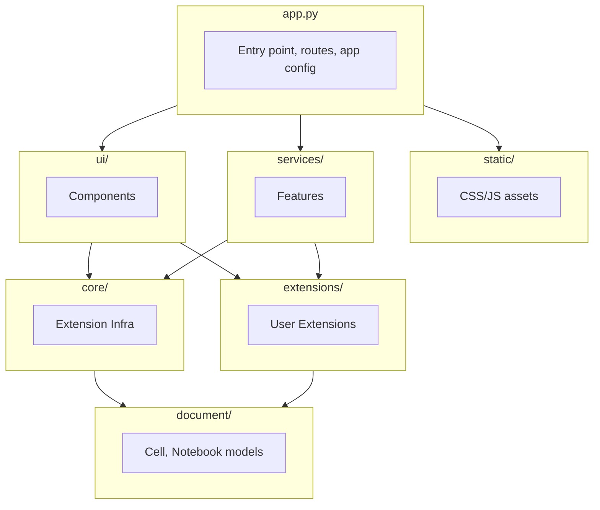
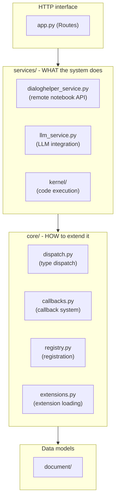

# Code Organization

This document explains the modular architecture of the Dialeng codebase, including where to find things, how components are organized, and how to extend or modify the system.

## Overview

Dialeng follows a **layered architecture** with clear separation of concerns:



## Directory Structure

```
dialeng/
├── app.py                    # Main application (~1,500 lines)
├── state.py                  # Global state documentation
├── static/                   # Frontend assets
│   ├── css/
│   │   ├── themes.css        # Theme color variables (dark/light)
│   │   ├── base.css          # Reset, typography, layout
│   │   ├── components.css    # Cells, buttons, badges, markdown
│   │   └── editor.css        # Monaco editor styles
│   └── js/
│       └── app.js            # All client-side logic (~1,700 lines)
├── ui/                       # FastHTML UI components
│   ├── __init__.py           # Public exports
│   ├── base.py               # Shared utilities
│   ├── controls.py           # TypeSelect, CollapseBtn, AddButtons
│   ├── layout.py             # NotebookPage, AllCells
│   ├── oob.py                # OOB wrappers for WebSocket
│   └── cells/
│       ├── __init__.py
│       ├── base.py           # CellView dispatcher, CellHeader
│       ├── code_cell.py      # CodeCellView (Monaco editor + output)
│       ├── note_cell.py      # NoteCellView
│       └── prompt_cell.py    # PromptCellView
├── core/                     # Extension infrastructure (NEW)
│   ├── __init__.py           # Public exports
│   ├── dispatch.py           # Type dispatch (render_cell, cell_to_llm_messages)
│   ├── callbacks.py          # 2-way callback system (ExecutionContext, Callback)
│   ├── registry.py           # Extension registry (register_callback, etc.)
│   └── extensions.py         # Extension loading from extensions/
├── extensions/               # User extensions (NEW)
│   ├── __init__.py
│   └── example_callbacks.py  # Example: ExecutionTimingCallback
├── services/                 # Feature implementations
│   ├── kernel/               # Python code execution
│   │   ├── kernel_service.py
│   │   ├── execution_queue.py
│   │   └── subprocess_kernel.py
│   ├── llm_service.py        # LLM provider abstraction
│   ├── dialoghelper_service.py  # Remote notebook API
│   ├── credential_service.py
│   └── dialeng_config.py
├── document/                 # Data models
│   ├── cell.py               # Cell, CellOutput, CellState
│   ├── notebook.py           # Notebook model
│   └── serialization.py      # .ipynb serialization
└── docs/how_it_works/        # Documentation
```

---

## 1. Static Assets (`static/`)

### CSS Files

CSS is split into logical files that are loaded in order:

| File | Purpose | When to Modify |
|------|---------|----------------|
| `themes.css` | CSS custom properties for theming | Adding themes, changing colors |
| `base.css` | Reset, body styles, typography, responsive rules | Fonts, base layout |
| `components.css` | Cells, buttons, badges, markdown preview | New UI components |
| `editor.css` | Monaco editor container, focus states | Editor appearance |

**Theme System:**

```css
/* themes.css - Define colors once */
:root {
    --bg-primary: #0d1117;
    --text-primary: #c9d1d9;
    --accent-blue: #58a6ff;
    /* ... */
}

[data-theme="light"] {
    --bg-primary: #ffffff;
    --text-primary: #24292f;
    /* ... */
}

/* Use variables in other files */
.cell {
    background: var(--bg-secondary);
    border: 1px solid var(--border);
}
```

### JavaScript (`static/js/app.js`)

Single file with clear section headers:

```javascript
// ==================== Global State ====================
const monacoEditors = {};
let focusedCellId = null;

// ==================== Monaco Editor Management ====================
function initMonacoEditor(cellId, mode) { ... }
function syncMonacoToTextarea(cellId) { ... }

// ==================== Cell Focus & Selection ====================
function setFocusedCell(cellId) { ... }

// ==================== Keyboard Shortcuts ====================
document.addEventListener('keydown', e => { ... });

// ==================== Preview/Edit Toggle (Event Delegation) ====================
// Uses event delegation for reliable double-click editing
document.addEventListener('dblclick', function(e) { ... });

// ==================== WebSocket & Streaming ====================
function connectWebSocket(notebookId) { ... }

// ==================== Initialization ====================
document.addEventListener('DOMContentLoaded', () => { ... });
```

**Key Pattern - Event Delegation:**

The double-click editing uses event delegation to work reliably even after OOB swaps:

```javascript
// This works even when cells are replaced via WebSocket
document.addEventListener('dblclick', function(e) {
    const preview = e.target.closest('.md-preview, .ai-preview, .prompt-preview');
    if (!preview) return;
    const cellId = preview.dataset.cellId;
    const field = preview.dataset.field;
    if (cellId && field) {
        switchToEdit(cellId, field);
    }
});
```

---

## 2. UI Components (`ui/`)

### Component Hierarchy

```
ui/
├── __init__.py          # Public exports (import from here)
├── base.py              # get_collapse_class utility
├── controls.py          # Interactive controls
│   ├── TypeSelect       # Cell type dropdown
│   ├── CollapseBtn      # Collapse level button
│   └── AddButtons       # "+ Code", "+ Note", "+ Prompt" buttons
├── layout.py            # Page-level components
│   ├── NotebookPage     # Complete page with header, cells, footer
│   ├── AllCells         # Container with all cells
│   └── AllCellsContent  # Cells without wrapper ID (for swaps)
├── oob.py               # Out-of-Band variants
│   ├── AllCellsOOB      # AllCells with hx-swap-oob
│   └── CellViewOOB      # CellView with hx-swap-oob
└── cells/
    ├── base.py          # CellView dispatcher, CellHeader
    ├── code_cell.py     # CodeCellView (Ace editor + output)
    ├── note_cell.py     # NoteCellView (markdown preview)
    └── prompt_cell.py   # PromptCellView (user input + AI response)
```

### Using Components

```python
# In app.py or routes
from dialeng.ui import (
    CellView, NotebookPage, AllCells, AllCellsOOB,
    AddButtons, TypeSelect, CollapseBtn
)

# Render a cell
cell_html = CellView(cell, notebook_id)

# Render full page
page = NotebookPage(nb, notebook_list, AVAILABLE_DIALOG_MODES, AVAILABLE_MODELS)

# For WebSocket OOB updates
oob_cells = AllCellsOOB(nb)  # Will auto-replace #cells element
```

### Component Pattern

All components follow this pattern:

```python
def ComponentName(required_arg, optional_arg=None, **kwargs):
    """Component description.

    Args:
        required_arg: Description
        optional_arg: Description (default: None)
        **kwargs: Additional HTML attributes

    Returns:
        FastHTML element (Div, Span, etc.)
    """
    return Div(
        ChildComponent(...),
        cls="component-class",
        **kwargs
    )
```

### CellView Dispatcher

The `CellView` function dispatches to the appropriate cell type:

```python
# ui/cells/base.py
def CellView(cell, notebook_id: str):
    """Dispatch to appropriate cell view based on cell type."""
    from .code_cell import CodeCellView
    from .note_cell import NoteCellView
    from .prompt_cell import PromptCellView

    views = {
        "code": CodeCellView,
        "note": NoteCellView,
        "prompt": PromptCellView,
    }
    return views.get(cell.cell_type, CodeCellView)(cell, notebook_id)
```

---

## 3. Main Application (`app.py`)

### Structure

```python
# Imports
from fasthtml.common import *
from dialeng.ui import CellView, NotebookPage, ...
from dialeng.services import ...

# Constants
SOLVEIT_VER = 2
DIALENG_CONFIG = load_config()
AVAILABLE_DIALOG_MODES = ...

# Data Models
class CellType(str, Enum): ...
class Cell: ...
class Notebook: ...

# Kernel Service
kernel_service = KernelService()
execution_queues: Dict[str, ExecutionQueue] = {}

# Storage
notebooks: Dict[str, Notebook] = {}
ws_connections: Dict[str, List[Any]] = {}

# Helper Functions
def get_notebook(nb_id): ...
def save_notebook(nb_id): ...
async def broadcast_to_notebook(nb_id, content): ...

# FastHTML App
app, rt = fast_app(hdrs=(...))

# Static File Serving
@rt("/static/{path:path}")

# Routes
@rt("/")
@rt("/dialeng/{nb_id}")
@rt("/dialeng/{nb_id}/cell/{cid}/run")
# ... many more routes

# WebSocket Handler
@app.ws("/dialeng/{nb_id}/ws")

# Server
if __name__ == "__main__":
    serve()
```

### Key Patterns

**1. Route Handlers:**
```python
@rt("/dialeng/{nb_id}/cell/{cid}/run")
async def post(nb_id: str, cid: str, source: str = None):
    nb = get_notebook(nb_id)
    cell = next((c for c in nb.cells if c.id == cid), None)
    # ... execution logic
    return CellView(cell, nb_id)
```

**2. WebSocket Broadcasting:**
```python
async def broadcast_to_notebook(nb_id: str, content):
    """Broadcast HTML to all WebSocket connections for a notebook."""
    if nb_id in ws_connections and ws_connections[nb_id]:
        msg = to_xml(content) if hasattr(content, '__ft__') else str(content)
        for send in list(ws_connections[nb_id]):
            try:
                await send(msg)
            except:
                pass
```

**3. OOB Updates (Multi-Tab Collaboration):**
```python
# When a cell changes, broadcast to all connected clients
await broadcast_to_notebook(nb_id, AllCellsOOB(nb))
```

---

## 4. Data Flow

### Cell Execution (Code Cell)

```
User clicks Run → Button onclick → prepareCodeRun()
                                        │
                                        ▼
                           POST /dialeng/{id}/cell/{cid}/run
                                        │
                                        ▼
                              ExecutionQueue.add(cell)
                                        │
                                        ▼
                              KernelWorker executes
                                        │
                           ┌────────────┴────────────┐
                           ▼                         ▼
                  Output callback            State callback
                           │                         │
                           ▼                         ▼
               broadcast_cell_output()    WebSocket: state change
                           │                         │
                           ▼                         ▼
               WebSocket → all clients    UI updates status
```

### Cell Execution (Prompt Cell)

```
User clicks Run → Button onclick → startStreaming()
                                        │
                                        ▼
                           POST /dialeng/{id}/cell/{cid}/run
                                        │
                                        ▼
                              llm_service.stream_response()
                                        │
                         ┌──────────────┴──────────────┐
                         ▼                             ▼
              (for each chunk)              (on completion)
                         │                             │
                         ▼                             ▼
              WebSocket: stream chunk      WebSocket: stream_end
                         │                             │
                         ▼                             ▼
              appendToResponse(chunk)      finishStreaming()
```

### OOB Update (Multi-Tab Collaboration)

```
Tab 1: User edits cell
            │
            ▼
HTMX POST /cell/{id}/source
            │
            ▼
Route handler saves + broadcasts
            │
      ┌─────┴─────┐
      ▼           ▼
   Tab 1       Tab 2
(response)  (WebSocket OOB)
      │           │
      ▼           ▼
  (no swap)   hx-swap-oob=true
              replaces #cells
```

---

## 5. How to Modify/Extend

### Adding a New Cell Type

1. **Define the type** in `app.py`:
   ```python
   class CellType(str, Enum):
       CODE = "code"
       NOTE = "note"
       PROMPT = "prompt"
       CHART = "chart"  # NEW
   ```

2. **Create the component** in `ui/cells/chart_cell.py`:
   ```python
   from fasthtml.common import *
   from .base import CellHeader

   def ChartCellView(cell, notebook_id: str):
       header = CellHeader(cell, notebook_id)
       body = Div(
           # ... chart-specific content
           cls="cell-body"
       )
       return Div(header, body, id=f"cell-{cell.id}", cls="cell", data_type="chart")
   ```

3. **Register in dispatcher** (`ui/cells/base.py`):
   ```python
   from .chart_cell import ChartCellView

   views = {
       "code": CodeCellView,
       "note": NoteCellView,
       "prompt": PromptCellView,
       "chart": ChartCellView,  # NEW
   }
   ```

4. **Add CSS** in `static/css/components.css`:
   ```css
   .cell[data-type="chart"] { /* styles */ }
   ```

5. **Add JS** (if needed) in `static/js/app.js`:
   ```javascript
   // ==================== Chart Cell ====================
   function initChartCell(cellId) { ... }
   ```

6. **Update TypeSelect** in `ui/controls.py`:
   ```python
   Option("chart", value="chart", selected=current == "chart"),
   ```

### Adding a New Keyboard Shortcut

1. **Edit `static/js/app.js`**, find `Keyboard Shortcuts` section:
   ```javascript
   // NEW: Ctrl+Shift+D to duplicate cell
   if (mod && e.shiftKey && e.key === 'd') {
       e.preventDefault();
       duplicateFocusedCell();
   }
   ```

2. **Add helper function**:
   ```javascript
   function duplicateFocusedCell() {
       const cellId = getFocusedCellId();
       if (cellId) {
           htmx.ajax('POST', `/dialeng/${window.NOTEBOOK_ID}/cell/${cellId}/duplicate`);
       }
   }
   ```

3. **Add route** in `app.py`:
   ```python
   @rt("/dialeng/{nb_id}/cell/{cid}/duplicate")
   async def post(nb_id: str, cid: str):
       # ... duplication logic
   ```

### Adding a New Theme

1. **Add variables** in `static/css/themes.css`:
   ```css
   [data-theme="solarized"] {
       --bg-primary: #002b36;
       --bg-secondary: #073642;
       --text-primary: #839496;
       --accent-blue: #268bd2;
       /* ... */
   }
   ```

2. **Update toggle** in `static/js/app.js`:
   ```javascript
   function toggleTheme() {
       const themes = ['dark', 'light', 'solarized'];
       const current = document.documentElement.getAttribute('data-theme') || 'dark';
       const next = themes[(themes.indexOf(current) + 1) % themes.length];
       document.documentElement.setAttribute('data-theme', next);
       localStorage.setItem('theme', next);
   }
   ```

### Adding a New UI Component

1. **Create function** in appropriate file:
   ```python
   # ui/controls.py
   def NewComponent(data, cls="", **kwargs):
       return Div(
           H3(data.title),
           P(data.content),
           cls=f"new-component {cls}".strip(),
           **kwargs
       )
   ```

2. **Export** in `ui/__init__.py`:
   ```python
   from .controls import NewComponent
   __all__ = [..., 'NewComponent']
   ```

3. **Add styles** in `static/css/components.css`:
   ```css
   .new-component { /* styles */ }
   ```

---

## 6. Common Patterns

### FastHTML Component

```python
def Card(title, *content, footer=None, cls="", **kwargs):
    """A card component with optional footer."""
    return Div(
        H3(title),
        Div(*content, cls="card-body"),
        Div(footer, cls="card-footer") if footer else None,
        cls=f"card {cls}".strip(),
        **kwargs
    )
```

### HTMX Form Submission

```python
Textarea(
    value,
    name="field",
    id=f"field-{id}",
    hx_post=f"/endpoint/{id}",
    hx_trigger="blur changed",  # Submit on blur if changed
    hx_swap="none"              # Don't replace anything
)
```

### WebSocket OOB Update

```python
# Make element auto-replace via WebSocket
def ComponentOOB(data):
    return Div(
        # ... content
        id="target-id",
        hx_swap_oob="true"  # HTMX will replace element with this ID
    )
```

---

## 7. Testing

### Quick Smoke Test

```bash
uv run python app.py
# Open http://localhost:5001
# Test:
# 1. Create notebook, add cells
# 2. Run code/prompt cells
# 3. Double-click to edit notes
# 4. Test keyboard shortcuts
# 5. Toggle theme
# 6. Test multi-tab collaboration
```

### Automated Tests

```bash
uv run pytest test_integration.py -v
uv run pytest test_kernel.py -v
uv run pytest test_stateless_dialoghelper.py -v
```

---

## 8. Architecture Design: `core/` vs `services/`

A key architectural decision in Dialeng is the separation between **extension infrastructure** (`core/`) and **feature implementations** (`services/`). Understanding this distinction helps you decide where new code belongs.

### The Distinction



### `core/` = Extension Infrastructure ("How to extend")

The `core/` package contains **mechanisms** - patterns that enable extensibility:

| File | Purpose | Extension Author Uses It To... |
|------|---------|-------------------------------|
| `dispatch.py` | Type dispatch routing | Register new cell type renderers, LLM converters |
| `callbacks.py` | 2-way callback system | Hook into cell execution lifecycle |
| `registry.py` | Registration system | Register cell types, callbacks, services |
| `extensions.py` | Extension loading | (Automatic - loads from `extensions/`) |

These are **meta-level** concerns about *how* to extend the system.

### `services/` = Feature Implementations ("What the system does")

The `services/` package contains **features** - actual functionality that users interact with:

| File | Purpose | What It Does |
|------|---------|--------------|
| `dialoghelper_service.py` | Remote notebook API | `get_msg_idx()`, `find_msgs()`, `read_msg()`, etc. |
| `llm_service.py` | LLM integration | Talk to Claude/other LLMs |
| `kernel/` | Code execution | Execute Python code in subprocess |
| `credential_service.py` | Credentials | Detect and manage API credentials |

These are **domain-level** concerns about *what* the system does.

### The Key Test

> **"Would an extension author need to modify this to add a new cell type?"**

| File | Answer | Reasoning |
|------|--------|-----------|
| `core/dispatch.py` | **Yes** | Register new renderer with `@register_renderer("mytype")` |
| `core/callbacks.py` | **Yes** | Create callback with `class MyCallback(Callback)` |
| `services/dialoghelper_service.py` | **No** | It just queries cells, doesn't define how to handle them |
| `services/llm_service.py` | **No** | It uses cells, doesn't define new cell behavior |

### The Integration Point

Services **consume** core infrastructure - they don't define it:

```python
# services/dialoghelper_service.py
def cell_to_messages(cell) -> List[Dict]:
    from dialeng.core.dispatch import cell_to_llm_messages  # Uses core infrastructure
    return cell_to_llm_messages(cell)
```

### Why This Matters

This separation enables:

1. **Clean extensibility** - Extension authors only need to understand `core/`
2. **Feature isolation** - Services can be modified without affecting extensions
3. **Clear boundaries** - Easy to decide where new code belongs
4. **Testability** - Infrastructure and features can be tested independently

### Where Should My Code Go?

| If you're building... | Put it in... | Example |
|-----------------------|--------------|---------|
| A new cell type | `extensions/` using `core/` | Custom "diagram" cell |
| A new execution hook | `extensions/` using `core/` | Auto-import callback |
| A new API endpoint feature | `services/` + `app.py` route | New dialoghelper command |
| A new LLM provider | `services/llm_service.py` | Ollama integration |
| A new dispatch mechanism | `core/` | New type dispatch function |

---

## Summary

| Layer | Files | Purpose |
|-------|-------|---------|
| **Static** | `static/css/*.css`, `static/js/app.js` | Frontend assets |
| **UI** | `ui/*.py`, `ui/cells/*.py` | FastHTML components |
| **App** | `app.py` | Routes, state, app config |
| **Core** | `core/*.py` | Extension infrastructure (how to extend) |
| **Extensions** | `extensions/*.py` | User extensions (custom cell types, callbacks) |
| **Services** | `services/*.py` | Feature implementations (what the system does) |
| **Document** | `document/*.py` | Data models |
| **Docs** | `docs/how_it_works/*.md` | Documentation |
