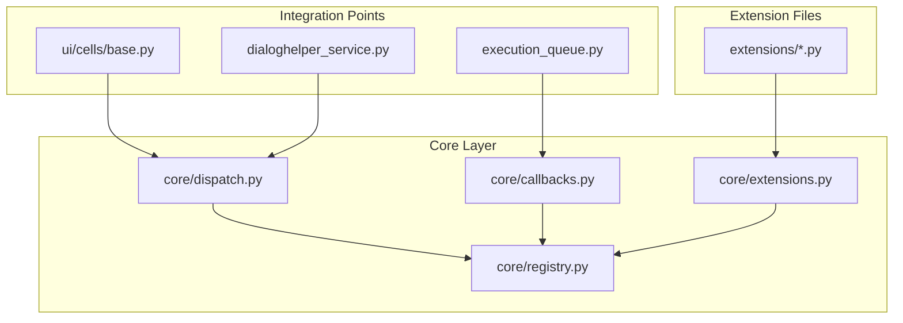
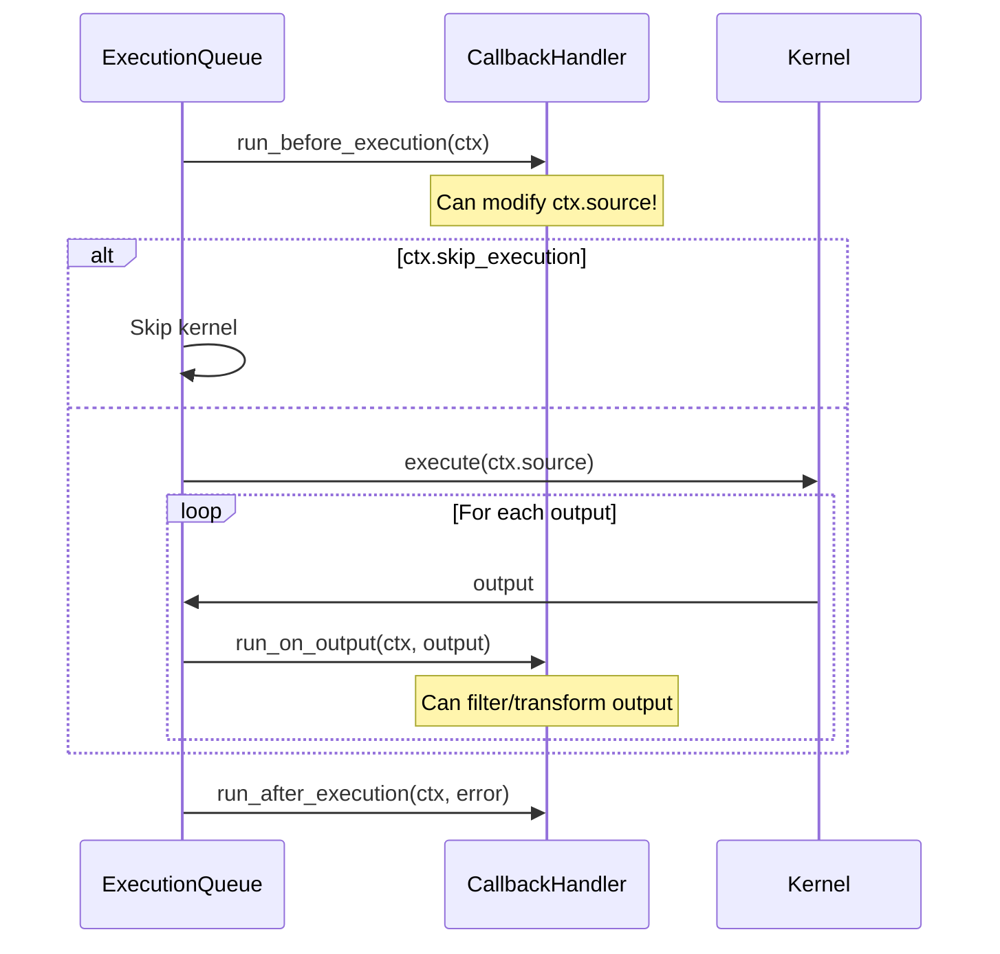

# Extension System

Dialeng includes an extensibility framework inspired by fastai/fastcore patterns, enabling:

- **Type dispatch** for cell operations (rendering, serialization, LLM conversion)
- **2-way callbacks** that can observe AND modify execution behavior
- **Extension registry** for registering new cell types, callbacks, and services
- **Notebook-to-extension workflow** for rapid experimentation

## Architecture Overview



## Type Dispatch System

The dispatch system routes operations based on cell type, enabling extensions to register custom handlers.

### Built-in Dispatch Functions

```python
from dialeng.core.dispatch import render_cell, cell_to_llm_messages, cell_to_jupyter

# Render a cell to HTML
html = render_cell(cell, notebook_id)

# Convert cell to LLM messages
messages = cell_to_llm_messages(cell)

# Convert cell to Jupyter format
jupyter_dict = cell_to_jupyter(cell)
```

### Registering Custom Handlers

```python
from dialeng.core.dispatch import register_renderer, register_llm_converter
from fasthtml.common import Div, Pre

@register_renderer("diagram")
def render_diagram(cell, notebook_id):
    """Custom renderer for diagram cells."""
    return Div(
        Pre(cell.source, cls="diagram-source"),
        Div(cell.output, cls="diagram-output"),
        id=f"cell-{cell.id}"
    )

@register_llm_converter("diagram")
def diagram_to_messages(cell):
    """Custom LLM converter for diagram cells."""
    return [{"role": "user", "content": f"[Diagram]\n{cell.source}"}]
```

## 2-Way Callback System

Unlike traditional callbacks that only observe, dialeng's callbacks can **modify** execution behavior.

### ExecutionContext

The `ExecutionContext` is a mutable object passed to all callbacks:

```python
@dataclass
class ExecutionContext:
    cell: Cell              # The cell being executed
    notebook_id: str        # Parent notebook
    source: str             # MODIFIABLE - code to execute
    outputs: List[CellOutput]  # MODIFIABLE - accumulated outputs
    skip_execution: bool    # Set True to skip kernel execution
    metadata: dict          # For callback communication
```

### Callback Lifecycle



### Creating Callbacks

```python
from dialeng.core.callbacks import Callback, ExecutionContext
from dialeng.core.registry import register_callback

@register_callback
class AutoImportCallback(Callback):
    """Auto-add imports for common libraries."""
    order = 0  # Lower = runs first

    def before_execution(self, ctx: ExecutionContext):
        # Modify source before execution
        if 'np.' in ctx.source and 'import numpy' not in ctx.source:
            ctx.source = "import numpy as np\n" + ctx.source

    def on_output(self, ctx, output):
        # Filter or transform outputs
        # Return None to filter out, return output to keep
        return output

    def after_execution(self, ctx, error=None):
        # Called after execution completes
        if error:
            print(f"Cell {ctx.cell.id} failed: {error}")
```

### Built-in Callbacks

```python
from dialeng.core.callbacks import TimingCallback, LoggingCallback, OutputTruncateCallback

# TimingCallback - Tracks execution time (order=-100, runs early)
# LoggingCallback - Logs execution events (order=100, runs late)
# OutputTruncateCallback - Limits output size (order=50)
```

## Extension Registry

The registry is the central store for all registered components.

### Registration API

```python
from dialeng.core.registry import (
    registry,
    register_cell_type,
    register_callback,
    register_service
)

# Register a cell type
@register_cell_type(icon="📊", label="Diagram")
class DiagramCell(Cell):
    cell_type = "diagram"

# Register a callback
@register_callback
class MyCallback(Callback):
    pass

# Register a service
@register_service("my_llm")
class MyLLMService:
    pass
```

### Accessing the Registry

```python
from dialeng.core.registry import registry

# Get all cell types
cell_types = registry.cell_types

# Get callback handler
handler = registry.get_callback_handler()

# Get a service
service = registry.get_service("my_llm")

# Get cell type choices for UI
choices = registry.get_cell_type_choices()
```

## Extension Loading

Extensions are Python files in the `extensions/` directory, loaded automatically at startup.

### Directory Structure

```
extensions/
├── __init__.py
├── example_callbacks.py    # Built-in example
├── diagram_cell.py         # Custom cell type
└── my_extension.py         # User extension
```

### Extension File Example

```python
# extensions/diagram_cell.py
"""Diagram cell extension."""

from dialeng.core.registry import register_cell_type, register_callback
from dialeng.core.dispatch import register_renderer, register_llm_converter
from dialeng.core.callbacks import Callback, ExecutionContext
from dialeng.document.cell import Cell
from fasthtml.common import Div, Pre

# 1. Define the cell class
class DiagramCell(Cell):
    cell_type = "diagram"
    diagram_type: str = "mermaid"

# 2. Register the renderer
@register_renderer("diagram")
def render_diagram(cell, notebook_id):
    return Div(
        Div(f"Diagram ({cell.diagram_type})", cls="cell-badge"),
        Pre(cell.source, cls="diagram-source"),
        Div(cell.output, cls="diagram-output"),
        id=f"cell-{cell.id}"
    )

# 3. Register LLM converter
@register_llm_converter("diagram")
def diagram_to_messages(cell):
    return [{"role": "user", "content": f"[{cell.diagram_type}]\n{cell.source}"}]

# 4. Register the cell type
register_cell_type(DiagramCell, icon="📊", label="Diagram")

# 5. Optional: Add callbacks
@register_callback
class DiagramRenderCallback(Callback):
    order = 10

    def after_execution(self, ctx: ExecutionContext, error=None):
        if isinstance(ctx.cell, DiagramCell) and not error:
            # Render diagram here
            pass
```

## Notebook-to-Extension Workflow

Experiment in dialeng notebooks, then extract to extensions.

### Step 1: Experiment in Notebook

Create a code cell with the `# @extension` marker:

```python
# @extension
from dialeng.core.registry import register_callback
from dialeng.core.callbacks import Callback

class MyExperiment(Callback):
    def before_execution(self, ctx):
        print(f"Running: {ctx.cell.id}")
```

### Step 2: Extract to Extension

```python
from dialeng.core.extensions import extract_extension
from pathlib import Path

# Extract all cells marked with # @extension
extract_extension(
    notebook_path=Path("notebooks/my_experiment.ipynb"),
    output_path=Path("extensions/my_extension.py")
)
```

### Step 3: Reload Extension (Development)

```python
from dialeng.core.extensions import reload_extension

# Reload without restarting dialeng
reload_extension("my_extension")
```

## Example: Complete Custom Cell Type

Here's a complete example of adding a SQL cell type:

```python
# extensions/sql_cell.py
"""SQL cell type for database queries."""

from dataclasses import dataclass
from typing import List, Dict
from fasthtml.common import Div, Textarea, Pre, Input
from dialeng.core.registry import register_cell_type, register_callback
from dialeng.core.dispatch import register_renderer, register_llm_converter
from dialeng.core.callbacks import Callback, ExecutionContext
from dialeng.document.cell import Cell

@dataclass
class SQLCell(Cell):
    """Cell for SQL queries."""
    cell_type: str = "sql"
    connection_string: str = ""

@register_renderer("sql")
def render_sql(cell, notebook_id):
    return Div(
        Div("SQL", cls="cell-badge sql"),
        Input(value=cell.connection_string, placeholder="Connection string"),
        Textarea(cell.source, cls="sql-editor"),
        Pre(cell.output, cls="sql-output") if cell.output else "",
        id=f"cell-{cell.id}"
    )

@register_llm_converter("sql")
def sql_to_messages(cell):
    return [{"role": "user", "content": f"```sql\n{cell.source}\n```\nResult:\n{cell.output}"}]

@register_callback
class SQLExecutionCallback(Callback):
    """Execute SQL cells against database."""
    order = 10

    def before_execution(self, ctx: ExecutionContext):
        if isinstance(ctx.cell, SQLCell):
            import sqlite3
            try:
                conn = sqlite3.connect(ctx.cell.connection_string)
                cursor = conn.execute(ctx.source)
                rows = cursor.fetchall()
                ctx.cell.output = str(rows)
            except Exception as e:
                ctx.cell.output = f"Error: {e}"
            ctx.skip_execution = True  # Don't run as Python

register_cell_type(SQLCell, icon="🗃️", label="SQL")
```

## Integration with Existing Code

### UI Integration

The `CellView()` function in `ui/cells/base.py` now uses the dispatch system:

```python
def CellView(cell, notebook_id: str):
    from dialeng.core.dispatch import render_cell
    return render_cell(cell, notebook_id)
```

### LLM Integration

The `cell_to_messages()` function in `services/dialoghelper_service.py` now uses dispatch:

```python
def cell_to_messages(cell) -> List[Dict]:
    from dialeng.core.dispatch import cell_to_llm_messages
    return cell_to_llm_messages(cell)
```

### Execution Queue Integration

The `ExecutionQueue` in `services/kernel/execution_queue.py` now uses callbacks:

```python
class ExecutionQueue:
    def __init__(self, kernel_service, callback_handler=None):
        self.callback_handler = callback_handler or CallbackHandler()

    async def _process_queue(self, notebook_id):
        ctx = ExecutionContext(cell=cell, source=cell.source, ...)

        # Callbacks can modify ctx.source
        await self.callback_handler.run_before_execution(ctx)

        # Execute with potentially modified source
        async for output in self.kernel.execute_cell(nb_id, cell, source=ctx.source):
            # Callbacks can filter/transform output
            filtered = await self.callback_handler.run_on_output(ctx, output)
            if filtered:
                yield filtered
```

## Best Practices

1. **Use callback ordering** - Lower order values run first. Use negative for validation, positive for logging.

2. **Don't modify cell directly** - Modify `ctx.source` and `ctx.outputs` instead.

3. **Handle exceptions gracefully** - Callbacks shouldn't break execution. Use try/except.

4. **Test in notebooks first** - Use `# @extension` marker to experiment before extracting.

5. **Use lazy imports** - Import inside functions to avoid circular dependencies.

## API Reference

### core.dispatch

| Function | Description |
|----------|-------------|
| `render_cell(cell, notebook_id)` | Render cell to HTML |
| `cell_to_llm_messages(cell)` | Convert cell to LLM messages |
| `cell_to_jupyter(cell)` | Convert cell to Jupyter format |
| `jupyter_to_cell(jcell)` | Convert Jupyter cell to Cell |
| `@register_renderer(cell_type)` | Register cell renderer |
| `@register_llm_converter(cell_type)` | Register LLM converter |
| `@register_jupyter_serializer(cell_type)` | Register serializer |

### core.callbacks

| Class/Function | Description |
|----------------|-------------|
| `ExecutionContext` | Mutable context for callbacks |
| `Callback` | Base class for callbacks |
| `CallbackHandler` | Manages callback list |
| `CancelCellException` | Cancel current cell |
| `CancelQueueException` | Cancel entire queue |
| `TimingCallback` | Track execution time |
| `LoggingCallback` | Log execution events |
| `OutputTruncateCallback` | Limit output size |

### core.registry

| Function | Description |
|----------|-------------|
| `registry` | Global registry instance |
| `@register_cell_type(...)` | Register cell type |
| `@register_callback` | Register callback |
| `@register_service(name)` | Register service |

### core.extensions

| Function | Description |
|----------|-------------|
| `load_extensions(dir)` | Load all extensions |
| `reload_extension(name)` | Reload single extension |
| `extract_extension(nb, out)` | Extract from notebook |
| `list_extensions(dir)` | List available extensions |
