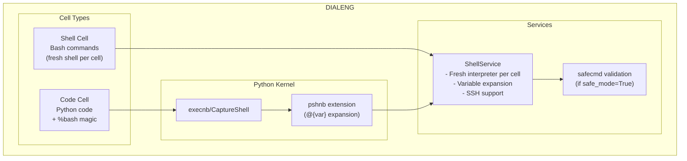

# Shell Integration

Dialeng integrates shell command execution using **pshnb** (persistent shell for notebooks) and **safecmd** (safe command validation). This enables running bash commands directly in notebooks with optional security validation for LLM-generated or shared notebooks.

## Architecture Overview



## Two Ways to Run Shell Commands

### 1. Code Cells with %bash Magic (Always Available)

Use `%bash`, `%%bash`, or `!` prefix in regular code cells:

```python
# Single command with %bash
%bash ls -la

# Or use ! prefix (like Jupyter)
!git status

# Multi-line script
%%bash
echo "Hello"
pwd
git status
```

**Features:**
- Python and shell in the same notebook flow
- Access to Python variable expansion via `@{var}` syntax
- Best for mixed Python/shell workflows
- Always available regardless of shell cell setting

### 2. Dedicated Shell Cells (Optional)

Shell cells are **disabled by default**. To enable:

1. Open Settings (⚙️ button in toolbar)
2. Expand "Shell Settings"
3. Enable "Enable Shell Cells"
4. Refresh the page

Once enabled, click **+ Shell** to create a shell cell:

```bash
echo "Direct bash execution"
uname -a
```

**Features:**
- Bash syntax highlighting (Ace editor `sh` mode)
- Fresh shell session per cell (no persistent state)
- Clear visual distinction with "Shell" badge
- Safe mode indicator when enabled

**Note:** Even without shell cells, you can run bash commands using `%bash` magic or `!command` prefix in code cells.

## Variable Expansion

The `@{var}` syntax allows using Python variables in shell commands:

```python
# Python cell
pattern = "def.*:"
max_results = 10

# Shell command
%bash grep -E "@{pattern}" *.py | head -@{max_results}
```

This works in both code cells (via pshnb) and shell cells (via ShellService).

## Safe Mode

Safe Mode validates shell commands against an allowlist before execution, powered by **safecmd**.

### Enabling Safe Mode

1. Find the **Safe** checkbox in the notebook toolbar
2. Check it to enable validation for all shell commands in the notebook
3. Commands are validated before execution

### Requirements

Safe Mode requires the `shfmt` binary for bash AST parsing:

```bash
# macOS
brew install shfmt

# Ubuntu/Debian
sudo apt install shfmt

# Arch Linux
sudo pacman -S shfmt
```

If `shfmt` is not installed:
- A warning is shown at server startup
- The Safe Mode toggle is disabled in the UI
- Shell execution still works (pshnb doesn't require shfmt)

### What's Allowed

safecmd includes a generous allowlist of read-only and easily-reverted commands:

| Category | Commands |
|----------|----------|
| **File Viewing** | `cat`, `head`, `tail`, `less`, `bat` |
| **Directory Ops** | `ls`, `tree`, `pwd`, `cd`, `find` (without `-exec`) |
| **Text Search** | `grep`, `rg`, `ag`, `ack` |
| **Text Processing** | `cut`, `sort`, `uniq`, `wc`, `tr` |
| **Git (Read-only)** | `git log`, `git show`, `git diff`, `git status`, `git branch` |
| **Git (Workspace)** | `git fetch`, `git add`, `git commit` |
| **Network** | `curl`, `wget`, `ping`, `dig` |
| **System Info** | `date`, `uname`, `whoami`, `hostname` |

### What's Blocked

The following are **always blocked** in Safe Mode:

| Category | Commands |
|----------|----------|
| **Destructive** | `rm`, `rmdir`, `unlink`, `dd` |
| **Privilege** | `sudo`, `su`, `doas` |
| **System Control** | `shutdown`, `reboot`, `kill` |
| **Permissions** | `chmod`, `chown` |
| **find Risks** | `find -exec`, `find -delete` |
| **Output Redirect** | `>`, `>>` (can overwrite files) |

## Implementation Details

### ShellService (`services/shell_service.py`)

The core service for shell execution:

```python
from dialeng.services.shell_service import ShellService, ShellResult

# Create service (safe_mode requires shfmt)
service = ShellService(safe_mode=True)

# Execute with variable expansion
result = service.execute(
    cmd="echo @{name}",
    namespace={"name": "World"},
    timeout=30
)

print(result.output)     # "World\n"
print(result.return_code)  # 0
```

**Key features:**
- Fresh `ShellInterpreter` per execution (no persistent state)
- Variable expansion from Python namespace
- Optional SSH remote execution
- safecmd validation when `safe_mode=True`

### Shell Cell Extension (`extensions/shell_cell.py`)

Registers the shell cell type and execution callback:

```python
@register_renderer("shell")
def render_shell_cell(cell, notebook_id: str):
    """Render shell cell with bash syntax highlighting."""
    # Uses Ace editor with mode="sh"

@register_callback
class ShellExecutionCallback(Callback):
    """Execute shell cells using ShellService."""
    order = -50  # Run before Python execution

    def before_execution(self, ctx: ExecutionContext):
        if ctx.cell.cell_type != "shell":
            return
        ctx.skip_execution = True  # Skip Python kernel
        # Execute via ShellService
```

### Kernel pshnb Registration (`services/kernel/kernel_worker.py`)

pshnb is loaded as an IPython extension for `%bash` magic:

```python
# In kernel_worker_main()
try:
    from pshnb import load_ipython_extension
    load_ipython_extension(shell)
except ImportError:
    pass  # pshnb is optional
```

### Safe Mode Toggle Route (`app.py`)

```python
@rt("/dialeng/{nb_id}/safe_mode")
def post(nb_id: str, safe_mode: str = "false"):
    """Toggle safe mode for a notebook."""
    nb = get_notebook(nb_id)
    nb.safe_mode = safe_mode.lower() in ("true", "on", "1", "yes")
    return ""
```

### shfmt Availability Check (`services/shell_service.py`)

```python
SHFMT_AVAILABLE = shutil.which('shfmt') is not None

def warn_missing_shfmt():
    """Log warning with installation instructions."""
    if not SHFMT_AVAILABLE:
        logger.warning(
            "shfmt not found - Safe Mode will not work!\n"
            "Install: brew install shfmt (macOS) or apt install shfmt (Ubuntu)"
        )
```

## Data Model

### Notebook Safe Mode

The `Notebook` dataclass includes a `safe_mode` field:

```python
@dataclass
class Notebook:
    # ... existing fields ...
    safe_mode: bool = False  # Enable safecmd validation
```

Serialized in notebook metadata as `dialeng_safe_mode`.

### Shell Cell

Shell cells use the existing `Cell` dataclass with `cell_type="shell"`.

## Security Considerations

### What Safe Mode Protects Against

1. **Accidental destruction** - `rm -rf /` won't run
2. **Command injection** - Nested malicious commands are detected
3. **Privilege escalation** - `sudo` and similar are blocked
4. **File system writes** - Output redirection is restricted

### What Safe Mode Does NOT Protect Against

1. **Deliberate bypass attempts** - Determined attackers may find workarounds
2. **Network exfiltration** - `curl` can still send data
3. **Resource exhaustion** - Fork bombs, infinite loops
4. **Complete sandboxing** - It's command validation, not containerization

**Safe Mode is a defense layer, not a complete security solution.** For untrusted code execution, consider containers or VMs.

## File Summary

### New Files

| File | Purpose |
|------|---------|
| `services/shell_service.py` | Shell execution with safecmd validation |
| `ui/cells/shell_cell.py` | Shell cell UI component |
| `extensions/shell_cell.py` | Shell cell type and execution callback |
| `notebooks/pshnb_guide.ipynb` | pshnb usage documentation |
| `notebooks/safecmd_guide.ipynb` | safecmd and safe mode documentation |
| `notebooks/shell_integration.ipynb` | Complete integration guide |

### Modified Files

| File | Changes |
|------|---------|
| `requirements.txt` | Added pshnb, safecmd dependencies |
| `services/kernel/kernel_worker.py` | Load pshnb extension |
| `document/notebook.py` | Added `safe_mode` field |
| `document/serialization.py` | Serialize/deserialize `safe_mode` |
| `ui/controls.py` | Added shell to TypeSelect and AddButtons |
| `ui/layout.py` | Added safe mode toggle in toolbar |
| `app.py` | Added shfmt check and safe_mode route |
| `static/js/app.js` | Updated initAceEditor for mode parameter |
| `static/css/components.css` | Added shell and safe mode styles |

## Related Documentation

- `notebooks/pshnb_guide.ipynb` - Detailed pshnb usage
- `notebooks/safecmd_guide.ipynb` - Safe Mode and security details
- `notebooks/shell_integration.ipynb` - Complete integration overview
- [pshnb on GitHub](https://github.com/AnswerDotAI/pshnb)
- [safecmd on GitHub](https://github.com/AnswerDotAI/safecmd)
