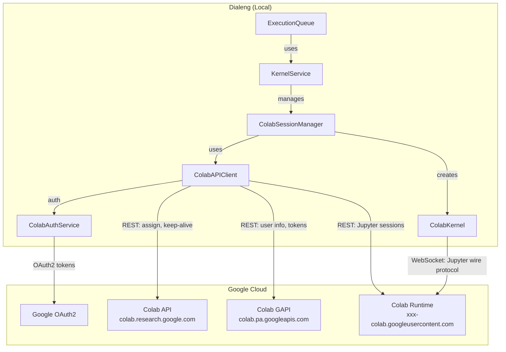
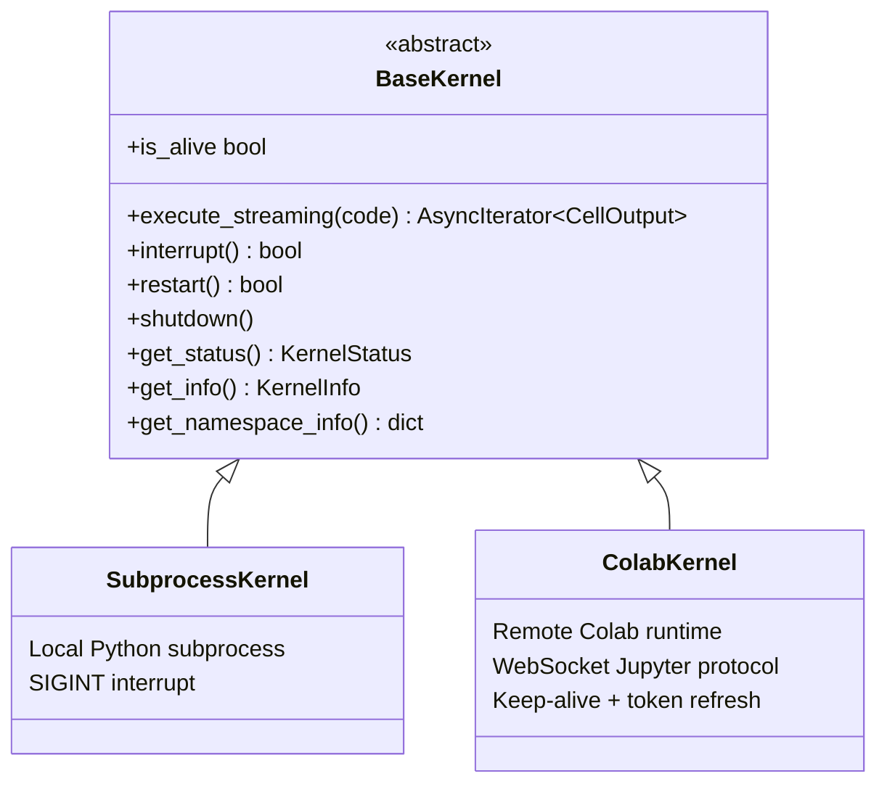
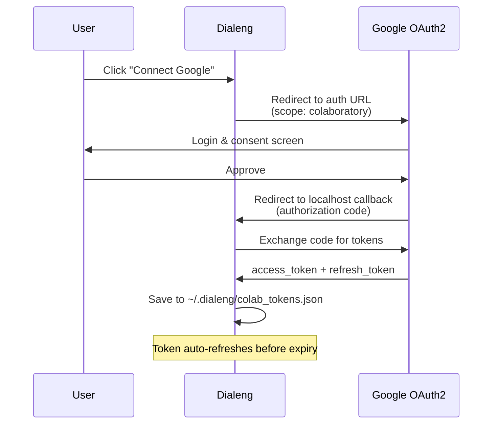
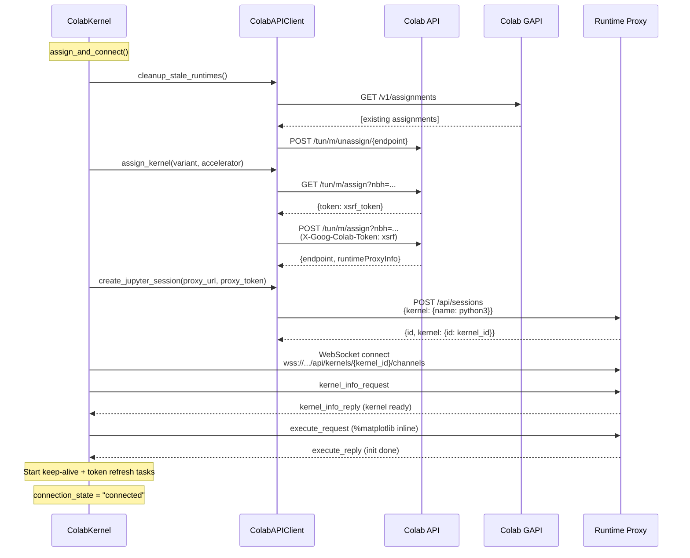
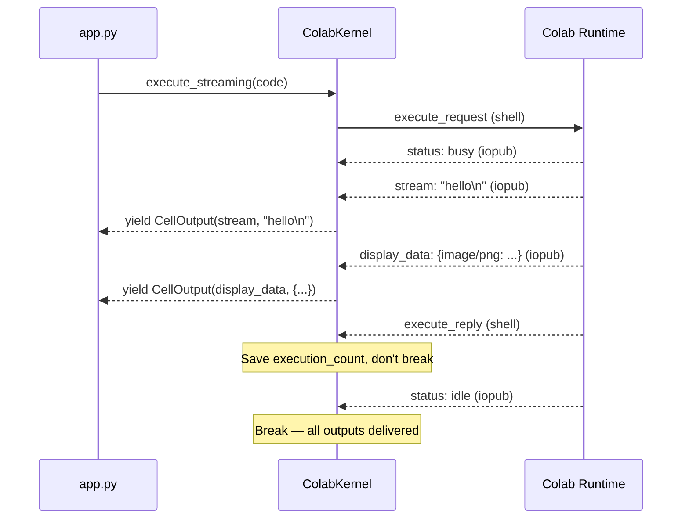
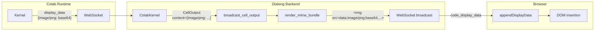
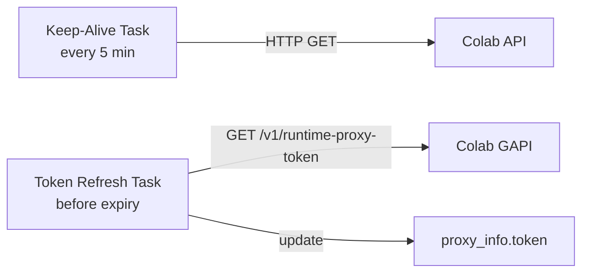
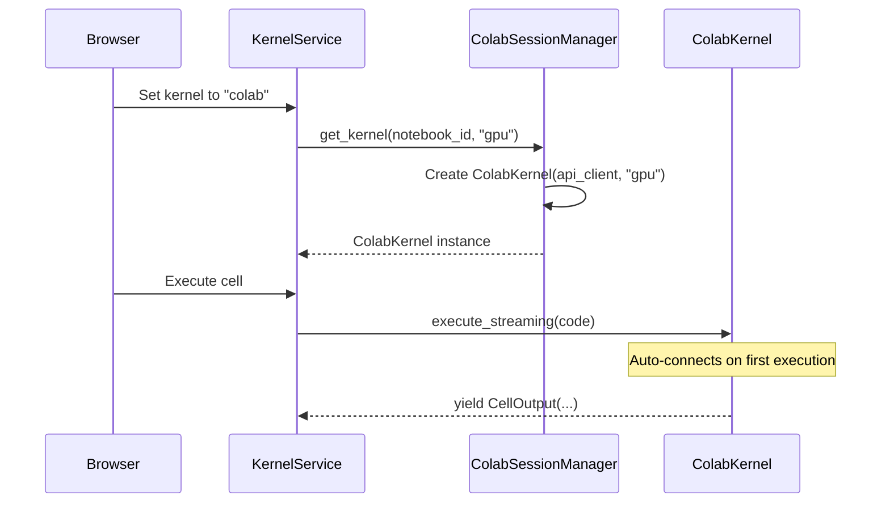

# Google Colab Kernel Integration

This document explains how Dialeng connects to Google Colab runtimes to execute code remotely, using the same APIs as the official Colab VS Code extension.

## Table of Contents

1. [Architecture Overview](#architecture-overview)
2. [Module Structure](#module-structure)
3. [Authentication Flow](#authentication-flow)
4. [Connection Lifecycle](#connection-lifecycle)
5. [Jupyter Wire Protocol over WebSocket](#jupyter-wire-protocol-over-websocket)
6. [Code Execution & Streaming Output](#code-execution--streaming-output)
7. [Rich Output Handling](#rich-output-handling)
8. [Multiplexed WebSocket Subtlety](#multiplexed-websocket-subtlety)
9. [Background Tasks](#background-tasks)
10. [Integration with Multi-Kernel System](#integration-with-multi-kernel-system)
11. [How to Extend](#how-to-extend)

## Architecture Overview

The Colab kernel allows Dialeng to execute code on Google's cloud infrastructure — the same machines you get when opening a notebook on colab.research.google.com. This gives users access to free GPUs/TPUs without installing anything locally.

The integration is built by reverse-engineering the same API endpoints used by the [colab-vscode](https://github.com/googlecolab/colab-vscode) extension (Apache 2.0, Google LLC).



## Module Structure

All Colab-related code lives in `services/colab/`:

| File | Class | Purpose |
|------|-------|---------|
| `colab_auth.py` | `ColabAuthService` | Google OAuth2 flow, token storage/refresh |
| `colab_api.py` | `ColabAPIClient` | REST API calls to Colab backends |
| `colab_kernel.py` | `ColabKernel` | WebSocket-based Jupyter wire protocol execution |
| `colab_session.py` | `ColabSessionManager` | Manages kernel instances per notebook |
| `__init__.py` | — | Re-exports public classes |

### Relationship to Base Kernel

`ColabKernel` extends `BaseKernel` (defined in `services/kernel/base_kernel.py`), the same abstract interface that `SubprocessKernel` implements. This means `KernelService` and `ExecutionQueue` work identically regardless of whether code runs locally or on Colab.



## Authentication Flow

Dialeng uses a Google OAuth2 desktop/native client to authenticate with the Colaboratory API. Credentials must be provided via environment variables:

- `COLAB_CLIENT_ID` — OAuth2 client ID
- `COLAB_CLIENT_SECRET` — OAuth2 client secret



**Key details:**
- `COLAB_CLIENT_ID` and `COLAB_CLIENT_SECRET` env vars are **required** for Colab integration
- Tokens persist in `~/.dialeng/colab_tokens.json` (file permissions `0600`)
- Access tokens auto-refresh 5 minutes before expiry
- Scopes: `profile`, `email`, `https://www.googleapis.com/auth/colaboratory`

## Connection Lifecycle

Connecting to a Colab runtime is a multi-step process involving two API backends, a Jupyter session, and a WebSocket:



### Steps in Detail

1. **Cleanup stale runtimes** — Colab limits active runtimes per user. We unassign any existing ones to avoid `TooManyAssignmentsError`.
2. **Assign runtime** — Two-step XSRF pattern: GET to obtain an XSRF token, POST with that token to create the assignment. Returns a runtime endpoint and proxy connection info.
3. **Create Jupyter session** — POST to the runtime proxy's Jupyter API to start a Python 3 kernel. Returns a `kernel_id`.
4. **Connect WebSocket** — Open `wss://<proxy>/api/kernels/<kernel_id>/channels?session_id=<session>` with proxy token in headers.
5. **Kernel readiness handshake** — Send `kernel_info_request`, wait for `kernel_info_reply` (30s timeout).
6. **Initialize kernel** — Execute `%matplotlib inline` silently to configure the inline backend for plot rendering.
7. **Start background tasks** — Keep-alive pings (5 min) and proxy token refresh (before expiry).

### Two API Backends

Colab uses two separate backends:

| Backend | Domain | Purpose |
|---------|--------|---------|
| ColabApiDomain | `colab.research.google.com` | Tunnel management: assign, unassign, keep-alive |
| ColabGapiDomain | `colab.pa.googleapis.com` | User info, proxy tokens, assignment listing |

Both require XSSI protection prefix stripping (`)]}'` prefix on JSON responses).

## Jupyter Wire Protocol over WebSocket

Colab's runtime exposes a standard Jupyter kernel over WebSocket, using the [Jupyter Wire Protocol v5.3](https://jupyter-client.readthedocs.io/en/stable/messaging.html). However, unlike a standard Jupyter deployment (which uses separate ZMQ channels), **Colab multiplexes all channels onto a single WebSocket** with a `"channel"` field in each message.

### Message Format

Every WebSocket message is JSON with this structure:

```json
{
    "header": {
        "msg_id": "<uuid>",
        "msg_type": "execute_request",
        "username": "dialeng",
        "session": "<session_id>",
        "date": "",
        "version": "5.3"
    },
    "parent_header": {},
    "metadata": {},
    "content": { ... },
    "channel": "shell"
}
```

### Channels

| Channel | Direction | Messages |
|---------|-----------|----------|
| `shell` | Client → Kernel | `execute_request`, `kernel_info_request` |
| `shell` | Kernel → Client | `execute_reply`, `kernel_info_reply` |
| `iopub` | Kernel → Client | `stream`, `display_data`, `execute_result`, `error`, `status` |
| `control` | Client → Kernel | `interrupt_request` |

### Message Correlation

Messages are correlated via `parent_header.msg_id`. When we send an `execute_request` with `msg_id = "abc123"`, all response messages (`stream`, `display_data`, `execute_reply`, etc.) will have `parent_header.msg_id = "abc123"`. We filter by this to handle only messages for the current execution.

## Code Execution & Streaming Output

When user code is executed, `ColabKernel.execute_streaming()` sends an `execute_request` and yields `CellOutput` objects as Jupyter messages arrive:



### Output Type Mapping

| Jupyter msg_type | CellOutput.output_type | Content |
|------------------|----------------------|---------|
| `stream` | `stream` | Text from stdout/stderr |
| `display_data` | `display_data` | MIME bundle dict (`{image/png: ..., text/plain: ...}`) |
| `update_display_data` | `update_display_data` | Updated MIME bundle (tqdm, widgets) |
| `execute_result` (text only) | `execute_result` | Plain text repr of result |
| `execute_result` (rich) | `display_data` | Promoted to display_data for rendering |
| `error` | `error` | Exception name, value, traceback |
| `clear_output` | `clear_output` | Clear previous outputs |

### Rich `execute_result` Promotion

When `execute_result` contains rich MIME types (`image/png`, `image/jpeg`, `image/svg+xml`, `text/html`, `image/gif`), we promote it to `display_data` so the rendering pipeline handles it correctly. This is important because some libraries produce rich content as the cell's return value rather than via `display()`.

## Rich Output Handling

The full pipeline for rich output (plots, HTML, images):



### `render_mime_bundle()` Priority Chain

The MIME bundle is converted to HTML using this priority:

1. `text/html` → rendered directly (trusted user code)
2. `image/svg+xml` → inline SVG
3. `image/png` → `` (newlines stripped from base64)
4. `image/jpeg` → ``
5. `image/gif` → ``
6. `text/markdown` → raw markdown wrapper
7. `text/latex` → wrapper for MathJax/KaTeX
8. `application/json` → pretty-printed JSON
9. `text/plain` → escaped plain text fallback

### Kernel Initialization for Plots

When connecting via raw WebSocket (bypassing Colab's frontend), the matplotlib inline backend is not automatically activated. During `_initialize_kernel()`, we execute `%matplotlib inline` which:

1. Sets matplotlib to use the `module://matplotlib_inline.backend_inline` renderer
2. Registers `flush_figures` as a `post_execute` hook on the IPython shell
3. Registers PNG format handlers on `IPython.display_formatter`

This ensures `plt.show()` and implicit figure display produce `display_data` messages with `image/png` content.

## Multiplexed WebSocket Subtlety

This is the most important implementation detail for correctness.

### The Problem

Standard Jupyter uses separate ZMQ sockets for Shell and IOPub channels. The protocol guarantees IOPub messages arrive before `execute_reply`. But **Colab multiplexes both channels onto a single WebSocket**. The proxy reads from two ZMQ sockets and forwards to one WebSocket, so **ordering between channels is not guaranteed**.

This means `execute_reply` (Shell) can arrive **before** `display_data` (IOPub):

```
Expected order:          What can actually happen:
  stream (iopub)           stream (iopub)
  display_data (iopub)     execute_reply (shell)  ← arrives early!
  status: idle (iopub)     display_data (iopub)   ← we'd miss this
  execute_reply (shell)    status: idle (iopub)
```

### The Solution

We break the receive loop on `status: idle` (IOPub) instead of `execute_reply` (Shell). Within the IOPub channel, message ordering IS preserved (same ZMQ PUB socket), so `display_data` is guaranteed to arrive before `status: idle`.

```python
# In execute_streaming():
elif msg_type == "execute_reply":
    # Save execution_count but do NOT break
    self._execution_count = content.get("execution_count", ...)

elif msg_type == "status":
    if content.get("execution_state") == "idle":
        break  # All IOPub outputs guaranteed delivered
```

This is the same approach used by proper Jupyter clients like VS Code's Jupyter extension.

### Why Stream Output Wasn't Affected

`stream` messages (from `print()`) are sent **during** cell execution, well before `execute_reply`. The large time gap makes reordering unlikely. But `display_data` from matplotlib is sent very close to the end of execution (via the `flush_figures` post-execute hook), making it susceptible to being overtaken by `execute_reply`.

## Background Tasks

Two asyncio tasks run continuously while the kernel is connected:

### Keep-Alive Pings

Every 5 minutes, we send an HTTP GET to `/tun/m/{endpoint}/keep-alive/`. Without this, Colab's idle timeout (default 30 minutes) will disconnect the runtime.

### Proxy Token Refresh

The proxy token has a TTL (typically 1 hour). We refresh it 5 minutes before expiry via the GAPI domain endpoint `/v1/runtime-proxy-token`. The new token is injected into the existing assignment's `proxy_info`.



## Integration with Multi-Kernel System

`ColabSessionManager` manages `ColabKernel` instances per notebook and integrates with `KernelService`:



Users can switch between local and Colab kernels per notebook. The `KernelService` delegates to either `SubprocessKernel` or `ColabKernel` through the `BaseKernel` interface.

### Runtime Type Selection

Users can choose between CPU, GPU (T4), and TPU runtimes. Changing runtime type shuts down the existing kernel and creates a new one:

```python
await session_manager.set_runtime_type(notebook_id, "gpu")
```

## How to Extend

### Adding New Colab-Specific Message Types

Colab's kernel can send custom message types (e.g., `colab_request` for Drive mount authentication). To handle these:

1. Add a handler in `ColabKernel.execute_streaming()`:
```python
elif msg_type == "colab_request":
    # Handle Colab-specific request
    colab_type = content.get("colab_request_type")
    if colab_type == "request_auth":
        # Handle Drive mount auth
        ...
```

2. Create a new `CellOutput` type or use an existing one to communicate to the frontend.

### Supporting Colab-Specific Features

Features that could be added using the existing architecture:

- **Drive mount** — Handle `colab_request` messages for authentication during `google.colab.drive.mount()`
- **File upload/download** — Use the runtime proxy's HTTP API
- **Form fields** — Parse `@param` annotations in cell comments
- **Runtime monitoring** — Query resource usage via the runtime proxy

### Adding a New Remote Kernel Backend

Follow the same pattern as `ColabKernel`:

1. Create a new directory under `services/` (e.g., `services/sagemaker/`)
2. Implement `BaseKernel` with `execute_streaming()`, `interrupt()`, etc.
3. Create a session manager (like `ColabSessionManager`)
4. Register with `KernelService`
