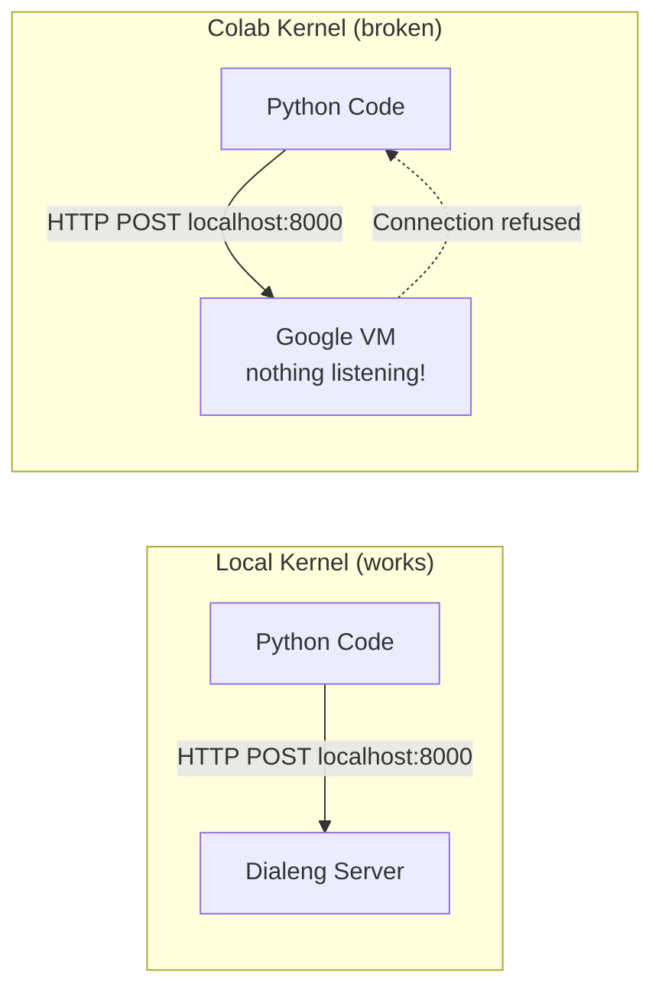
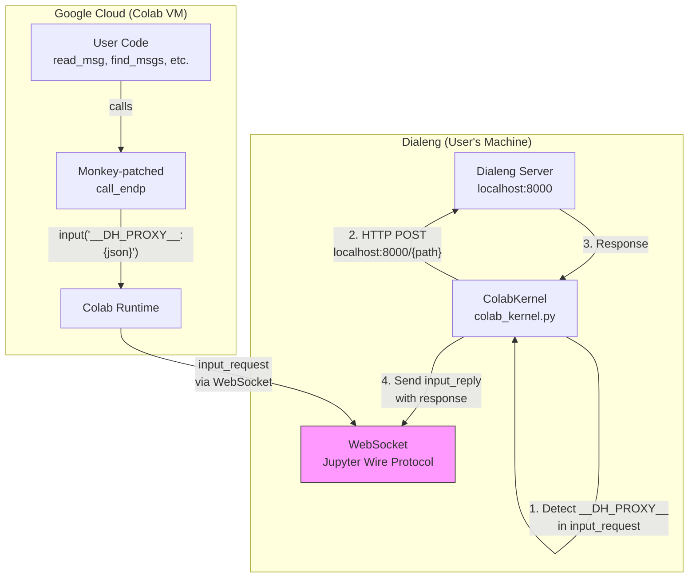
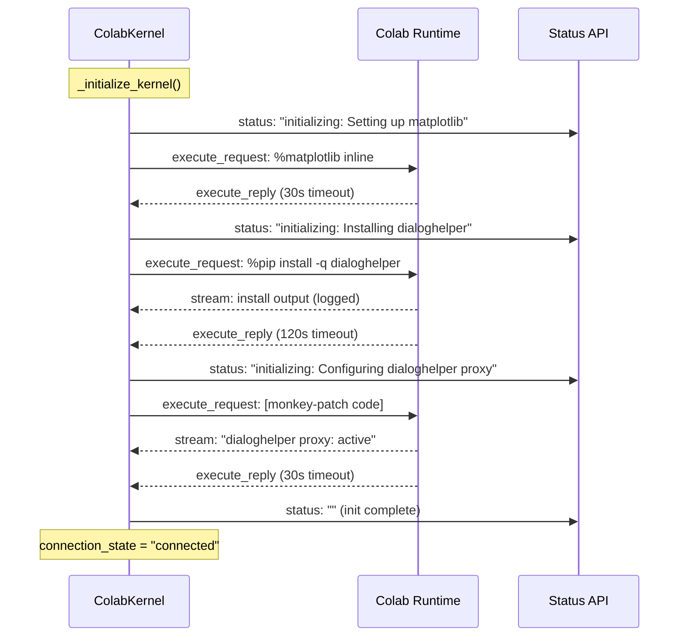
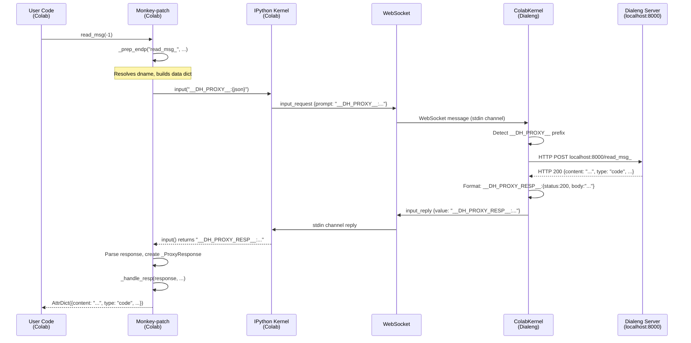

# DialogHelper Proxy for Colab Kernel

This document explains how Dialeng makes [dialoghelper](https://github.com/AnswerDotAI/dialoghelper) functions work on remote Google Colab runtimes, where `localhost` refers to Google's VM instead of the user's machine.

## Table of Contents

1. [The Problem](#the-problem)
2. [Solution Overview](#solution-overview)
3. [Architecture](#architecture)
4. [Kernel Initialization](#kernel-initialization)
5. [The Monkey-Patch](#the-monkey-patch)
6. [The Stdin Proxy Protocol](#the-stdin-proxy-protocol)
7. [Request/Response Flow](#requestresponse-flow)
8. [Magic Variable Injection](#magic-variable-injection)
9. [Implementation Details](#implementation-details)
10. [Why Stdin Instead of Other Approaches](#why-stdin-instead-of-other-approaches)
11. [Error Handling](#error-handling)
12. [Files Modified](#files-modified)

## The Problem

DialogHelper functions (`read_msg()`, `find_msgs()`, `add_msg()`, `update_msg()`, `iife()`, etc.) work by making HTTP POST requests to `http://localhost:{port}/{endpoint}` via the `call_endp()` function in `dialoghelper/core.py`. On the local subprocess kernel, this works perfectly because both the kernel and the Dialeng server run on the same machine.

On Google Colab, however, two issues arise:

1. **`localhost` points to Google's VM** — The Colab kernel runs on a remote Google Cloud VM. When dialoghelper calls `http://localhost:8000/read_msg_`, the request goes to the VM's loopback interface, where no server is listening.

2. **dialoghelper is not pre-installed** — Unlike the local kernel's virtual environment, Colab runtimes don't have `dialoghelper` installed. It must be auto-installed before any notebook code can use it.



## Solution Overview

The solution uses **Jupyter's built-in stdin/input mechanism** to tunnel dialoghelper HTTP requests from the remote Colab kernel back to the local Dialeng server. This is implemented in three parts:

1. **Auto-install**: During kernel initialization, `pip install dialoghelper` runs on Colab
2. **Monkey-patch**: After install, Python code is injected that replaces dialoghelper's HTTP transport (`call_endp`/`call_endpa`) with stdin-based proxied versions
3. **Stdin proxy**: During execution, when patched dialoghelper code calls `input()` with a magic prefix, Dialeng intercepts the Jupyter `input_request` message, makes the HTTP call locally, and sends the response back via `input_reply`

This approach requires **zero changes** to the local subprocess kernel, `app.py`, `kernel_service.py`, or `base_kernel.py`. Only `colab_kernel.py` and `colab_session.py` are modified.

## Architecture



## Kernel Initialization

When a Colab kernel connects for the first time, `_initialize_kernel()` runs a multi-step initialization sequence. Each step is a separate `execute_request` sent to the Colab runtime, with logging and individual timeouts:



### Init Steps

| Step | Code | Timeout | Purpose |
|------|------|---------|---------|
| Setting up matplotlib | `%matplotlib inline` | 30s | Enable inline plot rendering (same as before) |
| Installing dialoghelper | `%pip install -q dialoghelper` | 120s | Auto-install the package on Colab VM |
| Configuring dialoghelper proxy | `DIALOGHELPER_PROXY_SETUP` | 30s | Inject monkey-patch to redirect HTTP calls |

The 120-second timeout for pip install accounts for slow Colab package downloads. The `-q` flag reduces output noise.

### Progress Reporting

During initialization, `self._init_status` is set to the current step description. The `get_status()` method exposes this via the `connection_state` field:

```python
def get_status(self) -> KernelStatus:
    conn_state = self._connection_state
    if self._init_status:
        conn_state = f"initializing: {self._init_status}"
    return KernelStatus(..., connection_state=conn_state)
```

The UI's `/dialeng/{nb_id}/kernel/status` endpoint returns this state, so users see progress like:
- `"initializing: Setting up matplotlib"`
- `"initializing: Installing dialoghelper"`
- `"initializing: Configuring dialoghelper proxy"`
- `"connected"` (when complete)

### The `_run_init_code()` Helper

Each init step uses `_run_init_code()`, which sends a silent `execute_request` and waits for `execute_reply`, logging any stream output along the way:

```python
async def _run_init_code(self, code: str, description: str, timeout: float = 30.0) -> None:
    """Execute init code on kernel, log output, wait for completion."""
    # Sends execute_request with silent=True, store_history=False
    # Waits for execute_reply, logging stream/error messages
    # Times out gracefully if kernel doesn't respond
```

Key differences from `execute_streaming()`:
- `silent=True` — doesn't increment execution count or trigger output display
- `store_history=False` — doesn't pollute the In[]/Out[] history
- `allow_stdin=False` — init code doesn't need stdin support
- Logs output instead of yielding `CellOutput` objects

## The Monkey-Patch

The `DIALOGHELPER_PROXY_SETUP` constant contains Python code that is executed on the Colab kernel after dialoghelper is installed. It replaces dialoghelper's HTTP transport layer with a stdin-based proxy.

### What Gets Replaced

DialogHelper's `call_endp()` function (in `dialoghelper/core.py`) normally:
1. Calls `_prep_endp()` to resolve the dialog name, build data dict, and construct headers
2. Makes an HTTP POST to `http://localhost:{port}/{path}` using httpx
3. Calls `_handle_resp()` to parse the response

The monkey-patch replaces step 2 — the HTTP call — with an `input()` call that tunnels the request through Jupyter's stdin channel. Steps 1 and 3 remain unchanged, meaning `find_dname()` resolution, data assembly, and response parsing all work exactly as before.

### The `_ProxyResponse` Shim

Since `_handle_resp()` expects an httpx `Response` object, the monkey-patch includes a minimal shim:

```python
class _ProxyResponse:
    """Shim matching httpx.Response interface for _handle_resp."""
    def __init__(self, status_code, text):
        self.status_code = status_code
        self.text = text
    def json(self): return json.loads(self.text)
    def raise_for_status(self):
        if self.status_code >= 400: raise Exception(f"HTTP {self.status_code}: {self.text}")
```

This provides the three properties/methods that `_handle_resp()` uses: `.status_code`, `.text`/`.json()`, and `.raise_for_status()`.

### Sync vs Async Variants

DialogHelper has two transport functions:
- `call_endp()` — synchronous, used by `read_msg()`, `find_msgs()`, etc.
- `call_endpa()` — async, used by `read_msg_a()`, `find_msgs_a()`, etc.

The monkey-patch replaces both:

```python
# Sync version — input() blocks until reply arrives (fine for IPython)
def _patched_call_endp(path, dname='', json=False, raiseex=False, id=None, **data):
    url, data, headers = _dhc._prep_endp(path, dname, json, id, data)
    return _dhc._handle_resp(_proxy_call(path, data, headers), json, raiseex)

# Async version — uses run_in_executor to avoid blocking the event loop
async def _patched_call_endpa(path, dname='', json=False, raiseex=False, id=None, **data):
    url, data, headers = _dhc._prep_endp(path, dname, json, id, data)
    res = await asyncio.get_event_loop().run_in_executor(
        None, _proxy_call, path, data, headers)
    return _dhc._handle_resp(res, json, raiseex)
```

The sync version calls `input()` directly — this blocks the kernel thread, which is fine because IPython cells are single-threaded. The async version wraps `input()` in `run_in_executor()` to avoid blocking the asyncio event loop.

## The Stdin Proxy Protocol

The proxy uses Jupyter's stdin channel (`input_request`/`input_reply` messages) to communicate between the Colab kernel and Dialeng. Three magic prefixes identify proxy messages:

| Prefix | Direction | Purpose |
|--------|-----------|---------|
| `__DH_PROXY__:` | Colab → Dialeng | Request (JSON-encoded path, data, headers) |
| `__DH_PROXY_RESP__:` | Dialeng → Colab | Successful response (JSON with status, body) |
| `__DH_PROXY_ERR__:` | Dialeng → Colab | Error response (JSON with error message) |

### Why `input()` Works

Jupyter's `input()` is not the same as Python's built-in `input()`. In IPython, `input()` sends an `input_request` message over the stdin channel and blocks until an `input_reply` message arrives. This is normally used for interactive prompts (like `password = input("Enter password: ")`), but it can carry arbitrary data.

Key requirements:
- The `execute_request` must have `"allow_stdin": True` — otherwise `input()` raises an error
- The kernel blocks on `input()` — no other code runs until the reply arrives
- The reply can contain any string — perfect for serialized JSON responses

## Request/Response Flow

Here is the complete flow when a user calls `read_msg(-1)` in a Colab notebook:



### On the Colab Side (`_proxy_call`)

```python
def _proxy_call(path, data, headers):
    request = json.dumps({
        "path": path,
        "data": {k: str(v) if not isinstance(v, str) else v for k, v in data.items()},
        "headers": dict(headers),
    })
    raw_reply = input("__DH_PROXY__:" + request)
    # Parse response based on prefix...
```

Note the `str(v)` coercion in the data dict — this matches the behavior of HTTP form encoding where all values become strings.

### On the Dialeng Side (`_handle_dh_proxy`)

```python
async def _handle_dh_proxy(self, prompt: str) -> str:
    request = json.loads(prompt[len(DH_PROXY_PREFIX):])
    path = request["path"]
    data = request.get("data", {})
    headers = request.get("headers", {})
    url = f"http://localhost:{self._dialeng_port}/{path}"

    async with aiohttp.ClientSession() as session:
        async with session.post(url, data=data, headers=headers) as resp:
            body = await resp.text()
            return DH_PROXY_RESP_PREFIX + json.dumps({
                "status": resp.status, "body": body,
                "content_type": resp.headers.get("Content-Type", "text/plain"),
            })
```

### In `execute_streaming()`

The proxy handler is integrated into the WebSocket message loop in `execute_streaming()`:

```python
elif msg_type == "input_request":
    prompt = content.get("prompt", "")
    if prompt.startswith(DH_PROXY_PREFIX):
        reply_value = await self._handle_dh_proxy(prompt)
    else:
        reply_value = ""  # Non-proxy input() not supported on remote

    input_reply = {
        "header": self._make_header("input_reply"),
        "parent_header": data.get("header", {}),
        "metadata": {},
        "content": {"value": reply_value, "status": "ok"},
        "channel": "stdin",
    }
    await self._ws.send_json(input_reply)
```

Two key changes were needed in `execute_streaming()`:
1. **`"allow_stdin": True`** in the `execute_request` content (was `False`)
2. **`input_request` handler** added to the message type dispatch

## Magic Variable Injection

On the local subprocess kernel, `__dialog_name` and `__msg_id` are injected via `shell.user_ns` in `kernel_worker.py`. Since the Colab kernel doesn't have access to IPython's `user_ns`, variables are injected by **prepending assignment code** to each cell's source:

```python
# In execute_streaming():
if notebook_id or cell_id:
    preamble_parts = []
    if notebook_id:
        preamble_parts.append(f"__dialog_name = {notebook_id!r}")
    if cell_id:
        preamble_parts.append(f"__msg_id = {cell_id!r}")
    code = "\n".join(preamble_parts) + "\n" + code
```

This means that when the user runs a cell containing `read_msg(-1)`, what actually executes on Colab is:

```python
__dialog_name = 'my_notebook'
__msg_id = 'abc12345'
read_msg(-1)
```

DialogHelper's `find_var()` function walks the call stack looking for these variables, so they must be in the execution scope. Prepending assignments ensures they're in the module-level scope of the cell.

## Implementation Details

### Files Modified

| File | Changes |
|------|---------|
| `services/colab/colab_kernel.py` | Proxy constants, init restructure, `_run_init_code()`, `_handle_dh_proxy()`, stdin handling in `execute_streaming()`, `dialeng_port` param, init progress in `get_status()` |
| `services/colab/colab_session.py` | Pass `dialeng_port` through `get_kernel()` |

### Module-Level Constants

```python
# Protocol magic prefixes
DH_PROXY_PREFIX = "__DH_PROXY__:"
DH_PROXY_RESP_PREFIX = "__DH_PROXY_RESP__:"
DH_PROXY_ERR_PREFIX = "__DH_PROXY_ERR__:"

# Auto-install command
DIALOGHELPER_INSTALL = "%pip install -q dialoghelper"

# Monkey-patch code (see DIALOGHELPER_PROXY_SETUP in colab_kernel.py)
```

### `ColabKernel.__init__` Changes

Two new fields:
```python
self._dialeng_port: int = dialeng_port  # Default 8000, matches app.py
self._init_status: str = ""             # Current init step for UI
```

### `ColabSessionManager` Changes

`get_kernel()` now accepts and passes `dialeng_port`:

```python
def get_kernel(self, notebook_id: str, runtime_type: str = "cpu",
               dialeng_port: int = 8000) -> ColabKernel:
    if notebook_id not in self._kernels:
        self._kernels[notebook_id] = ColabKernel(
            self._api, runtime_type=runtime_type,
            dialeng_port=dialeng_port
        )
    return self._kernels[notebook_id]
```

## Why Stdin Instead of Other Approaches

Three approaches were considered:

### Option A: Tunnel (ngrok, Cloudflare, etc.)

**Rejected.** Would require the user to install and configure a tunnel service. Adds external dependencies, potential security concerns, and setup friction.

### Option B: WebSocket/Comm Messages

**Rejected.** Jupyter's `comm_msg` protocol could carry proxy data, but:
- Colab's runtime proxy may not forward comm messages
- Would require implementing a full comm registration/open/close lifecycle
- More complex than needed for simple request/response

### Option C: Stdin/Input (chosen)

**Advantages:**
- **Zero external dependencies** — uses Jupyter's built-in stdin channel
- **Universal support** — every Jupyter kernel supports `input()`
- **Simple protocol** — request/response maps naturally to `input()`/return
- **No registration** — works immediately, no comm setup needed
- **Transparent** — the proxy is invisible to user code; `read_msg(-1)` works identically on local and Colab

**Trade-offs:**
- `input()` is blocking — only one dialoghelper call can be in flight at a time (this is fine because notebook cells execute sequentially)
- Non-proxy `input()` calls (e.g., `x = input("Enter value: ")`) return empty string on Colab (interactive terminal input isn't practical on remote kernels anyway)

## Error Handling

### Install Failure

If `pip install dialoghelper` fails (e.g., network issues), the monkey-patch step will catch `ImportError` and print a warning to stderr. User code calling dialoghelper functions will get a standard `ModuleNotFoundError`.

### Proxy Setup Failure

If the monkey-patch code fails (e.g., dialoghelper API changed), it catches the exception and prints a warning. User code will fall back to the default HTTP transport, which will fail with connection errors (since `localhost` doesn't point to Dialeng on Colab).

### Runtime Proxy Errors

If the local HTTP call to Dialeng fails during execution:

```python
except Exception as e:
    logger.error(f"DialogHelper proxy error: {e}")
    return DH_PROXY_ERR_PREFIX + json.dumps({"error": str(e)})
```

The error is sent back to Colab as a `__DH_PROXY_ERR__:` response, which the monkey-patch converts to a `ConnectionError` with a descriptive message.

### Init Timeout

Each init step has its own timeout (30s for quick steps, 120s for pip install). If a step times out, it's logged as a warning and the next step proceeds. This prevents a slow install from blocking kernel readiness indefinitely.

## See Also

- [DialogHelper Integration](./05_dialoghelper_integration.md) — How dialoghelper works on local kernels (HTTP endpoints, magic variables, JavaScript injection)
- [Google Colab Kernel](./12_colab_kernel.md) — Colab kernel architecture, Jupyter wire protocol, WebSocket multiplexing
- [Kernel Execution](./04_kernel_execution.md) — Local subprocess kernel, execution queue
