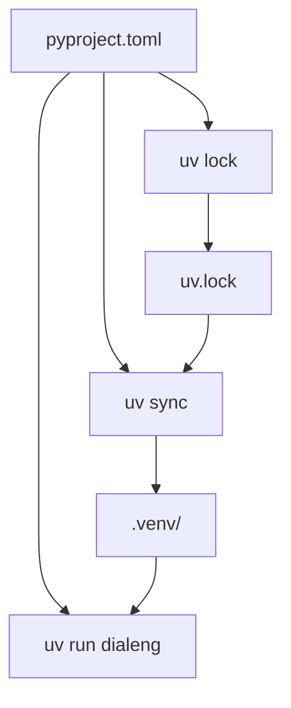

# Package Structure (uv Project)

How Dialeng is packaged as a `uv` project with `pyproject.toml`, CLI entry points, and configurable paths.

## Table of Contents

- [Overview](#overview)
- [pyproject.toml](#pyprojecttoml)
- [Entry Points](#entry-points)
- [Configurable Paths](#configurable-paths)
- [Development Workflow](#development-workflow)
- [Build Layout](#build-layout)

---

## Overview

Dialeng is structured as a standard Python package managed by `uv`. The project uses `hatchling` as its build backend, with all dependencies declared in `pyproject.toml` and locked in `uv.lock`.



## pyproject.toml

Key sections:

- **`[project]`** — Package name (`dialeng`), version, Python requirement (`>=3.11`), and all runtime dependencies.
- **`[project.scripts]`** — CLI entry point: `dialeng = "dialeng.app:main"`.
- **`[build-system]`** — Uses `hatchling`.
- **`[tool.hatch.metadata]`** — `allow-direct-references = true` (needed for the git-based `dialoghelper` dependency).
- **`[tool.hatch.build.targets.wheel]`** — Lists the `dialeng` package (which contains `core`, `document`, `services`, `ui`, `extensions`, `app.py`, `state.py`, and `static/`).
- **`[dependency-groups]`** — Dev dependencies (`pytest`, `ruff`).

## Entry Points

Three ways to run Dialeng:

| Command | How it works |
|---------|-------------|
| `uv run dialeng` | Uses the `[project.scripts]` entry point → calls `dialeng.app.main()` |
| `uv run python -m dialeng` | Uses `__main__.py` → imports and calls `dialeng.app.main()` |
| `uv run python -m dialeng.app` | Direct execution via `if __name__ == "__main__": main()` |

The `main()` function in `dialeng/app.py` prints startup info (credentials, config, shortcuts) then calls `serve(port=8000, log_config=build_log_config())`.

That custom log config keeps `dialeng.*` runtime logs visible in the terminal and filters out high-volume access-log noise like static assets and `/kernel/snapshot` polling, so kernel/setup/Colab logs remain readable during interactive use.

## Configurable Paths

Two environment variables customize runtime paths:

| Variable | Default | Used in |
|----------|---------|---------|
| `DIALENG_NOTEBOOKS_DIR` | `"notebooks"` | `app.py` — where `.ipynb` files are stored |
| `DIALENG_CONFIG_PATH` | `~/.config/dialeng/dialeng_config.json` | `services/dialeng_config.py` — settings file |

Example:
```bash
DIALENG_NOTEBOOKS_DIR=/path/to/my/notebooks uv run dialeng
```

## Development Workflow

```bash
# Initial setup
uv sync                    # Install all deps + project in editable mode

# Run the app
uv run dialeng             # Start the server

# Run tests
uv run pytest

# Check lockfile is up to date
uv lock --check

# Add a dependency
uv add some-package
```

## Build Layout

The wheel includes these packages:

```
dialeng/
├── app.py              # Main FastHTML application + main() entry point
├── state.py            # Shared state module
├── __main__.py         # python -m support
├── core/               # Registry, extensions, callbacks, dispatch
├── document/           # Cell, Notebook, serialization
├── services/           # Kernel, LLM, config, CRAFT, TEMPLATE, AUTORUN
├── ui/                 # FastHTML components (cells, layout, settings, etc.)
├── extensions/         # Built-in extensions (shell_cell, example_callbacks)
└── static/             # CSS, JS, images
```
