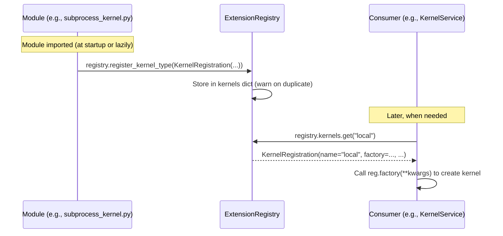

# Extension Registries

How kernel types, LLM providers, toolbar items, and settings sections are registered and discovered through the central registry.

## Table of Contents

- [Overview](#overview)
- [Architecture](#architecture)
- [Kernel Registry](#kernel-registry)
- [Provider Registry](#provider-registry)
- [Toolbar Item Registry](#toolbar-item-registry)
- [Settings Section Registry](#settings-section-registry)
- [Registration Flow](#registration-flow)
- [Writing an Extension](#writing-an-extension)

---

## Overview

The `ExtensionRegistry` in `core/registry.py` provides four specialized registries beyond the existing cell type and callback registries:

| Registry | Dataclass | Purpose |
|----------|-----------|---------|
| `kernels` | `KernelRegistration` | Kernel backends (local, Colab, custom) |
| `providers` | `ProviderRegistration` | LLM providers (Claudette, Agent SDK, etc.) |
| `toolbar_items` | `ToolbarItemRegistration` | Custom toolbar buttons |
| `settings_sections` | `SettingsSectionRegistration` | Custom settings groups |

## Architecture

```mermaid
graph TD
    subgraph "core/registry.py"
        R[ExtensionRegistry singleton]
        R --> K[kernels: Dict]
        R --> P[providers: Dict]
        R --> T[toolbar_items: Dict]
        R --> S[settings_sections: Dict]
    end

    subgraph "Built-in Registrations"
        SK[subprocess_kernel.py] -->|register_kernel_type| K
        CK[colab_kernel.py] -->|register_kernel_type| K
        CP[claudette_provider.py] -->|register_provider| P
        CA[claudette_agent_provider.py] -->|register_provider| P
        CS[claude_agent_sdk_provider.py] -->|register_provider| P
    end

    subgraph "Consumers"
        KS[KernelService] -->|lookup| K
        LS[LLMService] -->|lookup| P
        LY[ui/layout.py] -->|iterate| T
        ST[ui/settings.py] -->|iterate| S
    end
```



## Kernel Registry

### KernelRegistration

```python
@dataclass
class KernelRegistration:
    name: str               # "local", "colab", "julia"
    label: str              # "Local Python", "Google Colab"
    icon: str               # Lucide icon name (e.g., "house-plug")
    factory: Callable       # (**kwargs) -> BaseKernel
    description: str = ""
    requires_auth: bool = False
    runtime_options: List[str] = field(default_factory=list)  # e.g., ["cpu", "gpu", "tpu"]
```

### How it's used

`KernelService.get_kernel()` looks up the registry:

```python
from dialeng.core.registry import registry
reg = registry.kernels.get(kernel_type)
if reg and reg.factory:
    kernel = reg.factory(**kwargs)
```

The kernel selection modal (`ui/kernel_modal.py`) iterates `registry.kernels` to display all available kernels with their icons, labels, and descriptions.

### Built-in registrations

- **`local`** — Registered at bottom of `services/kernel/subprocess_kernel.py` via `_register_local_kernel()`
- **`colab`** — Registered at bottom of `services/colab/colab_kernel.py` via `_register_colab_kernel()` (factory=None, uses ColabSessionManager)

## Provider Registry

### ProviderRegistration

```python
@dataclass
class ProviderRegistration:
    name: str               # "claudette", "claudette_agent", "claude_agent_sdk"
    label: str              # "Anthropic API", "Claude Code Subscription"
    factory: Callable       # () -> BaseLLMProvider
    credential_checker: Optional[Callable] = None
    priority: int = 0       # Higher = preferred
```

### How it's used

`LLMService._ensure_initialized()` looks up the provider by name from the registry. The `priority` field is available for future auto-selection logic.

### Built-in registrations

| Provider | Priority | File |
|----------|----------|------|
| `claudette` | 10 | `services/llm/providers/claudette_provider.py` |
| `claudette_agent` | 5 | `services/llm/providers/claudette_agent_provider.py` |
| `claude_agent_sdk` | 5 | `services/llm/providers/claude_agent_sdk_provider.py` |

## Toolbar Item Registry

### ToolbarItemRegistration

```python
@dataclass
class ToolbarItemRegistration:
    name: str
    renderer: Callable      # (notebook, config) -> FT component
    position: str = "right" # "left", "center", "right"
    order: int = 50
```

### How it's used

In `ui/layout.py`, after the built-in toolbar buttons:

```python
*[reg.renderer(nb, config)
  for reg in sorted(registry.toolbar_items.values(), key=lambda r: r.order)],
```

## Settings Section Registry

### SettingsSectionRegistration

```python
@dataclass
class SettingsSectionRegistration:
    name: str
    label: str
    renderer: Callable      # (config) -> FT component (SettingsGroup)
    order: int = 50
```

### How it's used

In `ui/settings.py`, after the built-in settings groups:

```python
*[reg.renderer(config)
  for reg in sorted(
      _get_extension_settings_sections(),
      key=lambda r: r.order
  )],
```

## Registration Flow



Registrations happen via wrapper functions (e.g., `_register_local_kernel()`) called at module level. This avoids circular imports since the wrapper uses a lazy import of `core.registry`.

## Writing an Extension

Example: Adding a custom kernel type via an AUTORUN extension.

```python
# AUTORUN/my_kernel.py
#| export

from dialeng.core.registry import registry, KernelRegistration

class MyCustomKernel:
    """A custom kernel implementation."""
    def __init__(self, **kwargs):
        # ...
        pass

registry.register_kernel_type(KernelRegistration(
    name="my_kernel",
    label="My Custom Kernel",
    icon="microchip",
    factory=lambda **kw: MyCustomKernel(**kw),
    description="Custom kernel for specialized computation"
))
```

After placing this in `AUTORUN/`, restart the server. The kernel will appear in the kernel selection modal.

For toolbar and settings extensions:

```python
# AUTORUN/my_toolbar.py
#| export

from fasthtml.common import *
from dialeng.core.registry import registry, ToolbarItemRegistration, SettingsSectionRegistration
from dialeng.ui.settings import SettingsGroup, SettingToggle

# Add a toolbar button
registry.register_toolbar_item(ToolbarItemRegistration(
    name="my_button",
    renderer=lambda nb, config: Button("My Tool", cls="btn btn-sm", onclick="alert('Hello!')"),
    order=60
))

# Add a settings section
def my_settings(config):
    return SettingsGroup("My Extension", SettingToggle("Enable Feature", "my_ext.enabled", True))

registry.register_settings_section(SettingsSectionRegistration(
    name="my_settings",
    label="My Extension",
    renderer=my_settings,
    order=60
))
```
