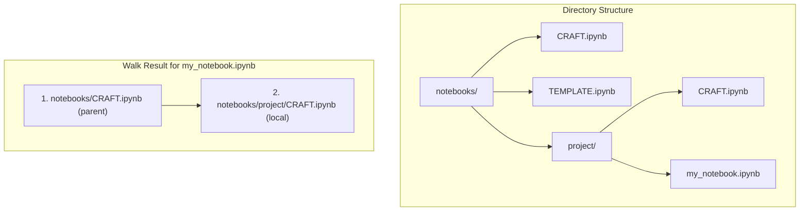
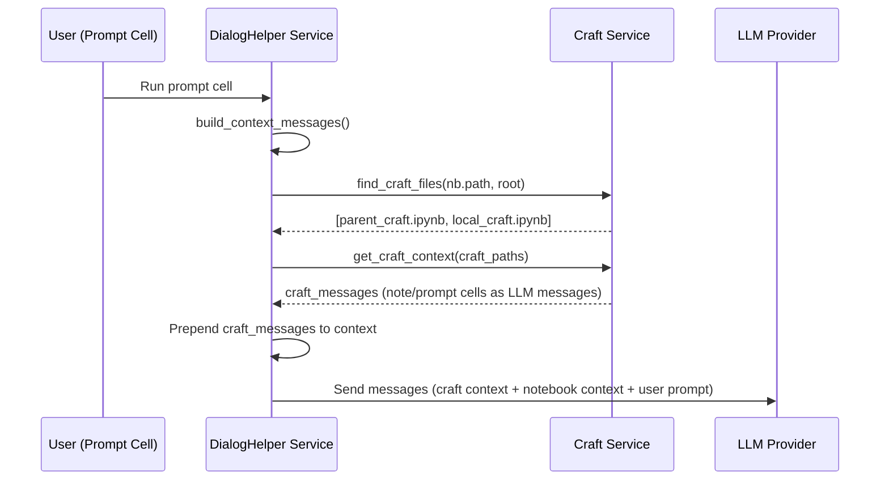
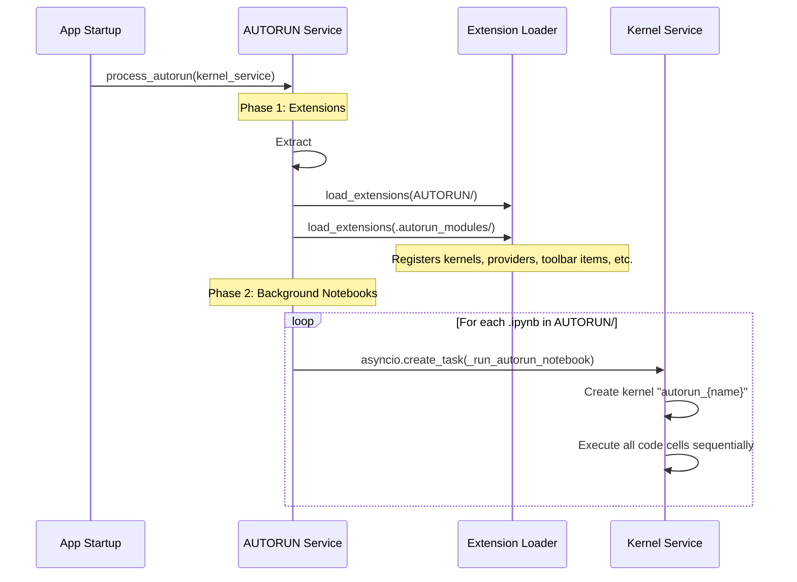
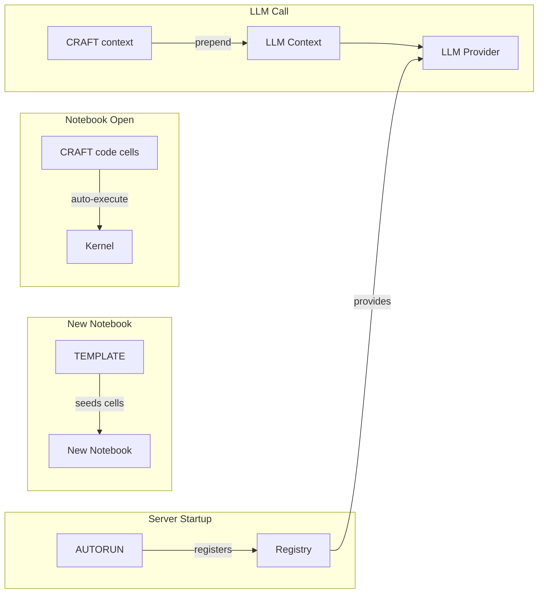

# CRAFT, TEMPLATE, and AUTORUN

How CRAFT.ipynb injects context into LLM calls, TEMPLATE.ipynb seeds new notebooks, and the AUTORUN/ folder loads extensions and runs background notebooks on startup.

## Table of Contents

- [Overview](#overview)
- [Directory Hierarchy Walk](#directory-hierarchy-walk)
- [TEMPLATE.ipynb](#templateipynb)
- [CRAFT.ipynb](#craftipynb)
- [AUTORUN Folder](#autorun-folder)
- [Interaction Between Features](#interaction-between-features)

---

## Overview

All three features follow a common pattern: special files in the notebook directory tree influence notebook behavior. TEMPLATE and CRAFT use a parent-first hierarchy walk, while AUTORUN runs once at server startup.

| Feature | File | Trigger | Effect |
|---------|------|---------|--------|
| TEMPLATE | `TEMPLATE.ipynb` | New notebook creation | Seeds initial cells |
| CRAFT | `CRAFT.ipynb` | Notebook open + LLM calls | Prepends context, auto-executes code |
| AUTORUN | `AUTORUN/*.py`, `AUTORUN/*.ipynb` | Server startup | Loads extensions, runs notebooks |

## Directory Hierarchy Walk

TEMPLATE and CRAFT files are discovered by walking **up** the directory tree from the notebook's location to the root notebooks directory. Files are collected in **parent-first order** (root → leaf).



This means parent context is applied first, then local context layers on top. A project-specific CRAFT can extend or override the root CRAFT.

**Implementation**: Both `find_templates()` and `find_craft_files()` in their respective service modules use the same walk pattern:

```python
# Walk from target_dir up to root, collecting files
current = target_dir.resolve()
root_resolved = root.resolve()
found = []
while True:
    candidate = current / filename
    if candidate.exists():
        found.append(candidate)
    if current == root_resolved:
        break
    current = current.parent
found.reverse()  # Parent-first order
```

## TEMPLATE.ipynb

**Service**: `services/template_service.py`

### How it works

1. User creates a new notebook (via `GET /notebook/new?dir=<path>`)
2. `find_templates(target_dir, root)` walks up from `target_dir` collecting `TEMPLATE.ipynb` files
3. `load_template_cells(template_paths)` loads cells from all templates (parent-first), generating fresh UUIDs for each cell
4. The new notebook is initialized with these cells instead of the default empty cell

### Fallback

If no `TEMPLATE.ipynb` exists anywhere in the hierarchy, the notebook gets a single note cell with "# New Notebook".

### Example

```
notebooks/
├── TEMPLATE.ipynb          # Contains: "# Project Notes" heading cell
└── ml-experiments/
    ├── TEMPLATE.ipynb      # Contains: import cells for numpy, pandas, sklearn
    └── experiment_01.ipynb
```

Creating a new notebook in `ml-experiments/` produces cells from both templates: first the root heading, then the ML imports.

## CRAFT.ipynb

**Service**: `services/craft_service.py`

CRAFT provides two capabilities: **context injection** for LLM calls and **code auto-execution** on notebook open.

### Context Injection



**What gets included**: Note and prompt cells from CRAFT notebooks are converted to LLM context messages. Code cells are **not** included in context (they're handled separately via auto-execution).

**Where it happens**: In `services/dialoghelper_service.py` → `build_context_messages()`, after building the notebook's own context, CRAFT messages are prepended.

### Code Auto-Execution

When a notebook is opened (`GET /notebook/{nb_id}`), CRAFT code cells are executed in the background:

1. `find_craft_files()` locates CRAFT files
2. `get_craft_code_cells()` extracts code cell source + IDs
3. Cells not yet executed for this notebook (tracked in `_executed_craft` dict) are run via `kernel_service.execute_cell()`
4. Execution happens in `asyncio.create_task()` so it doesn't block page load

This ensures that CRAFT setup code (imports, helper functions, environment config) is available in the kernel before the user starts working.

### Tracking

A module-level `_executed_craft: Dict[str, Set[str]]` maps notebook IDs to sets of executed CRAFT cell IDs. This prevents re-execution on page refresh.

## AUTORUN Folder

**Service**: `services/autorun_service.py`

AUTORUN runs at server startup via `@app.on_event("startup")`. It has two phases:



### Phase 1: Extension Loading

1. **Extract**: For each `.ipynb` in `AUTORUN/`, extract cells marked with `#| export` into `.autorun_modules/{name}.py`
2. **Load `.py` files**: Load all `.py` files from both `AUTORUN/` and `.autorun_modules/` as extensions (runs in main process)

This is where custom kernel types, LLM providers, toolbar items, and settings sections get registered.

### Phase 2: Background Notebooks

Each `.ipynb` in `AUTORUN/` gets its own kernel (`autorun_{stem}`) and all code cells are executed sequentially. Errors are logged but don't affect other notebooks.

Use cases:
- Long-running data pipelines
- Background monitoring
- Service initialization

### File Structure

```
AUTORUN/
├── custom_kernel.py        # Direct .py extension (loaded in Phase 1)
├── custom_kernel.ipynb     # Notebook with #| export cells (extracted, then run)
└── data_pipeline.ipynb     # Background notebook (run in Phase 2)

.autorun_modules/           # Generated cache (gitignored)
├── custom_kernel.py        # Extracted from custom_kernel.ipynb
└── data_pipeline.py        # Extracted from data_pipeline.ipynb
```

## Interaction Between Features



The typical workflow:

1. **Startup**: AUTORUN loads custom extensions (kernel types, providers)
2. **Create notebook**: TEMPLATE seeds initial cells with project-specific boilerplate
3. **Open notebook**: CRAFT code cells auto-execute to set up the kernel environment
4. **Run prompt**: CRAFT context is prepended to give the LLM project-specific instructions

All three features compose cleanly: AUTORUN provides infrastructure, TEMPLATE provides structure, and CRAFT provides runtime context.
