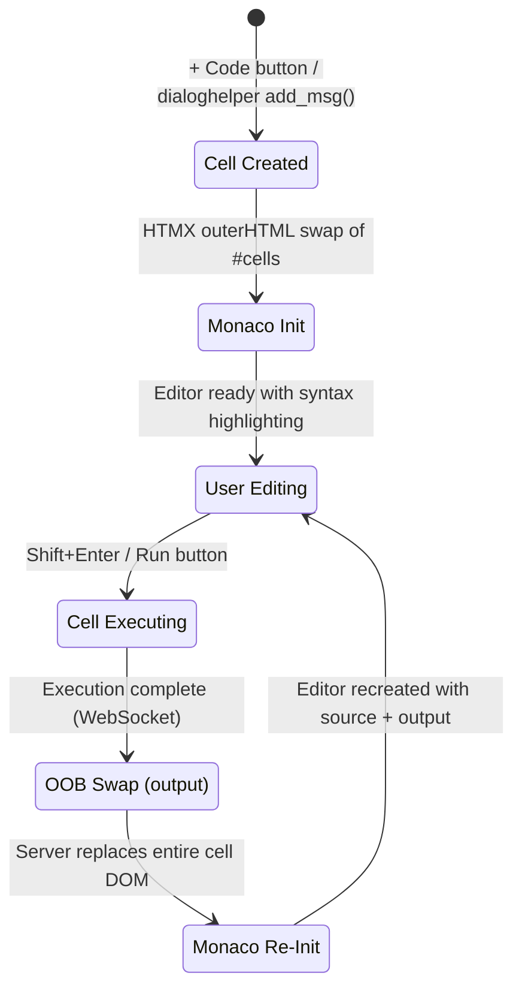
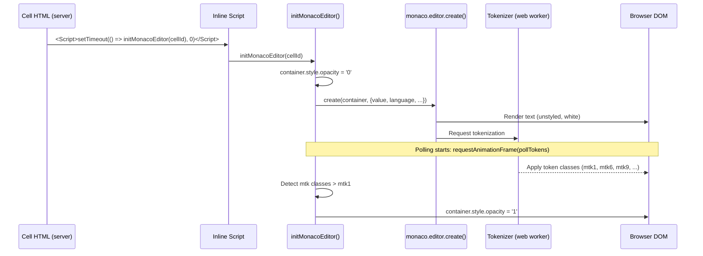

# Editor & Cell Transitions

This document describes how Monaco editors behave during cell lifecycle events (creation, execution, deletion, movement) and documents known issues with transition smoothness.

## Table of Contents

1. [Expected User Experience](#expected-user-experience)
2. [Cell Lifecycle Events](#cell-lifecycle-events)
3. [How Monaco Editors Are Managed](#how-monaco-editors-are-managed)
4. [Scroll Position Preservation](#scroll-position-preservation)
5. [Known Issue: Flash of Unstyled Text](#known-issue-flash-of-unstyled-text-foust)
6. [Potential Solutions for FOUST](#potential-solutions-for-foust)

## Expected User Experience

From the user's perspective, the notebook should behave as follows:

### Editing & Navigation
- Code cells display with **full syntax highlighting** at all times
- Scrolling inside an editor **passes through** to the notebook when at the top/bottom of the editor content (no scroll trapping)
- **Shift+Enter** runs the cell and moves focus to the next cell
- **Ctrl/Cmd+Enter** runs the cell and keeps focus on it
- **Ctrl/Cmd+S** saves the notebook

### Adding Cells
- Clicking **+ Code / + Note / + Prompt** inserts a new cell at that position
- The notebook **stays at the same scroll position** — no jumping
- Cells added via **dialoghelper** (`add_msg()`) behave identically — the server processes the addition and sends an HTMX OOB swap that replaces `#cells`
- The new cell's editor appears ready with syntax highlighting

### Running Cells
- While executing, the cell shows a running indicator
- Output streams in real-time below the editor via WebSocket
- When execution completes, the cell updates with final output
- The editor **retains its syntax-highlighted source code** — no visual disruption
- The notebook scroll position is **preserved**

### Deleting & Moving Cells
- Deleting a cell removes it without scroll position change
- Moving a cell up/down reorders without scroll position change
- All remaining editors keep their highlighted state

## Cell Lifecycle Events



### What triggers each event

| Event | Trigger | HTMX Mechanism | Scope |
|-------|---------|----------------|-------|
| Cell added | + Code button, `add_msg()` | `hx_post` → `outerHTML` on `#cells` | All cells replaced |
| Cell deleted | Delete button, `D D` shortcut | `hx_delete` → `outerHTML` on `#cells` | All cells replaced |
| Cell moved | Arrow buttons, `Alt+↑/↓` | `hx_post` → `outerHTML` on `#cells` | All cells replaced |
| Cell executed | Run button, Shift+Enter | WebSocket OOB swap | Single cell replaced |
| Cell type changed | Type dropdown | `hx_post` → `outerHTML` on `#cell-{id}` | Single cell replaced |

## How Monaco Editors Are Managed

### Initialization Flow



### HTMX Lifecycle Hooks

```javascript
// 1. htmx:beforeSwap — save scroll, destroy editors
//    Fires before the DOM is replaced
//    → Saves window.scrollY if #cells is being swapped
//    → Calls editor.dispose() on all editors within the swap target

// 2. htmx:afterSwap — restore scroll (first pass)
//    Fires right after DOM is replaced, before inline scripts
//    → Restores window.scrollY immediately

// 3. Inline <Script> tags — initMonacoEditor()
//    Run via setTimeout(0) from cell HTML
//    → Creates new Monaco editors for each cell

// 4. htmx:afterSettle — restore scroll (second pass), init cells
//    Fires after all HTMX processing (including OOB swaps)
//    → Runs initCell() for each cell in the swap target
//    → Restores window.scrollY again (catches Monaco layout shifts)
```

### Editor Disposal

When HTMX is about to replace cell DOM, the `htmx:beforeSwap` handler:
1. Queries for `.monaco-container` elements within the swap target
2. Calls `editor.dispose()` on each to free memory and event listeners
3. Removes the editor from the `monacoEditors` registry

This is critical — without disposal, each swap leaks Monaco editor instances.

## Scroll Position Preservation

The notebook uses HTMX `outerHTML` swaps on the `#cells` container for structural operations (add, delete, move). This replaces the entire cells DOM tree, which can cause scroll jumps because:

1. **HTMX show behavior** — HTMX may scroll the new element into view
2. **Monaco focus** — the last editor created may receive focus, scrolling to it
3. **Layout reflow** — replacing a large DOM tree causes reflow

### Mitigations

1. **`show:none`** on `hx_swap` — tells HTMX not to scroll after swap
2. **Scroll save/restore** — `window.scrollY` is saved in `htmx:beforeSwap` and restored in both `htmx:afterSwap` (immediate) and `htmx:afterSettle` (after Monaco init)
3. **`requestAnimationFrame` restore** — final scroll restore uses `requestAnimationFrame` to catch async layout shifts from Monaco

## Known Issue: Flash of Unstyled Text (FOUST)

### What happens

When a cell finishes executing (or is re-rendered for any reason), the server replaces the entire cell DOM via an HTMX OOB swap. This forces the Monaco editor to be destroyed and recreated from scratch. During the recreation:

1. `monaco.editor.create()` renders the source code as **plain white text** (no syntax colors)
2. Monaco dispatches tokenization to a **web worker** (asynchronous)
3. The web worker returns token classifications
4. Monaco applies **CSS classes** (`mtk1`, `mtk6`, `mtk9`, etc.) to text spans
5. The browser paints the colored text

Between steps 1 and 5, there is a visible flash of unstyled text. This typically lasts 20-100ms but can be longer under load.

### Current mitigation

```javascript
// 1. Hide editor before creation
container.style.opacity = '0';

// 2. After creation, poll for colored tokens
const pollTokens = () => {
    const tokenSpans = container.querySelectorAll('.view-lines [class*="mtk"]');
    for (const span of tokenSpans) {
        if (span.className !== 'mtk1') {
            // Found a colored token — tokenization is done
            container.style.opacity = '1';
            return;
        }
    }
    // Keep polling (up to ~30 frames / 500ms)
    requestAnimationFrame(pollTokens);
};
requestAnimationFrame(pollTokens);
```

### Why it's imperfect

- **Code with no keywords** — if the source is only comments or plain identifiers, all tokens may be `mtk1`, and we fall through to the 30-frame timeout (~500ms delay before reveal)
- **Heavy load** — when many cells reinitialize simultaneously (e.g., adding a cell replaces all 28 cells), tokenization can take longer than the polling window
- **Race conditions** — the inline `<Script>` tag (setTimeout 0) and the `htmx:afterSettle` handler (setTimeout 20) can both try to initialize the same cell

## Potential Solutions for FOUST

### Solution A: Output-Only OOB Swaps (Recommended)

Instead of replacing the entire cell DOM after execution, only swap the output section:

```python
# Current: replaces entire cell (destroys editor)
return CellView(cell, notebook_id)  # OOB swap targets #cell-{id}

# Proposed: only replace the output div
return Div(
    Pre(cell.output, cls="stream-output"),
    id=f"output-{cell.id}",
    hx_swap_oob="outerHTML"
)
```

**Pros:** Editor DOM is untouched — no flash, no reinit, no disposal needed
**Cons:** Requires refactoring the OOB swap logic to send partial updates; cell header state (execution count, timestamp) also needs its own OOB target

### Solution B: Editor Model Caching

Cache Monaco editor models before disposal and re-attach them:

```javascript
// Before swap: detach model
const model = editor.getModel();
modelCache[cellId] = model;  // Don't dispose the model
editor.dispose();

// After swap: reuse model
const editor = monaco.editor.create(container, { model: modelCache[cellId] });
```

**Pros:** Tokenization state is preserved in the model — no re-tokenization needed
**Cons:** Models may become stale if the server modifies source; memory management complexity

### Solution C: Virtual DOM Diffing

Use a virtual DOM library or HTMX morphing to diff the old and new cell DOM, only updating changed parts:

```python
# In hx_swap, use morph instead of outerHTML
hx_swap="morph"  # Requires htmx-ext-morphdom or idiomorph
```

**Pros:** Editor DOM would survive if only the output changed
**Cons:** Monaco editors have complex internal DOM that may not survive morphing; requires HTMX extension; may have other side effects

### Recommendation

**Solution A** is the most practical. It requires backend changes to send targeted OOB swaps for the output section, cell header, and cell state classes separately, rather than replacing the entire cell. This eliminates the root cause (editor destruction) rather than mitigating the symptom.
