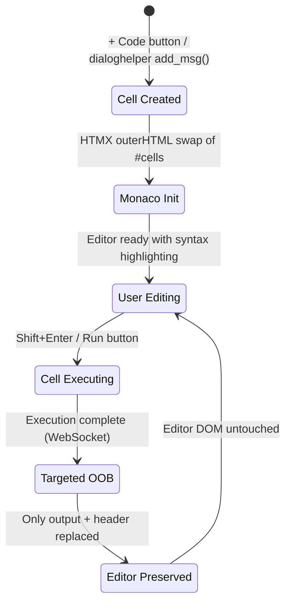
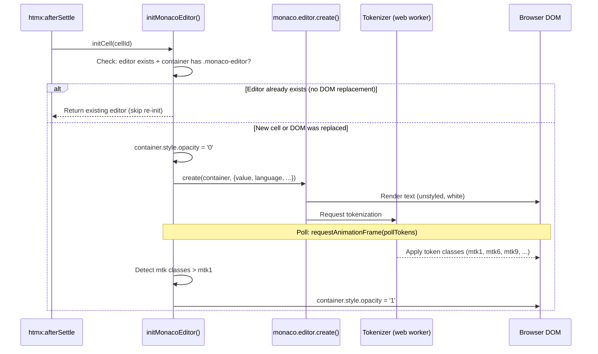
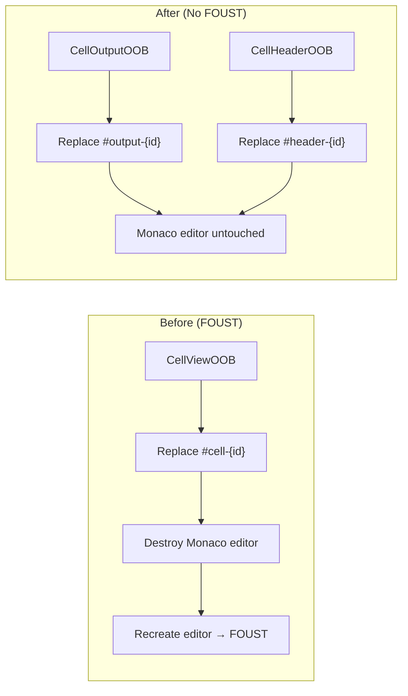
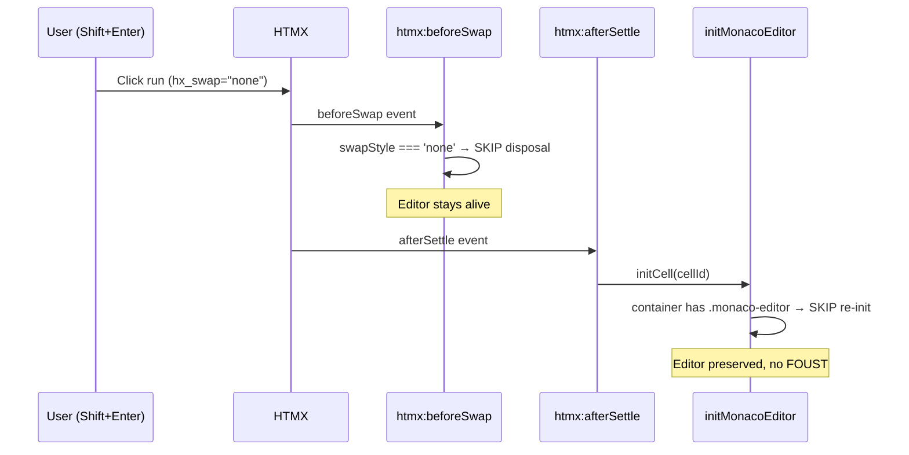
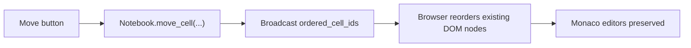

# Editor & Cell Transitions

This document describes how Monaco editors behave during cell lifecycle events (creation, execution, deletion, movement) and how FOUST (Flash of Unstyled Text) is prevented.

## Table of Contents

1. [Expected User Experience](#expected-user-experience)
2. [Cell Lifecycle Events](#cell-lifecycle-events)
3. [How Monaco Editors Are Managed](#how-monaco-editors-are-managed)
4. [Targeted OOB Swaps (FOUST Prevention)](#targeted-oob-swaps-foust-prevention)
5. [HTMX Lifecycle Guards](#htmx-lifecycle-guards)
6. [Scroll Position Preservation](#scroll-position-preservation)
7. [Cell Focus Navigation](#cell-focus-navigation)
8. [Remaining FOUST Cases](#remaining-foust-cases)

## Expected User Experience

### Editing & Navigation
- Code cells display with **full syntax highlighting** at all times
- Scrolling inside an editor **passes through** to the notebook when at the top/bottom of the editor content (no scroll trapping)
- **Shift+Enter** runs the cell and moves focus to the next cell (any type)
- **Ctrl/Cmd+Enter** runs the cell and keeps focus on it
- **Ctrl/Cmd+S** saves the notebook

### Running Cells
- While executing, the cell shows a running indicator and streams output
- When execution completes, **only the output and header** are updated
- The editor **retains its syntax-highlighted source code** — no visual disruption
- The notebook scroll position is **preserved**

### Adding / Deleting / Moving Cells
- These operations now update the notebook DOM surgically instead of replacing the entire `#cells` container
- Existing Monaco editors stay attached to their cells during add/delete/move operations
- The backend is the source of truth for cell order; the browser replays that order without guessing local swaps

## Cell Lifecycle Events



### What triggers each event

| Event | Trigger | Broadcast Type | Editor Impact |
|-------|---------|---------------|---------------|
| Cell executed | Run button, Shift+Enter | `CellOutputOOB` + `CellHeaderOOB` | **Preserved** |
| Source edit (dialoghelper) | `msg_str_replace_`, etc. | JSON `cell_source_update` | **Preserved** (setValue) |
| State toggle | Toggle button | `CellHeaderOOB` + JSON `cell_class_update` | **Preserved** |
| Collapse toggle | Collapse button | JSON `cell_collapse_update` | **Preserved** |
| Cell added | + Code button, `add_msg()` | JSON `cell_add` | **Preserved** (other cells) |
| Cell deleted | Delete button, `D D` | JSON `cell_delete` | **Preserved** (other cells) |
| Cell moved | Arrow buttons, `Alt+↑/↓` | JSON `cell_move` | **Preserved** (backend-authoritative reorder) |
| Cell type changed | Type dropdown | `CellViewOOB` | Destroyed & recreated |

## How Monaco Editors Are Managed

### Initialization Flow



### Editor Skip Guard

When `initMonacoEditor()` is called on a cell that already has a working editor (e.g., from `htmx:afterSettle` firing after a `hx_swap="none"` response), it skips re-initialization:

```javascript
if (monacoEditors[cellId]) {
    if (container.querySelector('.monaco-editor')) {
        return monacoEditors[cellId];  // Editor is fine, skip
    }
    // Container was replaced — destroy old editor, create new one
    monacoEditors[cellId].dispose();
    delete monacoEditors[cellId];
}
```

### Editor Disposal

When HTMX is about to replace cell DOM, the `htmx:beforeSwap` handler:
1. **Checks swap style** — if `swapStyle === 'none'` or response is empty, skips disposal entirely
2. Queries for `.monaco-container` elements within the swap target
3. Calls `editor.dispose()` on each to free memory and event listeners
4. Removes the editor from the `monacoEditors` registry

## Targeted OOB Swaps (FOUST Prevention)

### The Problem

Previously, executing a code cell broadcast `CellViewOOB(cell, nb_id)` which replaced the entire `#cell-{id}` DOM. This destroyed the Monaco editor and forced a new one to be created, causing a visible flash of unstyled white text before tokenization completed.

### The Solution

Execution now broadcasts **two targeted OOB swaps** that replace only the output and header sections:



### Server-Side OOB Components (`dialeng/ui/oob.py`)

```python
def CellOutputOOB(cell):
    """Replace only the output div — preserves Monaco editor DOM."""
    return Div(
        *output_content(cell),
        id=f"output-{cell.id}",
        cls=output_classes(cell),
        hx_swap_oob="true"
    )

def CellHeaderOOB(cell, notebook_id):
    """Replace only the header div — preserves Monaco editor DOM."""
    return Div(
        *CellHeader(cell, notebook_id).children,
        id=f"header-{cell.id}",
        hx_swap_oob="true"
    )
```

### Client-Side Processing (`processOOBSwap`)

The `processOOBSwap` function handles three target patterns:

| Target ID Pattern | Handler | Action |
|-------------------|---------|--------|
| `cell-{id}` | Full cell swap | Replace cell, reinit Monaco |
| `output-{id}` / `header-{id}` | Targeted swap | Replace element, process HTMX bindings |
| `cells` | Full container swap | Replace all cells, reinit all editors |

### JSON WebSocket Messages

For operations that change source code or cell classes, JSON messages update the existing editor in-place:

| Message Type | Fields | Client Action |
|-------------|--------|---------------|
| `cell_source_update` | `cell_id`, `source` | `editor.setValue(source)` — preserves editor DOM |
| `cell_class_update` | `cell_id`, `cls` | `cell.className = cls` — no DOM replacement |

## HTMX Lifecycle Guards

### Why Guards Are Needed

The code cell run button has `hx_swap="none"` — the server returns an empty string and no DOM replacement happens. However, HTMX still fires `htmx:beforeSwap` and `htmx:afterSettle` events. Without guards, these handlers would destroy and recreate the editor unnecessarily.

### Guard 1: `htmx:beforeSwap` — Skip Disposal

```javascript
document.addEventListener('htmx:beforeSwap', (e) => {
    // Skip editor destruction when no actual DOM replacement will happen
    const swapStyle = e.detail.swapStyle;
    if (swapStyle === 'none' || e.detail.serverResponse === '') {
        return;  // Don't destroy editors
    }
    // ... normal disposal logic for actual swaps
});
```

### Guard 2: `initMonacoEditor` — Skip Re-Init

```javascript
// If editor already exists and container still has .monaco-editor,
// the DOM wasn't replaced — skip re-initialization
if (monacoEditors[cellId] && container.querySelector('.monaco-editor')) {
    return monacoEditors[cellId];
}
```

### How They Work Together



## Scroll Position Preservation

The notebook used to rely on HTMX `outerHTML` swaps for structural operations. Add/delete/move now use granular JSON messages and in-place DOM moves instead, so the old full-container replacement path is no longer the normal case.

### Mitigations

1. **`show:none`** on `hx_swap` — tells HTMX not to scroll after swap
2. **Scroll save/restore** — `window.scrollY` is saved in `htmx:beforeSwap` and restored in both `htmx:afterSwap` (immediate) and `htmx:afterSettle` (after Monaco init)
3. **`requestAnimationFrame` restore** — final scroll restore uses `requestAnimationFrame` to catch async layout shifts from Monaco

## Cell Focus Navigation

### Shift+Enter Focus Flow

When pressing Shift+Enter in a code cell, the editor must move focus to the next cell regardless of type:

```javascript
function focusNextCell(cellId) {
    setFocusedCell(cellId);  // Visual highlight

    if (cell.dataset.type === 'code' || cell.dataset.type === 'shell') {
        monacoEditors[cellId].focus();  // Focus Monaco editor
    } else {
        // For note/prompt cells: move DOM focus to the cell element
        // This removes focus from the previous Monaco editor
        cell.tabIndex = -1;
        cell.focus();
    }
}
```

**Why `cell.focus()` is needed:** Without it, the Monaco editor in the previous code cell retains keyboard focus. The next Shift+Enter would fire the Monaco action handler again, re-running the same cell instead of advancing.

## Granular DOM Operations (Phase 3 — FOUST Elimination)

### Collapse-Section Toggle

Collapse toggling sends a `cell_collapse_update` JSON message. The client-side `setCollapseLevel()` function updates CSS classes in-place — no DOM replacement.

### Cell Delete

Deletion sends a `cell_delete` JSON message. The client removes the cell element and one adjacent `.add-row`, and disposes the Monaco editor.

### Cell Move

Move sends a `cell_move` JSON message with the backend-authoritative `ordered_cell_ids` list. The client snapshots the current `cell + trailing .add-row` units first, then rebuilds `#cells` from that stable snapshot in the exact backend order.

This is stricter than the earlier adjacent-swap approach:

- the backend owns notebook order
- the browser does not infer order from its current DOM neighbors
- the initiating tab does not perform an HTMX swap for moves; it only applies the WebSocket order update
- prompt cells with rendered output and the cells around them can move repeatedly without the UI getting stuck in a stale local ordering



### Cell Add

Addition sends a `cell_add` JSON message with pre-rendered HTML. The client uses `insertAdjacentHTML` to insert the new cell and add-row after the correct position, then calls `htmx.process()` and `initCell()` on the new element.

### Prompt Cell Completion

Prompt completion sends `CellHeaderOOB` + `cell_class_update` JSON. The output was already streamed via `stream_chunk`/`stream_end` messages during execution.

### Remaining FOUST Case

| Operation | Current Broadcast | FOUST? | Notes |
|-----------|------------------|--------|-------|
| Cell type change | `CellViewOOB` | Yes | Inherent — input section changes fundamentally (Monaco ↔ textarea) |

Cell type change is the only remaining case and is intentional: the entire input section changes structure, so full DOM replacement is correct.
