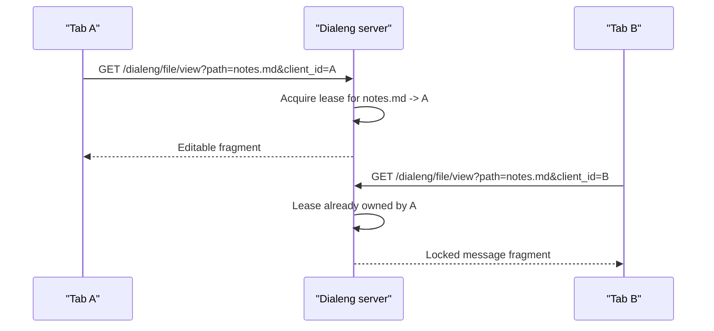
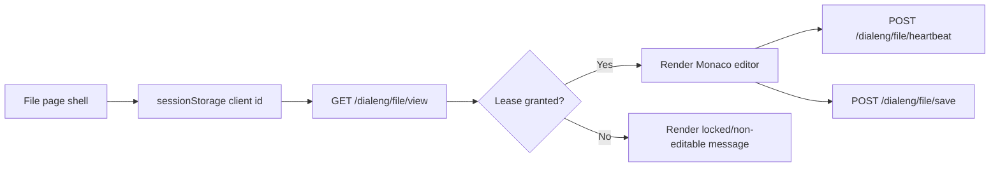

# File Editor Mode

This document explains how Dialeng opens and edits plain-text files outside notebook mode.

## Overview

Dialeng now supports two top-level resource modes:

- notebook mode for `.ipynb` dialogs
- file mode for plain-text files such as `.md`, `.json`, `.txt`, `.py`, and `.js`

File mode intentionally does **not** reuse notebook runtime state, cells, or kernels. It reuses Monaco styling and general page chrome, but the backend treats files as a separate resource type.

## Why Separate From Notebooks

Notebook pages assume:

- a `Notebook` object
- cell structure
- kernel state and queue state
- WebSocket-driven collaborative updates

Plain files do not need any of those. Reusing a whole code cell as a fake one-cell notebook would drag notebook-specific routes, actions, and keyboard behavior into file editing.

Instead, Dialeng reuses:

- Monaco initialization/styling
- the file explorer sidebar
- the main toolbar/status visual language

while keeping file state separate from notebook state.

## Route Structure

File mode uses dedicated routes in [`dialeng/app.py`](../../dialeng/app.py):

- `GET /dialeng/file?path=...`
  - renders the standalone file-editor page shell
- `GET /dialeng/file/view?path=...&client_id=...`
  - returns the backend-authoritative editor fragment for the current tab
  - always returns a fragment response, not a full HTML document, because the page shell injects it with `fetch(...)` into `#file-editor-container`
- `POST /dialeng/file/save`
  - saves file contents if the current client owns the edit lease
- `POST /dialeng/file/heartbeat`
  - refreshes the active lease
- `POST /dialeng/file/release`
  - releases the lease on unload/navigation

Notebook files still go through notebook mode:

- explorer links for `.ipynb` still point to `/dialeng/?name=...`
- `GET /dialeng/file?path=...ipynb` redirects back to notebook mode

## File Classification

Classification lives in [`dialeng/services/file_editor_service.py`](../../dialeng/services/file_editor_service.py).

The service:

1. resolves the requested path relative to the notebooks root
2. rejects traversal outside the root
3. identifies notebooks separately from plain files
4. classifies files as editable text or non-editable binary-like content

Current behavior:

- known text-like extensions map to Monaco languages
- files with NUL bytes are treated as binary/non-editable
- obvious non-text content shows a message instead of the editor

## Backend-Authoritative Single-Writer Lease

File editing is intentionally non-collaborative. Only one Dialeng browser tab/session can edit a file at a time.

The backend stores a short-lived lease per canonical file path:

Key details:

- a tab-specific `client_id` lives in `sessionStorage`
- the page shell renders first, then fetches the authoritative file fragment
- the editor is only shown if the backend grants the lease
- a heartbeat refreshes the lease every 10 seconds
- leases expire if heartbeat stops for 30 seconds
- `beforeunload` sends a best-effort release

This keeps locking backend-authoritative without requiring notebook WebSockets.

## Client Flow

The standalone page shell in [`dialeng/ui/file_editor.py`](../../dialeng/ui/file_editor.py) sets:

- `window.DIALENG_PAGE_KIND = 'file'`
- `window.DIALENG_FILE_PATH = ...`

Then [`dialeng/static/js/app.js`](../../dialeng/static/js/app.js) runs:

1. `initializeFileEditorPage(path)`
2. `reloadFileEditorView()`
3. `GET /dialeng/file/view?...` with `HX-Request: true`
4. render one of:
   - editable Monaco fragment
   - locked message
   - non-editable message
5. inject the fragment directly into `#file-editor-container`
   - file fragments do not rely on HTMX post-processing; the page bootstraps Monaco from the inserted DOM directly
5. if editable:
   - initialize standalone Monaco
   - enable save button
   - start heartbeat

## Explorer Integration

The file explorer in [`dialeng/ui/file_explorer.py`](../../dialeng/ui/file_explorer.py) now lists:

- folders
- notebook files
- other plain files

Behavior:

- notebooks open notebook mode
- non-notebook files open file mode
- the active plain file is tracked separately from the active notebook
- notebook kernel indicators remain notebook-only

## Keyboard Behavior

File mode uses the shared JS bundle, but file pages opt out of notebook-specific keyboard flows.

One subtle implementation constraint: the shared bundle is loaded from the document `<head>`, so any global event listeners that must exist on both notebook and file pages need to attach to `document`, not `document.body`. Otherwise file pages can crash during initial script evaluation before the body exists, which prevents the standalone file-editor bootstrap from initializing.

In file mode:

- `Ctrl/Cmd+S` saves the file
- `Ctrl/Cmd+Shift+E` still toggles the file explorer
- notebook cell shortcuts do not run

## Scope Limits

Current file mode intentionally does **not** include:

- collaborative editing
- runtime/kernel controls
- notebook cells or prompts
- binary previews
- file creation beyond the existing explorer folder/notebook creation

Those can be added later without mixing file resources into notebook state.
