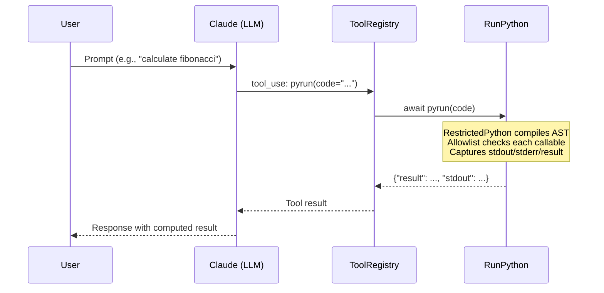
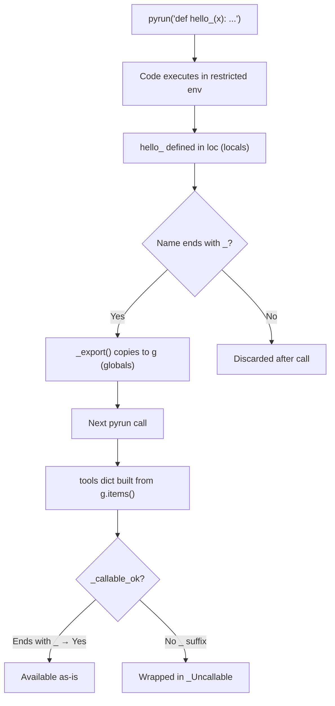
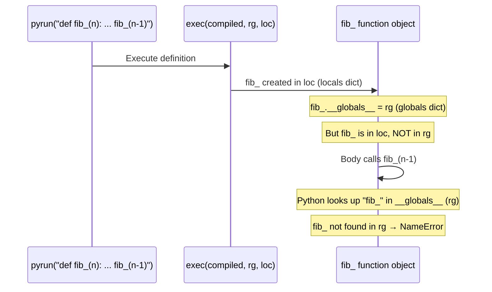

# safepyrun Integration

Dialeng integrates [safepyrun](https://github.com/AnswerDotAI/safepyrun) as a built-in LLM tool, providing the AI with safe sandboxed Python execution during prompt responses.

## Architecture



## How It Works

safepyrun uses [RestrictedPython](https://restrictedpython.readthedocs.io/) to compile Python source into a modified AST where every attribute access, item access, and iteration is routed through hook functions. These hooks check an allowlist of permitted callables before allowing execution.

### Threat Model

The sandbox is designed for an LLM — a well-meaning but occasionally clumsy collaborator. It prevents accidental damage (hallucinated cleanup steps, misunderstood requests), not deliberate escape attempts.

### Allowlist Tiers

1. **Curated stdlib subset**: `re`, `json`, `math`, `pathlib`, `datetime`, `collections`, `itertools`, `functools`, read-only `httpx.get`, and many more
2. **User-registered functions**: Via `allow()` — e.g., `allow('numpy.array', 'numpy.ndarray.sum')`
3. **LLM self-service**: Any symbol created with a trailing `_` (like `helper_`) is automatically available in subsequent calls

## The `_` Suffix Convention

This is safepyrun's core mechanism for cross-call state management:

### What it does

- **Persistence**: After each `pyrun` call, only variables/functions whose names end with `_` (and don't start with `_`) are exported to the persistent globals dict (`g`). Everything else is discarded.
- **Callability**: Only callables ending with `_`, or explicitly registered via `allow()`, are permitted to be called. Non-`_` callables are wrapped in `_Uncallable` and raise `PermissionError` if invoked.

### Why it exists

This is a deliberate security design. Without it, an LLM could define arbitrary functions and call them across sandbox invocations, effectively bypassing the allowlist. The `_` suffix acts as an explicit opt-in: the user (or LLM) must intentionally mark something as persistent.

### How it works internally



### Examples

```python
# These PERSIST across calls (names end with _):
await pyrun("x_ = 10")
await pyrun("x_")              # → 10

await pyrun("def greet_(name): return f'hello {name}'")
await pyrun("greet_('Joe')")   # → 'hello Joe'

# These DO NOT persist (no _ suffix):
await pyrun("x = 10")
await pyrun("x")               # → NameError

await pyrun("def greet(name): return f'hello {name}'")
await pyrun("greet('Joe')")    # → NameError
```

## Registration

In `dialeng/services/builtin_tools.py`:

```python
from safepyrun import RunPython

pyrun = RunPython(ok_dests=['.'])
pyrun.__name__ = 'pyrun'

BUILTIN_TOOLS = [view, rg, create, str_replace, insert, pyrun]
```

The `RunPython` instance is registered as a builtin tool via `ToolRegistry`. Since `RunPython.__call__` is async, `execute_builtin()` in `tool_registry.py` checks `asyncio.iscoroutinefunction` and awaits accordingly.

## Write Permissions

The Dialeng instance uses `ok_dests=['.']`, allowing the AI to write files relative to the current working directory. Path traversal attempts (`../`, `subdir/../../`) are detected and blocked.

## Limitations

### No recursive functions *defined inside pyrun*

Functions defined inside `pyrun` **cannot call themselves recursively**. This is not a safepyrun design choice — it's a fundamental consequence of how Python's `exec(code, globals, locals)` works with separate globals and locals dicts.

**Exception:** Functions defined in normal Python and registered via `allow()` CAN be recursive, because their `__globals__` is the real module globals dict (which contains themselves):

```python
from safepyrun import allow

def fib(n): return n if n <= 1 else fib(n-1) + fib(n-2)
allow('fib')

await pyrun('fib(10)')  # → 55 ✅
```

**Root cause:**



When Python defines a function inside `exec(code, globals_dict, locals_dict)`:
1. The function object is stored in `locals_dict`
2. The function's `__globals__` is set to `globals_dict`
3. When the function tries to call itself, Python looks up the name in `__globals__`
4. Since the function is in `locals_dict` (not `globals_dict`), the name lookup fails

This happens even with `_` suffix, even in the same `pyrun` call, and even across calls (because the function retains the `rg` dict from the call where it was defined, and that dict never contained the function).

**Workaround**: Use iterative implementations instead of recursion:

```python
# This FAILS (recursive):
await pyrun("def fib_(n): return n if n <= 1 else fib_(n-1) + fib_(n-2)")

# This WORKS (iterative):
await pyrun("""
def fib_(n):
    a, b = 0, 1
    for _ in range(n):
        a, b = b, a + b
    return a
""")
```

### No private names

Names starting with `_` are excluded from both export and the `tools` dict. Names with `__` (dunders) are further restricted by `SafeTransformer`.

### Module method access requires registration

You can `import` any module, but calling its methods requires them to be in the allowlist. For example, `json.loads()` works (registered), but `os.system()` does not.

## Using pyrun in Notebooks

### As an LLM tool (primary use case)

In a **prompt cell**, the AI automatically has access to `pyrun`. It knows the `_` suffix convention from the tool's docstring:

```
Calculate the first 20 prime numbers using pyrun
```

The AI will call `pyrun` with appropriate code, using `_` suffixed names for any state it needs to persist.

### Direct use in code cells

You can also use `pyrun` directly in **code cells** for testing or scripting:

```python
from dialeng.services.builtin_tools import pyrun

await pyrun("x_ = 42")
await pyrun("x_ * 2")  # → 84
```

Note that this `pyrun` instance shares state with the LLM's tool calls — `_` suffixed variables set by the AI are visible in code cells and vice versa.

## Key Files

| File | Purpose |
|------|---------|
| `dialeng/services/builtin_tools.py` | `RunPython` instantiation and registration |
| `dialeng/services/tool_registry.py` | Async-aware tool execution |
| `notebooks/safepyrun_demo.ipynb` | Interactive demo notebook |
