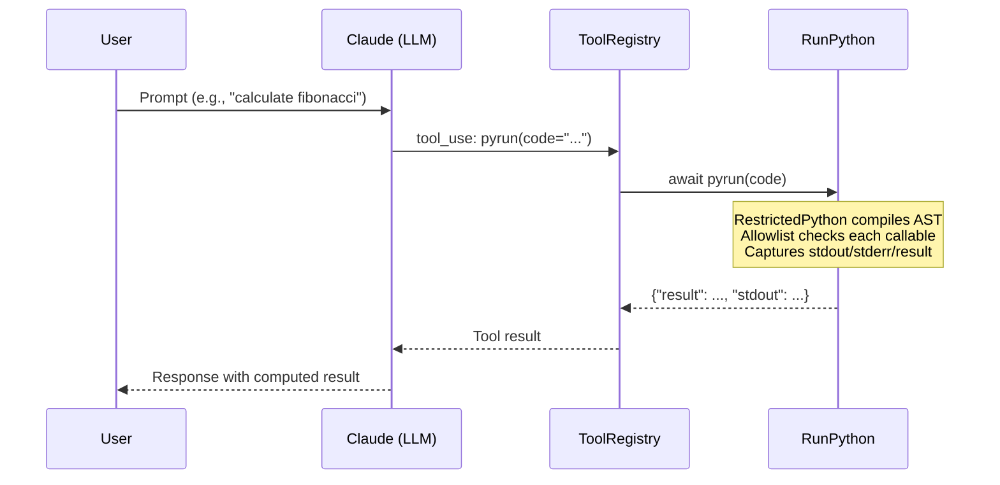

# safepyrun Integration

Dialeng integrates [safepyrun](https://github.com/AnswerDotAI/safepyrun) as a built-in LLM tool, providing the AI with safe sandboxed Python execution during prompt responses.

## Architecture



## How It Works

safepyrun uses [RestrictedPython](https://restrictedpython.readthedocs.io/) to compile Python source into a modified AST where every attribute access, item access, and iteration is routed through hook functions. These hooks check an allowlist of permitted callables before allowing execution.

### Threat Model

The sandbox is designed for an LLM — a well-meaning but occasionally clumsy collaborator. It prevents accidental damage (hallucinated cleanup steps, misunderstood requests), not deliberate escape attempts.

### Allowlist Tiers

1. **Curated stdlib subset**: `re`, `json`, `math`, `pathlib`, `datetime`, `collections`, `itertools`, `functools`, read-only `httpx.get`, and many more
2. **User-registered functions**: Via `allow()` — e.g., `allow('numpy.array', 'numpy.ndarray.sum')`
3. **LLM self-service**: Any symbol created with a trailing `_` (like `helper_`) is automatically available in subsequent calls

## Registration

In `dialeng/services/builtin_tools.py`:

```python
from safepyrun import RunPython

pyrun = RunPython(ok_dests=['.'])
pyrun.__name__ = 'pyrun'

BUILTIN_TOOLS = [view, rg, create, str_replace, insert, pyrun]
```

The `RunPython` instance is registered as a builtin tool via `ToolRegistry`. Since `RunPython.__call__` is async, `execute_builtin()` in `tool_registry.py` checks `asyncio.iscoroutinefunction` and awaits accordingly.

## Write Permissions

The Dialeng instance uses `ok_dests=['.']`, allowing the AI to write files relative to the current working directory. Path traversal attempts (`../`, `subdir/../../`) are detected and blocked.

## Key Files

| File | Purpose |
|------|---------|
| `dialeng/services/builtin_tools.py` | `RunPython` instantiation and registration |
| `dialeng/services/tool_registry.py` | Async-aware tool execution |
| `notebooks/safepyrun_demo.ipynb` | Interactive demo notebook |
