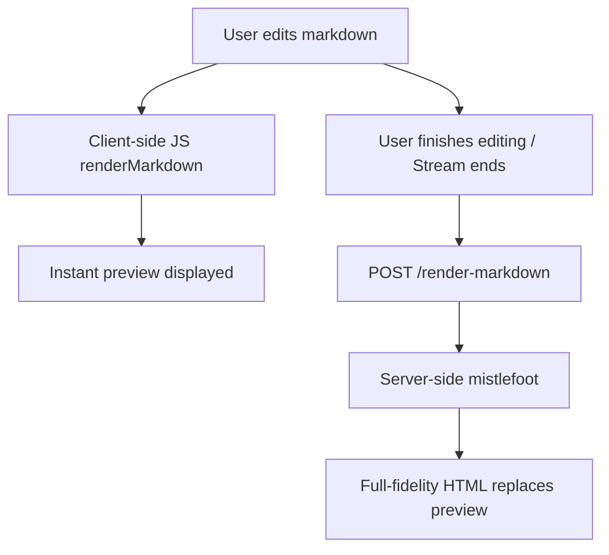

# mistlefoot Markdown Rendering

Dialeng uses [mistlefoot](https://github.com/AnswerDotAI/mistlefoot) for extended markdown rendering, replacing the simpler `markdown-it-py` renderer. mistlefoot is built on [mistletoe](https://github.com/miyuchina/mistletoe) and adds support for subscript, superscript, highlighting, strikethrough, emojis, footnotes, task lists, and heading attributes.

## Supported Extensions

| Syntax | Renders As | Example |
|--------|-----------|---------|
| `H~2~O` | Subscript | H<sub>2</sub>O |
| `E=mc^2^` | Superscript | E=mc<sup>2</sup> |
| `==text==` | Highlighting | <mark>text</mark> |
| `~~text~~` | Strikethrough | <del>text</del> |
| `:rocket:` | Emoji | 🚀 |
| `[^1]` | Footnote ref | Clickable reference |
| `- [x] Done` | Task list | Checkbox |
| `# Heading {#id .class}` | Heading attrs | `<h1 id="id" class="class">` |
| `https://url` | Auto-link | Clickable URL |

## Hybrid Rendering Strategy

Dialeng uses a two-tier rendering approach:



### Client-side (fast preview)

The existing `renderMarkdown()` JS function handles basic markdown (bold, italic, headers, lists, code blocks) for instant preview during editing. This avoids network latency while typing.

### Server-side (full fidelity)

After editing completes (or when a page loads), `renderMarkdownServer()` calls the `/render-markdown` endpoint which uses `mistlefoot.ExtendedHtmlRenderer` for the full feature set. If the server call fails, it falls back to client-side rendering.

## Server Endpoint

```
POST /render-markdown
Content-Type: application/x-www-form-urlencoded

text=H~2~O%20%3D%3Dhighlighted%3D%3D

Response: {"html": "<p>H<sub>2</sub>O <mark>highlighted</mark></p>\n"}
```

## Where Rendering Happens

| Location | Renderer | When |
|----------|----------|------|
| `render_mime_bundle()` in `app.py` | mistlefoot (server) | `text/markdown` MIME output from kernel |
| `initCell()` in `app.js` | JS → mistlefoot | Page load |
| `switchToPreview()` in `app.js` | JS → mistlefoot | After editing |
| `renderCellPreviews()` in `app.js` | JS → mistlefoot | Cell refresh |
| `finishStreaming()` in `app.js` | mistlefoot | After AI response completes |
| `updatePreview()` in `app.js` | JS only | During live editing (fast) |

## Key Files

| File | Purpose |
|------|---------|
| `dialeng/app.py` | `render_mime_bundle()` + `/render-markdown` endpoint |
| `dialeng/static/js/app.js` | `renderMarkdownServer()` + hybrid rendering |
| `notebooks/mistlefoot_demo.ipynb` | Interactive demo notebook |
