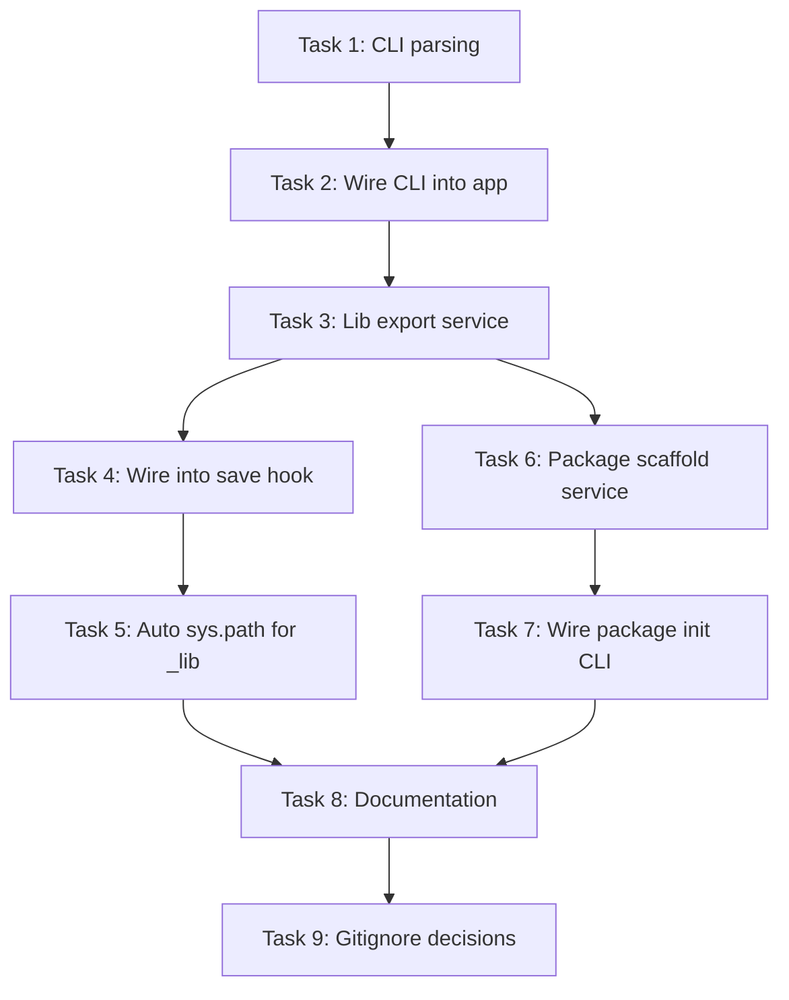

# Dialeng CLI + Notebook Export + nbdev Integration

> **For agentic workers:** REQUIRED: Use superpowers:subagent-driven-development (if subagents available) or superpowers:executing-plans to implement this plan. Steps use checkbox (`- [ ]`) syntax for tracking.

**Goal:** Make dialeng a proper CLI that runs from any directory, auto-extracts `#| export` cells on save into a `_lib/` folder for cross-notebook reuse, and provides a `dialeng package init` command to scaffold an nbdev-compatible project for publishing.

**Architecture:** Three layered features that build on each other: (1) CLI with directory argument so `dialeng` or `dialeng ./my-project` starts the server rooted at the given path, (2) save-hook extraction that watches for `#| default_exp` + `#| export` directives in any notebook and auto-generates `_lib/{module}.py` on save, (3) a `dialeng package init` subcommand that scaffolds `pyproject.toml` + `[tool.nbdev]` from existing notebooks so nbdev can take over for docs/tests/releases.

**Tech Stack:** Python 3.11+, FastHTML (Starlette), argparse, nbdev, fastcore, hatchling

---

## File Structure

### New files

| File | Responsibility |
|------|---------------|
| `dialeng/cli.py` | CLI argument parsing (`argparse`). Parses `dialeng [path]`, `dialeng package init [--name]`. Sets `NOTEBOOKS_DIR`, calls `main()` or subcommands. |
| `dialeng/services/lib_export_service.py` | Save-hook extraction: scans a notebook for `#| default_exp`, extracts `#| export` cells to `_lib/{module}.py`, manages `_lib/__init__.py`. |
| `dialeng/services/package_scaffold_service.py` | `dialeng package init`: scans notebooks for `#| default_exp`, generates `pyproject.toml` with `[tool.nbdev]`, creates package dir, runs `nbdev_install_hooks`. |
| `tests/test_cli.py` | Tests for CLI argument parsing and directory resolution. |
| `tests/test_lib_export_service.py` | Tests for save-hook extraction logic. |
| `tests/test_package_scaffold.py` | Tests for `dialeng package init` scaffolding. |

### Modified files

| File | Change |
|------|--------|
| `dialeng/app.py:274-275` | `NOTEBOOKS_DIR` becomes a settable module-level variable (no longer hardcoded from env). `main()` accepts `root_dir` parameter. |
| `dialeng/app.py:411-416` | `save_notebook()` calls `lib_export_service.maybe_extract()` after saving. |
| `dialeng/app.py:2816-2848` | `main()` accepts `root_dir: Path = None` and `port: int = 8000` parameters from CLI. |
| `dialeng/__main__.py` | Delegates to `cli.py` instead of directly calling `app.main()`. |
| `pyproject.toml:59-60` | Entry point changes from `dialeng.app:main` to `dialeng.cli:cli`. |

---

## Chunk 1: CLI with Directory Argument

Make `dialeng` accept an optional path argument so it can root the server at any directory.

### Task 1: CLI argument parsing

**Files:**
- Create: `dialeng/cli.py`
- Create: `tests/test_cli.py`
- Modify: `dialeng/__main__.py`
- Modify: `pyproject.toml:59-60`

- [ ] **Step 1: Write the failing tests for CLI parsing**

```python
# tests/test_cli.py
"""Tests for dialeng CLI argument parsing."""
import pytest
from pathlib import Path
from unittest.mock import patch, MagicMock


class TestParseArgs:
    """Test CLI argument parsing."""

    def test_no_args_defaults_to_cwd(self):
        from dialeng.cli import parse_args
        args = parse_args([])
        assert args.path == "."

    def test_relative_path(self):
        from dialeng.cli import parse_args
        args = parse_args(["./my-project"])
        assert args.path == "./my-project"

    def test_absolute_path(self):
        from dialeng.cli import parse_args
        args = parse_args(["/tmp/notebooks"])
        assert args.path == "/tmp/notebooks"

    def test_port_flag(self):
        from dialeng.cli import parse_args
        args = parse_args(["--port", "9000"])
        assert args.port == 9000

    def test_default_port(self):
        from dialeng.cli import parse_args
        args = parse_args([])
        assert args.port == 8000

    def test_path_with_port(self):
        from dialeng.cli import parse_args
        args = parse_args(["./projects", "--port", "3000"])
        assert args.path == "./projects"
        assert args.port == 3000


class TestResolveRootDir:
    """Test directory resolution logic."""

    def test_dot_resolves_to_cwd(self, tmp_path, monkeypatch):
        monkeypatch.chdir(tmp_path)
        from dialeng.cli import resolve_root_dir
        result = resolve_root_dir(".")
        assert result == tmp_path

    def test_relative_path_resolved(self, tmp_path, monkeypatch):
        monkeypatch.chdir(tmp_path)
        subdir = tmp_path / "notebooks"
        subdir.mkdir()
        from dialeng.cli import resolve_root_dir
        result = resolve_root_dir("notebooks")
        assert result == subdir

    def test_absolute_path_used_directly(self, tmp_path):
        from dialeng.cli import resolve_root_dir
        result = resolve_root_dir(str(tmp_path))
        assert result == tmp_path

    def test_nonexistent_path_created(self, tmp_path):
        from dialeng.cli import resolve_root_dir
        new_dir = tmp_path / "brand-new"
        result = resolve_root_dir(str(new_dir))
        assert result == new_dir
        assert new_dir.exists()

    def test_env_var_override_still_works(self, tmp_path, monkeypatch):
        """DIALENG_NOTEBOOKS_DIR env var should override CLI path."""
        env_dir = tmp_path / "from-env"
        env_dir.mkdir()
        monkeypatch.setenv("DIALENG_NOTEBOOKS_DIR", str(env_dir))
        from dialeng.cli import resolve_root_dir
        result = resolve_root_dir(".", respect_env=True)
        assert result == env_dir


class TestPackageSubcommand:
    """Test that 'dialeng package init' subcommand is parsed."""

    def test_package_init_parsed(self):
        from dialeng.cli import parse_args
        args = parse_args(["package", "init"])
        assert args.subcommand == "package"
        assert args.package_action == "init"

    def test_package_init_with_name(self):
        from dialeng.cli import parse_args
        args = parse_args(["package", "init", "--name", "my_lib"])
        assert args.subcommand == "package"
        assert args.package_name == "my_lib"

    def test_no_subcommand_means_serve(self):
        from dialeng.cli import parse_args
        args = parse_args([])
        assert args.subcommand is None
```

- [ ] **Step 2: Run tests to verify they fail**

Run: `cd /Users/sgaseretto/conductor/workspaces/solveish/yokohama && uv run pytest tests/test_cli.py -v`
Expected: FAIL — `ModuleNotFoundError: No module named 'dialeng.cli'`

- [ ] **Step 3: Implement `dialeng/cli.py`**

```python
# dialeng/cli.py
"""CLI entry point for dialeng.

Usage:
    dialeng                    # Start server rooted at current directory
    dialeng ./my-project       # Start server rooted at ./my-project
    dialeng /abs/path          # Start server rooted at absolute path
    dialeng --port 9000        # Custom port
    dialeng package init       # Scaffold nbdev-compatible package
"""
import argparse
import os
import sys
from pathlib import Path


def parse_args(argv=None):
    """Parse CLI arguments."""
    parser = argparse.ArgumentParser(
        prog="dialeng",
        description="Notebook-based dialog engine for exploration and development",
    )

    subparsers = parser.add_subparsers(dest="subcommand")

    # --- `dialeng package init` ---
    pkg_parser = subparsers.add_parser("package", help="Package management commands")
    pkg_sub = pkg_parser.add_subparsers(dest="package_action")
    init_parser = pkg_sub.add_parser("init", help="Scaffold nbdev-compatible package from notebooks")
    init_parser.add_argument("--name", dest="package_name", default=None,
                             help="Package name (default: directory name)")

    # --- Top-level flags (for `dialeng [path]`) ---
    parser.add_argument("path", nargs="?", default=".",
                        help="Root directory for notebooks (default: current directory)")
    parser.add_argument("--port", type=int, default=8000,
                        help="Server port (default: 8000)")

    return parser.parse_args(argv)


def resolve_root_dir(path_str: str, respect_env: bool = True) -> Path:
    """Resolve the root directory from CLI argument or environment.

    Priority: DIALENG_NOTEBOOKS_DIR env var (if respect_env) > CLI path argument.
    Creates the directory if it doesn't exist.
    """
    if respect_env:
        env_dir = os.environ.get("DIALENG_NOTEBOOKS_DIR")
        if env_dir:
            resolved = Path(env_dir).resolve()
            resolved.mkdir(parents=True, exist_ok=True)
            return resolved

    resolved = Path(path_str).resolve()
    resolved.mkdir(parents=True, exist_ok=True)
    return resolved


def cli(argv=None):
    """Main CLI entry point."""
    args = parse_args(argv)

    if args.subcommand == "package":
        if args.package_action == "init":
            from dialeng.services.package_scaffold_service import scaffold_package
            root = resolve_root_dir(".", respect_env=False)
            scaffold_package(root, package_name=args.package_name)
        else:
            print("Usage: dialeng package init [--name NAME]")
        return

    # Default: start the server
    root_dir = resolve_root_dir(args.path)
    from dialeng.app import main
    main(root_dir=root_dir, port=args.port)
```

- [ ] **Step 4: Run tests to verify they pass**

Run: `cd /Users/sgaseretto/conductor/workspaces/solveish/yokohama && uv run pytest tests/test_cli.py -v`
Expected: PASS (except `TestPackageSubcommand` tests that need argparse subparser — adjust if `parse_args` needs tweaking for subcommand + path coexistence)

- [ ] **Step 5: Commit**

```bash
git add dialeng/cli.py tests/test_cli.py
git commit -m "feat: add CLI argument parsing for dialeng"
```

### Task 2: Wire CLI into app.py and entry points

**Files:**
- Modify: `dialeng/app.py:274-275` (NOTEBOOKS_DIR)
- Modify: `dialeng/app.py:2816-2848` (main function)
- Modify: `dialeng/__main__.py`
- Modify: `pyproject.toml:59-60`

- [ ] **Step 1: Read current `app.py` main() and `__main__.py`**

Read `dialeng/app.py` lines 2816-2848 and `dialeng/__main__.py` in full.

- [ ] **Step 2: Modify `main()` to accept `root_dir` and `port` parameters**

In `dialeng/app.py`, change:

```python
# Line 274-275: Make NOTEBOOKS_DIR settable
NOTEBOOKS_DIR = Path(os.environ.get("DIALENG_NOTEBOOKS_DIR", "notebooks"))
NOTEBOOKS_DIR.mkdir(exist_ok=True)
```

To:

```python
# Default, overridden by set_root_dir() or CLI
NOTEBOOKS_DIR = Path(os.environ.get("DIALENG_NOTEBOOKS_DIR", "notebooks"))
NOTEBOOKS_DIR.mkdir(exist_ok=True)


def set_root_dir(root: Path):
    """Set the notebooks root directory. Called by CLI before main()."""
    global NOTEBOOKS_DIR
    NOTEBOOKS_DIR = root
    NOTEBOOKS_DIR.mkdir(exist_ok=True)
```

In `main()`, change to accept parameters:

```python
def main(root_dir: Path = None, port: int = 8000):
    """CLI entry point for dialeng."""
    if root_dir is not None:
        set_root_dir(root_dir)
    print(f"  Dialeng starting at http://localhost:{port}")
    print(f"   Root directory: {NOTEBOOKS_DIR.resolve()}")
    print("   Format: Solveit-compatible .ipynb")
    print("")
    print_credential_status(CREDENTIAL_STATUS)
    print("")
    print_config_status(DIALENG_CONFIG, CREDENTIAL_STATUS.backend)
    # ... rest of startup prints ...
    serve(port=port, reload_excludes=[".autorun_modules/*"])
```

- [ ] **Step 3: Update `__main__.py` to use CLI**

```python
# dialeng/__main__.py
"""Allow running dialeng as `python -m dialeng`."""
from dialeng.cli import cli

if __name__ == "__main__":
    cli()
```

- [ ] **Step 4: Update `pyproject.toml` entry point**

Change:
```toml
[project.scripts]
dialeng = "dialeng.app:main"
```
To:
```toml
[project.scripts]
dialeng = "dialeng.cli:cli"
```

- [ ] **Step 5: Manually test the CLI**

```bash
cd /tmp && mkdir test-dialeng && cd test-dialeng
uv run --project /Users/sgaseretto/conductor/workspaces/solveish/yokohama dialeng .
# Should start server rooted at /tmp/test-dialeng
# Ctrl+C to stop

uv run --project /Users/sgaseretto/conductor/workspaces/solveish/yokohama dialeng --port 9000
# Should start on port 9000
```

- [ ] **Step 6: Commit**

```bash
git add dialeng/app.py dialeng/__main__.py pyproject.toml
git commit -m "feat: wire CLI into app entry point, configurable root dir and port"
```

---

## Chunk 2: Save-Hook Extraction to `_lib/`

When a notebook with `#| default_exp module_name` is saved, auto-extract `#| export` cells into `_lib/{module_name}.py`.

### Task 3: Lib export service

**Files:**
- Create: `dialeng/services/lib_export_service.py`
- Create: `tests/test_lib_export_service.py`

- [ ] **Step 1: Write failing tests**

```python
# tests/test_lib_export_service.py
"""Tests for save-hook notebook export to _lib/."""
import json
import pytest
from pathlib import Path


def _make_notebook(cells, path):
    """Helper: write a minimal .ipynb with given code cell sources."""
    nb = {
        "cells": [
            {
                "cell_type": "code",
                "source": src if isinstance(src, list) else [src],
                "metadata": {},
                "outputs": [],
                "id": f"cell_{i}",
            }
            for i, src in enumerate(cells)
        ],
        "metadata": {"kernelspec": {"display_name": "Python 3", "language": "python", "name": "python3"}},
        "nbformat": 4,
        "nbformat_minor": 5,
    }
    path.write_text(json.dumps(nb))


class TestFindDefaultExp:
    """Test extraction of #| default_exp directive from notebooks."""

    def test_finds_default_exp(self, tmp_path):
        from dialeng.services.lib_export_service import find_default_exp
        nb = tmp_path / "test.ipynb"
        _make_notebook(["#| default_exp mymodule\nimport os"], nb)
        assert find_default_exp(nb) == "mymodule"

    def test_returns_none_when_missing(self, tmp_path):
        from dialeng.services.lib_export_service import find_default_exp
        nb = tmp_path / "test.ipynb"
        _make_notebook(["import os"], nb)
        assert find_default_exp(nb) is None

    def test_strips_whitespace(self, tmp_path):
        from dialeng.services.lib_export_service import find_default_exp
        nb = tmp_path / "test.ipynb"
        _make_notebook(["#| default_exp  my_utils \n"], nb)
        assert find_default_exp(nb) == "my_utils"

    def test_dotted_module_name(self, tmp_path):
        from dialeng.services.lib_export_service import find_default_exp
        nb = tmp_path / "test.ipynb"
        _make_notebook(["#| default_exp data.loaders\nimport os"], nb)
        assert find_default_exp(nb) == "data.loaders"


class TestMaybeExtract:
    """Test the save-hook extraction pipeline."""

    def test_extracts_export_cells_to_lib(self, tmp_path):
        from dialeng.services.lib_export_service import maybe_extract
        nb = tmp_path / "utils.ipynb"
        _make_notebook([
            "#| default_exp helpers",
            "#| export\ndef greet(): return 'hello'",
            "# scratch code, not exported",
        ], nb)
        result = maybe_extract(nb, root_dir=tmp_path)
        assert result is not None
        lib_file = tmp_path / "_lib" / "helpers.py"
        assert lib_file.exists()
        content = lib_file.read_text()
        assert "def greet():" in content
        assert "scratch code" not in content

    def test_skips_notebook_without_default_exp(self, tmp_path):
        from dialeng.services.lib_export_service import maybe_extract
        nb = tmp_path / "scratch.ipynb"
        _make_notebook(["#| export\nx = 1"], nb)
        result = maybe_extract(nb, root_dir=tmp_path)
        assert result is None
        assert not (tmp_path / "_lib").exists()

    def test_creates_init_py(self, tmp_path):
        from dialeng.services.lib_export_service import maybe_extract
        nb = tmp_path / "test.ipynb"
        _make_notebook(["#| default_exp foo", "#| export\nX = 1"], nb)
        maybe_extract(nb, root_dir=tmp_path)
        assert (tmp_path / "_lib" / "__init__.py").exists()

    def test_dotted_module_creates_subdirs(self, tmp_path):
        from dialeng.services.lib_export_service import maybe_extract
        nb = tmp_path / "test.ipynb"
        _make_notebook(["#| default_exp data.loaders", "#| export\ndef load(): pass"], nb)
        maybe_extract(nb, root_dir=tmp_path)
        assert (tmp_path / "_lib" / "data" / "loaders.py").exists()
        assert (tmp_path / "_lib" / "data" / "__init__.py").exists()

    def test_no_export_cells_removes_stale_file(self, tmp_path):
        from dialeng.services.lib_export_service import maybe_extract
        # First: create with exports
        nb = tmp_path / "test.ipynb"
        _make_notebook(["#| default_exp old", "#| export\nX = 1"], nb)
        maybe_extract(nb, root_dir=tmp_path)
        assert (tmp_path / "_lib" / "old.py").exists()
        # Second: remove exports
        _make_notebook(["#| default_exp old", "X = 1"], nb)
        maybe_extract(nb, root_dir=tmp_path)
        assert not (tmp_path / "_lib" / "old.py").exists()

    def test_returns_extraction_info(self, tmp_path):
        from dialeng.services.lib_export_service import maybe_extract
        nb = tmp_path / "test.ipynb"
        _make_notebook(["#| default_exp mymod", "#| export\nA = 1", "#| export\nB = 2"], nb)
        result = maybe_extract(nb, root_dir=tmp_path)
        assert result["module"] == "mymod"
        assert result["cells_exported"] == 2
```

- [ ] **Step 2: Run tests to verify they fail**

Run: `cd /Users/sgaseretto/conductor/workspaces/solveish/yokohama && uv run pytest tests/test_lib_export_service.py -v`
Expected: FAIL — `ModuleNotFoundError: No module named 'dialeng.services.lib_export_service'`

- [ ] **Step 3: Implement `lib_export_service.py`**

```python
# dialeng/services/lib_export_service.py
"""Save-hook extraction: notebooks with #| default_exp auto-export to _lib/.

When a notebook containing `#| default_exp module_name` is saved,
cells marked with `#| export` are extracted to `_lib/{module_name}.py`.
This makes exported code immediately importable from other notebooks.
"""
import json
import logging
from pathlib import Path
from typing import Optional, Dict

logger = logging.getLogger(__name__)

LIB_DIR_NAME = "_lib"


def find_default_exp(notebook_path: Path) -> Optional[str]:
    """Find the #| default_exp directive in a notebook.

    Scans code cells for a line starting with '#| default_exp'.
    Returns the module name, or None if not found.
    """
    try:
        data = json.loads(notebook_path.read_text())
    except (json.JSONDecodeError, FileNotFoundError):
        return None

    for cell in data.get("cells", []):
        if cell.get("cell_type") != "code":
            continue
        source = cell.get("source", [])
        if isinstance(source, str):
            source = source.splitlines(True)
        for line in source:
            stripped = line.strip()
            if stripped.startswith("#| default_exp"):
                parts = stripped.split(None, 2)
                if len(parts) >= 2:
                    return parts[1].strip()
    return None


def _extract_export_cells(notebook_path: Path) -> list[str]:
    """Extract source from cells marked with #| export."""
    try:
        data = json.loads(notebook_path.read_text())
    except (json.JSONDecodeError, FileNotFoundError):
        return []

    cells = []
    for cell in data.get("cells", []):
        if cell.get("cell_type") != "code":
            continue
        source = cell.get("source", [])
        if isinstance(source, str):
            source = source.splitlines(True)
        text = "".join(source)
        if not text.strip():
            continue
        # Check for #| export marker
        first_line = text.lstrip().split("\n", 1)[0].strip()
        if first_line == "#| export":
            # Remove the marker line
            lines = text.split("\n", 1)
            body = lines[1] if len(lines) > 1 else ""
            if body.strip():
                cells.append(body)
    return cells


def _ensure_init_files(lib_dir: Path, module_name: str):
    """Create __init__.py files for the _lib package and any sub-packages."""
    init = lib_dir / "__init__.py"
    if not init.exists():
        init.write_text("")

    # Handle dotted module names: data.loaders -> _lib/data/__init__.py
    parts = module_name.split(".")
    if len(parts) > 1:
        current = lib_dir
        for part in parts[:-1]:
            current = current / part
            current.mkdir(exist_ok=True)
            pkg_init = current / "__init__.py"
            if not pkg_init.exists():
                pkg_init.write_text("")


def maybe_extract(
    notebook_path: Path,
    root_dir: Path,
) -> Optional[Dict]:
    """Extract #| export cells from a notebook to _lib/ if it has #| default_exp.

    Called after notebook save. Returns extraction info dict or None if
    the notebook has no #| default_exp directive.
    """
    module_name = find_default_exp(notebook_path)
    if module_name is None:
        return None

    lib_dir = root_dir / LIB_DIR_NAME
    export_cells = _extract_export_cells(notebook_path)

    # Compute output path from module name
    parts = module_name.split(".")
    output_path = lib_dir / Path(*parts[:-1]) / f"{parts[-1]}.py" if len(parts) > 1 else lib_dir / f"{module_name}.py"

    if not export_cells:
        # Remove stale file if no exports remain
        if output_path.exists():
            output_path.unlink()
            logger.info(f"Removed stale _lib export: {output_path}")
        return None

    # Write extracted module
    lib_dir.mkdir(exist_ok=True)
    _ensure_init_files(lib_dir, module_name)

    header = f'# Auto-extracted from {notebook_path.name} — do not edit directly\n\n'
    content = header + "\n\n".join(export_cells)
    output_path.parent.mkdir(parents=True, exist_ok=True)
    output_path.write_text(content)

    logger.info(f"Extracted {len(export_cells)} cells from {notebook_path.name} → {output_path}")
    return {"module": module_name, "cells_exported": len(export_cells), "path": str(output_path)}
```

- [ ] **Step 4: Run tests to verify they pass**

Run: `cd /Users/sgaseretto/conductor/workspaces/solveish/yokohama && uv run pytest tests/test_lib_export_service.py -v`
Expected: PASS

- [ ] **Step 5: Commit**

```bash
git add dialeng/services/lib_export_service.py tests/test_lib_export_service.py
git commit -m "feat: add _lib/ export service for notebook save-hook extraction"
```

### Task 4: Wire extraction into notebook save

**Files:**
- Modify: `dialeng/app.py:411-416` (save_notebook function)

- [ ] **Step 1: Read save_notebook and surrounding context**

Read `dialeng/app.py` lines 405-420.

- [ ] **Step 2: Add extraction call after save**

In `save_notebook()`, after `nb.save(str(path))`, add:

```python
def save_notebook(notebook_id: str):
    if notebook_id in notebooks:
        nb = notebooks[notebook_id]
        path = nb.path if nb.path else NOTEBOOKS_DIR / f"{_nb_id_to_relpath(notebook_id)}.ipynb"
        nb.save(str(path))
        # Auto-extract #| export cells to _lib/ if notebook has #| default_exp
        try:
            from dialeng.services.lib_export_service import maybe_extract
            result = maybe_extract(Path(path), root_dir=NOTEBOOKS_DIR)
            if result:
                logger.info(f"_lib export: {result['module']} ({result['cells_exported']} cells)")
        except Exception as e:
            logger.warning(f"_lib export failed for {notebook_id}: {e}")
```

- [ ] **Step 3: Manually test save-hook**

1. Start dialeng
2. Create a notebook, add cells:
   - `#| default_exp myutils`
   - `#| export\ndef hello(): return "world"`
3. Save (Cmd+S)
4. Check that `_lib/myutils.py` was created with the extracted code
5. Open another notebook, run `from _lib.myutils import hello; hello()`

- [ ] **Step 4: Commit**

```bash
git add dialeng/app.py
git commit -m "feat: wire _lib/ extraction into notebook save hook"
```

### Task 5: CRAFT.ipynb template for `_lib` path setup

**Files:**
- Create: `dialeng/templates/default_craft_lib.py` (string template, not a file template)
- Modify: `dialeng/services/craft_service.py` (add `_lib` to sys.path automatically)

- [ ] **Step 1: Decide approach — CRAFT injection vs. kernel startup**

The simplest approach: when a kernel starts, if a `_lib/` directory exists in `NOTEBOOKS_DIR`, automatically add it to `sys.path`. This avoids requiring users to create a CRAFT.ipynb just for imports.

Read `dialeng/app.py` around the kernel creation/craft-init endpoint (lines 1186-1234) to find where to inject.

- [ ] **Step 2: Add `_lib` path injection at kernel startup**

In the CRAFT init endpoint or kernel creation, prepend a sys.path cell:

```python
# In the craft-init or kernel start flow, before CRAFT code cells:
lib_dir = NOTEBOOKS_DIR / "_lib"
if lib_dir.exists():
    setup_code = f"import sys; sys.path.insert(0, {str(NOTEBOOKS_DIR.resolve())!r})"
    # Execute as a hidden setup cell
```

This ensures `from _lib.myutils import hello` works in every notebook kernel.

- [ ] **Step 3: Test the import flow**

1. Start dialeng in a directory with a `_lib/helpers.py`
2. Open a notebook, start a kernel
3. Run `from _lib.helpers import something` — should work

- [ ] **Step 4: Commit**

```bash
git add dialeng/app.py  # or whichever file gets the injection
git commit -m "feat: auto-add _lib/ to kernel sys.path at startup"
```

---

## Chunk 3: `dialeng package init` — nbdev Scaffolding

### Task 6: Package scaffold service

**Files:**
- Create: `dialeng/services/package_scaffold_service.py`
- Create: `tests/test_package_scaffold.py`

- [ ] **Step 1: Write failing tests**

```python
# tests/test_package_scaffold.py
"""Tests for dialeng package init scaffolding."""
import json
import pytest
from pathlib import Path


def _make_notebook(cells, path):
    """Helper: write a minimal .ipynb."""
    nb = {
        "cells": [
            {"cell_type": "code", "source": src if isinstance(src, list) else [src],
             "metadata": {}, "outputs": [], "id": f"cell_{i}"}
            for i, src in enumerate(cells)
        ],
        "metadata": {"kernelspec": {"display_name": "Python 3", "language": "python", "name": "python3"}},
        "nbformat": 4, "nbformat_minor": 5,
    }
    path.write_text(json.dumps(nb))


class TestScaffoldPackage:
    """Test the package scaffolding logic."""

    def test_creates_pyproject_toml(self, tmp_path):
        from dialeng.services.package_scaffold_service import scaffold_package
        _make_notebook(["#| default_exp core", "#| export\nX = 1"], tmp_path / "core.ipynb")
        scaffold_package(tmp_path, package_name="mylib")
        assert (tmp_path / "pyproject.toml").exists()

    def test_pyproject_has_nbdev_section(self, tmp_path):
        from dialeng.services.package_scaffold_service import scaffold_package
        _make_notebook(["#| default_exp core", "#| export\nX = 1"], tmp_path / "core.ipynb")
        scaffold_package(tmp_path, package_name="mylib")
        content = (tmp_path / "pyproject.toml").read_text()
        assert "[tool.nbdev]" in content

    def test_defaults_name_to_directory(self, tmp_path):
        from dialeng.services.package_scaffold_service import scaffold_package
        project_dir = tmp_path / "my_project"
        project_dir.mkdir()
        _make_notebook(["#| default_exp core", "#| export\nX = 1"], project_dir / "core.ipynb")
        scaffold_package(project_dir)
        content = (project_dir / "pyproject.toml").read_text()
        assert 'name = "my_project"' in content

    def test_creates_package_directory(self, tmp_path):
        from dialeng.services.package_scaffold_service import scaffold_package
        _make_notebook(["#| default_exp core", "#| export\nX = 1"], tmp_path / "core.ipynb")
        scaffold_package(tmp_path, package_name="mylib")
        assert (tmp_path / "mylib").is_dir()
        assert (tmp_path / "mylib" / "__init__.py").exists()

    def test_does_not_overwrite_existing_pyproject(self, tmp_path):
        from dialeng.services.package_scaffold_service import scaffold_package
        (tmp_path / "pyproject.toml").write_text("[project]\nname = 'existing'\n")
        _make_notebook(["#| default_exp core", "#| export\nX = 1"], tmp_path / "core.ipynb")
        with pytest.raises(FileExistsError):
            scaffold_package(tmp_path, package_name="mylib")

    def test_scans_notebooks_for_modules(self, tmp_path):
        from dialeng.services.package_scaffold_service import scaffold_package, scan_notebook_modules
        _make_notebook(["#| default_exp utils", "#| export\nX = 1"], tmp_path / "utils.ipynb")
        _make_notebook(["#| default_exp data.loaders", "#| export\ndef load(): pass"], tmp_path / "data.ipynb")
        _make_notebook(["import os"], tmp_path / "scratch.ipynb")  # no default_exp
        modules = scan_notebook_modules(tmp_path)
        assert set(modules.keys()) == {"utils", "data.loaders"}
```

- [ ] **Step 2: Run tests to verify they fail**

Run: `cd /Users/sgaseretto/conductor/workspaces/solveish/yokohama && uv run pytest tests/test_package_scaffold.py -v`
Expected: FAIL — `ModuleNotFoundError`

- [ ] **Step 3: Implement `package_scaffold_service.py`**

```python
# dialeng/services/package_scaffold_service.py
"""Scaffold an nbdev-compatible package from existing dialeng notebooks.

Scans notebooks for #| default_exp directives, generates pyproject.toml
with [tool.nbdev] configuration, and creates the package directory.
"""
import logging
from pathlib import Path
from typing import Dict, Optional

logger = logging.getLogger(__name__)


def scan_notebook_modules(root: Path) -> Dict[str, Path]:
    """Scan .ipynb files for #| default_exp directives.

    Returns dict mapping module names to notebook paths.
    Skips notebooks inside AUTORUN/ and _lib/.
    """
    from dialeng.services.lib_export_service import find_default_exp

    modules = {}
    skip_dirs = {"AUTORUN", "_lib", ".autorun_modules", ".ipynb_checkpoints"}
    for nb_path in sorted(root.rglob("*.ipynb")):
        if any(part in skip_dirs for part in nb_path.parts):
            continue
        module_name = find_default_exp(nb_path)
        if module_name:
            modules[module_name] = nb_path
    return modules


def scaffold_package(
    root: Path,
    package_name: Optional[str] = None,
) -> Path:
    """Scaffold an nbdev-compatible project from existing notebooks.

    Creates pyproject.toml with [tool.nbdev] config and the package directory.
    Raises FileExistsError if pyproject.toml already exists.

    Returns path to the created pyproject.toml.
    """
    if package_name is None:
        package_name = root.resolve().name.replace("-", "_").replace(" ", "_")

    pyproject_path = root / "pyproject.toml"
    if pyproject_path.exists():
        raise FileExistsError(
            f"pyproject.toml already exists at {pyproject_path}. "
            "Remove it first or add [tool.nbdev] manually."
        )

    # Scan for notebook modules
    modules = scan_notebook_modules(root)
    module_list = ", ".join(f'"{m}"' for m in sorted(modules.keys()))

    # Create pyproject.toml
    pyproject_content = f'''[project]
name = "{package_name}"
version = "0.0.1"
description = ""
readme = "README.md"
requires-python = ">=3.11"
dependencies = []

[build-system]
requires = ["hatchling"]
build-backend = "hatchling.build"

[tool.nbdev]
lib_name = "{package_name}"
lib_path = "{package_name}"
nbs_path = "."
doc_path = "_docs"
# Discovered modules: {module_list}
'''
    pyproject_path.write_text(pyproject_content)
    logger.info(f"Created {pyproject_path}")

    # Create package directory
    pkg_dir = root / package_name
    pkg_dir.mkdir(exist_ok=True)
    init_file = pkg_dir / "__init__.py"
    if not init_file.exists():
        init_file.write_text("")
    logger.info(f"Created package directory: {pkg_dir}")

    # Print summary
    print(f"\nPackage '{package_name}' scaffolded!")
    print(f"  pyproject.toml created with [tool.nbdev] config")
    print(f"  {pkg_dir}/ directory created")
    if modules:
        print(f"\n  Found {len(modules)} notebook module(s):")
        for mod, nb in sorted(modules.items()):
            print(f"    {mod} ← {nb.name}")
    print(f"\n  Next steps:")
    print(f"    1. Run: nbdev_install_hooks    (git-friendly notebooks)")
    print(f"    2. Run: nbdev_export           (generate {package_name}/ from notebooks)")
    print(f"    3. Run: nbdev_test             (run notebook tests)")
    print(f"    4. Run: nbdev_pypi             (publish to PyPI)")

    return pyproject_path
```

- [ ] **Step 4: Run tests to verify they pass**

Run: `cd /Users/sgaseretto/conductor/workspaces/solveish/yokohama && uv run pytest tests/test_package_scaffold.py -v`
Expected: PASS

- [ ] **Step 5: Commit**

```bash
git add dialeng/services/package_scaffold_service.py tests/test_package_scaffold.py
git commit -m "feat: add package scaffold service for nbdev integration"
```

### Task 7: Wire `dialeng package init` into CLI

**Files:**
- Modify: `dialeng/cli.py` (already has the subcommand wiring, verify it works end-to-end)

- [ ] **Step 1: Integration test — end-to-end CLI**

```bash
cd /tmp && mkdir test-pkg && cd test-pkg
# Create a notebook with exports
python3 -c "
import json
nb = {'cells': [
    {'cell_type': 'code', 'source': ['#| default_exp helpers'], 'metadata': {}, 'outputs': [], 'id': 'c1'},
    {'cell_type': 'code', 'source': ['#| export\ndef greet(): return \"hi\"'], 'metadata': {}, 'outputs': [], 'id': 'c2'},
], 'metadata': {'kernelspec': {'display_name': 'Python 3', 'language': 'python', 'name': 'python3'}}, 'nbformat': 4, 'nbformat_minor': 5}
with open('helpers.ipynb', 'w') as f: json.dump(nb, f)
"
# Run scaffold
uv run --project /path/to/yokohama dialeng package init --name my_utils
# Verify
cat pyproject.toml  # should have [tool.nbdev]
ls my_utils/        # should have __init__.py
```

- [ ] **Step 2: Commit if any adjustments needed**

```bash
git add dialeng/cli.py
git commit -m "fix: finalize dialeng package init CLI wiring"
```

---

## Chunk 4: Documentation and Polish

### Task 8: Update documentation

**Files:**
- Modify: `docs/guides/autorun_extensions.md` (cross-reference _lib)
- Modify: `docs/how_it_works/16_craft_template_autorun.md` (mention _lib extraction)
- Create: `docs/guides/notebook_to_package.md` (the exploration → reuse → package guide)

- [ ] **Step 1: Write the notebook-to-package guide**

Create `docs/guides/notebook_to_package.md` with:

1. **Phase 1: Explore** — `dialeng .` starts the server, create notebooks freely
2. **Phase 2: Reuse** — Add `#| default_exp` and `#| export` to cells, save triggers extraction to `_lib/`, import in other notebooks
3. **Phase 3: Package** — `dialeng package init --name mylib`, then `nbdev_export`, `nbdev_test`, `nbdev_pypi`

Include Mermaid diagrams showing the progression.

- [ ] **Step 2: Update existing docs with cross-references**

Add links from the AUTORUN and extension registry docs to the new guide.

- [ ] **Step 3: Update `docs/README.md` directory listing**

Add the new guide to the tree and quick links.

- [ ] **Step 4: Commit**

```bash
git add docs/
git commit -m "docs: add notebook-to-package progression guide"
```

### Task 9: Add `_lib/` to default `.gitignore` (or not)

- [ ] **Step 1: Decide on `_lib/` git tracking**

Two valid approaches:
- **Gitignore `_lib/`** — it's auto-generated, like `.autorun_modules/`. Regenerated on save.
- **Track `_lib/`** — makes the exported code available without running dialeng. Better for collaboration.

Recommendation: **Track it** (don't gitignore). It's user-facing code that others might import directly. Add a header comment in generated files saying "Auto-extracted from {notebook}.ipynb — edit the notebook, not this file."

This is already handled by the `# Auto-extracted from...` header in `lib_export_service.py`.

- [ ] **Step 2: Ensure `.autorun_modules/` stays gitignored but `_lib/` does not**

Check `.gitignore` — `.autorun_modules/` should be there, `_lib/` should NOT.

- [ ] **Step 3: Commit if changes needed**

```bash
git add .gitignore
git commit -m "chore: ensure _lib/ is tracked, .autorun_modules/ is gitignored"
```

---

## Summary: Implementation Order



Tasks 1-2 (CLI) are independent of Tasks 3-5 (_lib export) which are independent of Tasks 6-7 (package scaffold). Tasks 1-2 must come first because the CLI wiring affects how root_dir flows through the system. After that, Tasks 3-5 and 6-7 can be developed in parallel by separate agents.
